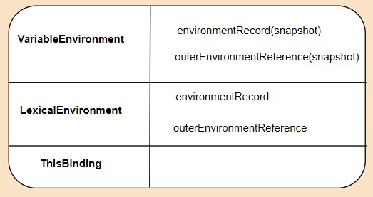

## JS Execution Context

> js 핵심 개념인 hoisting, scope, closure 개념을 이해하기 위해 실행 컨텍스트에 대한 이해가 필수. 자바스크립트 코드를 실행한다는 것은, 내부적으로 실행 컨텍스트가 동작하기 시작한다는 것을 의미

- Global Execution Context(전역 실행 컨텍스트)
  - 가장 기본이 되는 실행 컨텍스트
  - 2가지 기능을 함
    - 전역 객체(= window)를 만듦
    - 전역 객체를 this의 값으로 설정
  - 하나의 프로그램에는 하나의 전역 실행 컨텍스트만이 존재
- Functional Execution Context(함수형 실행 컨텍스트)
  - 함수가 호출될 때마다 각 함수에 대한 함수 실행 컨텍스트 생성
  - 각 함수는 자신만의 함수 실행 컨텍스트를 가지고, 해당 함수가 호출되거나 블록을 생성하면 만들어짐

##### 실행 컨텍스트 구조

출처: https://github.com/Dongkyun-Jang/TIL

- VariableEnvironment
  - 현재 컨텍스트 내의 식별자들에 대한 정보(environmentRecord) + 외부 환경 정보(outerEnvironmentReference)
  - 변경사항은 반영되지 않음
  
- LexicalEnvironment
  - 처음에는 VariableEnvironment의 값과 같지만 변경 사항이 실시간 반영

- ThisBinding
