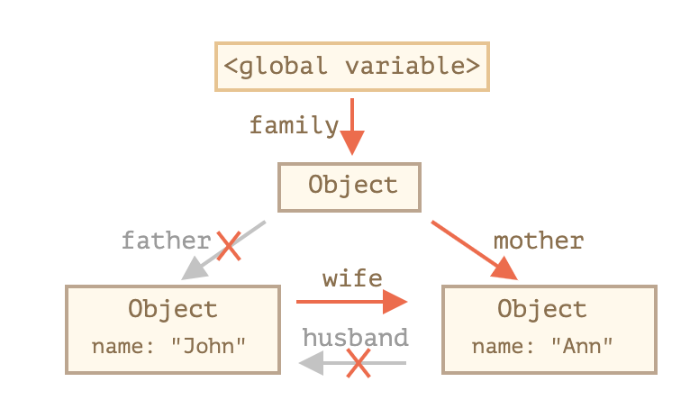
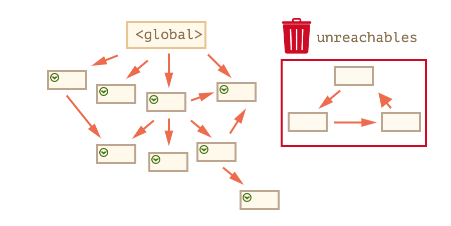

# JS garbage collection

참고자료 : [javascript info](https://ko.javascript.info/garbage-collection), [MDN](https://developer.mozilla.org/ko/docs/Web/JavaScript/Memory_Management)

> 객체가 생성되었을 때 자동으로 메모리를 할당하고, 쓸모 없어졌을 때 자동으로 해제(garbage collection)함
>
> javascript는 `reachability` 개념을 기준으로 메모리 관리


## Reachability

- 접근하거나 사용할 수 있는 값을 의미
- 도달 가능한 값은 메모리에서 삭제되지 않음
- <b>Root</b>가 되는 값은 메모리에 올라가 있는 상태에서 삭제되지 않음
  - 현재 함수의 지역 변수와 매개 변수
  - 중첩 함수의 체인에 있는 함수에서 사용되는 변수와 매개 변수
  - 전역 변수
- Reachable Object는 루트가 참조하는 값이나 chaining으로 루트에서 참조할 수 있는 값이 됨


## Garbage Collection

##### reference-counting

- 2012년 이후 모든 브라우저에서 아래에서 설명할 mark and sweep algorithm을 사용하지만, 이전까지는 참조-세기 GC를 사용하는 브라우저도 있었음

- GC를 실행할 오브젝트를 '어떤 다른 오브젝트도 참조하지 않는 오브젝트'로 정의

- 아래와 같은 참조 순환이 발생했을 때 해당 객체(아래 예시에서는 father/husband가 참조했던 객체)들이 root를 기준으로 unreachable 하지만, 참조-세기 알고리즘에서는 GC를 실행하지 않음

  ```js
  function marry(man, woman) {
    woman.husband = man;
    man.wife = woman;
  
    return {
      father: man,
      mother: woman
    }
  }
  
  let family = marry({
    name: "John"
  }, {
    name: "Ann"
  });
  
  delete family.father;
  delete family.mother.husband;
  ```

  

  

##### mark-and-sweep

- 동작방식
  - 가비지 컬렉터는 root 정보를 수집하고 mark
  - root가 참조하고 있는 모든 객체를 방문하고 mark
  - mark된 모든 객체를 방문하고 해당 객체가 참조하는 객체도 mark
  - 즉, 위 과정에서 방문한 모든 객체(rechable object)를 mark하고, mark 되지 않은 객체를 메모리에서 삭제

  


##### 최적화 방법

- generational collection
  - young and old object로 영역을 나눠서 관리
  - young object는 금방 참조를 해제할 가능성이 높고, 계속해서 참조해 살아남은 객체는 old object에서 관리하여 GC는 덜 감시
- incremental collection
  - 방문해야할 객체가 많으면 모든 객체를 모두 방문하고 mark 하는 데 시간 소요가 많아 GC 실행 속도가 느려짐
  - gabage collection을 여러 부분으로 분리해 각 부분을 별도로 수행하여 분산
- idle-time collection
  - CPU가 유휴 상태일 때만 GC 실행
