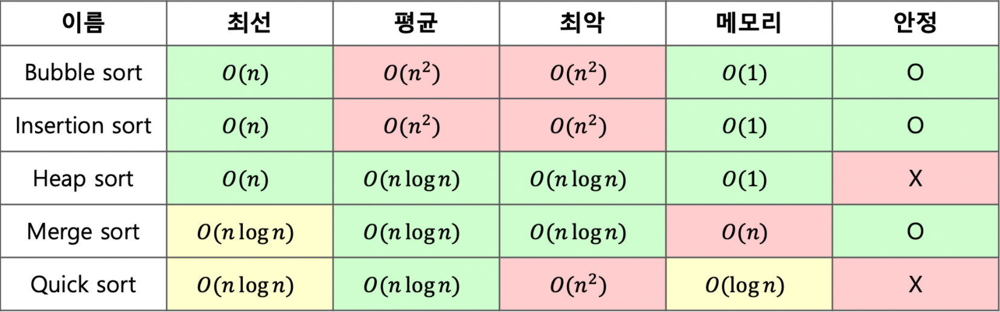

# Sort

[MergeSort Visualizer](https://www.hackerearth.com/practice/algorithms/sorting/merge-sort/visualize/)

> 2개 이상의 자료를 특정 기준에 의해 재배열 하는 것(오름차순, 내림차순)



| Tim sort |    O(n)    |    O(nlogn)    |    O(nlogn)    |    O(n)    |    O    |
| :--: | :----: | :--------: | :--------: | :--------: | :--------: |
| <small>Counting sort</small> | O(n+k) | O(n+k) | O(n+k) | O(k) | O |

- 버블 정렬(Bubble Sort)

  ```python
  def bubble_sort(arr):
    for i in range(len(arr)-1, 0, -1):
      for j in range(i):
        if arr[j] > arr[j+1]:
          arr[j], arr[j+1] = arr[j+1], arr[j]
  ```

- 선택 정렬(Selection Sort)

  - 주어진 자료들 중 가장 작은 값의 원소부터 차례대로 선택하여 위치를 교환하는 방식

    ```python
    def selection_sort(arr):
      for i in range(len(arr)-1):
        min = i
        for j in range(i+1, len(arr)):
          if a[min] > a[j]:
            min = j
          a[i], a[min] = a[min], a[i]
    ```

    `O(n**2)` 배열의 길이 n에 대하여 n만큼 최솟값을 찾아서 바꿈

- 카운팅 정렬(Counting Sort)

  - 항목들의 순서를 결정하기 위해 집합에 각 항목이 몇 개씩 있는지 세는 작업을 하여, 선형 시간에 정렬하는 효율적인 알고리즘
  - 정수나 정수로 표현할 수 있는 자료에 한해 적용 가능(정수 항목으로 인덱스 되는 카운트들의 배열을 사용하기 때문)

  ```python
  def counting_sort(A, B, k):
    #A[1..n] 입력 배열 (1 to k)
    #B[1..n] 정렬된 배열
    #C[1..n] 카운트 배열
    
    C = [0] * k
    
    for i in range(len(B)):
    	C[A[i]] += 1
      
    for i in range(1, len(C)):
      C[i] += C[i-1]
      
    for i in range(len(B)-1, -1, -1):
      B[C[A[i]]-1] = A[i]
    	C[A[i]] -= 1
  ```

  `O(n+k)` 배열의 길이 n에 대하여 가장 큰 수 k만큼의 처리가 더 필요

- 삽입 정렬(Insertion Sort)

  - 자료 배열의 모든 요소를 앞에서부터 차례대로 비교하여 이미 정렬된 배열 부분과 비교해 자신의 위치를 찾아 삽입하는 알고리즘

  ```python
  def insert_sort(x):
  	for i in range(1, len(x)):
  		j = i - 1
  		key = x[i]
  		while x[j] > key and j >= 0:
  			x[j+1] = x[j]
  			j = j - 1
  		x[j+1] = key
  	return x
  ```

- 병합 정렬(Merge Sort)

  [MergeSort 정리 문서](./mergeSort.md)

- 퀵 정렬(Quick Sort)

  - 다른 원소와의 비교만으로 정렬을 수행하는 비교 정렬 및 불안정 정렬
  - 분할 정복 알고리즘의 하나로, 병합정렬과 달리 비균등하게 분할
  - 정렬 과정
    - 리스트 안 하나의 요소인 pivot 선정
    - (분할)pivot 기준으로 작은 요소는 모두 pivot 왼쪽으로, 큰 요소는 모두 오른쪽 이동
    - pivot 제외한 왼쪽/오른쪽 리스트를 다시 분할하는 과정 반복
    - (정복)부분 리스트가 더이상 분할이 불가능할 때까지 나누면 정렬 시행
    - (결합)정렬된 부분 왼쪽/오른쪽 리스트와 pivot 결합(분할 시에 pivot의 위치는 확정되므로 알고리즘은 반드시 끝난다는 것을 보장)

- 팀 정렬(Tim Sort)

  [Tim Sort 정리](./timSort.md)
