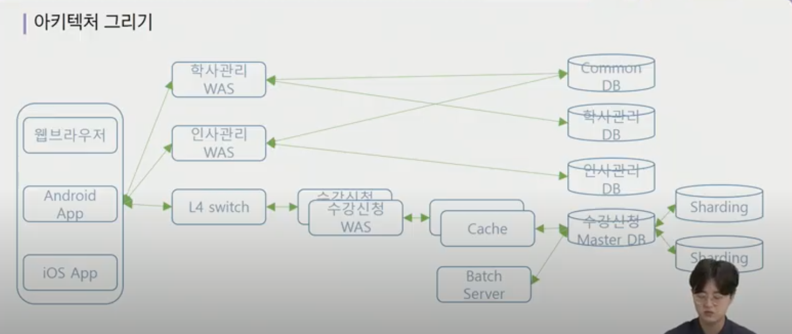
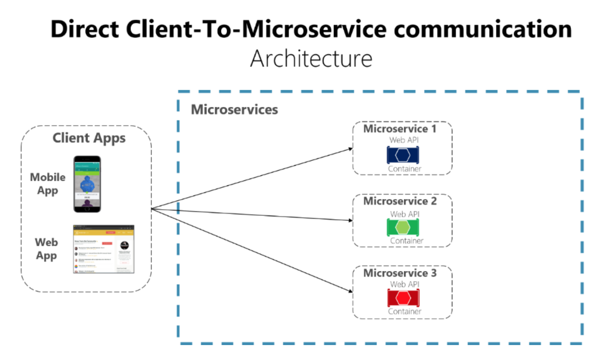
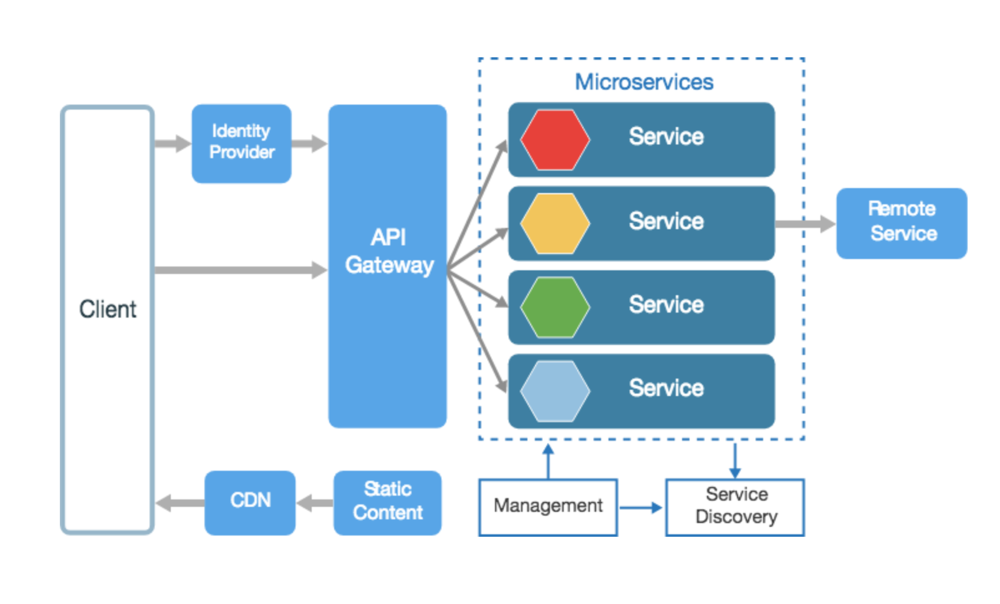
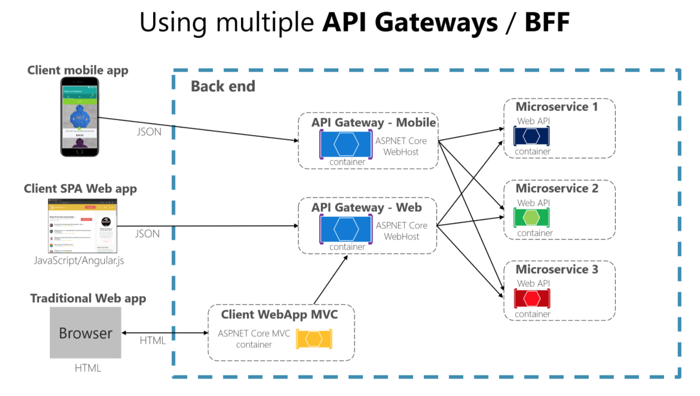

# Architecture

##### 개념

- 건물이나 다른 구조물을 계획하고 설계하고 건설하는 과정과 그 결과물
- SW아키텍처는 소프트웨어 구성요소들 사이에서 유기적 관계를 표현하고, 소프트웨어의 설계와 업그레이드를 통제하는 지침과 원칙

##### 중요성

- 초기 설계 과정의 결정사항
  - 구현에 대한 제약사항 검토 및 시스템에 대한 구조 결정
- 커뮤니케이션의 기준점
  - 서비스나 시스템 이해당사자들 간의 공통분모
- 재사용 가능한 레퍼런스
  - 아키텍처를 결정짓게 한 유사한 요구사항 및 설계 경험의 재사용

##### 예시(학사관리시스템)

- 결정요인 도출

  - 이해관계자 선별
    - 시스템과 연관되는 사람이나, 다른 시스템
    - 학생, 교수, 교직원, 외부시스템(인사관리 시스템, 학사관리 시스템)
  - 기능요구사항
    - 학사 관리 기능, 수업 관리 기능, 수강 관리 기능, 사용자 관리 기능
  - 비기능요구사항
    - 강의 신청 기간에 원활한 진행, 언제 어디서나 접근 가능, 모바일에서도 접속 가능, 권한을 통한 정보 보안, 데이터 손실 방지

- 품질속성 시나리오

  - 스파이크성 트래픽에 대한 처리, public 환경, 하이브리드 웹, 권한을 통한 정보 보안
  - 학생 1,100명이 수강신청을 동시에 할 시 수강신청을 먼저 신청한 순서대로 5초 이내에 처리 완료한다.
  - 학생과 교수는 본 시스템에 외부, 내부 네트워크 환경에서 모두 접속하여 수강신청을 할 수 있다.
  - 학생과 교수는 안드로이드, IOS, PC로 접속하여 수강신청을 할 수 있다. 지원 브라우저는 IE 11, Chrome 80, safary 13, Samsung internet 11 버전 이상이다.

- 비기능 요구사항

  - 권한이 있는 교직원 외에는 인사관리 데이터에 아무도 접근할 수 없다.
  - 권한이 없는 교수와 교직원 외에는 학사관리 시스템에 아무도 접근할 수 없다.
  - 수강신청 기간에는 매일 오전 03시에 수강신청 데이터를 백업한다.
  - 수강신청 완료 후에는, 데이터의 영구보존을 위해 수강신청 데이터를 백업하여 별도 디스크에 저장한다.

- 아키텍쳐 그리기

  

- 정리

  - 이론적인 방법과 실전에서 사용되는 과정 설명

    (비기능 요구사항 도출 - 품질속성 시나리오 작성 - 아키텍처 패턴 결정 - 아키텍처 도식화)

  - 품질 속성을 정확히 정의

  - 품질속성별로 전략 도출

  - 도출된 전략을 잘 보여줄 수 있게 도식화

  - 아키텍처 검증(평가)

API gateway?

## API Gateway pattern

[참조 문서](https://docs.microsoft.com/ko-kr/dotnet/architecture/microservices/architect-microservice-container-applications/direct-client-to-microservice-communication-versus-the-api-gateway-pattern)

> 소규모 microservice 기반에서는 클라이언트-마이크로서비스 간 직접 통신이 적합하지만, 대규모 서비스 기반에서는 요청이 과다해지고, 의존성이 높아짐
>
> 

##### API Gateway

- API Gateway server를 별도로 두어 client-service를 중개하는 역할

- 클라이언트 앱이 백엔드에 대한 요청을 최소화하고 여러 마이크로서비스에 대한 번거로운 통신을 줄이기 위함(대기 시간 및 UI 복잡도 감소)

- 각 서비스 간 권한 부여, 보안 등의 구현이 복잡해질 수 있는데, api gateway pattern을 이용하면 client에서 직접 서비스에 액세스 하는 것이 아니라 gateway에만 접근 가능하게 하여 한 곳에서 구현 가능
- 라우팅, 로드밸런싱 가능

- Multiple API Gateways

  

- API Management
  - AWS API Gateway
  - Azure API Management
  - Naver Cloud Platform API Gateway
  - docker express-gateway
