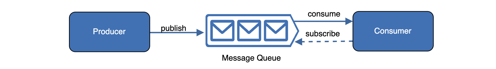
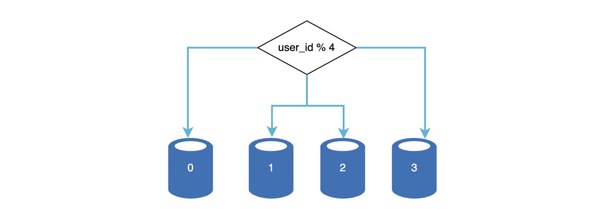

# 1장. 사용자 수에 따른 규모 확장성

> [단일 서버](#단일-서버)
>
> [데이터베이스](#데이터베이스)
>
> [수직적 규모 확장 vs 수평적 규모 확장](#수직적-규모-확장-vs-수평적-규모-확장)
>
> - [로드밸런서](#로드밸런서)
> - [데이터베이스 다중화](#데이터베이스-다중화)
>
> [캐시](#캐시)
>
> [CDN](#CDN)
>
> [무상태(stateless) 웹 계층](#무상태(stateless)-웹-계층)
>
> [데이터 센터](#데이터-센터)
>
> [메시지 큐](#메시지-큐)
>
> [로그, 메트릭, 자동화](#로그,-메트릭,-자동화)
>
> [데이터베이스의 규모 확장](#데이터베이스의-규모-확장)
>
> [백만 사용자, 그리고 그 이상](#백만-사용자,-그리고-그-이상)

- 웹 계층은 무상태 계층으로
- 모든 계층에 다중화 도입
- 가능한 많은 데이터를 캐시
- 여러 데이터 센터 지원
- 정적 콘텐츠는 CDN을 통해 서비스
- 데이터 계층은 샤딩을 통해 규모 확장
- 각 계층은 독립적 서비스로 분할
- CI/CD 자동화 도구 활용

 

## 단일 서버

> 웹 앱, 데이터베이스, 캐시 등이 서버 한 대에서 실행

- 사용자는 도메인 이름(api.mysite.com)을 이용해 웹사이트에 접속하고, 이 접속을 위해 DNS에 질의하여 IP주소로 변환
- DNS 조회 결과로 IP주소 반환
- 해당 IP 주소로 HTTP 요청 전달
- 요청 받은 웹 서버는 HTML page, JSON 형태 등의 응답 반환

 

## 데이터베이스

> 사용자가 늘어나면 서버 하나로는 충분치 않아서 여러 서버를 둠
>
> 웹/모바일 트래픽 처리 서버(웹 계층), 데이터베이스 서버(데이터 계층) 분리를 통해 각각 독립적으로 확장 가능

##### 어떤 데이터베이스를 사용할 것인가?

- 관계형 데이터베이스
  - MySQL, Oracle, PostgreSQL
  - 자료를 table, row, column으로 표현
  - sql을 사용해 관계에 따라 join 하여 합칠 수 있음
- 비관계형 데이터베이스
  - NoSQL
    - CouchDB, Neo4j, Cassandra, HBase, Amazon DynamoDB
    - 4가지 부류
      - 키-값 저장소(key-value store)
      - 그래프 저장소(graph store)
      - 컬럼 저장소(column store)
      - 문서 저장소(document store)
  - NoSQL을 쓰는 case
    - 아주 낮은 응답 지연시간(latency)이 요구됨
    - 다루는 데이터가 비정형(unstructured)이라 관계형 데이터가 아님
    - 데이터(JSON, YAML, XML 등)를 직렬화(serialize)하거나 역직렬화(deserialize) 할 수 있기만 하면 됨
    - 아주 많은 양의 데이터를 저장할 필요가 있음

 

## 수직적 규모 확장 vs 수평적 규모 확장

##### 수직적 규모 확장

- 스케일 업(scale up)은 서버에 고사양 자원(더 좋은 CPU, 더 많은 RAM 등)을 추가하는 행위
- 서버로 유입되는 트래픽의 양이 적을 때 좋음
- 장점
  - 단순함
- 단점
  - 수직적 규모 확장 한계(한 대의 서버에 cpu, memory 무한대로 증설할 수 없음)
  - 장애에 대한 자동복구(failover) 방안이나 다중화(redundancy) 방안을 제시하지 않음(서버 장애 발생 시 서비스 완전 중단)

##### 수평적 규모 확장

- 스케일 아웃(scale out)은 더 많은 서버를 추가하여 성능을 개선하는 행위
- 대규모 애플리케이션 지원 시 적절

 

##### 로드밸런서

> 사용자가 웹 서버에 바로 연결되면, 웹 서버 다운 시 접속 불가
>
> 너무 많은 사용자가 접속해 웹서버가 한계 상황에 도달하면 응답 속도가 느려지거나 서버 접속 불가능

- 사용자는 로드밸런서의 공개 IP 주소(public IP address)로 접근하므로, 웹 서버는 클라이언트의 접속을 직접 처리하지 않음
- 더 나은 보안을 위해 서버 간 통신에는 사설 IP 주소(private IP address) 사용
  - 같은 네트워크에 속한 서버 사이의 통신에만 쓰일 수 있는 IP 주소
  - 로드밸런서는 웹 서버와 통신하기 위해 사설 IP 주소 이용
- 부하 분산 집합에 웹 서버를 추가하면 장애 자동복구하지 못하는 문제**(no failover) 해소** / 웹 계층의 가용성(**availability**) 향상
  - server1 offline -> 모든 트래픽 server2로 전송
  - 유입 트래픽이 증가하면 서버 추가하여 로드밸런서가 트래픽 분산 처리

 

##### 데이터베이스 다중화

> 많은 데이터베이스 관리 시스템이 다중화를 지원
>
> 보통은 서버 사이에 master-slave 관계를 설정하고 데이터 원본은 master에, 사본은 slave에 저장하는 방식

master

- 쓰기 연산(write operation)은 마스터에서만 지원

slave

- master로부터 사본을 전달 받아 읽기 연산(read operation) 지원
- 통상적인 애플리케이션은 read 연산이 많으므로 slave 서버 수가 더 많음

장점

- 더 나은 성능
  - write, read 연산을 분산하여 병렬 처리 질의(query) 수가 늘어나 성능이 좋아짐
- 안정성(reliability)
  - 지역적으로 다중화하여 자연재해 등으로 인해 데이터베이스 서버 가운데 일부가 파괴되어도 데이터 보존
- 가용성(availability)
  - 하나의 데이터베이스 서버에 장애가 발생하더라도 다른 서버에서 데이터 가져와 서비스 가능

 

## 캐시

> 응답시간(latency) 개선

- 값비싼 연산 결과 또는 자주 참조되는 데이터를 메모리 안에 두고, 뒤이은 요청을 빨리 처리하는 저장소
- 애플리케이션 성능은 데이터베이스를 얼마나 자주 호출하느냐에 크게 좌우되는데, 캐시는 그러한 문제를 완화시킴

 

##### 캐시 계층(cache tier)

- 데이터가 잠시 보관되는 곳으로 데이터베이스보다 훨씬 빠름

- 성능 개선 및 부하 감소

- 캐시 계층 규모를 독립적으로 확장 가능

- 읽기 주도형 캐시 전략(read-through caching strategy)

  - 웹 서버는 캐시에 응답 저장되어 있는지 확인
  - 저장되어 있다면 해당 데이터를 클라이언트에 반환
  - 저장되어 있지 않다면 질의(query)를 통해 캐시에 저장한 뒤 클라이언트에 반환
  - 이외에도 캐시할 데이터 종류, 크기, 액세스 패턴에 맞는 캐시 전략이 많음

- 캐시 사용 시 주의점

  - **상황**: 데이터 갱신은 자주 일어나지 않지만 참조는 빈번하게 일어날 때 사용
  - **데이터**: 휘발성 메모리에 저장하므로 영속적으로 보관할 데이터를 캐시에 두는 것은 바람직하지 않음
  - **만료**: 만료된 데이터는 캐시에서 삭제되어야 하는데, 만료 정책을 마련하는 것이 좋음
  - **일관성**: 데이터 저장소의 원본과 캐시 내의 사본이 같은지 여부
    - 원본 갱신 연산과 캐시 갱신 연산이 단일 트랜잭션으로 처리되지 않으면 일관성이 깨질 수 있음. 여러 지역에 걸쳐 시스템을 확장하는 경우 일관성 유지를 주의해야 함
  - **장애 대처**: 캐시 서버를 한 대만 두는 경우 해당 서버는 단일 장애 지점(Single Point of Failure, SPOF)이 됨. 캐시 분산시켜야 함
  - **메모리 크기**: 너무 작으면 액세스 패턴에 따라서 데이터가 너무 자주 캐시에서 밀려나버림(eviction).  메모리를 과할당(overprovision)하여 캐시 보관 데이터가 갑자기 늘어났을 때를 대비
  - **방출(eviction) 정책**: LRU, LFU, FIFO 등의 전략을 상황에 맞게 사용

   

## CDN

> 정적 콘텐츠 전송하는 데 쓰이는, 지리적으로 분산된 서버의 네트워크
>
> - 이미지, 비디오, CSS, JavaScript 파일 등 캐시
> - (동적 컨텐츠 캐싱은 request path, query string, cookie, request header 등의 정보에 기반해 HTML 페이지 캐시하는 것)

- 동작 방식
  - 클라이언트가 image url을 이용해 접근
  - CDN 서버의 캐시에 해당 이미지가 없는 경우, 서버는 원본(origin) 서버에 요청해 파일 가져옴
    - 웹 서버일수도, S3 같은 온라인 저장소일 수 있음
  - 원본 서버가 파일을 CDN 서버에 반환. 응답의 HTTP 헤더에는 해당 파일이 얼마나 오래 캐시될 수 있는지 설명하는 TTL(Time-To-Live) 값이 있음
  - CDN 서버는 파일 캐시 후 클라이언트에 반환
- 주의점
  - 비용: CDN은 보통 제3사업자(third-party providers)에 의해 운영되므로, 비용을 고려해 자주 사용되는 컨텐츠를 캐싱
  - 만료 시한: time-sensitive 콘텐츠의 경우 적절한 TTL 설정
  - 장애 대처: CDN 자체가 죽었을 경우 애플리케이션이 어떻게 동작해야 하는지 고려해야 함
    - 미응답 시 원본 서버로부터 직접 컨텐츠를 가져오도록 클라이언트를 구성할 필요가 있을 수 있음
  - 콘텐츠 무효화(invalidation): 아직 만료되지 않더라도 CDN에서 제거해야 할 수도 있음
    - CDN 서비스 사업자가 제공하는 API 이용
    - 콘텐츠의 다른 버전을 서비스하도록 object versioning 이용
      - 버전 지정을 위해 URL 마지막에 번호 인자를 줌(e.g. image.png?v=2)

 

## 무상태(stateless) 웹 계층

> 수평적 확장을 위해선 상태 정보(사용자 세션 데이터와 같은)를 웹 계층에서 제거
>
> 바람직한 전략은 상태 정보를 관계형 데이터베이스나 NoSQL 같은 지속성 저장소에 보관하고, 필요할 때 가져오도록 하는 것(이렇게 구성된 웹 계층을 무상태 웹 계층이라 부름)

##### 상태 정보 의존적인 아키텍처

- 클라이언트 정보(상태)를 유지하여 요청들 사이에 공유되도록 함(무상태 서버에는 이런 장치가 없음)
- 각 User 정보를 인증하기 위해 HTTP 요청은 반드시 특정 Server로 전달되어야 함
  - 로드밸런서가 고정세션(sticky session) 기능을 제공하고 있지만, 로드밸런서에 부담을 주고 로드밸런서 뒷단에 서버 추가/제거가 까다로워짐

 

##### 무상태 아키텍처

- 상태 정보가 웹 서버로부터 물리적으로 분리됨

  - HTTP 요청은 어떠한 웹 서버로도 전달될 수 있음
  - 웹 서버는 상태 정보가 필요할 경우 공유 저장소(shared storage)로부터 데이터를 가져옴

- 무상태 아키텍처 적용 결과

  

  - shared storage
    - 관계형 데이터베이스, 캐시 시스템(e.g. Memcached/Redis), NoSQL 어떤 것도 가능
    - 위 설명에서는 NoSQL 사용하였는데, 규모 확장이 간편해서임
      - auto scale: 트래픽의 양에 따라 웹 서버를 자동으로 추가하거나 삭제하는 기능
      - 상태 정보가 웹 서버로부터 제거되었으므로, 트래픽 양에 따라 웹 서버 추가/삭제 간편

 

## 데이터 센터

> 지리적으로 떨어져 있는 사용자들에게 서비스를 제공하기 위함

- 지리적 라우팅(geoDNS-routing or geo-routing)

  - 장애가 없는 상황에서 사용자는 가장 가까운 데이터 센터로 안내됨
  - 사용자의 위치에 따라 도메인 이름을 어떤 IP 주소로 변환할지 결정할 수 있도록 해주는 DNS 서비스

- 다중 데이터센터 아키텍처 구성 시 해결해야 할 기술적 난제

  - 트래픽 우회
    - 올바른 데이터 센터로 트래픽을 보내는 효과적인 방법을 찾아야 함

  - 데이터 동기화(synchronization)
    - 데이터 센터마다 별도의 데이터베이스를 사용한다면, 장애가 자동으로 복구되어(failover) 트래픽이 다른 데이터베이스로 우회된다 해도, 해당 데이터 센터에 찾는 데이터가 없을 수 있음
  - 테스트와 배포(deployment)
    - 애플리케이션을 여러 위치에서 테스트해보는 것이 중요
    - 자동화된 배포 도구는 모든 데이터센터에 동일한 서비스가 설치되도록 하는 데 중요한 역할을 함

 

## 메시지 큐

> 시스템을 더 큰 규모로 확장하기 위해, 시스템의 컴포넌트를 분리해 자기 독립적으로 확장될 수 있도록 하기 위함
>
> 메시지의 무손실을 보장하는, 비동기 통신을 지원하는 컴포넌트
>
> - 무손실(durability): 메시지 큐에 일단 보관된 메시지는 소비자가 꺼낼 때까지 안전히 보관된다는 특성

##### 아키텍처

- 생산자/발행자(producer/publisher)
  - 위와 같이 불리는 입력 서비스가 메시지를 만들어 메시지 큐에 발행(publish)
- 소비자/구독자(consumer/subscriber)
  - 메시지 큐에 있는 메시지를 받아 동작을 수행하는 서버 혹은 서비스
- Queue
  - 메시지를 저장하는 공간

 

##### 장점

- 서비스 또는 서버 간 결합이 느슨해져 규모 확장성이 보장되어야 하는 안정적 애플리케이션 구성하기 좋음
  - 생산자는 소비자 프로세스가 다운되어 있어도 메시지를 발행할 수 있음
  - 소비자는 생산자 서비스가 가용한 상태가 아니더라도 메시지를 수신할 수 있음

##### 예시

- 시간이 오래걸릴 수 있는 프로세스가 있다고 가정
- 비동기적으로 처리해야 편리
- 작업(job)을 메시지 큐에 넣음
- 소비자 프로세스가 메시지 큐에서 꺼내어 비동기적으로 작업 수행
- 이렇게 하면, 생산자와 소비자 서비스의 규모는 각기 독립적으로 확장 가능
  - 큐의 크기가 커지면 더 많은 작업 프로세스 추가
  - 큐가 비어있으면 작업 프로세스 감소

 

## 로그, 메트릭, 자동화

> 소규모 서비스에서는 꼭 필요하지 않을 수 있지만, 규모가 큰 서비스는 필수적으로 투자해야 함

##### 로그

- 시스템 오류와 문제를 더 쉽게 찾아낼 수 있도록 하므로 에러 로그 모니터링은 중요함
- 서버 단위 모니터링을 할 수도 있지만, 다중 서버에서는 로그를 단일 서비스로 모아주는 도구를 활용하면 편리함

##### 메트릭

- 메트릭을 잘 수집하면 사업 현황에 관한 유용한 정보 얻을 수 있음
- 시스템의 현재 상태 손쉽게 파악
- 종류
  - 호스트 단위 메트릭: CPU, 메모리, 디스크 I/O
  - 종합(aggregated) 메트릭: 데이터베이스 계층의 성능, 캐시 계층의 성능
  - 핵심 비즈니스 메트릭: 일별 능동 사용자(daily active user), 수익(revenue), 재방문(retention)

##### 자동화

- 시스템이 크고 복잡해지면 생산성을 높이기 위해 자동화 도구 활용
- 지속적 통합(Continuous Integration, CI), 지속적 배포(Continuous Deployment, CD)를 도와주는 도구 활용
  - 코드가 어떤 검증 절차를 자동으로 거치도록 할 수 있어 문제 쉽게 감지 가능
  - 빌드, 테스트, 배포 등의 절차 자동화

 

## 데이터베이스의 규모 확장

> 저장할 데이터가 많아져서 데이터베이스에 대한 부하가 증가하면, 데이터베이스를 증설해야 함

##### 수직적 확장

- Scale up, 기존 서버에 더 많은, 또는 고성능의 자원(CPU, RAM, 디스크 등)을 증설
- 단점
  - 데이터베이스 서버 하드웨어에는 한계가 있으므로 CPU, RAM 등을 무한 증설할 수 없음
  - 사용자가 계속 늘어나면 한 대 서버로는 결국 감당하기 어려움
  - SPOF(Single Point Of Failure)로 인한 위험성 큼
  - 비용이 커짐

##### 수평적 확장

- 샤딩(sharding)이라고도 부름

  - 대규모 데이터베이스를 샤드(shard)라고 부르는 작은 단위로 분할하는 기술
  - 더 많은 서버를 추가함으로써 성능 향상

  

  

  - 위 사례에서는 user_id % 4를 해시함수로 사용해서 데이터가 보관되는 샤드를 정함

- 샤딩 전략 구현 시 주의점

  - 샤딩 키(sharding key)를 어떻게 정하냐가 중요(고르게 분포하도록 해야 함)
    - 파티션 키(partition key)라고도 부름
    - 데이터가 어떻게 분산될지 정하는 하나 이상의 컬럼으로 구성
    - 위 사례에서는 user_id가 샤딩 키
  - 데이터의 재샤딩(resharding)
    - 데이터가 너무 많아져서 하나의 샤드로는 더 이상 감당하기 어려울 때
    - 샤드 소진(shard exhaustion)
      - 샤드 간 데이터 분포가 균등하지 못하여 어떤 샤드에 할당된 공간 소모가 다른 샤드에 비해 빨리 진행될 때
      - 샤드 소진이 발생하면 샤드 키를 계산하는 함수를 변경하고 데이터를 재배치해야 함(e.g. 안정 해시(consistant hashing))
  - 유명인사(celebrity) 문제
    - 특정 샤드에 질의가 집중되어 서버에 과부하가 걸리는 문제
    - 질의가 집중되는 데이터를 각 샤드에 할당하거나 더 잘게 쪼개야 할 수도 있음
  - 조인과 비정규화(join and de-normalization)
    - 하나의 데이터베이스를 여러 샤드 서버로 쪼개면, 여러 샤드에 걸친 데이터를 조인하기 힘들어짐
    - 이를 해결하기 위해 데이터베이스를 비정규화

 

## 백만 사용자, 그리고 그 이상

- 시스템 규모를 확장하는 것은 지속적이고 반복적인 과정
- 위 내용들을 반복하다보면 원하는 규모의 시스템을 구축할 수 있지만, 수백만 사용자 이상을 지원하려면 새로운 전략을 도입해야 함
  - 예를 들어 시스템을 최적화하고 더 작은 단위의 서비스로 분할해야 할 수도 있음

[위로](#1장.-사용자-수에-따른-규모-확장성)