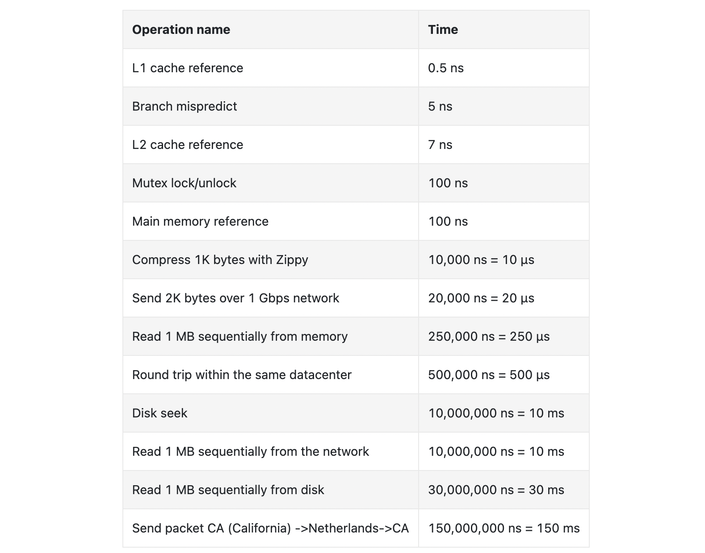

# 2장. 개략적인 규모 추정

> [응답지연 값](#응답지연-값)
>
> [가용성에 관계된 수치들](#가용성에-관계된-수치들)
>
> [예제-트위터 QPS와 저장소 요구량 추정](#예제-트위터-QPS와-저장소-요구량-추정)
>
> [팁](#팁)

 

개략적인 규모 추정(back-of-the-envelope estimation)은 보편적으로 통용되는 성능 수치상에서 사고 실험(thought experiments)을 행하여 추정치를 계산하는 행위로서, 어떤 설계가 요구사항에 부합할 것인지 보기 위한 것

 

## 응답지연 값

- 메모리는 빠르지만 디스크는 아직 느림
- 디스크 탐색(seek)은 가능한 한 피하라
- 단순한 압축 알고리즘은 빠름
- 데이터를 인터넷으로 전송하기 전에 가능하면 압축하라
- 데이터 센터는 보통 여러 지역(region)에 분산되어 있고, 센터들 간에 데이터를 주고받는 데는 시간이 걸림

 

## 가용성에 관계된 수치들

- 고가용성(high availability)은 시스템이 오랜 시간 동안 지속적으로 중단 없이 운영될 수 있는 능력
- 고가용성을 표현하는 값은 퍼센트로 표현
  - 100%는 시스템이 단 한 번도 중단된 적이 없었음을 의미
  - 대부분의 서비스는 99% ~ 100% 사이의 값을 가짐
- SLA(Service Level Agreement)는 서비스 사업자(service provider)가 보편적으로 사용하는 용어

 

## 예제-트위터 QPS와 저장소 요구량 추정

##### 가정

- 월간 능동 사용자(monthly active user)는 3억명
- 50%의 사용자가 트위터를 매일 사용
- 평균적으로 각 사용자는 매일 2건의 트윗을 올림
- 미디어를 포함하는 트윗은 10% 정도
- 데이터는 5년간 보관

##### 추정

- QPS(Query Per Second) 추정치
  - 일간 능동 사용자(Daily Active User, DAU) = 3억 x 50% = 1.5억
  - QPS = 1.5억 x 2트윗 / 24시간 / 3600초 = 약 3,500
  - 최대 QPS(Peek QPS) = 2 x QPS = 약 7,000
- 미디어 저장을 위한 저장소 요구량
  - 평균 트윗 크기
    - tweet_id 64byte
    - 텍스트 140byte
    - 미디어 1MB
  - 미디어 저장소 요구량: 1.5억 x 2 x 10% x 1MB = 30TB per day
  - 5년간 미디어를 보관하기 위한 저장소 요구량: 30TB x 365 x 5 = 약 55PB

 

## 팁

- 근사치를 활용한 계산(rounding and approxmation)
  - "99,987 / 9.1" 의 계산 결과는 "100,000 / 10" 근사치를 활용해 계산 가능
- 가정(assumption)은 적어가며 과정을 따라갈 수 있게 할 것
- 단위(unit)을 붙여야 함
  - 5라고만 적으면 5kb인지 5mb인지 알 수가 없음
- QPS, 최대 QPS, 저장소 요구량 , 캐시 요구량, 서버 수 등을 추정할 수 있어야 함

##### 

