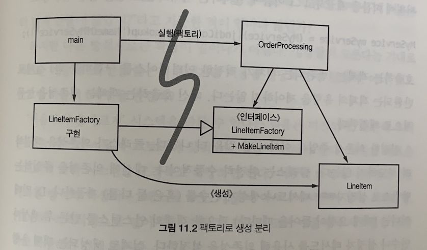

# 시스템

- [시스템 제작과 시스템 사용을 분리하라](#시스템-제작과-시스템-사용을-분리하라)
  - 관심사 분리
  - 의존성 주입
- [확장](#확장)
  - AOP
- [기타](#기타)

<br>

### 시스템 제작과 시스템 사용을 분리하라

- 제작(construction)과 사용(use)은 아주 다르다
  - (애플리케이션 객체를 제작하고 의존성을 서로 '연결'하는) 준비 과정과
  - (준비 과정 이후에 이어지는) 런타임 로직을 분리해야 한다

- <b>관심사 분리</b>

  - 애플리케이션 시작 단계에서의 관심사를 분리하지 않은 사례

    ```java
    public Service getService() {
      if (service == null) {
        service = new MyServiceImpl(...);  // 모든 상황에 적합한 기본값인가?
      }
      return service;
    }
    ```

    - 장점
      - 초기화 지연(Lazy Initialization) 또는 계산 지연(Lazy Evaluation) 기법
      - service를 생성하는 getService() 메서드를 호출하지 않으면 객체를 생성하지 않으므로 불필요한 부하가 걸리지 않음
      - 어떤 경우에도 null 포인터를 반환하지 않음
    - 단점
      - getService() 메서드가 MyServiceImpl과 생성자 인수에 명시적으로 의존
      - 런타임 로직에서 MyServiceImpl 객체를 전혀 사용하지 않더라도 의존성을 해결하지 않으면 컴파일 되지 않음
      - MyServiceImpl이 무거운 객체라면 단위 테스트에서 getService 메서드를 호출하기 전에 적절한 테스트 전용 객체(TEST DOUBLE이나 MOCK OBJECT)를 service 필드에 할당해야 함
      - 일반 런타임 로직에 객체 생성 로직을 섞어 놓아 모든 실행 경로도 테스트 해야 함
        - new MyServiceImpl()로 service 객체를 생성하는 로직을 섞어 놓았는데, 이로 인해서 service가 null일 때와 null이 아닐 때에 대해 모두 테스트해야 한다는 의미(SRP 위반)
      - MyServiceImpl이 모든 상황에 적합한 객체인지 모르게 됨

  - 객체를 생성하거나 의존성을 연결할 때

    - 설정 논리는 일반 실행 논리와 분리해야 모듈성이 높아짐
    - 아래 Main 분리와 추상 팩토리 패턴와 같이 분리

  - <b>Main 분리</b>

    - 시스템 생성과 시스템 사용을 분리하는 한 가지 방법
    - 생성과 관련된 코드는 모두 main이나 main이 호출하는 모듈로 옮김
      - main 함수에서 시스템에 필요한 객체를 생성한 후 이를 애플리케이션에 넘기면, 애플리케이션은 그저 객체를 사용할 뿐
      - 애플리케이션은 main이나 객체가 생성되는 과정을 전혀 몰라도 됨

  - <b>추상팩토리</b>

    > [abstract factory pattern](https://www.baeldung.com/java-abstract-factory-pattern)

    - 객체가 생성되는 시점을 애플리케이션이 결정할 필요가 생길 때 사용

      

      - 즉, runtime에 LineItem이 생성되는 로직을 컨트롤 해야 하지만, 해당 LineItem을 생성하는 구체적인 비즈니스 로직은 몰라야 할 때
      - main 실행 단계에서 LineItemFactoryImpl 객체는 생성되지만, 실제 LineItem 인스턴스가 생성되는 것은 OrderProcessing이 이루어지는 런타임 단계임

- <b>의존성 주입</b>

  - 사용과 제작을 분리하는 강력한 메커니즘 중 하나가 의존성 주입(DI: Dependency Injection)

  - 의존성 주입은 제어 역전(IOC: Inversion of Control) 기법을 의존성 관리에 적용한 메커니즘

    - 제어역전: 한 객체가 맡은 보조 책임을 새로운 객체에게 전적으로 떠넘긴다(새로운 객체는 넘겨받은 책임만 맡으므로 SRP 지킴)

  - 의존성 관리 맥락에서 객체는 의존성 자체를 인스턴스로 만드는 책임은 지지 않음

    - 즉, 다른 '전담' 메커니즘에 넘겨 제어를 역전한다는 것인데, 위 예시에서는 초기 설정(LineItemFactoryImpl 객체를 생성)이 시스템 전체에서 필요하므로 main 루틴이나 특수 컨테이너를 사용

  - 진정한 의존성은 클래스가 의존성을 해결하려 시도하지 않음

    - 클래스는 완전히 수동적이다

    - 의존성을 주입하는 방법으로 setter나 생성자 인수를 제공

    - DI 컨테이너는 (대게 요청이 들어올 때마다) 필요한 객체의 인스턴스를 만든 후 생성자 인수나 설정자 메서드를 사용해 의존성을 설정

      ```java
      @Controller  // controller, service는 bean 객체로 관리
      public class MyController {
        
        @Resource(name ="myService")  // 생성자 인수로 의존성 설정
        // @Resource(name = "yourService")
        private MyService myService;
      }
      
      @Service
      public class MyService {
        // ...
      }
      
      @Service
      public class YourService {
        // ...
      }
      ```

    - 실제로 생성되는 객체 유형은 설정파일에서 지정하거나 특수 생성 모듈에서 코드로 명시

    - 대다수 DI 컨테이너는 필요할 때까지는 객체를 생성하지 않고, 대부분은 계산 지연이나 비슷한 최적화에 쓸 수 있도록 팩토리를 호출하거나 프록시를 생성하는 방법을 제공. 즉, 계산 지연 기법이나 이와 유사한 최적화 기법에서 이런 메커니즘을 사용할 수 있음

<br>

### 확장

- '처음부터 올바르게' 시스템을 만들 수 있다는 믿음은 미신이므로, 우리는 오늘 주어진 사용자 스토리에 맞춰 시스템을 구현해야 하고, 내일은 새로운 스토리에 맞춰 시스템을 조정하고 확장하면 된다

- TDD, 리팩터링을 통해 얻어지는 깨끗한 코드는 `코드 수준`에서 시스템을 조정하고 확장하기 쉽게 만들지만, `시스템 수준`에서는 시스템 아키텍쳐를 복잡한 수준으로 확장하기 쉽지 않은데, 이를 해결하기 위해 관심사를 적절히 분리해야 함

  ```txt
  소프트웨어 시스템은 물리적인 시스템과 다르다. 관심사를 적절히 분리해 관리한다면 소프트웨어 아키텍처는 점진적으로 발전할 수 있다.
  ```

- 관심사를 적절히 분리하지 못한 사례(EJB1,2)

  - pp.200~202 참조
  - 비즈니스 논리가 덩치 큰 컨테이너와 밀접하게 결합되어 있어, 독자적인 단위 테스트가 어려움

- 횡단(cross-cutting) 관심사

  - 영속성과 같은 관심사는 application에서 객체 경계를 넘나드는 경향이 있음
    - 즉, 메모리에 존재하지 않고 file system이나 DBMS 등에 저장하는 작업을 통해 영속성을 유지하는데, 파일시스템이나 db에 접근하는 방식은 시스템 내 어떤 객체에서도 동일해야 하고 해당 방식을 구현한 코드가 다른 객체들로 흩어지게 해서는 안되게 개선해야 함
    - 이같은 개선을 위해 AOP라는 개념이 나옴

  - AOP(Aspect Oriented Programming)

    - 횡단 관심사에 대처해 모듈성을 확보하는 일반적인 방법론

    - 관점(aspect)이라는 모듈 구성 개념은 '특정 관심사를 지원하려면 시스템에서 특정 지점들이 동작하는 방식을 일관성 있게 바꿔야 한다'는 것

      ```txt
      영속성을 예로 들면, 프로그래머는 영속성으로 저장할 객체와 속성을 선언한 후 영속성 책임을 영속성 프레임워크에 위임한다. 그러면 AOP 프레임워크는 대상 코드에 영향을 미치지 않는 상태로 동작 방식을 변경한다.
      ```

- 자바에서 사용하는 Aspect와 유사한 메커니즘

  - 자바 프록시

    - 단순한 상황에 적합

    - 개별 객체나 클래스에서 메서드 호출을 감싸는 경우

    - JDK에서 제공하는 동적 프록시는 인터페이스만 지원(클래스 프록시를 사용하려면 바이트 코드 처리 라이브러리 필요)

    - Bank application에서 JDK 프록시를 사용해 영속성 지원하는 예제

      ```java
      // use
      Bank bank = (Bank) Proxy.newProxyInstance(
          Bank.class.getClassLoader(),
          new Class[] { Bank.class },
          new BankProxyHandler(new BankImpl())    
      );
      
      public interface Bank {
          Collection<Account> getAccount();
          void setAccounts(Collection<Account> accounts);
      }
      
      // 추상화를 위한 POJO(Plain Old Java Obejct) 구현
      public class BankImpl implements Bank {
          private List<Account> accounts;
      
          public Collection<Account> getAccounts() {
              return accounts;
          }
      
          public void setAccounts(Collection<Account> accounts) {
              this.accounts = new ArrayList<Account>();
              for (Account account: accounts) {
                  this.accounts.add(account);
              }
          }
      }
      
      // 프록시 API가 필요한 InvocationHandler
      public class BankProxyHandler implements InvocationHandler {
          private Bank bank;
      
          public BankProxyHandler(Bank bank) {
              this.bank = bank;
          }
      
          public Object invoke(Object proxy, Method method, Object[] args) throws Throwable {
              String methodName = method.getName();
              if (methodName.equals("getAccounts")) {
                  bank.setAccounts(getAccountsFromDatabase());
              } else if (methodName.equals("setAccounts")) {
                  bank.setAccounts((Collection<Account>) args[0]);
                  setAccountsToDatabase(bank.getAccounts());
                  return null;
              } else {
                  // ...
              }
          }
          
          protected Collection<Account> getAccountsFromDatabase() {}
          protected void setAccountsToDatabase(Collection<Account> accounts) {}
      }
      ```

      - Proxy로 감쌀 interface Bank와 비즈니스 논리를 구현하는 POJO BankImpl 정의
      - 프록시 API에는 InvocationHandler를 넘겨줘야 하고, InvocationHandler는 프록시에 호출되는 Bank 메서드를 구현하는 데 사용
      - 단점
        - 코드도 많고 복잡
        - 바이트 조작 라이브러리를 사용해도 어려움
        - 즉, 프록시를 사용하면 깨끗한 코드를 작성하기 어렵고, 시스템 단위로 실행 '지점'을 명시하는 메커니즘도 제공하지 않음

  - 순수 자바 AOP 프레임워크

    - 순수 자바란 AspectJ를 사용하지 않는 것
    - 스프링 AOP, JBoss AOP 같은 자바 프레임워크는 내부적으로 프록시 사용
    - 스프링은 비즈니스 논리를 POJO로 구현하고, POJO는 순수하게 도메인에 초점을 맞춤
    - 위 해당 프레임워크는 사용자가 모르게 프록시나 바이트코드 라이브러리를 사용해 이를 구현
    - 예시로
      - Bank 객체 -> DAO로 프록시 -> 다시 JDBC 드라이버 AppDataSource로 프록시
      - 이를 통해 Bank 객체가 getAccounts()를 호출해 db와 통신한다고 생각할 수 있지만, 실제로는 JDBC 객체가 db와 통신하는 것
    - EJB3는 XML 설정 파일과 annotation 기능을 사용해 횡단 관심사를 선언적으로 지원하는 스프링 모델을 따르게 됨(pp.208~209 참고)

  - AspectJ

    - 책 내용의 범위를 벗어나므로 생략..?

<br>

### 기타

- 테스트 주도 시스템 아키텍처 구축

  - 관점으로 관심사를 분리하는 방식(애플리케이션 도메인 논리를 POJO로 작성해 코드 수준에서 아키텍처 관심사를 분리)은 테스트 주도 아키텍처 구축이 가능하게 함

  - 이를 통해 단순한 아키텍처를 복잡한 아키텍처로 키워나갈 수 있음

  ```txt
  최선의 시스템 구조는 각기 POJO (또는 다른) 객체로 구현되는 모듈화된 관심사 영역(도메인)으로 구성된다. 이렇게 서로 다른 영역은 해당 영역 코드에 최소한의 영향을 미치는 관점이나 유사한 도구를 사용해 통합한다. 이런 구조 역시 코드와 마찬가지로 테스트 주도 기법을 적용할 수 있다.
  ```

- 의사 결정을 최적화하라

  - 모듈을 나누고 관심사를 분리하면 지엽적인 관리와 결정이 가능해짐

  ```txt
  관심사를 모듈로 분리한 POJO 시스템은 기민함을 제공한다. 이런 기민함 덕택에 최신 정보에 기반해 최선의 시점에 최적의 결정을 내리기가 쉬워진다. 또한 결정의 복잡성도 줄어든다.
  ```

- 명백한 가치가 있을 때 표준을 현명하게 사용하라

  ```txt
  표준을 사용하면 아이디어와 컴포넌트를 재사용하기 쉽고, 적절한 경험을 가진 사람을 구하기 쉬우며, 좋은 아이디어를 캡슐화하기 쉽고, 컴포넌트를 엮기 쉽다. 하지만 때로는 표준을 만드는 시간이 너무 오래 걸려 업계가 기다리지 못한다. 어떤 표준을 원래 표준을 제정한 목적을 잊어버리기도 한다.
  ```

- 시스템은 도메인 특화 언어가 필요하다

  - DSL(Domain-Specific Language)
  - 좋은 DSL은 도메인 개념과 그 개념을 구현한 코드 사이에 존재하는 '의사소통 간극'을 줄여줌

  ```java
  도메인 특화 언어를 사용하면 고차원 정책에서 저차원 세부사항에 이르기까지 모든 추상화 수준과 모든 도메인을 POJO로 표현할 수 있다.
  ```