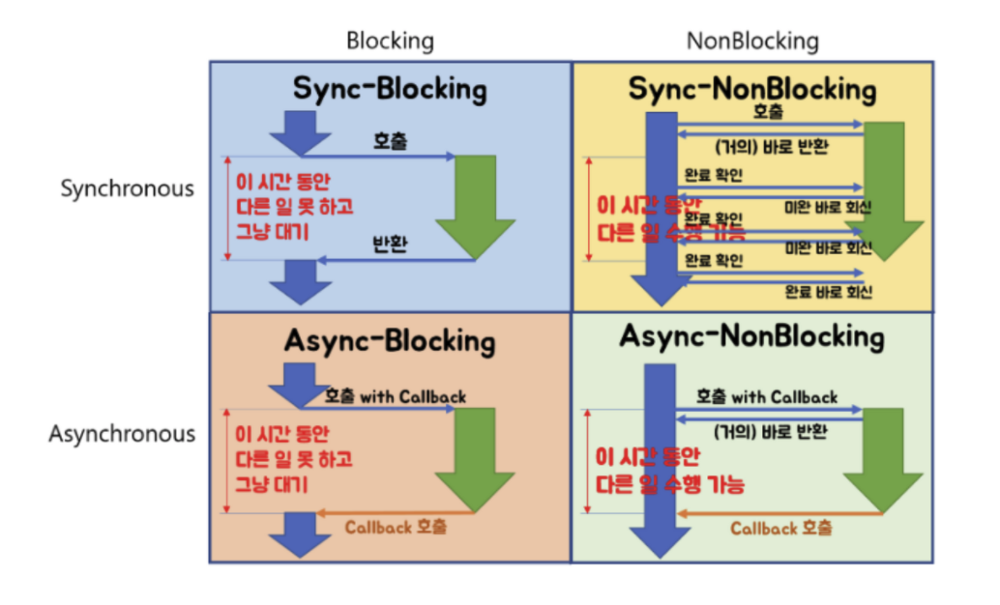

# blocking, non-blocking / sync, async

> blocking, non-blocking, synchronous, asynchronous는 혼동되는 개념이고, blocking/synchronous와 non-blocking/asynchronous가 대칭되는 개념으로 오해하기 쉽다. 하지만 둘의 차이점이 존재한다.

## Blocking vs Non-blocking

- blocking
  - 호출 하는 함수의 실행이 다른 콜백 함수의 실행에 의해 막혀버린, 제한된, 대기하는 상태
  - `호출된 함수`가 자신이 할 일을 모두 마칠 때까지 제어권을 계속 가지고서 `호출한 함수`에게 바로 return하지 않는 것
- non-blocking
  - `호출된 함수`가 자신이 할 일을 마치지 않았더라도 바로 제어권을 넘겨주며(return), `호출한 함수`가 다른 일을 진행할 수 있도록 해주는 것

## Synchronous vs Asynchronous

- synchronous
  - `호출된 함수`의 수행 결과 및 종료를 `호출한 함수`가(호출된 함수 뿐 아니라 호출한 함수도 함께) 신경쓰는 것
- Asynchronous
  - `호출된 함수`의 수행 결과 및 종료를 `호출된 함수` 혼자 신경 쓰고 처리하는 것(as a callback fn.)

## 네가지 경우

- block - sync : 블럭드와 동기는 호출한 함수가 호출된 함수에 의해 wait() 되어 다른 일은 수행하지 못하고, 호출한 함수는 호출된 함수의 종료를 지속적으로 신경쓰는 것
- non-block - async : 넌블럭드와 비동기는 호출한 함수가 호출된 함수에게 제어권을 바로 돌려 받고(return), 호출한 함수는 호출된 함수의 종료를 신경쓰지 않고 종료 시점을 호출한 함수에게 완료되었을 경우 알려줌

- non-block - sync : 넌블럭드와 동기는 호출된 함수는 호출한 함수에게 바로 제어권을 돌려 주지만(return), 호출한 함수가 호출된 함수와 sync 되어 있어 지속적으로 완료 여부를 검사해야 함
- block- async : 블럭드와 비동기는 호출된 함수가 실행되어야 하는 task 종료 시에 호출한 함수에게 알려주지만, 호출한 함수는 wait() 되어 다른 일을 수행하지 못함

## etc

- server side I/O performance: Node, php, java, go

  https://www.toptal.com/back-end/server-side-io-performance-node-php-java-go

  - php
    - 각 요청에 대해 각 process를 만들어 부하 심함

  - Java
    - Multithreaded
    - 다중 쓰레드를 구현했지만 여전히 각 요청에 따라 쓰레드를 여러개 만들어 메모리나 데이터를 공유할 경우 blocked되어 효율적이지 않음(스케쥴링이 필요)
    - 이후 non-blocking I/O calls 구현? 하지만 대부분의 웹서버에서 사용되고 있지 않음
  - Node
    - non-blocking I/O 구현
