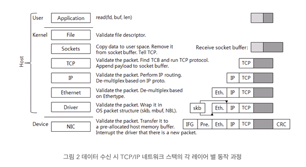

# HTTP Connection 관리

> 다루는 내용
>
> - HTTP는 어떻게 TCP 커넥션을 사용하는가
> - TCP 커넥션의 지연, 병목, 막힘
> - 병렬 커넥션, keep-alive 커넥션, 커넥션 파이프라인을 활용한 HTTP의 최적화
> - 커넥션 ㅗ간리를 위해 따라야 할 규칙들

## TCP 커넥션

- HTTP 통신은 패킷 교환은 네트워크 프로토콜들의 계츠와된 집합인 TCP/IP를 통해 이루어짐 >> 클라이언트 애플리케이션은 서버 애플리케이션으로 TCP/IP 커넥션을 맺을 수 있음을 의미

- TCP는 연결 지향 프로토콜이기 때문에, 일단 커넥션이 맺어지면 메시지들이 손실/손상되거나 순서가 바뀌지 않고 안전하게 전달됨

- TCP 스트림은 세그먼트로 나뉘어 IP 패킷을 통해 전송

  - TCP는 세그먼트 단위로 데이터 스트림을 잘게 나누고, 세그먼트를 IP 패킷이라 불리는 '봉투'에 담아서 데이터를 전달

  - 이 모든 것은 TCP/IP 소프트웨어에 의해 처리

    

- TCP 커넥션 유지하기

  - TCP는 `<발신지 IP 주소, 발신지 포트, 수신지 IP 주소, 수신지 포트> ` 의 네가지 값으로 유일한 커넥션을 생성

