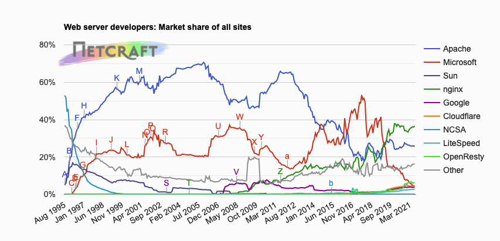
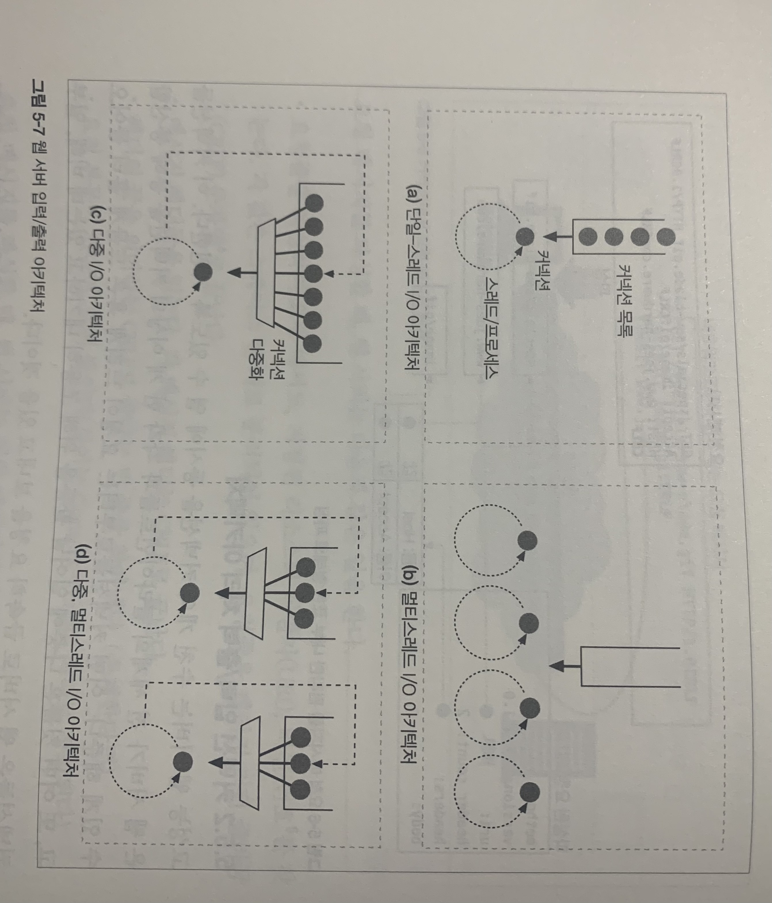

# HTTP Web Server

> 이 장에서 다룰 내용
>
> - 여러 종류의 소프트웨어 및 하드웨어 웹 서버
> - 웹서버가 HTTP 트랜잭션을 처리하는 단계

## 웹 서버의 종류

##### 다목적 소프트웨어 웹 서버

- 네트워크에 연결된 표준 컴퓨터 시스템에서 동작

  - 아파치, 직소(W3C) 같은 오픈 소스 소프트웨어 사용 가능

  - 마이크로소프트, 아이플래닛의 웹서버 같은 상용 소프트웨어 사용도 가능

  - 2014년 까지는 MS(37%), 아파치(35%), nginx(14%) 정도였지만, 2021년 현재 nginx(37%), 아파치(26%), MS(4%) 로 변동이 있음

    

##### 

##### 임베디드 웹 서버

- 일반 소비자용 제품에 내장될 목적으로 만들어진 작은 웹서버(프린터나 가전제품 등)

##### 간단한 펄 웹 서버

- HTTP 1.1의 기능을 지원하기 위해서는 풍부한 리소스 지원, 가상 호스팅, 접근 제어, 로깅, 설정, 모니터링, 그외 성능을 위한 각종 기능들이 필요함
- 하지만 간단한 펄 웹 서버는 약 30여줄 이하로 만들 수 있음
- 클라이언트 요청에 대해 서버 요청을 직접 입력하여 전달하는 방식이며, 요청과 응답의 형식을 구현

## 웹 서버 역할

> 웹 서버는 종류가 다양하지만 모두 리소스에 대한 HTTP 요청을 받아 콘텐츠를 클라이언트에게 돌려주는 역할을 함
>
> HTTP 및 그와 관련된 TCP 처리를 구현한 것
>
> - 자신이 제공하는 리소스를 관리하고 웹서버를 설정/통제/확장하기 위한 관리 기능을 제공
> - TCP 커넥션 관리에 대한 책임을 운영체제와 나눠 가짐
>
> 1. 커넥션을 맺는다: 클라이언트의 접속을 받아들이거나, 원치 않는 클라이언트라면 닫음
> 2. 요청을 받는다: HTTP 요청 메시지를 네트워크로부터 읽어 들임
> 3. 요청을 처리한다: 요청 메시지를 해석하고 행동을 취함
> 4. 리소스에 접근한다: 메시지에서 지정한 리소스에 접근
> 5. 응답을 만든다: 올바른 헤더를 포함한 HTTP 응답 메시지를 생성
> 6. 응답을 보낸다: 응답을 클라이언트에게 돌려줌
> 7. 트랜잭션을 로그로 남긴다: 로그파일에 트랜잭션 완료에 대한 기록을 남김

### 클라이언트 커넥션 수락

- 클라이언트가 이미 서버에 대해 커넥션을 가지고 있으면, 요청을 보내기 위해 해당 커넥션을 사용하지만, 커넥션이 없다면 새 커넥션을 열 필요가 있음

- 새 커넥션 다루기

  - 클라이언트 -> 서버 TCP 커넥션을 요청하면, 웹 서버는 그 커넥션을 맺고 TCP 커넥션에서 IP 주소를 추출하여 커넥션 맞은편에 어떤 클라이언트가 있는지 확인
  - 새 커넥션이 맺어지고 받아들여지면, 서버는 새 커넥션을 커넥션 목록에 추가하고 커넥션에서 오가는 데이터를 지켜보기 위한 준비를 함
  - 웹 서버는 어떤 커넥션이든 마음대로 거절하거나 닫을 수 있음(IP 주소나 호스트명이 인가되지 않았거나, 악의적이라고 알려진 것들의 경우 거부)

- 클라이언트 호스트명 식별

  - 대부분의 웹 서버는 '역방향 DNS(reverse DNS)'를 사용해서 클라이언트의 IP 주소를 클라이언트의 호스트명으로 변환하도록 설정됨
  - 이 호스트명을 구체적인 접근 제어나 로깅을 위해 사용할 수 있음
  - hostname lookup은 시간이 오래 걸려 대용량 웹 서버는 이 기능을 꺼두거나 특정 콘텐츠에 대해서만 허용

- ident를 통해 클라이언트 사용자 알아내기

  - 몇몇 웹 서버는 IETF ident 프로토콜(TCP Client Identity Protocol) 지원
  - TCP 커넥션을 요청한 사용자의 이름을 알 수 있는데, 클라이언트 측이 113번 포트를 열면 서버가 누가 요청했는지 알아내기 위해 요청을 보냄
  - 조직 내부에서는 사용하지만, 공공 인터넷에서는 잘 사용하지 않음
    - ident 프로토콜 지원하는 소프트웨어가 클라이언트 측에 설치되지 않은 경우 많음
    - HTTP 트랜잭션을 유의미하게 지연시킴
    - 방화벽이 ident 트래픽이 오는 것을 막는 경우가 많음
    - 안전하지 않고 조작이 쉬움
    - 가상 IP 주소 지원 잘 안함
    - 사용자 이름 노출로 보안 우려

  

### 요청 메시지 수신

- 커넥션에 데이터가 도착하면, 웹서버는 네트워크 커넥션에서 그 데이터를 읽고 파싱해 요청 메시지 구성

- 요청 메시지 파싱

  - 파싱하면, 요청 메서드, 리소스 식별자(URI), HTTP 버전 번호를 찾음
  - 메시지 헤더를 읽음
  - 요청 본문이 있다면 읽어들임

- 요청 메시지는 네트워크로부터 불규칙적으로 받기 때문에 네트워크 커넥션은 언제라도 무효화될 수 있음

- 따라서 웹서버는 파싱해서 이해할 수 있는 수준의 분량을 확보할 때까지 데이터를 네트워크로부터 읽어서 메시지 일부분을 메모리에 임시로 저장해 둘 필요가 있음

- 메시지의 내부 표현

  - 웹서버는 요청메시지를 쉽게 다루기 위해 내부의 자료 구조에 저장
  - 포인터와 길이를 담거나, 헤더는 속도가 빠른 룩업 테이블에 저장하는 등

- 커넥션 I/O 처리 아키텍쳐

  - 고성능 웹서버는 수천 개의 커넥션을 동시에 열 수 있도록 지원

  

  - 단일 스레드 웹 서버
    - 한 번에 하나씩 요청을 처리(트랜잭션이 완료되면, 다음 커넥션이 처리)
    - 트랜잭션 처리 중 다른 커넥션은 무시되기 때문에 성능 저하가 큼
  - 멀티프로세스와 멀티스레드
    - 여러 요청을 동시에 처리하기 위해 여러개의 프로세스 혹은 고효율 스레드를 할당
    - 스레드와 프레세스는 필요할 때 만들어질 수 있고 미리 만들져 있을 수도 있음
    - 동시에 많은 프로세스나 스레드를 사용하면 너무 많은 메모리나 시스템 리소스를 소모하기 때문에 최대 개수의 제한을 거는 것이 일반적
  - 다중 I/O 서버
    - 대량의 커넥션을 처리하기 위해 모든 커넥션은 감시당하고, 커넥션의 상태가 바뀌면(데이터를 사용할 수 있게 되거나 에러가 발생), 다음번 상태 변경을 위해 열린 커넥션 목록으로 돌아감
    - 특정 커넥션에 대해 작업을 수행하는 것은 그 커넥션이 실제로 해야 할 일이 있을 때 뿐이므로, 스레드와 프로세스는 유휴 상태의 커넥션에서 리소스를 낭비하지 않음
  - 다중 멀티스레드 서버
    - 멀티스레딩과 다중화(multiplexing)을 결합한 형태
    - 여러 개의 스레드(보통 하나의 물리적 프로세스)는 각각 열려있는 커넥션을 감시하고 각 커넥션에 대해 조금씩 작업을 수행

### 요청 처리

- 웹서버가 요청을 받으면 서버는 요청으로부터 메서드, 리소스, 헤더, 본문을 해석해 처리
- 요청 처리는 다른 장의 내용 참조

### 리소스의 매핑과 접근

- 웹서버가 클라이언트에 콘텐츠를 전달하려면, 그전에 요청 메시지의 URI에 대응하는 알맞은 콘텐츠나 콘텐츠 생성기를 웹서버에서 찾아서 그 콘텐츠의 원천을 식별해야 함
- Docroot
  - 요청 URI를 웹서버의 파일 시스템 안에 있는 파일 이름으로 사용하는데, 특정 root 폴더의 경로를 docroot라고 하며, 요청 메시지에서 URI를 가져와 이 루트에 붙임
  - /specials/saw-blade.gif 라는 URI 요청이 있다면, 실제 서버의 폴더 경로인 /usr/local/httpd/files/specials/saw-blade.gif 파일을 반환하는 형식
- 가상 호스팅된 docroot
  - 각 사이트에 분리된 문서 루트를 주는 방법으로, 한 웹서버에서 여러 개의 웹 사이트를 호스팅하는 것
  - host 헤더나 서로 다른 IP 주소를 이용해 구분하여 호스팅
- 사용자 홈 디렉토리 docroots
  - 한 대의 웹서버에서 여러(각 개인의) 웹사이트를 만들 수 있도록 해주는 것
  - `/`, `~` 다음에 사용자 이름이 오는 것으로 시작하는 URI(예를 들어 `GET /~bob/index.html HTTP 1.0`)는 사용자의 개인 문서 루트를 가리킴
- 디렉터리 목록
  - 사용자가 디렉토리 경로를 URL로 요청하면, 다음을 반환
    - 에러
    - 디렉토리 대신 특별한 '색인 파일'을 반환
    - 디렉토리를 탐색해서 그 내용을 담은 HTML 페이지를 반환
  - 대부분의 웹서버는 요청 URL에 대응되는 디렉토리에서 index.html, index.htm에 대응되는 파일을 찾아 반환
- 동적 콘텐츠 리소스 매핑
  - 동적 리소스(요청에 따라 콘텐츠를 생성하는 것)에 매핑할 수도 있음
  - 어떤 리소스가 동적 리소스라면, 애플리케이션 서버는 그에 대한 동적 콘텐츠 생성 프로그램이 어디에 있는지, 그리고 어떻게 실행하는지 알려줄 수 있어야 함
  - 예를 들어 `ScriptAlias /cgi-bin/ /usr/local/etc/httpd/cgi-programs/` 라는 URI가 들어온다면, 해당 경로에서 해당 프로그램을 찾아 실행하라는 의미임
- 서버사이드 인클루드(Server-Side Includes, SSI)
  - 많은 웹서버가 지원하는 형태
  - 특정 리소스가 SSI를 포함하고 있는 것으로 설정되어 있다면, 서버는 그 리소스의 콘텐츠를 클라이언트에게 보내기 전에 특정 처리를 함
  - 서버는 콘텐츠에 변수 이름이나 내장된 스크립트가 될 수 있는 어떤 특별한 패턴이 있는지 검사를 받고, 해당 패턴은 변수 값이나 실행 가능한 스크립트의 출력 값으로 치환됨. 이는 동적 콘텐츠를 만들는 쉬운 방법임
- 접근 제어
  - 클라이언트의 IP 주소에 접근하여 요청을 제어할 수 있고, 리소스에 접근하기 위한 비밀번호를 물어볼 수도 있음

### 응답 만들기

- 서버는 클라이언트 요청에 해당하는 동작을 처리한 뒤 응답 메시지를 반환함
- 응답 entity
  - 응답 본문이 있다면 응답 메시지는 주로 다음을 포함함
    - Content-Type: 응답 본문의 MIME 타입
    - Content-Length: 응답 본문의 길이
    - 실제 응답 본문의 내용
- MIME 타입 결정
  - 웹서버에게는 응답 본문의 MIME 타입을 결정해야 하는 책임이 있음
  - MIME 타입과 리소스를 연결하는 여러 방법
    - mime.types
      - 리소스의 MIME 타입을 알아내기 위해 MIME 타입이 담겨 있는 파일을 탐색
    - Magic typing
      - 파일의 내용을 검사해 알려진 패턴에 대한 테이블(매직 파일이라 불림)에 해당하는 패턴이 있는지 찾아보는 것
    - 유형 명시(Explicit typing)
      - 특정 파일이나 디렉토리 안의 파일들이 파일 확장자나 내용에 상관없이 어떤 MIME 타입을 갖도록 웹서버가 설정하는 것
    - 유형 협상(Type negotiation)
      - 한 리소스가 여러 종류의 문서 형식에 속하도록 설정하는 것
      - 웹서버가 사용자가 사용하기 좋은 형식을 판별할 것인지 여부도 설정 가능
      - 특정 파일이 특정 MIME 타입을 갖게 설정 가능
  - 리다이렉션(redirection)
    - 웹서버는 요청을 수행하기 위해 브라우저가 다른 곳으로 가도록 리다이렉트 할 수 있음
    - Location 응답 헤더는 콘텐츠의 새로운(또는 선호되는) 위치 URI를 포함
    - 리소스가 영구하게 이동된 경우
      - 301 Moved Permanently
    - 리소스가 임시 이동된 경우
      - 303 See Other
      - 307 Temporary Redirect
  - URL 증강
    - 요청이 도착했을 때 서버는 상태 정보를 내포한 새 URL을 생성해 사용자를 해당 URL로 리다이렉트함
    - 클라이언트는 해당 URL을 따라가서 상태정보가 추가된 완전한 URL이 포함된 요청을 다시 보내어 트랜잭션 간 상태를 유지함
    - 위처럼 303, 307 상태 코드 사용
  - 부하 균형
    - 부하가 심한 서버에 요청이 도달하면, 서버는 부하가 덜한 서버로 리다이렉트
    - 위처럼 303, 307 상태 코드 사용
  - 친밀한 서버가 있을 때
    - 특정 서버가 어떤 사용자에 대한 정보를 가질 수 있는데, 이 서버로 사용자를 리다이렉트 하는 것
    - 위처럼 303, 307 상태 코드 사용
  - 디렉토리 이름 정규화
    - URI 요청 끝에 `/`가 빠졌으면, 상대경로가 정상적으로 동작할 수 있도록 슬래시를 추가한 URI로 리다이렉트함

### 응답 보내기

- 서버는 여러 클라이언트에 대해 많은 커넥션을 가질 수 있는데, 커넥션이 유휴 상태일 수도 활성 상태일 수도 있음
- 트랜잭션을 효율적으로 처리하기 위해 서버는 커텍션의 상태를 추적해야 하며, 비지속 커넥션은 서버가 모든 메시지 전송했을 때 서버 커넥션을 종료하겠지만, 지속 커넥션은 특별히 주의해야 함
- 지속 커넥션의 경우
  - 서버가 Content-Length 헤더를 올바르게 계산하기 위해 더 주의를 요함
  - 클라이언트가 응답이 언제 끝나는지 알 수 없는 경우 커넥션은 열린 상태 유지

### 로깅

- 트랜잭션이 완료되었을 때 웹서버는 트랜잭션이 어떻게 수행되었는지에 대한 로그를 로그파일에 기록
- 21장 참조

