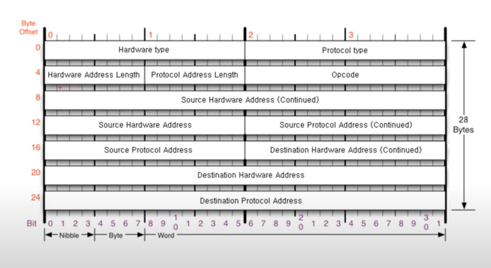
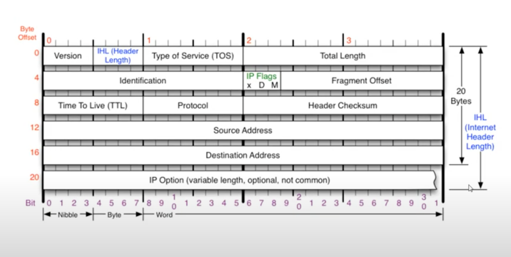
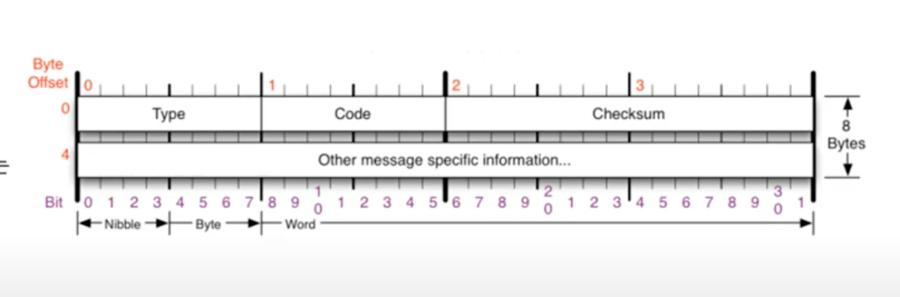
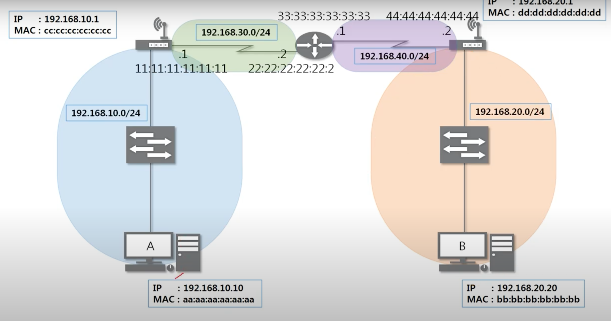
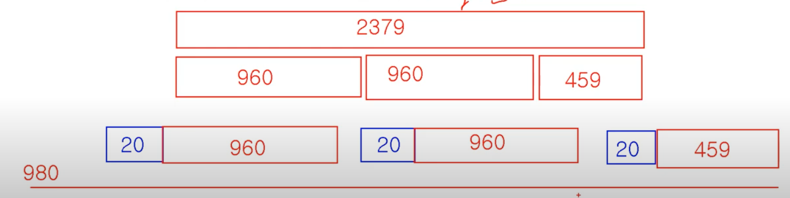

# OSI(3계층 Network)


## 3계층의 기능

- 다른 네트워크 대역, 즉 멀리 떨어진 곳에 존재하는 네트워크까지 어떻게 데이터를 전달할지 제어하는 일을 담당
- 발신에서 착신까지의 패킷의 경로를 제어

- WAN에서 통신할 때 사용하는 IP 주소

  > IP 주소는 서브넷 마스크와 함께 씀(네트워크 대역을 구분하기 위해서)

  - IPv4: 현재 PC에 할당된 IP 주소
  - 서브넷 마스크: IP 주소에 대한 네트워크의 대역을 규정하는 것
    - classful한 네트워크 대역을 나눠주는 데 사용하는 값
    - 어디까지가 네트워크 대역을 구분하는 데 사용하고 어디서부터 호스트를 구분하는 데 사용하는지 지정
  - 게이트웨이 주소: 외부와 통신할 때 사용하는 네트워크의 출입구

  

- 3계층 프로토콜

  - ARP: IP주소를 이용해 MAC 주소를 알아냄
  - IPv4: WAN에서 통신할 때 사용
  - IPv6 
  - ICMP: 서로가 통신되는지 확인할 때 사용


## 일반적인 IP 주소

- Classful IP
  - A / B / C / D / E 클래스 -> 낭비가 심함
- Classless IP
  - IP주소 / 서브넷 마스크 / 네트워크 ID / 브로드캐스트 주소 / 사용 가능 IP 범위
- <b>사설 IP / 공인 IP (IPv4의 개념) </b>
  - 공인IP 1개당 2^32개의 사설IP
  - 연결된 사설 IP를 이용하는 네트워크는 공인 IP를 거쳐서 통신하게 만듦
    - NAT(Network Address Translation): IP 주소를 바꾸는 기술


## 특수한 IP 주소

- 0.0.0.0 : 나머지 모든 IP
- 127.0.0.1 : 자기 자신을 뜻하는 IP
- 게이트웨이 주소 : 일반적으로 공유기의 IP를 사용(할당된 IP 대역 중에 가장 낮거나 가장 높은 대역을 할당)


## ARP 프로토콜

- ARP 프로토콜은 같은 네트워크 대역에서 통신을 하기 위해 필요한 MAC 주소를 IP주소를 이용해서 알아오는 프로토콜
- 같은 네트워크 대역에서 통신을 하더라도 데이터를 보내기 위해서는 7계층부터 캡슐화를 통해 데이터를 보내기 때문에, IP 주소와 MAC 주소가 모두 필요함
- 이 때, IP 주소는 알고 MAC 주소는 모르더라도 ARP를 통해 통신이 가능



- Hardware type : 2계층에서 사용하는 프로토콜 타입(일반적으로 ethernet...)
- Protocol type : 일반적으로 IPv4
- Opcode(Operation code) : 요청을 보내는지, 응답을 하는지에 대한 여부
- Source Hardware Address(출발지 MAC 주소 / 6byte)
- Source Protocol Address(출발지 IP 주소 / 4byte)
- Destination Hardware Address(목적지 MAC 주소)
- Destination Protocol Address(목적지 IP 주소)


## ARP 프로토콜의 통신 과정

- A 컴퓨터가 ARP 요청 프로토콜을 만들어 encapsulation(header에 ethernet 프로토콜을 붙임) -> Ethernet+ARP

- ARP 프로토콜 : 목적지 IP 주소는 알지만 MAC 주소를 모르기 때문에, 00 00 00 00 00 00 으로 비워둠

- ethernet 프로토콜 : 목적지 MAC 주소를 모르기 때문에 FF FF FF FF FF FF 으로 채움

  (브로드캐스트 - 모두와 통신하도록)

- 같은 네트워크 대역에 있는 모든 곳에 요청을 보냄

- LAN 대역에서 2계층 장비인 switch에서 2계층 프로토콜만 확인(목적지 MAC 주소가 브로드캐스트이기 때문에 같은 대역에 있는 모두에게 보냄)

- 요청을 받은 각 노드는 3계층 ARP 프로토콜을 확인하여 목적지 IP 주소가 일치하지 않으면 패킷을 버리고, 일치하면 ARP 응답 프로토콜을 생성하여 보냄

- 응답을 보낼 때는 목적지 MAC 주소를 알기 때문에 브로드캐스트 하지 않고, 목적지 MAC 주소를 명시하여 보냄

- ARP 캐시 테이블에 특정 IP의 MAC 주소를 캐싱


## ARP 테이블

- ARP 캐시 테이블 확인

  ```bash
  $ arp -a
  ```

- 자신과 통신했던 네트워크의 IP - MAC ADDRESS 매칭하여 캐싱

- 일정 시간이 지나면 소멸되기 때문에 다시 ARP 프로토콜 통신


## IPv4 프로토콜

- 네트워크 상에서 데이터를 교환하기 위한 프로토콜

- 데이터가 <b>정확하게 전달될 것을 보장하지 않음</b>

- 중복된 패킷을 전달하거나 패킷의 순서를 잘못 전달할 가능성도 있음(악의적으로 이용되면 DoS 공격이 됨)

- 데이터의 정확하고 순차적인 전달은 상위 프로토콜인 TCP에서 보장

- IPv4 구조

  - Version: 4만 옴
  - IHL: IPv4 + encapsulation 되어서 내려온 상위 프로토콜 길이 까지 합친 전체 길이
  - Identification: 네트워크 패킷이 쪼개져 있는데, ID 값이 같아야만 같은 데이터였다는 것을 구분 가능
  - IP Flags: X / D(don't fragmentation) / M(More fragmentation), X/D는 잘 쓰지 않고, 데이터가 조각화 되어 있으면 최대 전송단위 이후에 다른 데이터들이 더 있다는 것을 알려주는 값
  - Fragmentation Offset: 조각화된 데이터가 시작 지점에서 얼마나 떨어져있는지 알려줌(이를 통해 받는 쪽에서는 받아야 할 데이터를 순서에 맞게 조립)
  - TTL(Time To Live): 패킷이 살아있을 수 있는 시간(유효숫자)
  - Protocol: 상위 프로토콜 정보
  - Header Checksum: Header에 오류가 없는지 확인하는 값
  - Type of Service: 처음 나왔을 때 사용하다가 이제 사용하지 않아서 0으로 구성
  - Source Address (출발지 IP 주소)
  - Destination Address (도착지 IP 주소)
  - IP Option: 20byte로 구성(IP Option이 붙으면 최대 60byte)

  


## ICMP 프로토콜

- ICMP(Internet Control Message Protocol, 인터넷 제어 메시지 프로토콜)

- 네트워크 컴퓨터 위에서 돌아가는 운영체제에서 오류 메시지를 전송받는 데 주로 쓰임

- 프로토콜 구조의 Type과 Code를 통해 오류 메시지 전송 받음




- Type: 대분류
  - 8(Echo), 0(Echo Reply): 8번이 요청, 0번이 응답
  - 3(Destination Unreachable), 11(Time exceeded)
  - 5(Redirect): 옛날에 쓰던 것인데, 원격지 routing table을 icmp로 수정할 때 사용 / 보안상 사용하지 않음

  - Code: 소분류


## 라우팅 테이블

- 어디로 보내야 하는지 설정되어 있는 라우팅 테이블

- cmd 확인

  ```bash
  $ netstat -r
  ```

- 라우팅 테이블에 적혀 있지 않은 네트워크 대역은 찾아갈 수 없음

- 다른 네트워크와의 통신 과정(내 컴퓨터에서 보낸 패킷이 다른 네트워크 컴퓨터까지 어떻게 이동하는가?)

  

  - A 컴퓨터가 라우팅 테이블을 확인했을 때, B의 네트워크 대역이 존재해야 통신 가능
  - 자신과 통신하는 공유기에 맞게 프로토콜을 갱신(ethernet protocol에서 자신과 통신하는 MAC 주소를 확인하여 바꿔줌)

- 라우팅 테이블 확인
  - 위 라우팅 테이블의 `$ netstat -r`로 확인하면, 네트워크 대상에는 특정 IP 주소 보다는, 네트워크 <b>대역</b>이 명시되어 있음


## IPv4 조각화 이론

- 큰 IP 패킷들이 적은 <b>MTU</b>(Maximum Transmission Unit)를 갖는 링크를 통하여 전송되려면 <b>여러 개의 작은 패킷으로 쪼개어/조각화 되어 전송</b>되어야 함.
  - 데이터를 보내는 단위가 제한이 없다면, 서버 컴퓨터가 감당할 수 없을 수 있고, 네트워크의 부하를 막기 위해서, 대용량 데이터 전송할 때는 MTU 단위로 쪼개서 함
- 즉, 목적지까지 패킷을 전달하는 과정에서 통과하는 각 라우터마다 전송에 적합한 프레임으로 변환이 필요
- 일단 조각화되면, 최종 목적지에 도달할 때까지 재조립되지 않는 것이 일반적
- IPv4에서는 발신지 뿐만 아니라 중간 라우터에서도 IP 조각화 가능
- IPv6에서는 IP 단편화가 발신지에서만 가능
- 재조립은 항상 최종 수신지에서만 가능


##### IPv4 조각화 실습

- MTU가 3,300byte 이면, IPv4 프로토콜의 일반적인 길이인 20byte를 뺀 3,280byte씩 쪼개야함

- 예시

  - 보내려는 데이터 크기 : 2379 byte
  - MTU : 980 byte
  - 몇 개의 패킷으로 쪼개지는가? 3
  - 첫번째 패킷의 데이터의 크기는 몇인가? 960
  - 마지막 패킷의 데이터의 크기는 몇인가? 459 byte

  

  

