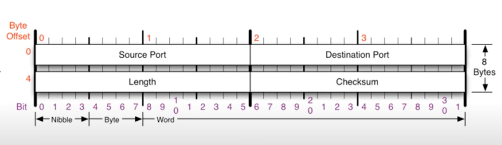
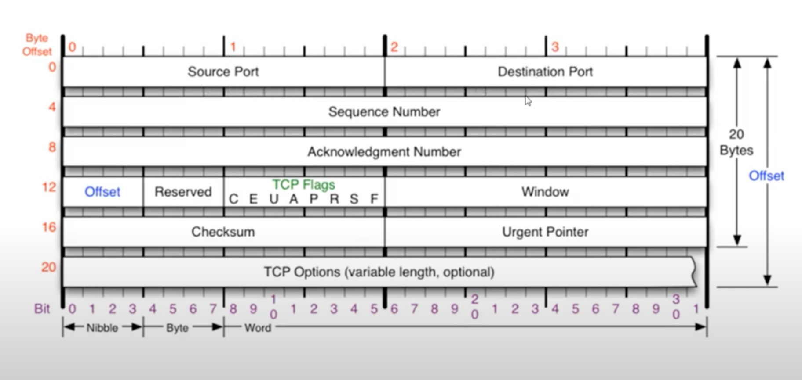
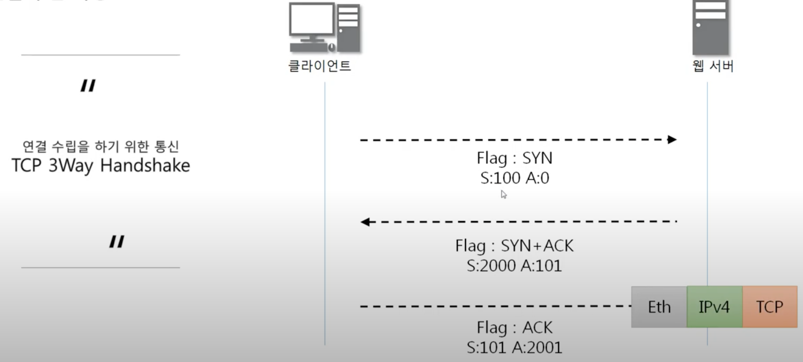
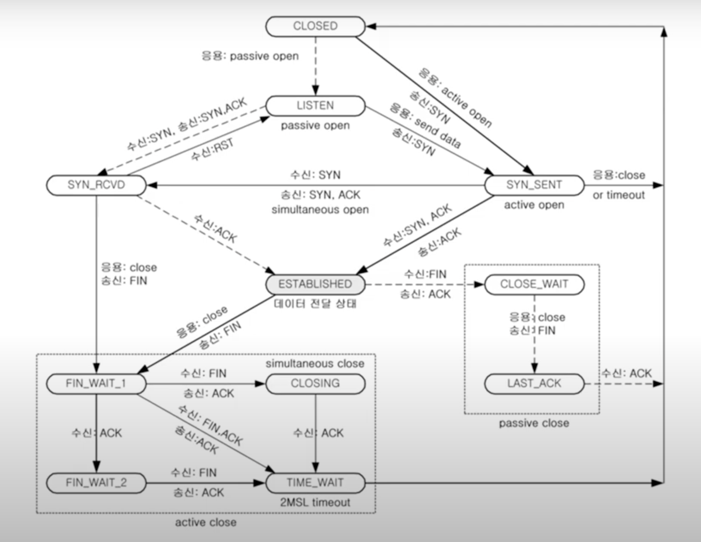

# OSI(4계층 Transport)


## 4계층 프로토콜

- 전송 계층(Transport layer)은 송신자의 프로세스와 수신자의 프로세스를 연결하는 통신 서비스를 제공
- 전송 계층은 연결 지향 데이터 스트림 지원, 신뢰성, 흐름 제어, 다중화와 같은 편리한 서비스를 제공
- 전송 프로토콜 중 가장 잘 알려진 것은 연결 지향 전송 방식을 사용하는 전송 제어 프로토콜(TCP)
- 단순한 전송에 사용되는 비연결 지향형 프로토콜(UDP)


## 포트 번호

- 특정 프로세스와 특정 프로세스가 통신을 하기 위해 사용

- <b>하나의 포트는 하나의 프로세스만</b> 사용 가능

- 하나의 프로세스가 여러 개의 포트를 사용하는 것은 가능

- 포트 번호는 일반적으로 정해져 있지만 무조건 지켜야 하는 것은 아님

- 일반적으로 웹 서비스는 80번 포트를 사용하지만, 웹 서비스가 항상 80번 포트를 사용해야만 하는 것은 아님

- 분류

  - Well-Known Port
    - FTP: 20, 21
    - SSH: 22
    - TELNET: 23
    - DNS: 53
    - DHCP: 67, 68
    - TFTP: 69
    - HTTP: 80
    - HTTPS: 443
  - Registered
    - 오라클 DB 서버: 1521
    - MySQL 서버: 3306
    - MS 원격 데스크탑: 3389
  - Dynamic Port: 49152 ~ 65535
- 포트 연결 확인

```bash
$ netstat -ano
```


## UDP 프로토콜



- 4계층 프로토콜
- 사용자 데이터그램 프로토콜(User Datagram Protocol, UDP)은 유니버설 데이터그램 프로토콜(Universal Datagram Protocol)이라고 일컫기도 함
- UDP의 <b>전송 방식은 너무 단순</b>해서 <b>서비스의 신뢰성이 낮고</b>, 데이터그램 도착 순서가 바뀌거나, 중복되거나, 심지어는 통보 없이 누락시키기도 함
- UDP는 일반적으로 <b>오류의 검사와 수정이 필요 없는</b> 프로그램에서 수행할 것으로 가정
- UDP 프로토콜을 사용하는 프로그램
  - DNS 서버: domain에 따라 IP를 알려줌
  - tftp 서버: Trivial File Transfer Protocol, 파일(데이터) 공유 서버
  - RIP 프로토콜: 라우팅 정보 공유


##### tftpd로 파일 전송 실습

- tftpd를 사용해 데이터 공유(Tftpd 프로그램 이용해 UDP를 이용한 데이터 통신 해보기)
  - 서버: Server Interfaces 세팅
  - 보내줄 파일을 저장
- UDP 패킷 캡쳐 및 분석
  - tftp는 well-known 프로그램이라 69번 포트를 사용
  - local file: 내 컴퓨터에 저장할 파일 이름
  - remote file: tftp 서버에 있는 받을 파일 이름
- 파일 전송을 UDP로 하면 신뢰성을 보장하지 않기 때문에, 특수한 경우에만 UDP로 파일 전송(예를 들어 동영상 스트리밍 서비스, 운영체제가 설치되어 있지 않은 컴퓨터에 파일 전송할 때 등)


## TCP 프로토콜

- 전송 제어 프로토콜(Transmission Control Protocol)

- 프로그램 간에 통신을 <b>안정적으로, 순서대로, 에러 없이</b> 교환할 수 있게 함

- TCP는 UDP보다 안전하지만 느림(하지만 충분히 빠름)

  

  - 일반적인 길이는 20byte( 60 byte 까지 늘어날 수는 있음)
  - Source Port: 출발지 포트
  - Destination Port: 목적지 포트
  - Sequence Number(4byte)
  - Acknowledgment Number(4byte)
  - Offset: Header의 길이
  - Reserved: 예약된 필드로 사용하지 않음
  - <b>TCP Flags</b>
    - 다른 프로그램에게 약속된 신호를 남기기 위한 용도로 사용되는 미리 정의된 비트
    - C, E
    - U(Urgent bit): 우선순위가 높은 데이터가 포함되어 있음을 표시 / Urgent Pointer와 세트로, 어디서부터가 긴급 데이터인지 표시
    - A(Ack): 응답 플래그, 송신 측으로부터 패킷을 잘 받았다는 것을 알려줌
    - P(Push): TCP buffer가 쌓여야 패킷을 전송하는데, 이와 상관없이 데이터를 바로 전달하는 플래그
    - R(Reset): 비정상적인 연결을 재설정
    - <b>S</b>(Synchronization): 동기화 플래그, 상대방과 연결을 시작할 때 사용하는 플래그(지속적으로 송신과 수신이 제대로 되어 있는지 확인)
    - F(Finish): 종료 비트, 연결을 끊을 때
  - Window: 남아있는 TCP buffer 공간을 알려줌(내 사용 공간이 얼마나 남아있는지 상대방에게 알려주는 것)
  - Checksum
  - Urgent Pointer


## TCP 3Way Handshake

> TCP를 이용한 데이터 통신을 할 때 프로세스와 프로세스를 연결하기 위해 가장 먼저 수행되는 과정
>
> - 클라이언트가 서버에게 요청 패킷을 보내고
> - 서버가 클라이언트의 요청을 받아들이는 패킷을 보내고
> - 클라이언트는 이를 최종적으로 수락하는 패킷을 보냄


## TCP를 이용한 데이터 전송 과정



- shaking이 일어날 때마다 받은 sequence 번호에 1을 더해서 ack 번호 결정
- 한번 주고 받으면 동기화하여 sequence 번호에 받은 ack 번호 대입 

- 이를 통해 연결이 수립되면!
  - c - s 또 보내게 되므로 seq, ack 번호가 동일
  - 받는 s의 seq는 받은 ack
  - 받는 쪽 ack는 <b>받은 seq + 데이터 크기</b>


## TCP의 연결 상태 변화

