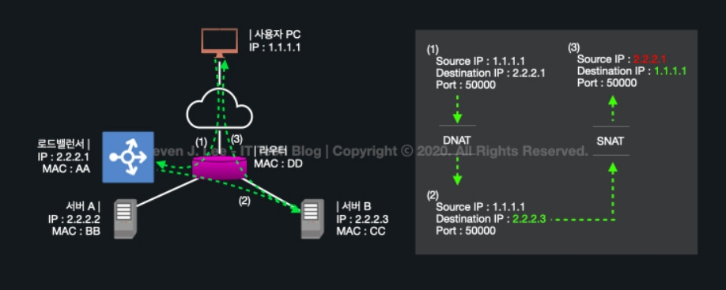

## NAT

- Network Address Translation

- IP 패킷의 TCP/UDP 포트 숫자와 소스 및 목적지의 IP 주소 등을 재기록하면서 라우터를 통해 네트워크 트래픽을 주고 받는 기술

- 패킷에 변화가 생기기 때문에 IP나 TCP/UDP의 체크섬도 다시 계산되어 재기록

- NAT를 이용하는 이유는 대개 사설 네트워크에 속한 여러 개의 호스트가 하나의 공인 IP주소를 사용해 인터넷에 접속하기 위함

- [CISCO docs](https://www.cisco.com/c/ko_kr/support/docs/ip/network-address-translation-nat/26704-nat-faq-00.html)

  - NAT는 IP 보존을 위해 설계된 것

  - NAT는 라우터에서 작동하며, 패킷이 다른 네트워크로 전달되기 전에 내부 사설 IP를 공인 IP로 변환함

    (등록되지 않은 IP 주소를 사용하는 사설 IP 네트워크를 활성화하여 인터넷에 연결시킴)

  - NAT의 동작

    > 라우팅은 패킷을 다른 네트워크까지 어떻게 전달할 것인가의 경로를 결정하는 과정

    - 내부 -> 외부 네트워크
      - 라우팅 후에 발생
      - 내부 네트워크에서 내보내고자 하는 패킷이 있다면, 목적지까지의 경로를 결정한 뒤에 private IP를 public IP로 바꿔주는 것이라고 할 수 있음

    - 외부 -> 내부 네트워크
      - 라우팅 전에 발생
      - 외부 네트워크에서 내부 네트워크로 들어오는 패킷이 있다면, public IP를 목적지로 설정하고 들어오는 패킷임. 이 패킷을 받은 뒤에 어떤 사설 네트워크로 보내줘야 할지를 결정해야 함. 따라서 어떤 사설 네트워크로 보내줘야 할지 라우팅하기 전에 NAT로 사설 IP를 찾아낸 뒤에 경로를 찾는 것임

    

    출처: [STEVEN J.LEE 블로그](https://www.stevenjlee.net/2020/07/11/%EC%9D%B4%ED%95%B4%ED%95%98%EA%B8%B0-nat-network-address-translation-%EB%84%A4%ED%8A%B8%EC%9B%8C%ED%81%AC-%EC%A3%BC%EC%86%8C-%EB%B3%80%ED%99%98/)

    - 패킷방향에 따른 NAT 구분(SourceNAT(공유기 등), DestinationNAT(방화벽 또는 로드밸런서 등))
    -  SNAT은 출발지 IP를 public IP로 바꿔주는 것이고, DNAT은 외부에서 들어온 목적지 IP를 내부 private IP로 바꿔주는 것

## 포트 포워딩

- 포트 포워딩 또는 포트 매핑(port mapping)이라 함
- 패킷이 라우터나 방화벽과 같은 네트워크 장비를 가로지르는 동안 <b>특정 IP 주소와 포트 번호의 통신 요청을 특정 다른 IP와 포트 번호로 넘겨주는</b> 네트워크 주소 변환(NAT)의 응용
- 사설 아이피에 배분해줄 때도, 각 사설 아이피마다 public ip와 매핑을 하는 것이고, 웹서비스에서도 게이트웨이 반대쪽에 위치한 사설네트워크 포트를 감춰서 보호할 수도 있고, 공용 ip만 알아도 사설네트워크 서비스 포트를 각각 연결해 사용할 수 있다는 장점
- 이 기법은 게이트웨이(외부망)의 반대쪽에 위치한 사설네트워크에 상주하는 호스트에 대한 서비스를 생성하기 위해 흔히 사용

