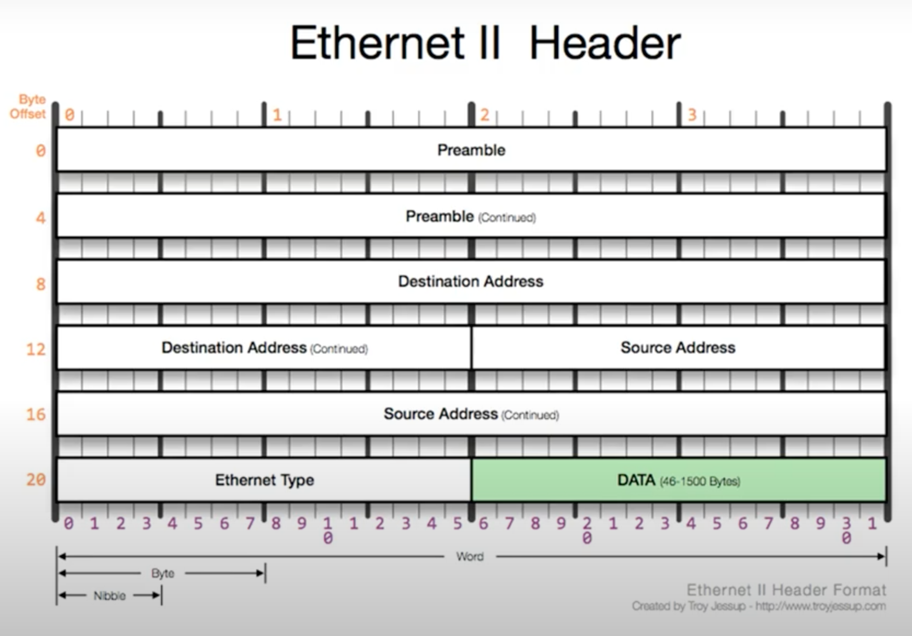

# OSI(2계층 Data Link)

## 2계층에서 하는일

- 하나의 네트워크 대역(같은 LAN 대역)에 존재하는 여러 장비들 중에서 어떤 장비가 어떤 장비에게 보내는 데이터를 전달

- 오류제어, 흐름제어 수행

- 다른 네트워크와 통신하려면

  - 다른 네트워크와 통신할 때는 3계층이 도와주어야 함

  - 3계층의 주소와 3계층의 프로토콜을 이용해야만 다른 네트워크와 통신이 가능하다

  

## 2계층에서 사용하는 주소

- MAC 주소(물리적 주소)
- 16진수로 표현(e.g. 6C-29-95-04-EB-A1)
  - OUI(IEEE에서 부여하는 일종의 제조회사 식별 ID): 6C-29-95
  - 고유번호(제조사에서 부여한 고유번호): 04-EB-A1

## 2계층(Ethernet) 프로토콜

- Destination Address: 목적지 MAC 주소 6byte
- Source Address: 보내는 MAC 주소 6byte
- Ethernet Type
  - 2byte(상위 프로토콜의 정보를 담음)
  - IPv4(0x0800), ARP(0x0806)
- DATA: payload
