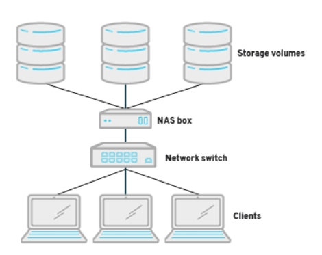

# NAS(Network-Attached Storage)

> [Red Hat NAS](https://www.redhat.com/en/topics/data-storage/network-attached-storage)를 번역한 글입니다.

##### 개요

- NAS는 저장된 데이터를 네트워크에 연결된 장치에 더 쉽게 access할 수 있게 하는 file-level storage architecture.
- 세가지 storage architecture 중 하나
  - NAS
  - SAN(storage area networks)
  - DAS(direct-attached storage)
- NAS는 네트워크에 built-in 보안, 관리, fault tolerant capability 제공


##### NAS는 어떻게 동작하는가?

- Hardware

  - 사전 구성된 스토리지 소프트웨어는 전용 하드웨어에 설치됨

  - `NAS box`, `NAS unit`, `NAS head`는 본질적으로 서버에 불과

    (storage disks or drives, processors, RAM 포함)

- Software

  - NAS와 일반 목적의 서버 스토리지의 가장 큰 차이점은 소프트웨어
  - 일반 OS(하드웨어에 이미 설치되어 있는 windows, macOS, linux 등..)에 배포되는 것은 같으나
    - 일반 목적 서버 스토리지는 모든 OSs(full OSs that send and receive thousands of requests every second)가 있는 반면에
    - NAS box는 2가지 타입(`data storage and file sharing`)의 request만을 송수신함

- Protocols

  

  - NAS 박스는 표준화된 데이터 전송 프로토콜(data transfer protocols)로 포맷됨(formatted)
    - 보통 TCP/IP를 기반으로 전송되나 여러 전송 프로토콜도 실행 가능
  - 해당 프로토콜을 통해 전송되는 전송되는 파일은 다음과 같은 형식으로 포맷될 수 있음
    - NFS(Network File Systems)
      - 일반적으로 linux, unix 계열에서 사용되고, 특정 벤더에 국한되지 않고 어떤 하드웨어, OS, network architecture에 적용 가능함
    - SMB(Server Message Blocks)
      - windows에서 주로 사용
    - AFP(Apple Filing Protocol)
      - macOS 실행하는 Apple 기기를 위한 프로토콜


##### NAS의 장점

- Scale-out capacity(용량 확장)
  - 스토리지 용량을 추가하기 용이함
  - 기존 서버 업그레이드, 교체 필요 없으며 네트워크를 종료하지 않고 추가할 수 있음
- Performance(성능)
  - file serving 만을 담당
  - 특정 용도(빅데이터나 멀티미디어 스토리지)에 맞춰 조정할 수 있어 높은 성능 기대 가능

- Easy setup

  - 시스템 설정이나 관리에 소요되는 시간이 적다고 함

- Accessibility

  - 모든 네트워크 연결 가능한 디바이스에서 접근 가능

- Fault tolerance

  - 데이터 무결성을 보장할 수 있다고 함

    ```txt
    NAS can be formatted to support replicated disks, a redundant array of independent disks, or erasure coding to ensure data integrity.
    ```


##### NAS vs Cloud

- NAS는 클라우드 환경에서 IaaS의 일부로 클라이언트에게 스토리지를 제공할 때 포함될 수 있는 것임


