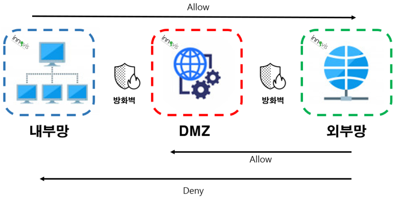

# Network Zone

> network zone은 보안을 위해서 구분한 영역으로, `Internet Zone - Demilitarized Zone - Intranet Zone` 으로 나눌 수 있음

##### 내부망, DMZ, 외부망

> 개인정보의 안전성 확보조치 기준(제2020-2호) 해설서 / 개인정보보호위원회

- 내부망
  - 물리적 망분리, 접근 통제시스템 등에 의해 인터넷 구간에서의 접근이 통제 또는 차단되는 구간
- DMZ 구간
  - 인터넷과 내부망 사이에 위치한 중간 지점 또는 인터넷 구간 사이에 위치한 중간지점으로서 인터넷 구간에서 직접 접근이 가능한 영역
- 외부망
  - 외부망이란 실제적인 용어는 존재하지 않지만, 내부망과 구분하여 사용하기 위해 쓰이는 용어. 일반 인터넷 환경을 말함

##### PAT(Port Address Translation)

- 외부 네트워크에서 DMZ로 가는 연결은 보통 PAT(포트변환)를 통해 제어됨

  > 일반 공유기에서도 PAT를 수행할 수 있지만, 이는 NAT 정책에 따라 달라질 수 있음. 일반 가정에서는 가정용 공유기를 쓰지만, 기업에서는 보안 강화 등을 위해 L4 스위치, 방화벽, VPN 등을 사용하기도 함.
  >
  > Port-Forwarding 과의 차이점은, 동적으로 port를 할당해 변환시켜주는 것이 아니라 특정 호스트의 프로세스가 private IP + port 로 실행중이라면, public IP + port와 매핑시켜서, 외부에서 해당 IP+port로 요청 시에 바로 내부 프로세스에 접근할 수 있게 하는 것임

- 주소 할당 방식에 따른 NAT 종류 구분 중 하나에 해당

  - Static NAT(1:1 NAT): 공인 IP 주소와 사설 IP 주소가 1:1로 매칭. 공인 IP주소의 절약 효과는 없고, 주로 사설 IP를 사용하는 서버가 여러 역할을 할 때 포트포워딩 목적으로 사용
  - Dynamic NAT(N:N NAT): 여러 공인 IP 대비 사설 IP가 많을 경우, 즉 내부 네트워크에 호스트의 숫자가 많을 경우 사용
  - PAT(1:N NAT)

- 공인 IP 주소 1개에 사설 IP 주소 N개가 매칭되는 방식

- 사설 네트워크 내 각 호스트에 임의의 포트번호를 지정해, public IP+port -> private IP+port 로 변환

- 이는 외부 패킷을 내부 네트워크 목적지에 올바로 전달해주기 위함(사설 네트워크에 여러 대의 호스트가 같은 목적지와 통신하고자 할 때, 되돌아오는 패킷의 최종 목적지가 어디가 되어야 하는지 모를 수 있기 때문에 올바로 전달해주기 위해 사용하는 것임)

##### 방화벽

- 삼각 방화벽 설정(three-legged firewall set-up)
  - 방화벽의 설정 옵션을 통해 각자의 네트워크는 방화벽에 서로 다른 포트를 사용하여 연결하게 됨
- <b>차단된 서브넷 방화벽(screened-subnet firewall)</b>
  - 삼각 방화벽 설정보다 더 강력한 방법으로, 위 사진처럼 두 개의 방화벽을 사용
  - DMZ는 두 방화벽 사이에 위치해 연결됨

