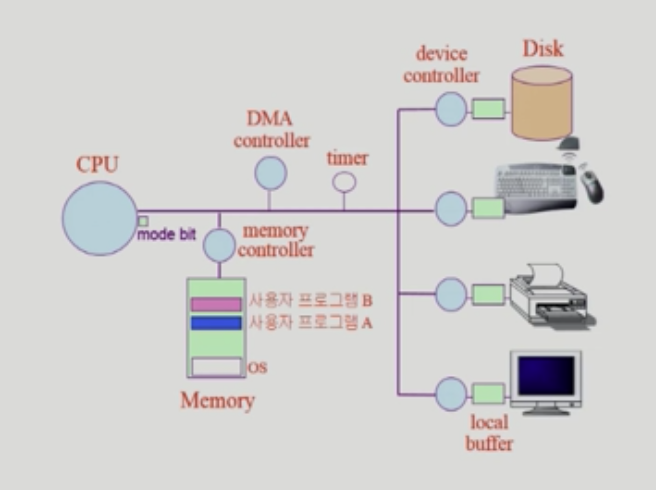

## [운영체제 개요](https://core.ewha.ac.kr/publicview/C0101020140307151724641842?vmode=f)

> 참고: 이화여대 반효경 교수님 강의

## 운영 체제란?

- 컴퓨터 하드웨어 바로 위에 설치되어 사용자 및 다른 모든 소프트웨어와 하드웨어를 연결하는 소프트웨어 계층
- 협의의 운영체제(커널)
  - 운영체제의 핵심 부분으로 메모리에 상주하는 부분
- 광의의 운영체제
  - 커널 뿐 아니라 각종 주변 시스템 유틸리티를 포함한 개념

## 운영 체체의 목적

- 컴퓨터 시스템을 편리하게 사용할 수 있는 환경을 제공
  - 사용자/프로그램들이 각각 독자적 컴퓨터에서 수행되는 것 같은 환상(illusion)을 제공
  - 하드웨어를 직접 다루는 복잡한 부분을 운영체제가 대행
- 컴퓨터 시스템의 자원을 효율적으로 관리
  - CPU, 메모리, I/O 장치 등의 효율적 관리
    - 효율성 : 주어진 자원으로 최대한 성능을 내도록 함
    - 형평성: 특정 사용자/프로그램의 지나친 불이익이 발생하지 않도록 함
  - 사용자 및 운영체제 자신을 보호
- CPU 스케쥴링: 어떤 프로그램에게 cpu 제어권을 줄지 결정
- 메모리 관리 : 한정된 메모리를 어떻게 쪼개서 사용할지
- 디스크 스케줄링 : 디스크에 들어온 요청을 어떤 순서로 처리할지
- 인터럽트, 캐싱 : 빠른 CPU와 느린 I/O 장치간 속도차를 극복하기 위한 것

## CPU 스케쥴링

> 메모리에 올라가 있는 프로세스가 CPU를 점유하기 위해 cpu queue에 쌓이게 되는데, 이 때 CPU는 해당 프로세스들이 얼마나 cpu를 점유할지를 결정하게 해야함

- FCFS(First-Come First-Served)
  - 먼저 도착한 프로세스가 먼저 CPU를 점유하게 하는 것
- SJF(Shortest Job First)
  - CPU 사용시간이 가장 짧은 프로세스를 먼저 점유하게 함
  - minimum average wating time을 보장
- RR(Round Robin)
  - 각 프로세스는 동일 크기의 CPU 할당시간을 가짐
  - 할당시간이 끝나면 인터럽트가 발생하여 프로세스는 CPU를 빼앗기고 CPU 큐의 제일 뒤에 줄을 섬
  - n개의 프로세스가 CPU 큐에 있는 경우
    - 어떤 프로세스도 (n-1) * 할당시간 이상 기다리지 않음
    - 대기시간이 프로세스의 CPU 사용시간에 비례 

## 메모리 관리

> 디스크에 있는 실행 파일들이 가상 메모리에 올라가고, 실제 물리적인 메모리에는 당장 필요한 부분만 올려놓음. 물리 메모리에 영역을 모두 차지하게 되면 디스크(스왐영역)으로 빠지게됨.

##### LRU vs LFU

- LRU(Least Recently Used)
  - 가장 오래 전에 참조한 페이지 삭제
- LFU(Least Frequently Used)
  - 참조 횟수가 가장 적은 페이지 삭제

## 디스크 스케줄링

- 디스크 접근 시간(Access time)의 구성
  - 탐색시간(Seek time): 헤드를 해당 트랙(실린더)로 움직이는 데 걸리는 시간
  - 회전지연(Rotational latency): 헤드가 원하는 섹터에 도달하기까지 걸리는 시간
  - 전송시간(Transfer time): 실제 데이터의 전송 시간
- 디스크 스케줄링
  - seek time을 최소화하는 것이 목표
  - seek time = seek distance
- SSTF(Shortest Seek Time First)
  - 가까운 곳부터 방문
  - starvation(헤드가 먼 곳은 처리가 늦어질 수 있는 문제점)
- SCAN
  - 헤드가 디스크의 한쪽 끝에서 다른쪽 끝으로 이동하며 가는 길목에 있는 모든 요청을 처리
  - 다른 한쪽 끝에 도달하면 역방향으로 이동하며 오는 길목에 있는 모든 요청을 처리하며 다시 반대쪽 끝으로 이동

## 운영 체제의 분류

##### 1. 동시 작업 가능 여부

- 단일 작업(single tasking)
  - 한 번에 하나의 작업만 처리
  - 예를 들어 MS-DOS 프롬포트 상에서는 한 명령의 수행을 끝내기 전에 다른 명령을 수행시킬 수 없음
- 다중 작업(multi tasking)
  - 동시에 두 개 이상의 작업 처리
  - 예를 들어 UNIX, MS Windows 등에서는 한 명령의 수행이 끝나기 전에 다른 명령이나 프로그램을 수행할 수 있음

##### 2. 사용자의 수

- 단일 사용자(single user)
- 다중 사용자(multi user)

##### 3. 처리 방식

- 일괄 처리(batch processing)
  - 작업 요청의 일정량 모아서 한꺼번에 처리
  - 작업이 완전 종료될 때까지 기다려야 함
- 시분할(time sharing)
  - 여러 작업을 수행할 때 컴퓨터 처리 능력을 일정한 시간 단위로 분할하여 사용
  - 일괄 처리 시스템에 비해 짧은 응답 시간을 가짐
  - interactive한 방식
- 실시간(Realtime OS)
  - 정해진 시간 안에 어떠한 일이 반드시 종료됨이 보장되어야 하는 실시간 시스템을 위한 OS
  - 원자로/공장 제어, 미사일 제어, 반도체 장비, 로보트 제어 등
  - 실시간 시스템의 개념 확장
    - Hard realtime system(경성 실시간 시스템)
    - Soft realtime system(연성 실시간 시스템)
      - hard에 비해 비교적 심각하지 않은 시스템(영상 시청 등)

## 몇 가지 용어

- Multitasking

- Multiprogramming

  - 메모리에 여러 프로그램이 동시에 올라가 있는 것

- Time sharing

  - CPU가 짧은 시간 간격으로 시분할하여 나누어 쓴다는 의미를 강조

- Multiprocess

  - 하나의 컴퓨터에 CPU(processor)가 여러개 붙어 있음을 의미

  

## 운영 체제의 예

- UNIX
  - 코드의 대부분 C언어로 작성
  - 높은 이식성
  - 최소한의 커널 구조
  - 복잡한 시스템에 맞게 확장 용이
  - 소스 코드 공개
  - 프로그램 개발에 용이
  - 다양한 버전(Linux, System V, FreeBSD, SunOS, Solaris)

## 시스템 구조 및 프로그램의 실행 Part-1

> CPU의 작업공간인 메모리에 있는 기계어를 읽어서 실행함
>
> CPU 안에 있는 register 중에서 program counter라는 register가 현재 가리키고 있는 메모리 위치의 기계어를 읽어와서 실행함

### 컴퓨터 시스템 구조

### Mode bit

- 사용자 프로그램의 잘못된 수행으로 다른 프로그램 및 운영체제에 피해가 가지 않도록 하기 위한 보호 장치 필요
- Mode bit을 통해 하드웨어적으로 두가지 모드의 operation 지원
  - 1: 사용자 모드(사용자 프로그램 수행)
  - 0: 모니터 모드(OS 코드 수행)
  - 보안을 해칠 수 있는 중요한 명령어는 모니터 모드에서만 수행 가능한 '특권 명령'으로 규정
  - Interrupt나 Exception 발생시 하드웨어가 mode bit을 0으로 바꿈
  - 사용자 프로그램에게 CPU를 넘기기 전에 mode bit을 1로 세팅

### Timer

- 특정 시간 간격으로 interrupt를 발생시켜 CPU를 점유하고 있는 프로세스의 독점을 막기 위한 하드웨어
- time sharing을 구현하기 위해 사용

### Device Controller

- I/O device controller
  - 해당 I/O 장치 유형을 관리하는 일종의 작은 CPU
  - 제어 정보를를 위해 control register, status register를 가짐
  - local buffer를 가짐(일종의 data register)
- I/O는 실제 device와 local buffer 사이에서 일어남
- Device Controller는 I/O가 끝났을 경우 interrupt로 CPU에 그 사실을 알림 

## 입출력과 인터럽트 (Input-Output and Interrupt)

### 시스템 콜 (System Call)

- 사용자 프로그램이 I/O 디바이스에게 명령을 직접 내릴 수 없기 때문에 운영체제에게 해당 함수를 실행시키는 요청

### 인터럽트(Interrupt)

> 인터럽트 당한 시점의 레지스터와 program counter를 save한 후 CPU의 제어를 인터럽트 처리 루틴에 넘김

- Interrupt(하드웨어 인터럽트): 하드웨어가 발생시킨 인터럽트

- Trap(소프트웨어 인터럽트)
  - Exception: 프로그램이 오류를 범한 경우
  - System call: 프로그램이 커널 함수를 호출하는 경우
- 인터럽트 관련 용어
  - 인터럽트 벡터: 해당 인터럽트의 처리 루틴 주소를 가지고 있음
  - 인터럽트 처리 루틴(Interrupt Service Routine, 인터럽트 핸들러): 해당 인터럽트를 처리하는 커널 함수

## 시스템 구조 및 프로그램의 실행 Part-2

### 동기식 입출력과 비동기식 입출력

- 동기식 입출력 (synchronous I/O)
  - I/O 요청 후 입출력 작업이 완료된 후에야 제어가 사용자 프로그램에 넘어감
    - 구현 방법1
      - I/O가 끝날 때까지 CPU를 낭비시킴
      - 매시점 하나의 I/O만 일어날 수 있음
    - 구현 방법2
      - I/O가 완료될 때까지 해당 프로그램에게서 CPU를 빼앗음
      - I/O가 처리를 기다리는 중에 그 프로그램을 줄 세움
      - 다른 프로그램에게 CPU를 줌
- 비동기식 입출력(asynchronous I/O)
  - I/O가 시작된 후 입출력 작업이 끝나기를 기다리지 않고 제어가 사용자 프로그램에 즉시 넘어감

### DMA (Direct Memory Access)

- 빠른 입출력 장치를 메모리에 가까운 속도로 처리하기 위해 사용
- CPU의 중재 없이 device controller가 device의 buffer storage의 내용을 메모리에 block 단위로 직접 전송
- 바이트 단위가 아니라 block 단위로 인터럽트를 발생시킴

### 서로 다른 입출력 기계어

- I/O를 수행하는 special instruction에 의한 것(device / memory 각각을 수행(접근)하는 기계어가 별도로 있는 것)
- Memory Mapped I/O에 의한 것(메모리 주소를 메모리에만 기록하는 것이 아니라 I/O장치에도 해당 주소를 연장해서 기록하고, 메모리 접근하는 기계어를 통해서 접근하는 방식)
