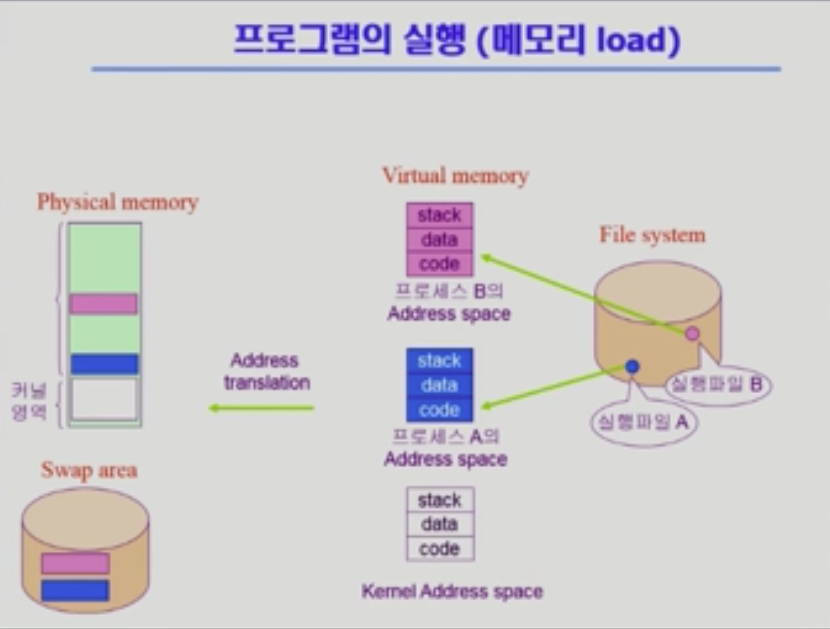
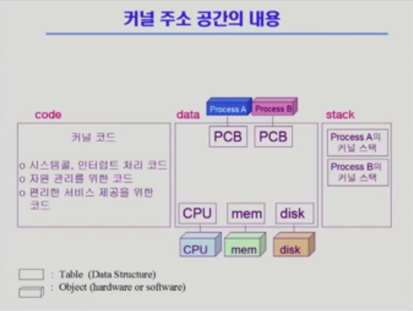
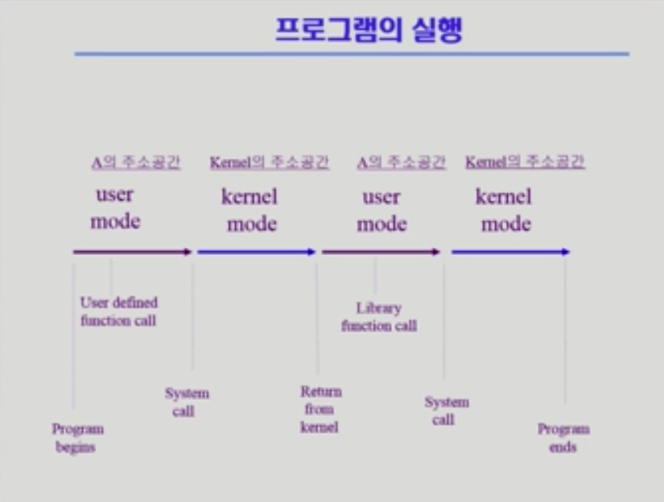
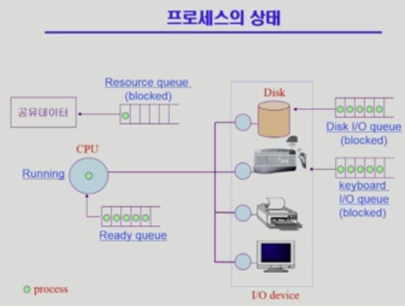
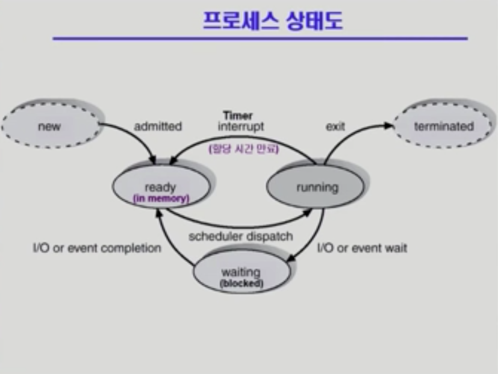
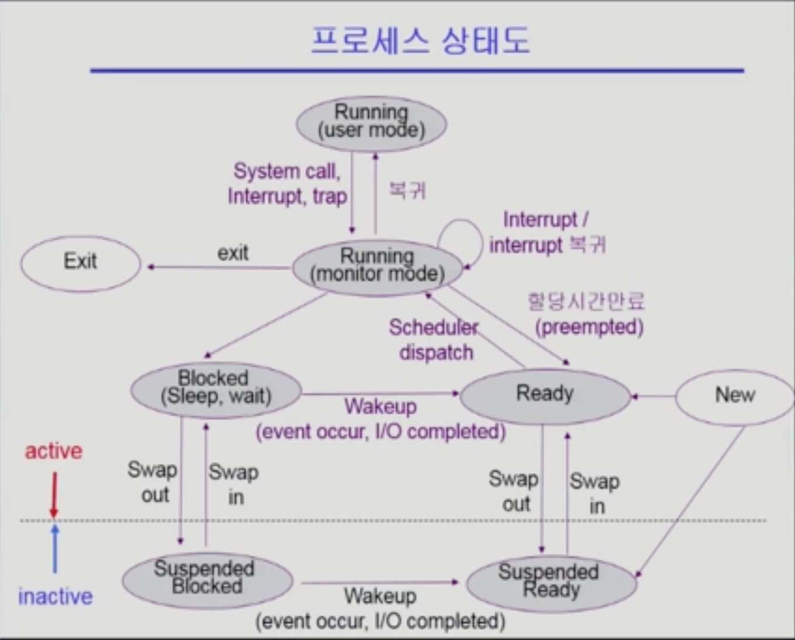
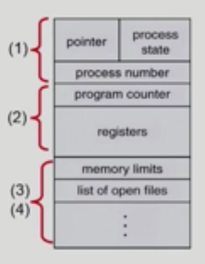
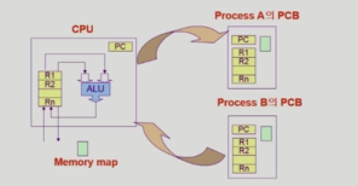
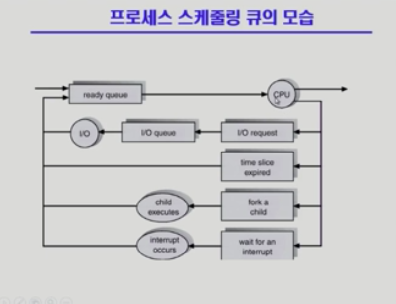

# 프로세스

## 프로그램의 실행

- 프로그램은 실행시킬 때 메모리에 올라가서 프로세스가 되는 것

- 중간에 한 단계를 더 거치는 Virtual memory 있음

  - 프로그램만의 독자적인 Address space(주소 공간)
  - 실제로 존재하는 것이 아니라 가상의 공간임
  - 당장 실행이 필요한 것은 Physical memory에 올라가고, 이외의 사용되지 않는 것은 Swap area에 존재함

- Physical Memory vs Virtual Memory

  - 논리적 주소와 물리적 주소가 달라 Address translation이라는 주소 변환 과정이 필요함
  - code / data / stack
    - code: 실행파일에 있는 코드가 올라오는 것으로, cpu에서 실제 실행할 기계어가 위치하는 곳
    - data: 전역 변수, 프로그램 실행~종료 시까지 남아있는 데이터
    - stack: 함수 호출과 리턴, 함수 안에 있는 지역변수 등에 대한 정보가 저장

- Kernel Address Space의 구조

  

  

  - code: 커널에 관한 코드가 함수 형태로 들어있는 곳
  - data: 하드웨어를 관리하기 위한 자료구조를 가짐, 현재 실행중인 프로세스를 관리하기 위한 자료구조(PCB: Process Control Block, 프로세스가 n개면 PCB도 n개를 가짐)도 가지고 있음

  - stack: 어떤 프로세스를 실행하기 위해 운영체제

### 프로세스의 개념

- Process is <b>a program in execution</b>
- Process Context
  - 현재 프로세스의 특정 상태
  - CPU 수행 상태를 나타내는 하드웨어 문맥
    - Program Counter
    - 각종 register
  - 프로세스의 주소 공간
    - code, data, stack
  - 프로세스 관련 커널 자료 구조
    - PCB(Process Control Block)
    - Kernel stack

### 프로세스의  상태 (Process State)

- 프로세스는 상태(state)가 변경되며 수행

  - PCB가 이런 상태를 관리를 함

  - Running

    - CPU를 잡고 instruction을 수행중인 상태

  - Ready

    - CPU를 기다리는 상태(메모리 등 다른 조건을 모두 만족하고)

  - Blocked(wait, sleep)

    - CPU를 주어도 당장 instruction을 수행할 수 없는 상태
    - Process 자신이 요청한 event(e.g. I/O)가 즉시 만족되지 않아 이를 기다리는 상태(예를 들어 디스크에서 file을 읽어와야 하는 경우)

  - Suspended(stopped) <b>중기 스케쥴러에 의해 생성되는 상태</b>

    - 외부적인 이유로 프로세스의 수행이 정지된 상태(디스크로 쫓겨남)

    - 프로세스는 통째로 디스크에 swap out 된다

    - blocked와 suspended의 가장 큰 차이는 실행 여부이다. blocked는 I/O 등의 처리를 위해 잠시 중지된 것이지 실행이 완전 중단된 것이 아니고, suspended는 일시적으로 완전히 중지시킨 것임

    - 예시

      - 사용자가 프로그램을 일시정지시킨 경우 (break key)

      - 시스템이 여러 이유로 프로세스를 잠시 중단시킴

        (메모리에 너무 많은 프로세스가 올라와 있을 때)

  - 기타

    - 엄밀히 말하면 프로세스가 생성되지 않았거나, 종료되었기 때문에 상태라고 말하긴 어려움
    - New: 프로세스가 생성중인 상태
    - Terminated: 수행(execution)이 끝난 상태

  

   

  - blocked -> suspended / ready -> suspended
    - 두 상태 모두 외부에서 메모리를 빼앗은 상태
    - 운영체제가 multiprogramming degree를 조절하기 위해 메모리를 빼앗았다하면 운영체제가 다시 올려줘야 함(사람이 한다면 사람이)
  - Running (user mode vs monitor mode)
    - 운영체제 자체가 running 된다는 뜻이 아니라 실행 중인 process에서 system call, interrupt 등에 의해 운영체제가 cpu 제어권을 가져오게 되었을 때 monitor mode라고 함

### Process Control Block(PCB)

- 운영체제가 각 프로세스를 관리하기 위해 프로세스당 유지하는 정보

- Kernel <b>메모리</b> 주소공간 중에 data 영역에서 가짐(프로세스 단위로도 가짐)

- 다음의 구성요소를 가짐(구조체로 유지)

  - OS가 관리상 사용하는 정보
    - Process state, Process ID
    - scheduling information, priority
  - CPU 수행 관련 하드웨어 값
    - Program counter, registers
  - 메모리 관련
    - Code, data, stack의 위치 정보
  - 파일 관련
    - Open file distruction

  

  

### 문맥 교환 (Context Switch)

- CPU를 한 프로세스에서 다른 프로세스로 넘겨주는 과정
- CPU가 다른 프로세스에게 넘어갈 때 운영체제는 다음을 수행
  - CPU를 내어주는 프로세스의 상태를 그 프로세스의 PCB에 저장
  - CPU를 새롭게 얻는 프로세스의 상태를 PCB에서 읽어옴
- timer inturrupt, I/O 요청, system call 등에 의해 일어나서 다른 프로세스에 CPU제어권이 넘어갈 때 일어남
- 문맥교환이 일어나면 cache memory flush 등으로 인해 부담이 큼

### 프로세스를 스케줄링하기 위한 큐

- Job queue: 현재 시스템 내에 있는 모든 프로세스의 집합
- Ready queue: 현재 메모리 내에 있으면서 CPU를 잡아서 실행되기를 기다리는 프로세스의 집합
- Device queues: I/O device의 처리를 기다리는 프로세스의 집합
- 프로세스들은 각 큐를 오가며 수행

### 스케줄러 (Scheduler)

> 운영체제 중에서 코드의 일부로 이해해도 됨

- Long-term scheduler(장기 스케쥴러 or job scheduler)
  - 시작 프로세스 중 어떤 것들을 ready queue로 보낼지 결정
  - 프로세스에 memory(및 각종 자원)을 주는 문제
  - degree of Multiprogramming 제어
    - 멀티프로그래밍 : 메모리에 프로그램이 여러개 올라가는 것
    - degree of Multiprogramming은 메모리에 프로그램이 몇개 올라갈지 결정하는 것
  - time sharing system에는 보통 장기 스케쥴러가 없음(무조건 ready)

- Short-term scheduler(단기 스케쥴러 or CPU scheduler)
  - 어떤 프로세스를 다음번에 running 시킬지 결정
  - 프로세스에 CPU를 주는 문제
  - 충분히 빨라야 함(millisecond 단위)
- Medium-Term scheduler(중기 스케쥴러 or Swapper)
  -  여유 공간을 마련하기 위해 프로세스를 통째로 메모리에서 디스크로 쫓아냄
  -  프로세스에게서 memory를 뺏는 문제
  -  degree of Multiprogramming을 제어