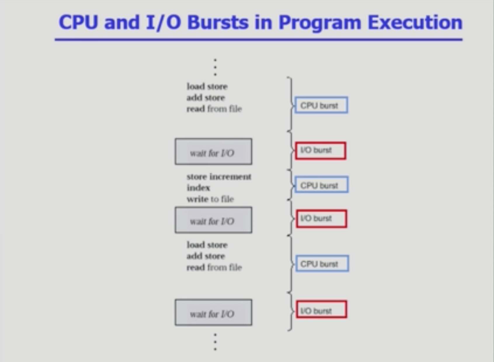
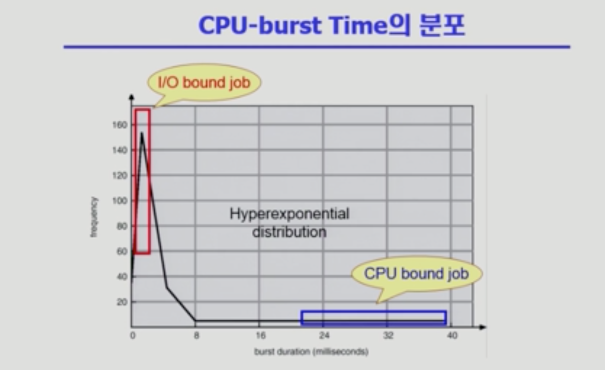

# CPU Scheduling

### CPU and I/O Bursts in Program Execution

- CPU와 I/O 가 반복적으로 번갈아가며 실행됨

### CPU-burst Time의 분포

CPU burst time 분포를 보면 빠른 응답시간을 제공해야 하는 것들을 분류해야 하기 때문에 CPU 스케쥴링이 필요한 것

- I/O bound process(job)

  - I/O 작업이 많은(사람과 인터랙션이 많은) 작업

  - CPU를 잡고 계산하는 시간보다 I/O에 많은 시간이 필요한 job

    (many short CPU bursts)

- CPU bound process(job)

  - 연산이 많은 CPU 사용이 긴 작업

  - 계산 위주의 job

    (few very long CPU bursts)

- 여러 종류의 job(=process)이 섞여 있기 때문에 CPU 스케쥴링이 필요함

  - interactive job에게 적절한 response 제공 요망
  - CPU와 I/O 장치 등 시스템 자원을 골고루 효율적으로 사용

### CPU Scheduler & Dispatcher

> 운영체제 코드의 일부로 cpu 스케쥴링을 하는 코드라고 생각하면 됨

- CPU Scheduler
  - Ready 상태의 프로세스 중에서 이번에 CPU를 줄 프로세스를 결정
- Dispatcher
  - CPU 제어권을 CPU scheduler에 의해 선택된 프로세스에게 넘김
  - 이 과정을 context switch(문맥 교환)라고 함

- CPU 스케쥴링이 필요한 경우는 다음과 같이 프로세스에게 상태 변화가 있는 경우

  1. running -> blocked (e.g. I/O 요청하는 시스템 콜)

  2. running -> ready (e.g. 할당시간 만료로 timer interrupt)

  3. blocked -> ready (e.g. I/O 완료 후 인터럽트)

  4. terminate

- 1, 4 스케쥴링은 nonpreemptive(강제로 뺏지 않고 자진 반납) / 2,3 스케쥴링은 preemptive(강제로 빼앗음)

### Scheduling Criteria(성능 척도)

> Performance Index(= Performance Measure)

- CPU utilization (이용률)
  - keep the CPU as busy as possible
  - CPU가 놀지 않고 일을 많이한 척도
- Throughput(처리량)
  - number of processes that complete their execution per time unit
  - 단위 시간 당 프로세스를 처리한 수
- Turnaround time(소요시간, 반환시간)
  - amount of time to execute a particular process
  - response + waiting + execution 시간의 총합
- Waiting time(대기시간)
  - amount of time a process has been wating in the ready queue
  - 최초(response time) 뿐만이 아니라 프로세스가 ready queue에서 기다린 시간의 총합
- Response time(응답시간)
  - amount of time it takes <b>from when a request was submitted until the first response is produced</b>, not output(for time-sharing environment)
  - 특정 프로세스가 최초로 cpu를 얻기까지 걸린 시간

## Scheduling Algorithms

> FCFS(First-Come First-Served)
>
> SJF(Shortest-Job-First)
>
> Priority Scheduling
>
> Multilevel Queue
>
> Multilevel Feedback Queue 

##### FCFS(First-Come First-Served)

- 프로세스의 도착 순서대로 CPU를 사용하도록 하게 하는 알고리즘
- Burst Time이 긴 프로세스가 먼저 처리되면 Average waiting time이 길 수 있음
- convoy effect : short process behind long process
  - Burst Time이 긴 프로세스가 앞에 있는 현상

##### SJF(Shortest-Job-First)

- 각 프로세스의 다음번 CPU burst time을 가지고 스케쥴링에 활용
- CPU burst time이 가장 짧은 프로세스를 제일 먼저 스케쥴
- Two schemes
  - Nonpreemptive
    - 일단 CPU를 잡으면 이번 CPU burst가 완료될 때까지 CPU를 선점(preemptive) 당하지 않음
  - Preemptive
    - 현재 수행중인 프로세스의 남은 burst time 보다 더 짧은 CPU burst time을 가지는 새로운 프로세스가 도착하면 CPU를 빼앗김
    - 이 방법을 Shortest-Remaining-Time-First(SRTF)라고도 부름
- SJF is optimal
  - 주어진 프로세스들에 대해 minimum average waiting time을 보장

- 치명적 약점
  - Starvation
    - 효율성만 생각하다 보니 짧은 프로세스에 무조건 우선권을 주어, long job이 영원히 실행되지 않는 상황이 발생할 수도 있음
  - 다음 CPU Burst Time의 예측
    - 다음번 cpu burst time을 정확히 알 수 없음
    - 과거의 cpu burst time을 이용해서 추정(exponential averaging / 지수 평균)
      - t<small>n</small> = actual length of nth CPU burst
      - t<small>n+1</small> = predicted value for the next CPU burst
      - a, 0 <= a <= 1
      - Define: r<small>n+1</small> = a\*t<small>n</small> + (1-a)\*r<small>n</small>

##### Priority Scheduling

- A priority number(integer) is associated with each process

- highest priority를 가진 프로세스에게 CPU 할당

  (smallest integer = highest priority)

  - Preemptive
  - nonpreemptive

- SJF는 일종의 priority scheduling

  - priority = predicted next CPU burst time

- Problem

  - <b>starvation</b>: low priority processes may never execute

- Solution

  - <b>Aging</b>: as time progresses increase the priority of the process

##### Round Robin(RR)

- 각 프로세스는 동일한 크기의 할당 시간(time quantum)을 가짐(일반적으로 10~100 milliseconds)
- 할당 시간이 지나면 프로세스는 선점(preempted)당하고 ready queue의 제일 뒤에 가서 다시 줄을 섬
- n개의 프로세스가 ready queue에 있고 할당 시간이 q time unit인 경우 각 프로세스는 최대 q time unit 단위로 CPU 시간의 1/n을 얻음
- Performance
  - q large => FCFS
  - q small => context switch 오버헤드가 커짐
  - 일반적으로 SJF 보다 average turnaround time은 길지만, response time(응답시간 / 큐에 들어와서 처음으로 CPU를 얻게 되는 시간)은 더 짧음

##### Multilevel Queue

- 각 큐에서 대기 중인 프로세스는 다른 큐로 이동할 수 없음

- Ready queue를 여러개로 분할
  - foreground(interactive) - human interaction이 많은 I/O bound job 같은 것
  - background(batch - no human interaction) - CPU 작업이 많은 CPU bound job 같은 것
- 각 큐는 독립적인 스케쥴링 알고리즘을 가짐
  - foreground - RR
  - background - FCFS
- 큐에 대한 스케줄링이 필요
  - Fixed priority scheduling
    - serve all from foreground then from background
    - Possibility of starvation
  - Time slice
    - 각 큐에 CPU time을 적절한 비율로 할당
    - e.g. 80% to foreground in RR, 20% to background in FCFS

##### Multilevel Feedback Queue

- 여러 queue가 있으면 어느 queue에 들어갈지 변동이 가능한 것
- 각 큐의 할당 시간(time quantum)을 사용한 뒤에도 CPU 작업한 것이 남아있으면 밑으로 보내는 등
- 즉 프로세스가 다른 큐로 이동 가능한 것인데, <b>Aging</b>을 이와 같은 방식으로 구현할 수 있음
  - Queue의 수
  - 각 큐의 scheduling algorithm
  - Process를 상위 큐로 보내는 기준
  - Process를 하위 큐로 내쫓는 기준
  - 프로세스가 CPU 서비스를 받으려 할 때 들어갈 큐를 결정하는 기준
