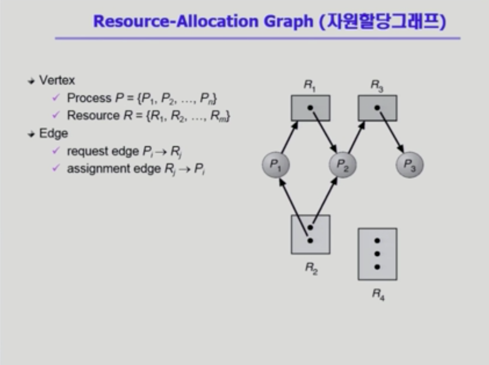
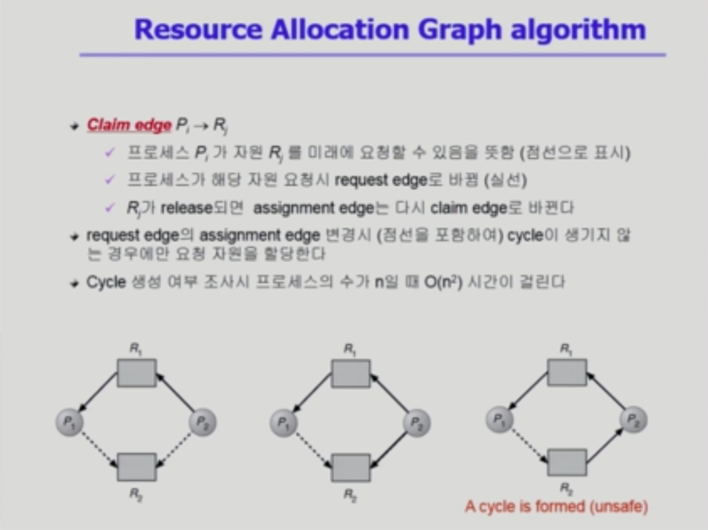

# Deadlock(교착상태)

## The Deadlock Problem

- Deadlock
  - 일련의 프로세스들이 서로가 가진 자원을 기다리며 block된 상태
- Resource(자원)
  - 하드웨어, 소프트웨어 등을 포함하는 개념
  - e.g. I/O device, CPU cycle, memory space, semaphore 등
  - 프로세스가 자원을 사용하는 절차
    - Request, Allocate, Use, Release
- Deadlock Example 1
  - 시스템 2개의 tape drive가 있을 때
  - 프로세스 P1과 P2 각각이 하나의 tape drive를 보유한 채 다른 하나를 기다리고 있음
- Deadlock Example 2
  - Binary semaphores A and B
  - P0: P(A), P(B)
  - P1: P(B), P(A)

## Deadlock 발생의 4가지 조건

- Mutual exclusion(상호 배제)
  - 매 순간 하나의 프로세스만이 자원을 사용할 수 있음
- No preemption
  - 프로세스는 자원을 스스로 내어놓을 뿐 강제로 빼앗기지 않음
- Hold and wait
  - 자원을 가진 프로세스가 다른 자원을 기다릴 때 보유 자원을 놓지 않고 계속 가지고 있음
- Circular wait
  - 자원을 기다리는 프로세스 간에 사이클이 형성되어야 함
  - P0 -> P1 -> P2 -> P0 ...

## Resource-Allocation Graph(자원 할당 그래프)

- 그래프에 cycle이 없으면 deadlock이 아님
- 그래프에 cycle이 있으면
  - if only one instance per resource type, then deadlock
  - if several instances per resource type, possibility of deadlock

## Deadlock의 처리 방법

##### Deadlock Prevention

> 자원 할당 시 deadlock의 4가지 필요 조건 중 어느 하나가 만족되지 않도록 하는 것

- Mutual Exclusion

  - 공유해서는 안되는 자원의 경우 반드시 성립해야 함

- Hold and wait

  - 프로세스가 자원을 요청할 때 다른 어떤 자원도 가지고 있지 않아야 함
  - 방법1: 프로세스 시작 시 모든 필요한 자원을 할당받게 하는 방법
  - 방법2: 자원이 필요한 경우 보유 자원을 모두 놓고 다시 요청

- No Preemption

  - process가 어떤 자원을 기다려야 하는 경우 이미 보유한 자원이 선점됨
  - 모든 필요한 자원을 얻을 수 있을 때 그 프로세스는 다시 시작됨
  - State를 쉽게 save하고 restore할 수 있는 자원에서 주로 사용(CPU, memory)

- Circular Wait

  - 모든 자원 유형에 할당 순서를 정하여 정해진 순서대로만 자원 할당
  - 예를 들어 순서가 3인 자원 Ri를 보유 중인 프로세스가 순서가 1인 자원 Rj를 할당받기 위해서는 우선 Ri를 release 해야 함

- ##### 문제점

  - Utilization 저하, throughput 감소, starvation 문제

##### Deadlock Avoidance

> - 자원 요청에 대한 부가적인 정보를 이용해서 deadlock의 가능성이 없는 경우에만 자원을 할당
>
> - 시스템 state가 원래 state로 돌아올 수 있는 경우에만 자원 할당
>
> - 시스템이 safe state에 있으면 <b>no deadlock</b>
> - 시스템이 unsafe state에 있으면 <b>possibility of deadlock</b>
> - Deadlock Avoidance
>   - 시스템이 unsafe state에 들어가지 않는 것을 보장
>   - 2가지 경우의 avoidance 알고리즘
>     - Single instance per resource types: Resource Allocation Graph algorithm 사용
>     - Multiple instances per resource types: Banker's Algorithm 사용

- Deadlock avoidance

  - 자원 요청에 대한 부가정보를 이용해서 자원 할당이 deadlock으로부터 안전(safe)한지를 동적으로 조사해서 안전한 경우에만 할당
  - 가장 단순하고 일반적인 모델은 프로세스들이 필요로 하는 각 자원별 최대 사용량을 미리 선언하도록 하는 방법

- ##### Resource Allocation Graph algorithm

  

- ##### Banker's Algorithm

  - 가정
    - 모든 프로세스는 자원의 최대 사용량을 미리 명시
    - 프로세스가 요청 자원을 모두 할당받은 경우 유한 시간 안에 이들 자원을 다시 반납함
  - 방법
    - 기본 개념: 자원 요청 시 safe 상태를 유지할 경우에만 할당
    - 총 요청 자원의 수가 가용자원의 수보다 적은 프로세스를 선택(그런 프로세스가 없으면 unsafe 상태)
    - 그런 프로세스가 있으면 그 프로세스에게 자원을 할당
    - 할당 받은 프로세스가 종료되면 모든 자원을 반납
    - 모든 프로세스가 종료될 때까지 이러한 과정 반복

##### Deadlock Detection and recovery

> Deadlock 발생은 허용하되 그에 대한 detection 루틴을 두어 deadlock 발견 시 recover
>
> banker's algorithm과 비교하여 미래의 최악 조건을 고려하지 않고, 현재 할당된 자원들만을 가지고 판단

- Deadlock Detection
  - Resource type 당 single instance인 경우
    - 자원 할당 그래프에서의 cycle이 곧 deadlock을 의미
  - Resource type 당 multiple instance인 경우
    - Banker's algorithm과 유사한 방법 활용

- Wait-for graph 알고리즘

  - Resource type 당 single instance인 경우
  - Wait-for graph
    - 자원 할당 그래프의 변형
    - 프로세스만으로 node 구성
    - Pi가 가지고 있는 자원을 Pk가 기다리는 경우 Pk -> Pi
  - Algorithm
    - Wait-for graph에 사이클이 존재하는지를 주기적으로 조사 >> O(N^2)

- ##### Recovery

  - Process termination
    - Abort all deadlocked processes
    - Abort one process at a time until the deadlock cycle is eliminated
  - Resource Preemption
    - 비용을 최소화할 victim의 선정
    - safe state로 rollback하여 process를 restart
    - Starvation 문제
      - 동일한 프로세스가 계속해서 victim으로 선정되는 경우
      - cost factor에 rollback 횟수도 같이 고려

##### Deadlock Ignorance

> Deadlock을 시스템이 책임지지 않음
>
> UNIX를 포함한 대부분의 OS가 채택

- Deadlock이 일어나지 않는다고 생각하고 아무런 조치도 취하지 않음
  - Deadlock이 매우 드물게 발생하므로 deadlock에 대한 조치 자체가 더 큰 overhead일 수 있음
  - 만약, 시스템에 deadlock이 발생한 경우 시스템이 비정상적으로 작동하는 것을 사람이 느낀 후 직접 process를 죽이는 등의 방법으로 대처