## Logical vs Physical Address

> 논리적 주소에서 물리적 주소로 변환이 필요

##### Logical Memory

- 프로세스마다 독립적으로 가지는 주소 공간
- 각 프로세스마다 0번지부터 시작
- <b>CPU가 보는 주소는 logical address</b>
  - compile, load, run time binding 시 물리적 메모리 주소는 계속 변경될 수 있고, 논리적 메모리 주소는 변하지 않으므로, CPU는 기계어를 하나하나에 할당된 논리적 메모리 주소를 바라보고 있어야 함

##### Physical Memory

- 메모리에 실제 올라가는 위치

##### 주소바인딩(Address Binding)

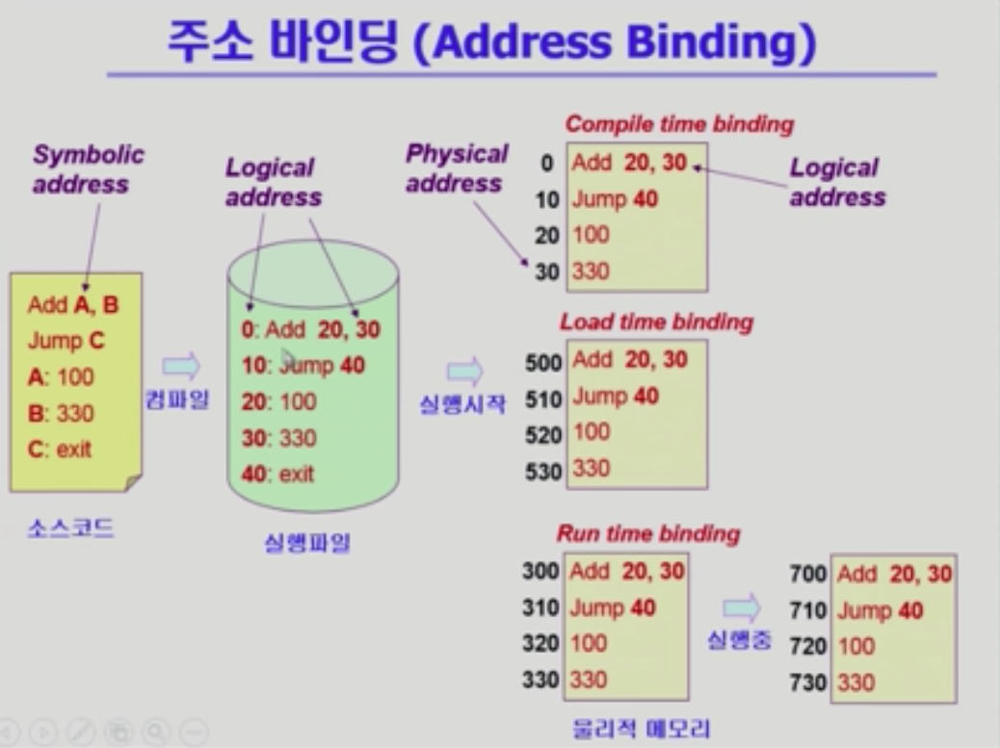

- 논리적 주소에서 물리적 주소로 변환이 필요함!

- Symbolic Address -> Logical Address -> Physical Address

- Compile time binding

  - 물리적 메모리 주소(physical address)가 컴파일 시 알려짐
  - 시작 위치 변경 시 재컴파일
  - 컴파일러는 절대 코드(absolute code) 생성

- Load time binding

  - Loader의 책임 하에 물리적 메모리 주소 부여
  - 컴파일러가 재배치 가능 코드(relocatable code)를 생성한 경우 가능

- Execution time binding(=Run time binding)

  - 수행이 시작된 이후에도 프로세스의 메모리 상 위치를 옮길 수 있음

  - CPU가 주소를 참조할 때마다 binding을 점검(address mapping table)

  - <b>하드웨어적인 지원이 필요</b>

    (e.g. base and limit registers, MMU)

    

## Memory-Management Unit(MMU)

- logical address를 physical address로 매핑해 주는 Hardware device

- MMU scheme

  - 사용자 프로세스가 CPU에서 수행되며 생성해내는 모든 주소값에 대해 base register(=relocation register)의 값을 더한다

- user program

  - logical address만을 다룸
  - 실제 physical address를 볼 수 없으며 알 필요도 없음

- Dynamic Relocation

  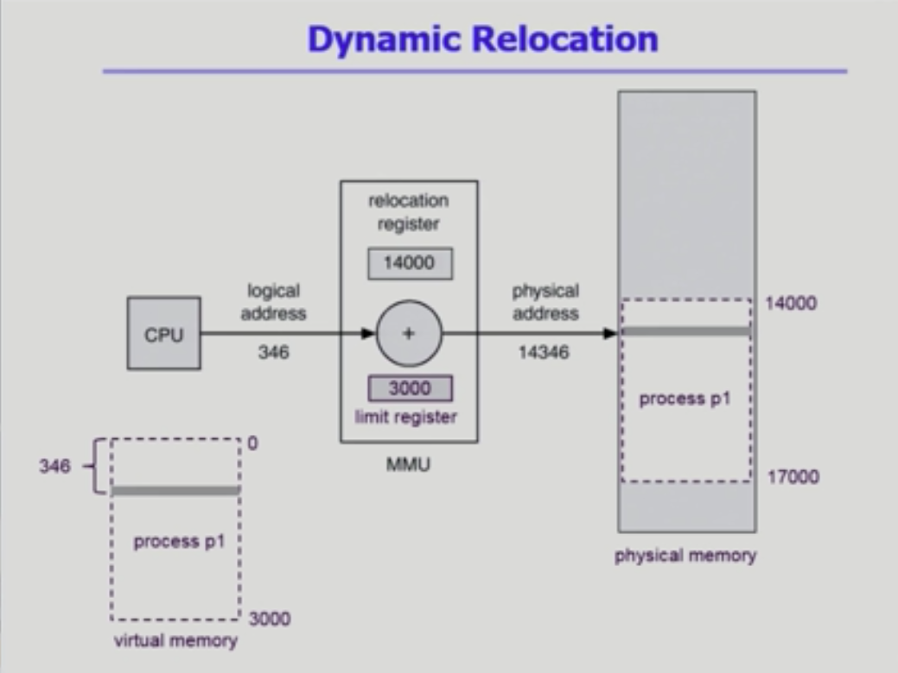

- Hardware Support for address Translation

  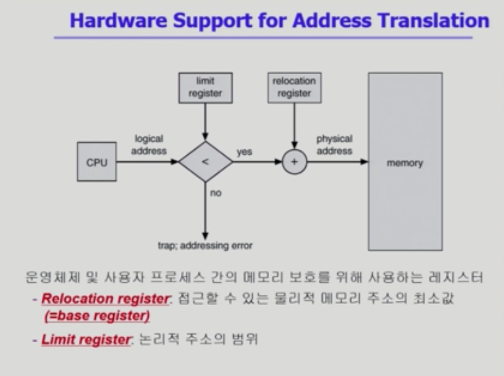

## Some Treminologies

- Dynamic Loading

  - 프로세스 전체를 메모리에 미리 다 올리는 것이 아니라 해당 루틴이 불려질 때 메모리에 load하는 것
  - memory utilization의 향상
  - 가끔씩 사용되는 많은 양의 코드의 경우 유용(오류 처리 루틴 등)
  - 운영체제의 특별한 지원 없이 프로그램 자체에서 구현 가능(OS는 라이브러리르 통해 지원 가능)

- Overlays

  - 메모리에 프로세스의 부분 중 실제 필요한 정보만을 올림
  - 프로세스의 크기가 메모리보다 클 때 유용
  - 운영체제의 지원 없이 사용자에 의해 구현
  - 작은 공간의 메모리를 사용하던 초창기 시스템에서 수작업으로 프로그래머가 구현(manual overlay / 프로그래밍이 매우 복잡)

- Swapping

  - 프로세스를 일시적으로 메모리에서 backing store로 쫓아내는 것

  - backing store(=swap area)

    - 디스크: 많은 사용자의 프로세스 이미지를 담을 만큼 충분히 빠르고 큰 저장 공간

  - Swap in / Swap out

    - 일반적으로 중기 스케쥴러(swapper)에 의해 swap out 시킬 프로세스 선정
    - priority-based CPU scheduling algorithm
      - priority가 낮은 프로세스를 swapped out 시킴
      - priority가 높은 프로세스를 메모리에 올려 놓음
    - Compile time 또는 load time binding에서는 원래 메모리 위치로 swap in 해야 함

    - Execution time binding에서는 추후 빈 메모리 영역 아무곳에나 올릴 수 있음
    - swap time은 대부분 transfer time(swap되는 양에 비례하는 시간)임

- Dynamic Linking

  - Linking을 실행 시간(execution time)까지 미루는 기법
  - Static linking(= static library)
    - 라이브러리가 프로그램의 실행 파일 코드에 포함됨
    - 실행 파일의 크기가 커짐
    - 동일한 라이브러리를 각각의 프로세스가 메모리에 올리므로 메모리 낭비(e.g. printf 함수의 라이브러리 코드)
  - Dynamic linking(= shared library) / .so .dll 파일 등..
    - 라이브러리가 실행시 연결(link)됨
    - 라이브러리 호출 부분에 라이브러리 루틴의 위치를 찾기 위한 stub이라는 작은 코드를 둠
    - 라이브러리가 이미 메모리에 있으면 그 루틴이의 주소로 가고 없으면 디스크에서 읽어옴
    - 운영체제의 도움이 필요

## Allocation of Physical Memory(물리적 메모리 관리)

> 메모리는 일반적으로 두 영역으로 나뉘어 사용
>
> - OS 상주 영역: interrupt vector와 함께 낮은 주소 영역 사용
> - 사용자 프로세스 영역: 높은 주소 영역 사용

- Contiguous allocation(연속 할당)

  각각의 프로세스가 메모리의 연속적인 공간에 적재되도록 하는 것

  - Fixed partition allocation(고정 분할 방식)
    - 물리적 메모리를 몇 개의 영구적 분할(partition)로 나눔
    - 분할의 크기가 모두 동일한 방식과 서로 다른 방식이 존재
    - 분할당 하나의 프로그램 적재
    - 융통성이 없음!
      - 동시에 메모리에 load되는 프로그램의 수가 고정됨
      - 최대 수행 가능 프로그램 크기 제한
    - Internal fragmentation 발생(external fragmentation도 발생)
  - Variable partition allocation(가변 분할 방식)
    - 프로그램의 크기를 고려해서 할당
    - 분할의 크기, 개수가 동적으로 변함
    - 기술적 관리 기법 필요
    - External fragmentation 발생
    - <b>Dynamic Storage-Allocation Problem</b>
      - 가변 분할 방식에서 size n인 요청을 만족하는 가장 적절한 hole을 찾는 문제 / First-fit과 Best-fit이 worst-fit 보다 속도와 공간 이용률 측면에서 효과적인 것으로 알려짐(실험적 결과)
      - First-fit: 최초로 찾아지는 hole에 할당
      - Best-fit: size n 이상인 가장 작은 hole을 찾아서 할당(정렬되지 않은 경우 모든 hole 리스트 탐색해야함)
      - Worst-fit: 가장 큰 hole에 할당(모든 리스트 탐색해야 하고 상대적으로 큰 hole이 생성됨)
    - <b>compaction</b>
      - external fragmentation 문제를 해결하는 한 가지 방법
      - 사용 중인 메모리 영역을 한 군데로 몰고 hole 들을 다른 한 곳으로 몰아 큰 block을 만드는 것
      - 매우 비용이 많이 드는 방법
      - 최소한의 메모리 이동으로 compaction하는 방법(매우 복잡한 문제)
      - compaction은 프로세스의 주소가 실행 시간에 동적으로 재배치 가능한 경우에만 동작

- <b>NonContiguous allocation(불연속 할당)!!</b>

  - 하나의 프로세스가 메모리의 여러 영역에 분산되어 올라갈 수 있음
  - [Paging](#paging)
  - [Segmentation](#segmentation)
  - [Paged Segmentation](#paged-segmentation)

## Paging

> Process의 virtual memory를 동일한 사이즈의 page 단위로 나눔
>
> Virtual memory의 내용이 page 단위로 noncontiguous하게 저장됨
>
> 일부는 backing storage에, 일부는 physical memory에 저장됨
>
> Basic Method
>
> - physical memory를 동일한 크기의 <b>frame</b>으로 나눔
> - logical memory를 동일 크기의 <b>page</b>로 나눔(frame과 같은 크기)
> - 모든 가용 frame들을 관리
> - page table을 사용해 logical address를 physical address로 변환
> - External fragmentation 발생 안함
> - Internal fragmentation 발생 가능

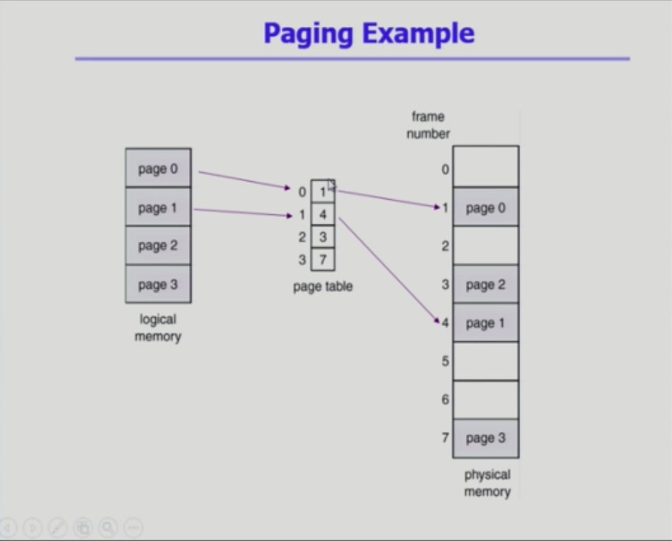

##### Implementation of Page Table

- Page table은 main memory에 상주

- Page-table base register(PTBR)가 page table을 가리킴

- Page-table length register(PTLR)가 테이블 크기를 보관

- 모든 메모리 접근 연산에는 2번의 memory access 필요

- page table 접근 1번, 실제 data/instruction 접근 1번

- 속도 향상을 위해!

  - associative register(parallel search가 가능한 하드웨어) 혹은 translation look-aside buffer(TLB) 라는 고속의 lookup hardware cache 사용

    (데이터를 담기 위한 캐시 메모리와 주소 변환을 위한 캐시 메모리 두가지가 있는데, TLB는 주소 변환을 위한 캐시 메모리)

  - TLB

    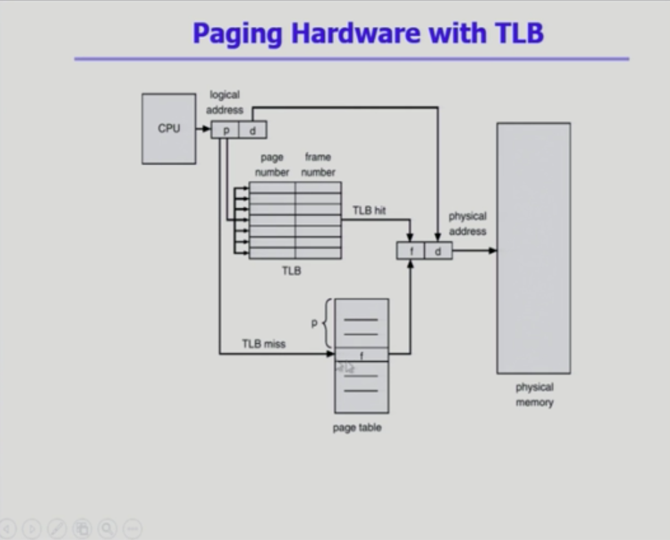

  - Associate register(TLB): parallel search가 가능
    - TLB에는 page table 중 일부만 존재
    - Address translation
      - page table 중 일부가 associative register에 보관되어 있음
      - 만약 해당 page #가 associative register에 있는 경우 곧바로 frame # 얻음
      - 그렇지 않은 경우 main memory에 있는 page table로부터 frame #를 얻음
      - TLB는 context switch 때 flush(remove old entries)

##### Two-Level Page Table

- 현대의 컴퓨터는 address space가 매우 큰 프로그램 자원,, 따라서 다단계 페이지 테이블을 사용!!
  - 32 bit address 사용시: 2^32(4GB)의 주소 공간
  - page size가 4KB 시 1M개의 page table entry 필요
  - 각 page entry가 4B 시 프로세스당 4M의 page table 필요
  - 그러나, 대부분의 프로그램은 4GB의 주소 공간 중 지극히 일부분만 사용하므로 page table 공간이 심하게 낭비됨
  - 따라서! 
    - page talbe 자체를 page로 구성
    - 사용되지 않는 주소 공간에 대한 outer page table의 엔트리 값은 NULL(대응하는 inner page table이 없음)

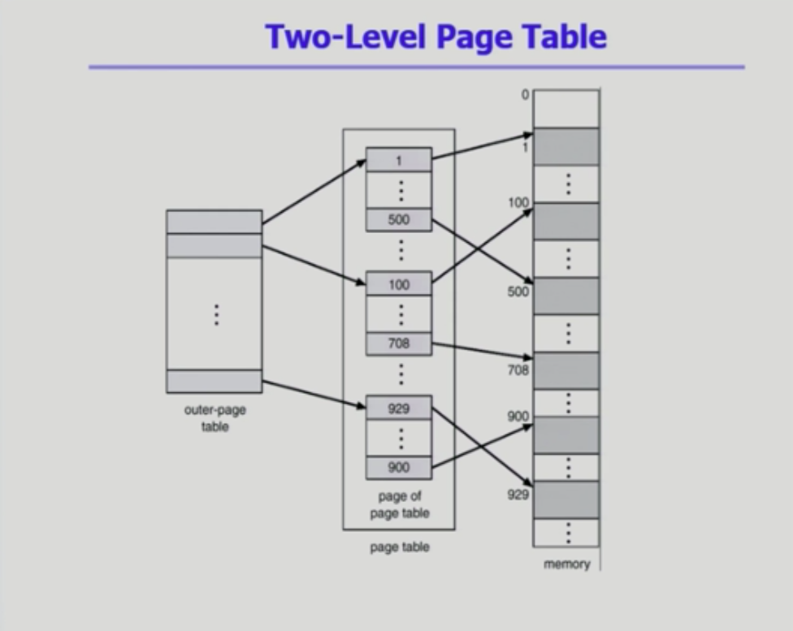

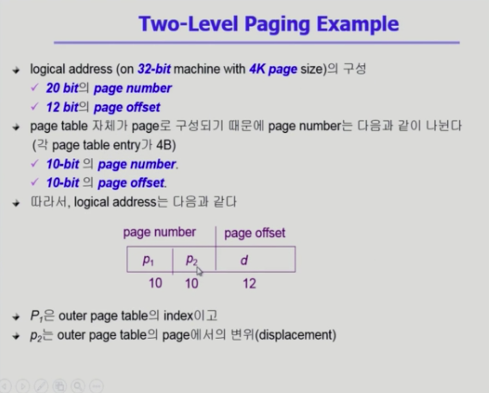

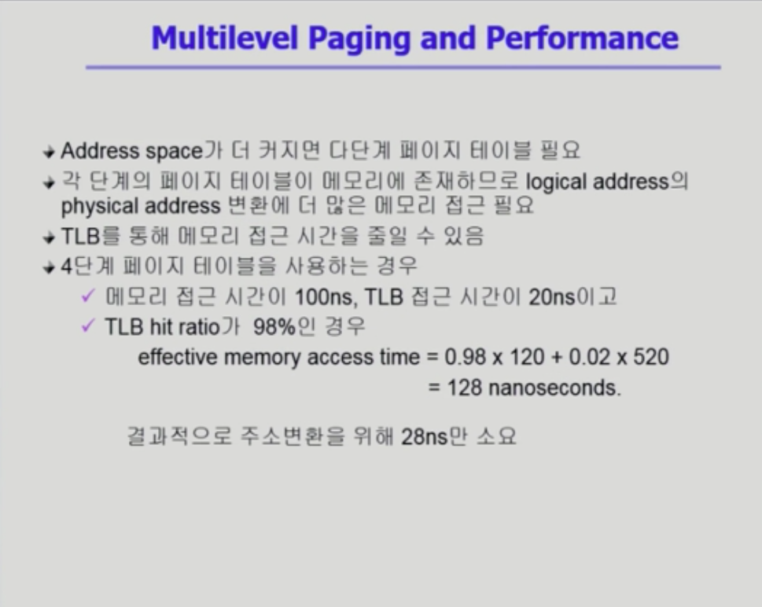

##### Inverted Page Table

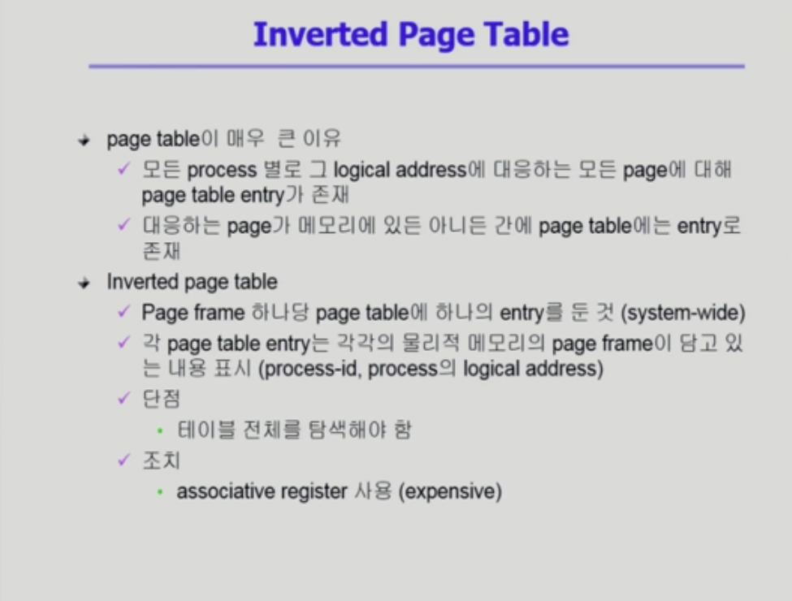

##### Shared Page

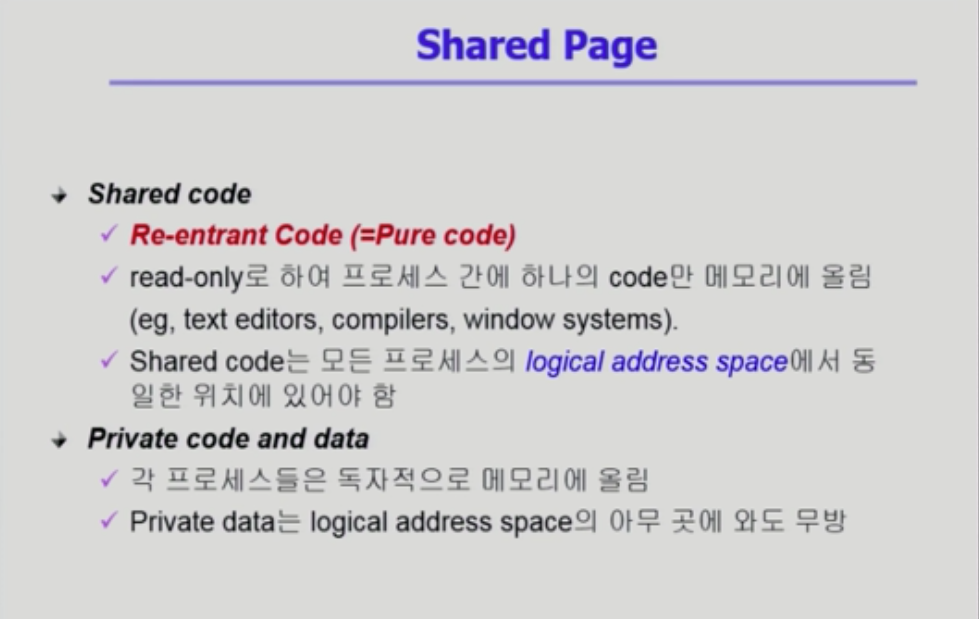

## Segmentation

> 프로그램은 의미 단위인 여러 개의 segment로 구성
>
> - 작게는 프로그램을 구성하는 함수 하나 하나를 세그먼트로 정의
> - 크게는 프로그램 전체를 하나의 세그먼트로 정의 가능
> - 일반적으로는 code, data, stack 부분이 하나씩 세그먼트로 정의됨
> - Segment는 다음과 같은 logical unit들임
>   - main(), function, global variables, stack, symbol tables, arrays...

##### Segmentation Architecture

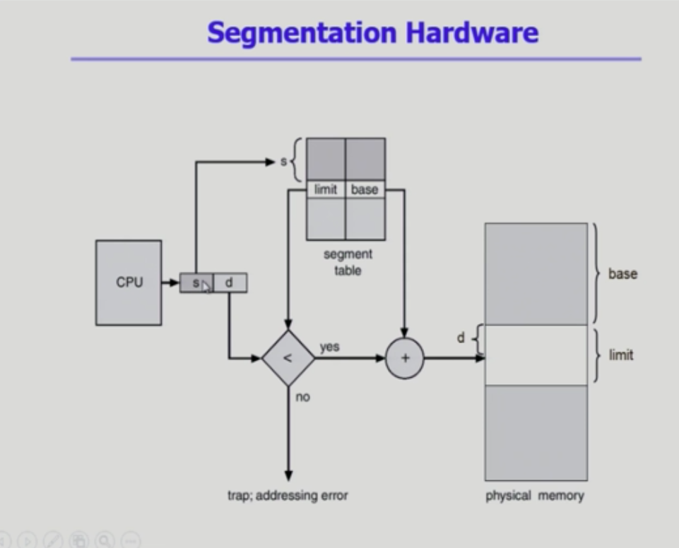

- Logical address는 다음의 두 가지로 구성
  - segment-number
  - offset
- Segment table
  - each table entry has
    - base: starting physical address of the segment
    - limit: length of the segment
- Segment-table base register(STBR)
  - 물리적 메모리에서의 segment table의 위치
- Segment-table length register(STLR)
  - 프로그램이 사용하는 segment의 수
- <b>Protection</b>
  - 각 세그먼트 별로 protection bit가 있음
  - Each entry
    - Valid bit = 0 >> illegal segment
    - Read/Write/Execution 권한 bit
- <b>Sharing</b>
  - shared segment
  - same segment number
  - segment는 의미 단위이기 때문에 공유(sharing)와 보안(protection)에 있어 paging 보다 훨씬 효과적임
- <b>Allocation</b>
  - first fit / best fit
  - external fragmentation 발생
  - segment의 길이가 동일하지 않으므로 가변분할 방식에서와 동일한 문제점 발생 

## Paged Segmentation

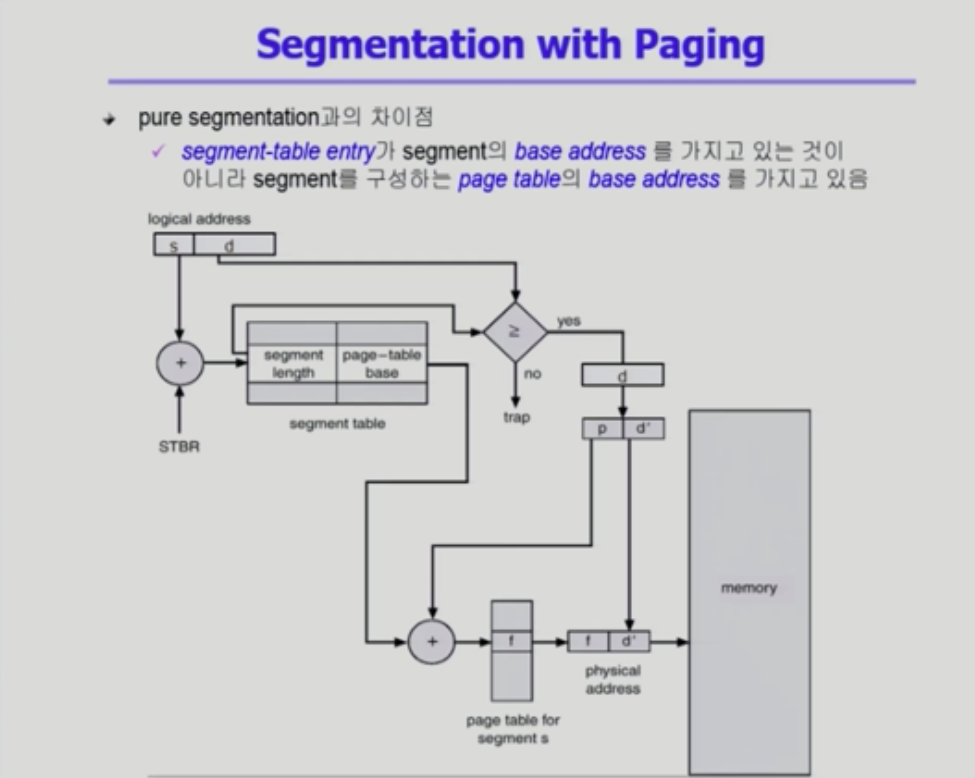

- segment가 여러개의 페이지로 구성되어, 페이지 길이가 세그먼트 길이의 배수가 됨
- 세그먼트를 페이지 단위로 잘라서 관리