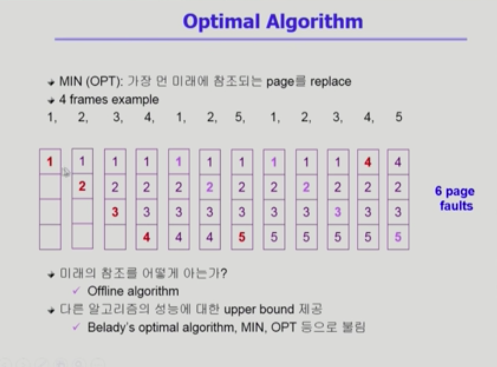
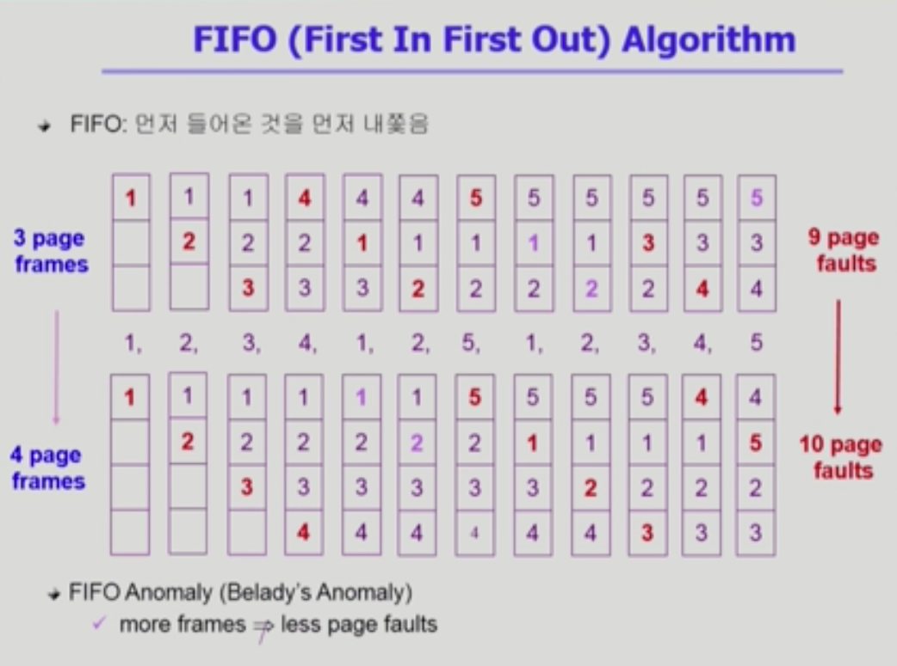
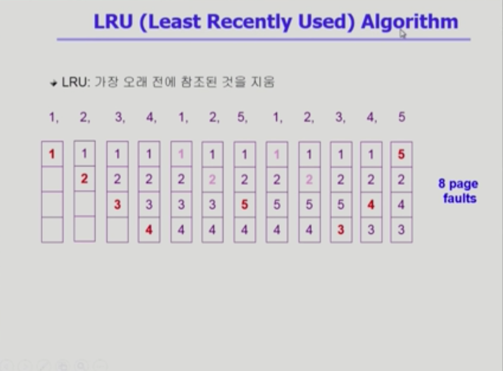
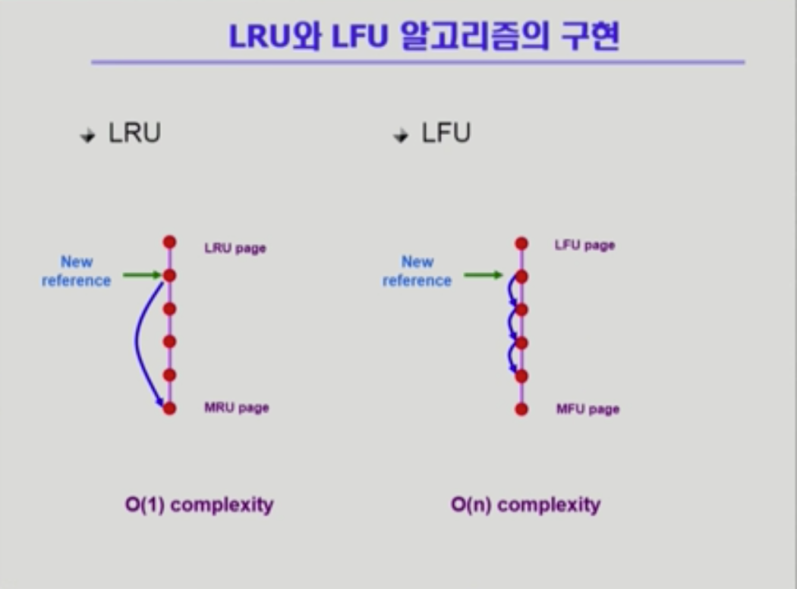
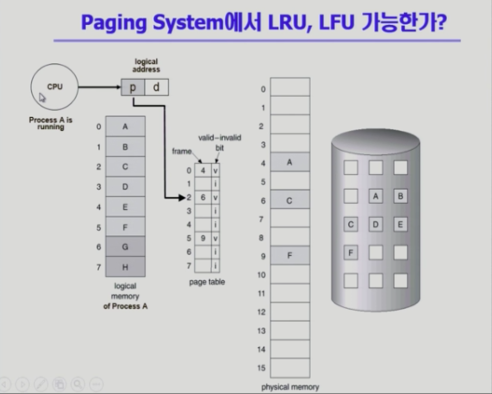
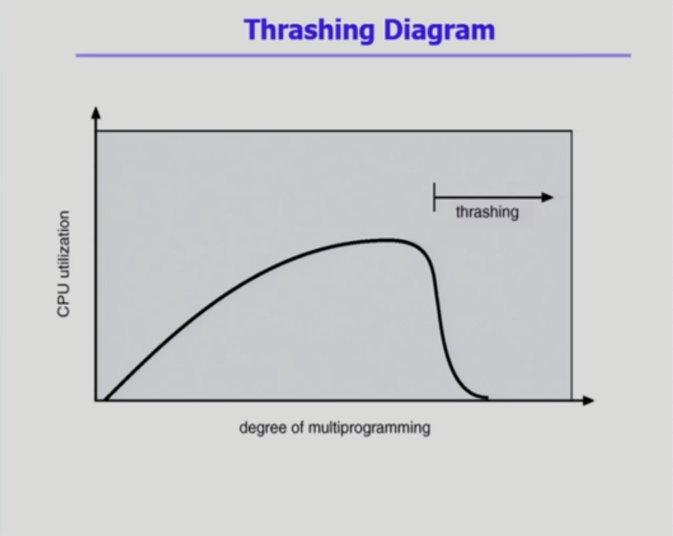
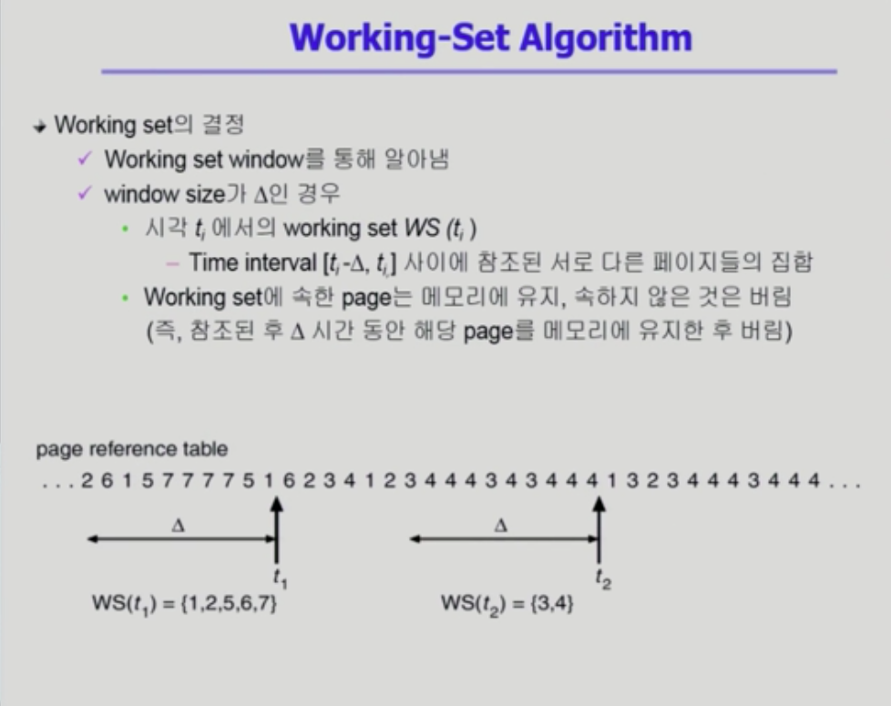
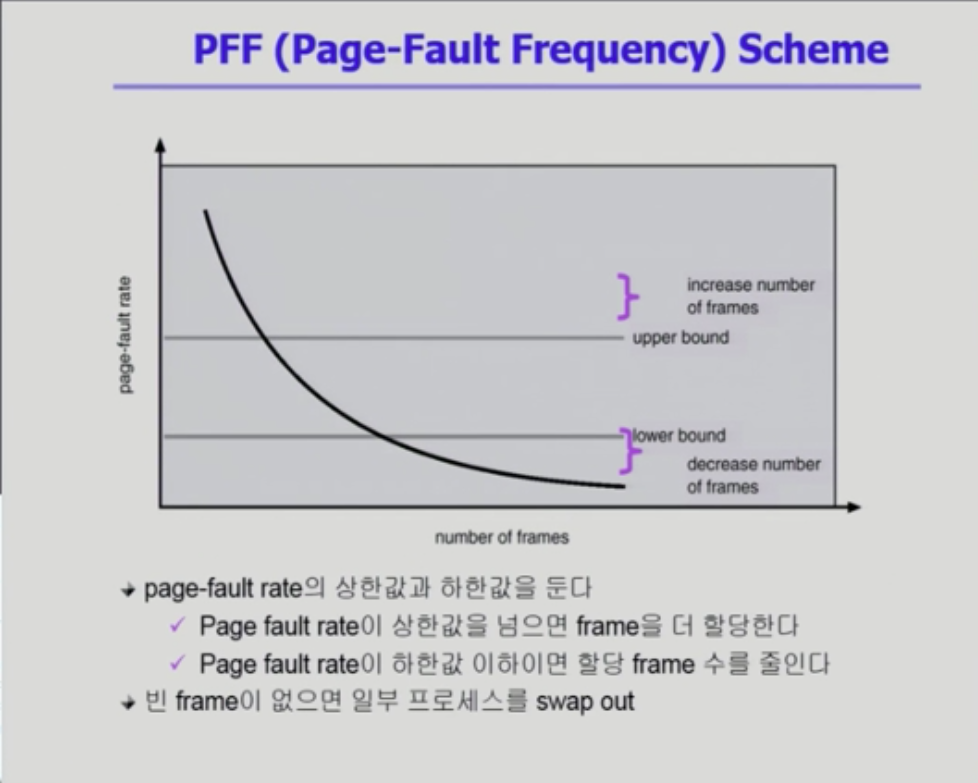

## 가상 메모리 #1

> 전적으로 운영체제가 관여하는 부분

### Demand Paging

- 실제로 필요할 때 page를 메모리에 올리는 것
  - I/O 양의 감소
  - Memory 사용량 감소
  - 빠른 응답 시간
  - 더 많은 사용자 수용
- Valid / Invalid bit의 사용
  - Invalid의 의미
    - 사용하지 않는 주소 영역인 경우
    - 페이지가 물리적 메모리에 없는 경우
  - 처음에는 모든 page entry가 invalid로 초기화
  - address translation 시에 invalid bit가 set되어 있으면 <b>page fault</b>

### Page Fault

> 요청한 페이지가 메모리에 없는 경우 page fault가 났다고 표현함

- invalid page를 접근하면 MMU가 trap을 발생시킴(page fault trap)
- Kernal mode로 들어가서 page fault handler가 invoke됨
- 다음과 같은 순서로 page fault를 처리
  - invalid reference ? (e.g. bad address, protection violation) => abort process
  - Get an empty page frame (없으면 뺏어온다:  replace)
  - 해당 페이지를 disk에서 memory로 읽어옴
    - disk I/O가 끝나기까지 이 프로세스는 CPU를 preempt 당함(block)
    - Disk read가 끝나면 page tables entry 기록, valid/invalid bit = "valid"
    - ready queue에 process를 insert => dispatch later
- Performance of Demand paging
  - page fault가 나는 비율을 보면, 대부분 page fault가 나지 않아 메모리에 바로 접근이 가능하지만, 메모리에 page가 올라가 있지 않으면 성능에 문제가 발생
  - OS & HW page fault overhead / swap page out if needed / swap page in / OS & HW restart overhead 등의 작업이 발생하기 때문
- Free frame이 없는 경우
  - Page replacement
    - 어떤 frame을 빼앗아올지 결정해야 함
    - 곧바로 사용되지 않을 page를 쫓아내는 것이 좋음
    - 동일한 페이지가 여러번 메모리에서 쫓겨났다가 다시 들어올 수 있음
  - Replacement Algorithm
    - page-fault rate를 최소화하는 목표
    - 알고리즘의 평가
      - 주어진 page reference string에 대해 page fault를 얼마나 내는지 조사
    - replacement string의 예
      - 1,2,3,4,1,2,5,1,2,3,4,5

- 미래에 사용될 페이지를 아는지 모르는지
  - 알 때: Optimal Algorithm
  - 모를 때(과거 참조): FIFO, LRU, LFU

### Optimal Algorithm

- MIN(OPT): 가장 먼 미래에 참조되는 page를 replace(페이지 레퍼런스 string을 이미 알고 있다는 가정 하에 운영)

  

### FIFO(First In First Out) Algorithm

> 미래에 참조될 페이지를 모를 때 사용하는 알고리즘

### LRU(Least Recently Used) Algorithm

> 가장 최근에 사용된 페이지를 대체하는 알고리즘

### LFU(Least Frequently Used) Algorithm

- 참조 횟수(reference count)가 가장 적은 페이지를 지움
  - 최저 참조 횟수인 page가 여럿 있는 경우
    - LFU 알고리즘 자체에서는 여러 page중 임의로 선정
    - 성능 향상을 위해 가장 오래 전에 참조된 page를 지우게 구현할 수도 있음
  - 장단점
    - LRU처럼 직전 참조 시점만 보는 것이 아니라 장기적인 시간 규모를 보기 때문에 page의 인기도를 좀 더 정확히 반영할 수 있음
    - 참조 시점의 최근성을 반영하지 못함
    - LRU보다 구현이 복잡함

### LRU와 LFU 알고리즘의 구현

- LFU를 heap으로 구현하면 O(logn)으로 줄어들 수 있음

## 가상 메모리 #2

### 다양한 caching 환경

- caching 기법

  - 한정된 빠른 공간(=캐쉬)에 요청된 데이터를 저장해 두었다가 후속 요청 시 캐쉬로부터 직접 서비스하는 방식
  - paging system 이외에도 cache memory, buffer caching, Web caching 등 다양한 분야에서 사용

- 캐쉬 운영의 시간 제약

  - 교체 알고리즘에서 삭제할 항목을 결정하는 일에 지나치게 많은 시간이 걸리는 경우 실제 시스템에서 사용할 수 없음

  - Buffer caching이나 Web caching의 경우 O(1)에서 O(logn) 정도까지 허용

  - Paging system인 경우

    - page fault인 경우에만 OS가 관여함
    - 페이지가 이미 메모리에 존재하는 경우 참조시각 등의 정보를 OS가 알 수 없음
    - O(1)인 LRU의 list 조작조차 불가능

    

    - 페이지가 사용되는 시점을 알아야 LRU, LFU가 가능한데, 주소 변환 과정은 운영체제가 관여하지 않고 하드웨어가 통제하기 때문에, 이 페이지를 언제 사용했는지 운영체제가 알 수 없기 때문에 불가능

    - page fault가 났을 때만 os가 해당 정보를 알 수 있기 때문에 불완전한 것임

### Clock Algorithm

- LRU의 근사(approximation) 알고리즘
- 여러 명칭으로 불림
  - Second chance algorithm
  - NUR(Not Used Recently) 또는 NRU(Not Recently Used)
- reference bit를 사용해서 교체 대상 페이지 선정(circular list)
- reference bit가 0인 것을 찾을 때까지 포인터를 하나씩 앞으로 이동
- 포인터 이동하는 중에 reference bit 1은 모두 0으로 바꿈
- reference bit가 0인 것을 찾으면 그 페이지를 교체
- 한 바퀴 되돌아와서도(=second chance) 0이면 그 때에는 replace 당함
- 자주 사용되는 페이지라면 second chance가 올 때 1
- Clock 알고리즘의 개선
  - reference bit(access bit)가 modified bit(dirty bit)을 함께 사용
  - reference bit = 1: 최근에 참조된 페이지
  - modified bit = 1: 최근에 변경된 페이지(I/O를 동반하는 페이지)

### Page Frame의 Allocation

> 어떤 process의 페이지인지는 고려하지 않고 쫓아내는데 page frame의 allocation은 어떤 process인지 고려하는 것

- Allocation problem: 각 process에 얼마만큼의 page frame을 할당할 것인가?

- Allocation의 필요성

  - 메모리 참조 명령어 수행 시 명령어, 데이터 등 여러 페이지 동시 참조

    (명령어 수행을 위해 최소한 할당되어야 하는 frame의 수가 있음)

  - Loop를 구성하는 page들은 한꺼번에 allocate 되는 것이 유리함

    (최소한의 allocation이 없으면 매 loop 마다 page fault)

- <b>Allocation Scheme</b>

  - Equal allocation: 모든 프로세스에 똑같은 갯수 할당
  - Proportional allocation: 프로세스 크기에 비례하여 할당
  - Priority allocation: 프로세스의 priority에 따라 다르게 할당

### Global vs Local Replacement

- Global replacement
  - Replace 시 다른 process에 할당된 frame을 빼앗아 올 수 있음
  - Process별 할당량을 조절하는 또다른 방법
  - FIFO, LRU, LFU 등의 알고리즘을 global replacement로 사용시에 해당
  - Working set, PFF 알고리즘 사용
- Local replacement
  - 자신에게 할당된 frame 내에서만 replacement
  - FIFO, LRU, LFU 등의 알고리즘을 process 별로 운영시

## Thrashing

- 프로세스의 원활한 수행에 필요한 최소한의 page frame 수를 할당 받지 못한 경우 발생
- Page fault rate 매우 높아짐
- CPU utilization 낮아짐
- OS는 MPD(Multiprogramming degree)를 높여야 한다고 판단
- 또 다른 프로세스가 시스템에 추가됨(higher MPD)
- 프로세스당 할당된 frame의 수가 더욱 감소
- 프로세스는 page의 swap in/ swap out으로 매우 바쁨
- 대부분의 시간에 CPU는 한가함
- low throughput

### Working-Set Model

- Locality of reference
  - 프로세스는 특정 시간 동안 일정 장소만을 집중적으로 참조함
  - 집중적으로 참조되는 해당 page들의 집합을 locality set이라 함
- Working-set Model
  - Locality에 기반하여 프로세스가 일정 시간 동안 원활하게 수행되기 위해 한꺼번에 메모리에 올라와 있어야 하는 page들의 집합을 Working Set이라 정의함
  - Working Set 모델에서는 process의 working set 전체가 메모리에 올라와 있어야 수행되고, 그렇지 않을 경우 모든 frame을 반납한 후 swap out(suspend)
  - Thrashing 방지
  - Multiprogramming degree를 결정함

### Working-Set Algorithm

### PFF(Page-Fault Frequency) Scheme

- upper bound와 lower bound 사이의 frame 수를 결정하자는 것

### Page Size의 결정

- page size를 감소시키면
  - 페이지 수 증가
  - 페이지 테이블 크기 증가
  - internal fragmentation 감소
  - Disk transfer의 효율성 감소
    - Seek/rotation vs transfer
  - 필요한 정보만 메모리에 올라와 메모리 이용이 효율적
    - Locality의 활용 측면에서는 좋지 않음
- Trend
  - larger page size