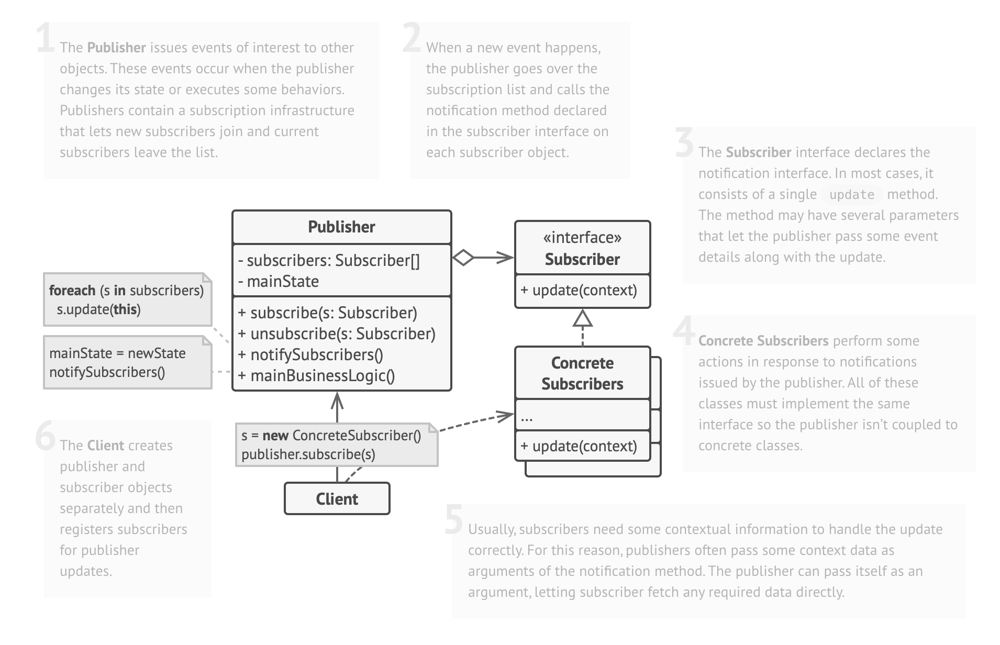
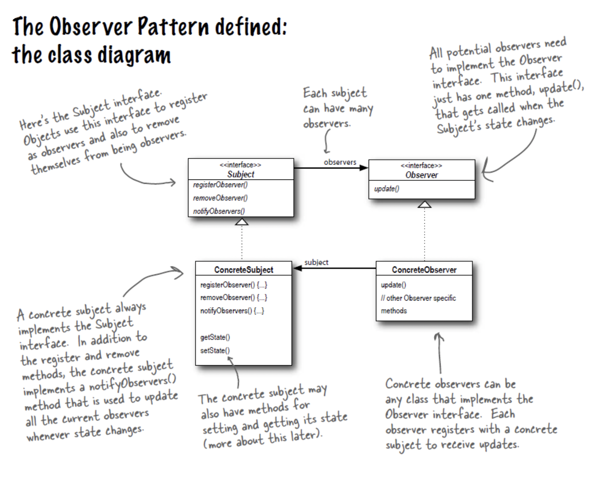

# Observer Pattern

> notify multiple objects about any events that happen to the object they're observing
>
> 참고자료
>
> - [refactoring.guru](https://refactoring.guru/design-patterns/observer)
> - head first design patterns 서적


## UML



- `Publisher`
  - subscribers 리스트를 갖고 있고, subscribe() / unsubscribe() 메서드를 통해 관리
  - 상태가 변경되면 subscribers 각각에 대해 변경된 상태를 알려주는 notifySubscribers() 메서드를 가짐
- `Subscriber`
  - Subscriber interface는 Publisher가 notifySubscribers() 메서드에서 호출할 update() 메서드를 선언
- `ConcreteSubscribers`
  - Subscriber interface의 update() 메서드를 구현
  - Publisher는 Subscriber interface만을 바라보고 있기 때문에 Concrete Subscribers와의 연결이 느슨해짐

<br>



- Subject - Publisher / Observer - Subscriber에 대응

- 위 UML과의 차이점

  - Subject interface 를 추가적으로 두어 구체 Subject가 다형적으로 변할 수 있게 함
  - 상태를 설정하고 알아내기 위한 state getter/setter 메서드가 있을 수도 있음
  
- 코드

  ```java
  // main
  public class ObserverApplication {
      public static void main(String[] args) {
          WeatherData weatherData = new WeatherData();
          CurrentConditions currentConditions = new CurrentConditions();
  
          weatherData.registerObserver(currentConditions);
          weatherData.setMeasurements(80, 65, 30.4f);
      }
  }
  
  // Subject & ConcreteSubject
  public interface Subject {
      void registerObserver(Observer o);
      void removeObserver(Observer o);
      void notifyObservers();
  }
  
  public class WeatherData implements Subject {
  
      private List<Observer> observers;
      private float temperature;
      private float humidity;
      private float pressure;
  
      public WeatherData() {
          this.observers = new ArrayList<Observer>();
      }
  
      @Override
      public void registerObserver(Observer o) {
          observers.add(o);
      }
  
      @Override
      public void removeObserver(Observer o) {
          int idx = observers.indexOf(o);
          if (idx >= 0) {
              observers.remove(idx);
          }
      }
  
      @Override
      public void notifyObservers() {
          for (Observer observer : observers) {
              observer.update(temperature, humidity, pressure);
          }
      }
  
      public void measurementsChanged() {
          notifyObservers();
      }
  
      public void setMeasurements(float temperature, float humidity, float pressure) {
          this.temperature = temperature;
          this.humidity = humidity;
          this.pressure = pressure;
          measurementsChanged();
      }
  }
  
  
  // Observer & ConcreteObserver
  public interface Observer {
      void update(float temp, float humidity, float pressure);
  }
  
  public class CurrentConditions implements Observer {
  
      private float temperature;
      private float humidity;
      private float pressure;
  
      @Override
      public void update(float temp, float humidity, float pressure) {
          this.temperature = temp;
          this.humidity = humidity;
          this.pressure = pressure;
          display();
      }
  
      public void display() {
          System.out.println("Current conditions: " + temperature + ", " + humidity + ", " + pressure);
      }
  }
  ```


<br>

## Pros and Cons

- Pros
  - Open/Closed Principle. You can introduce new subscriber classes without having to change the publisher's code (and vice versa if there's a publisher interface).
  - You can establish relations between objects at runtime.
- Cons
  - Subscribers are notfied in random order.

<br>

## 자바 내장 Observer *deprecated*

> java.util.Observer, java.util.Observable

- *This class and the* [`Observer`](https://docs.oracle.com/javase/10/docs/api/java/util/Observer.html) *interface have been deprecated. The event model supported by* `Observer` *and* `Observable` *is quite limited, the order of notifications delivered by* `Observable` *is unspecified, and state changes are not in one-for-one correspondence with notifications. For a richer event model, consider using the* [`java.beans`](https://docs.oracle.com/javase/10/docs/api/java/beans/package-summary.html) *package. For reliable and ordered messaging among threads, consider using one of the concurrent data structures in the* [`java.util.concurrent`](https://docs.oracle.com/javase/10/docs/api/java/util/concurrent/package-summary.html) *package. For reactive streams style programming, see the* [`Flow`](https://docs.oracle.com/javase/10/docs/api/java/util/concurrent/Flow.html) *API.*