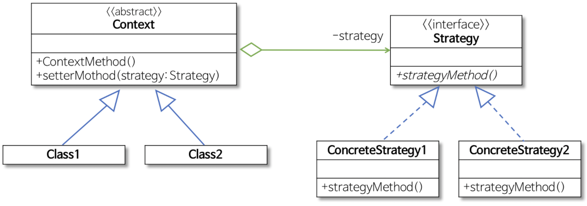
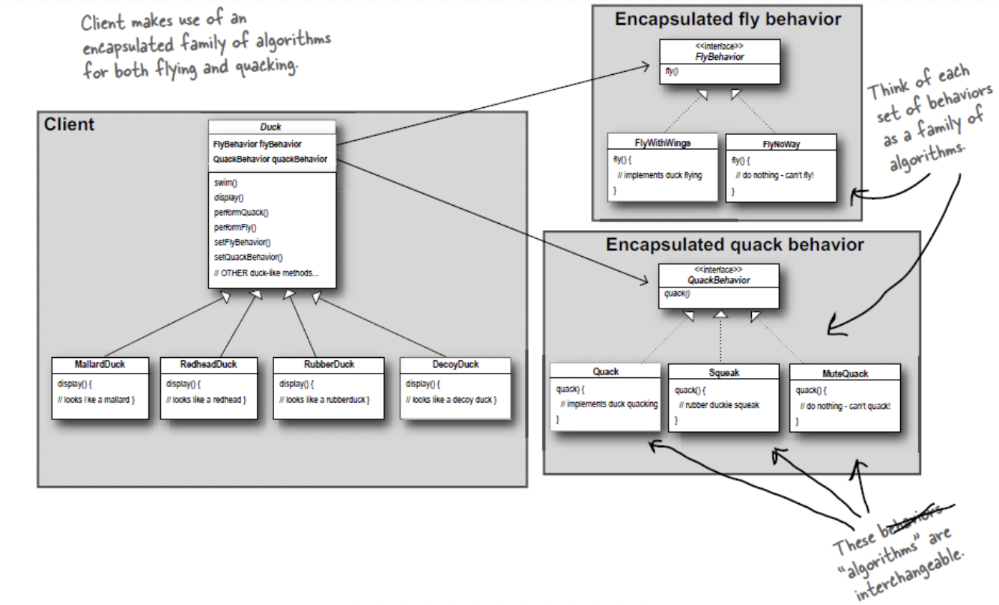

# Strategy Pattern

> Strategy to allow different formatting algorithms
>
> 참고자료
>
> - [refactoring.guru](https://refactoring.guru/design-patterns/strategy/java/example)
> - head first design patterns 서적
> - [https://github.com/gmlwjd9405](https://gmlwjd9405.github.io/2018/09/06/java-comparable-and-comparator.html)


## UML



- `Context`
  - strategy 패턴을 이용하는 클래스
  - strategy를 인터페이스 타입을 갖는 인스턴스 변수로 갖게 됨
  - setStrategy() method를 제공하여 필요한 algorithm을 setter로 주입할 수 있게 함
- `Strategy`
  - 인터페이스 또는 추상 클래스로 외부에서 동일한 method를 사용해 특정 algorithm을 호출할 수 있게 함
- `ConcreteStrategy`
  - Strategy 인터페이스 또는 추상 클래스를 구현 또는 상속 받아 특정 Strategy를 실제로 구현하는 클래스

<br>



- Duck은 여러 종류의 Duck을 가질 수 있다.

  - 여러 종류의 Duck은 공통적으로 수행하는 로직이 있지만, 각자 특성에 맞게 수행되는 로직(algorithm)도 있다
  - 각자 특성에 맞게 수행되는 로직을 분리하여 캡슐화한다
  - setter 함수로(e.g. setFlyBehavior(), setQuackBehavior()) 특정 strategy를 주입할 수 있게 한다

- Strategy interface인 FlyBehavior, QuackBehavior가 있다

  - 각 인터페이스는 여러 타입의 ConcreteBehavior가 수행하는 공통 메서드를 정의한다
  - ConcreteBehavior는 인터페이스를 구현하여 개별 algorithm을 수행한다

- 코드

  ```java
  // main
  public class Test {
      public static void main(String[] args) {
          FlyBehavior flyWithWings = new FlyWithWings();
          Duck mallard = new MallardDuck(flyWithWings);
          mallard.performFly();
      }
  }
  
  // Duck & ConcreteDucks
  public abstract class Duck {
      FlyBehavior flyBehavior = null;
  
      Duck(FlyBehavior flyBehavior) {  // 생성자를 통해 강제 or setter로 주입
          this.flyBehavior =  flyBehavior;
      }
  
      abstract void display();  // 공통 method
  
      public void performFly() {
          flyBehavior.fly();
      }
  
      public void setFlyBehavior(FlyBehavior flyBehavior) {
          this.flyBehavior =  flyBehavior;
      }
  }
  
  public class MallardDuck extends Duck {
  
      MallardDuck(FlyBehavior flyBehavior) {
          super(flyBehavior);
      }
      
      @Override
      public void display() {
          System.out.println("this is mallard duck");
      }
  
  }
  
  
  // FlyBehavior & ConcreteFlyBehaviors
  public interface FlyBehavior {
      void fly();
  }
  
  public class FlyWithWings implements FlyBehavior {
  
      @Override
      public void fly() {
          System.out.println("fly with wings");
      }
  }
  ```

  - setter로 주입하지 않고 생성자를 통해 바로 강제하도록 하는 것으로 바꿔봄

    ~~초기 생성자를 통해 강제하지 않으면 Duck 추상 클래스에서 flyBehavior 인스턴스 변수에 null이 아닌 default ConcreteFlyBehavior 인스턴스를 할당해주어야 할텐데, 어떤 전략을 쓸지 모르는 상황에서 default도 추가적으로 만드느니 생성자로 만들었는데 장단점은?~~

<br>

## 실제 활용

##### [`java.util.Comparator#compare()`](https://docs.oracle.com/javase/8/docs/api/java/util/Comparator.html#compare-T-T-) called from `Collections#sort()`

```java
public class Collections {
  public static <T extends Comparable<? super T> void sort(List<T> list) {
    list.sort(null);
  }
  
  public static <T> void sort(List<T> list, Comparator<? super T> c) {
    list.sort(c);
  }
  
  default void sort(Comparator<? super E> c) {
    Object[] a = this.toArray();
    Arrays.sort(a, (Comparator) c);
    ListIterator<E> i = this.listIterator();
    for (Object e : a) {
      i.next();
      i.set((E) e);
    }
  }
}

@FunctionalInterface
public interface Comparator<T> {
  int compare(T o1, T o2);
}

public class myComparator implements Comparator {
  
  @Override
  public int compare(Object obj1, Object obj2) {
    if (obj1.x > obj2.x) {
      return 1;  // x에 대해 오름차순
    } else if (obj1.x == obj2.x) {
      if (obj1.y < obj2.y) {  // y에 대해서는 내림차순
        return 1;
      }
    }
    return -1;
  }
}
```

- Collections.sort()에 의해 호출된 Comparator.compare()
- `Context` - Collections
- `Stratety` - Comparator
- `ConcreteStrategy` - (otherClasses implements Comparator).compare()
  - 추상 메서드 compare() override 하여 여러 algorithm 사용 가능
  - compare() method override 한 customComparator를 Collections.sort() 인자로 전달하면 해당 comparator algorithm에 따라 sort 시행

<br>

## Pros and Cons

- Pros
  - You can swap algorithms used inside an object at runtime.
  - You can isolate the implementation details of an algorithm from the code that uses it.
  - You can replace inheritance with composition.
  - Open/Closed Principle. You can introduce new strategies without having to change the context.
- Cons
  - If you only have a couple of algorithms and they rarely change, there's no real reason to overcomplicate the program with new classes and interfacaes that come along with the pattern.
  - Clients must be aware of the differences between strategies to be able to select a proper one.
  - A lot of modern programming languages have functional type support that lets you implement different versions of an algorithm inside a set of anonymous functions. Then you could use these functions exactly as you'd have used the strategy objects, but without bloating your code with extra classes and interfaces.