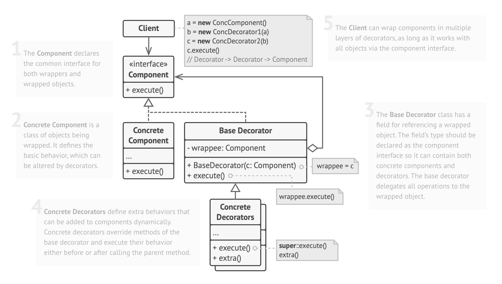
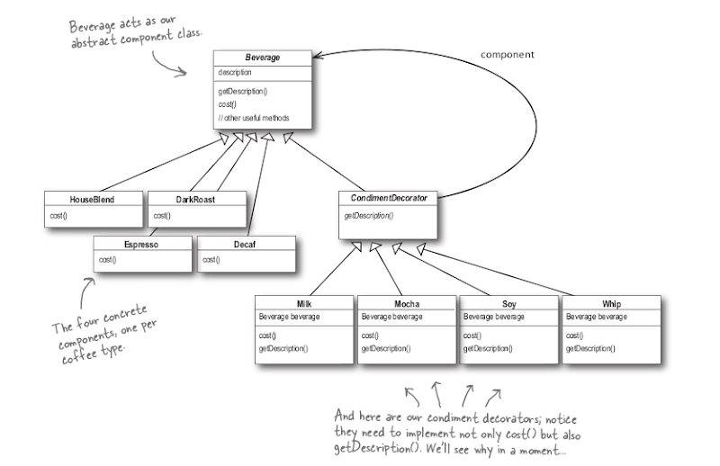

# Decorator

> attach new behaviors to objects by placing these objects inside special wrapper objects that contain the behaviors.
>
> 참고자료
>
> [refactoring.guru](https://refactoring.guru/design-patterns/decorator
>
> head first design patterns 서적


## UML



- `Client` 여러 데코레이터로 wrapping하여 추가 작업(concrete decorator에서 정의한) 실행 가능
- `Component` \<\<interface>> wrappers and wrapped objects를 위한 인터페이스나 추상 클래스
  - `Concrete Component` 실제로 wrapped 되는 subclass로, 기본 기능에 해당
  - `Base Decorator` \<\<interface or abstract class>> wrapping 시킬 object의 상위 인터페이스 또는 추상 클래스 타입을 구현 또는 상속하여 형식을 맞춤
    - `Concrete Decorator` 실제로 추가 기능을 정의

<br>



- `Beverage` Component

  - `Espresso` `DarkRoast` ...  Concrete Component
  - `CondimentDecorator` Base Decorator
    - `Mocha` `Whip` ...  Concrete Decorator

- 코드

  ```java
  /* Client */
  public class DecoratorApplication {
      public static void main(String[] args) {
          Beverage beverage = new Espresso();
          System.out.println(beverage.getDescription() + " $" + beverage.cost());
  
          Beverage beverage2 = new DarkRoast();
          beverage2 = new Mocha(beverage2);
          beverage2 = new Mocha(beverage2);
          beverage2 = new Whip(beverage2);
          System.out.println(beverage2.getDescription() + " $" + beverage2.cost());
      }
  }
  
  
  /* Component */
  public abstract class Beverage {
      String description = "no content";
  
      public String getDescription() {
          return this.description;
      }
  
      public abstract double cost();
  }
  
  public class DarkRoast extends Beverage {
  
      public DarkRoast() {
          description = "다크로스트";
      }
  
      @Override
      public double cost() {
          return .99;
      }
  }
  
  // Concrete Component
  public class Espresso extends Beverage {
  
      public Espresso() {
          description = "에스프레소";
      }
  
      @Override
      public double cost() {
          return 1.99;
      }
  }
  
  
  /* Base Decorator */
  public abstract class CondimentDecorator extends Beverage {
      public abstract String getDescription();
  }
  
  // Concrete Decorator
  public class Mocha extends CondimentDecorator {
  
      Beverage beverage;
  
      public Mocha(Beverage beverage) {
          this.beverage = beverage;
      }
  
      @Override
      public String getDescription() {
          return beverage.getDescription() + ", mocha";
      }
  
      @Override
      public double cost() {
          return .20 + beverage.cost();
      }
  
  }
  
  public class Whip extends CondimentDecorator {
  
      Beverage beverage;
  
      public Whip(Beverage beverage) {
          this.beverage = beverage;
      }
  
      @Override
      public String getDescription() {
          return beverage.getDescription() + ", whip";
      }
  
      @Override
      public double cost() {
          return .10 + beverage.cost();
      }
  }
  ```

<br>

## 실제 활용

[`java.io`](https://docs.oracle.com/javase/7/docs/api/java/io/package-summary.html) <- FilterInputStream, FilterOutputStream, FilterReader, FilterWriter...

```java
/* Client */
public class LowerCaseInputStreamApplication {
    public static void main(String[] args) throws FileNotFoundException {
        int c;
        try {
            InputStream in = new LowerCaseInputStream(
                                new BufferedInputStream(
                                new FileInputStream("test.txt")));

            while((c = in.read()) >= 0) {
                System.out.print((char)c);
            }

            in.close();
        } catch (IOException e) {
            e.printStackTrace();
        }
    }
}

/* Component */
public abstract class InputStream implements Closeable {
  
    private static final int MAX_SKIP_BUFFER_SIZE = 2048;
    private static final int DEFAULT_BUFFER_SIZE = 8192;
  
    public abstract int read() throws IOException;
  
    //...
}

// Concrete Component
class FileInputStream extends InputStream {
    public int read() throws IOException {
        return read0();
    }
  
    //...
}

/* Base Decorator */
class FilterInputStream extends InputStream {

    protected volatile InputStream in;

    protected FilterInputStream(InputStream in) {
        this.in = in;
    }

    public int read() throws IOException {
        return in.read();
    }
    
    //...
}

// Decorator
public class BufferedInputStream extends FilterInputStream {

    public BufferedInputStream(InputStream in) {
        this(in, DEFAULT_BUFFER_SIZE);
    }
  
    public synchronized int read() throws IOException {
        if (pos >= count) {
            fill();
            if (pos >= count)
                return -1;
        }
        return getBufIfOpen()[pos++] & 0xff;
    }
  
    //...
}

public class LowerCaseInputStream extends FilterInputStream {

    protected LowerCaseInputStream(InputStream in) {
        super(in);
    }

    public int read() throws IOException {
        int c = super.read();
        return (c == -1 ? c : Character.toLowerCase((char)c));
    }

    public int read(byte[] b, int offset, int len) throws IOException {
        int result = super.read(b, offset, len);
        for (int i = offset; i < offset+result; i++) {
            b[i] = (byte)Character.toLowerCase((char)b[i]);
        }
        return result;
    }
}

```

- `InputStream` Component
  - `FileInputStream` ...   Concrete Component
  - `FilterInputStream` Base Decorator
    - `BufferedInputStream` `DataInputStream` `LowerCaseInputStream(customized)`... Concrete Decorator

<br>

## Pros and Cons

- Pros
  - You can extend an objects' behavior without making a new subclass.
  - You can add or remove responsibilities from an object at runtime.
  - You can combine several behaviors by wrapping an object into multiple decorators.
  - Single Responsibility Principle. You can divide a monolithic class that implements many possible variants of behavior into several smaller classes.
- Cons
  - It's hard to remove a specific wrapper from the wrappers stack.
  - It's hard to implement a decorator in such a way that its behavior doesn't depend on the order in the decorators stack.
  - The initial configuration code of layers might look pretty ugly.