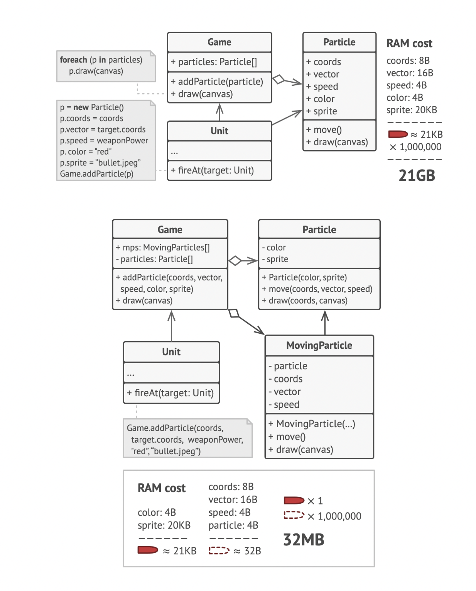
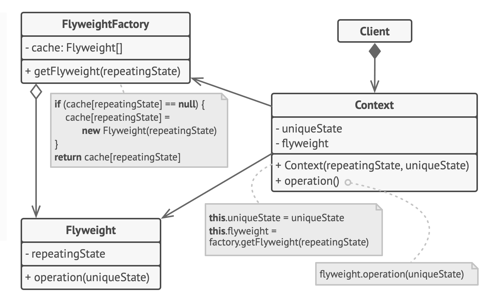

# Flyweight Pattern

> fit more objects into the available amount of RAM by sharing common parts of state between multiple objects instead of keeping all of the data in each object
>
> 참고자료
>
> [refactoring.guru](https://refactoring.guru/design-patterns/flyweight)
>
> head first design patterns 서적

## Problem



- 인스턴스가 매우 많이 생성될 때, 인스턴스 생성 비용이 높은(하지만 모든 인스턴스가 공유하는 uniqueState) 필드가 있다면, 해당 필드는 공유하고 반복되는 state는 cache를 하면 메모리 절약 가능

- 위 예시에서는 20KB를 차지하는 sprite는 공유하고, 반복적으로 생성되어 각 인스턴스에 할당되어야 하는 필드들은 새로 할당

- 이 때, particle, coords, vector, speed를 가진 MovingParticle 인스턴스는 immutable 해야 함

  ```txt
  Since the same flyweight object can be used in different contexts, you have to make sure that its state can’t be modified. A flyweight should initialize its state just once, via constructor parameters. It shouldn’t expose any setters or public fields to other objects.
  ```

  - 동일한 플라이웨이트 객체가 다른 context에서 사용될 수 있으므로 해당 상태를 수정 불가능으로 만들어야 함. 플라이웨이트는 생성자 매개변수를 통해 상태를 한 번만 초기화해야 함. setter나 public field를 다른 객체에 노출해선 안됨

- Flyweight Pattern은 단지 최적화를 위해서 사용해야 함

  - 적용하기 전에 프로그램이 메모리에 유사한 객체를 대량으로 가지고 있어 RAM 소비에 문제가 있는지 확인하여 필요에 따라 적용해야 함

<br>

## UML



- `Flyweight`
  - 여러 인스턴스가 공유하는 Context의 field(uniqueState)를 포함하여 사용 가능
  - 반복적으로 사용되어지는 repeatingState는 flyweight 인스턴스 생성 시 최초에만 초기화

- `Context`
  - 실제 모든 fields(uniqueState & flyweight)를 포함하는 original 객체
  - Client 코드가 의존하는 객체
  - 각 필드들을 초기화하고, 실제 method 행위를 하는 객체

- `FlyweightFactory`
  - flyweight 인스턴스를 cache 하고, 실제 해당 캐시에 접근하는 메서드를 가짐
  - 클라이언트가 direct로 Context에서 해당 객체를 접근하는 것이 아니라, Context에서 flyweightFactory의 메서드를 호출해 cache에 접근하여 캡슐화

<br>

## 코드

```java
public class Context {
    Object uniqueState;
    Flyweight flyweight;

    public Context(Object uniqueState, Flyweight flyweight) {
        this.uniqueState = uniqueState;
        this.flyweight = flyweight;
    }

    public void operation() {
        flyweight.operation(uniqueState);
    }
}

public class FlyweightFactory {
    Map<Object, Flyweight> cache = new HashMap<>();

    public Map<Object, Flyweight> getFlyweight(Object repeatingState) {
        if (cache.get(repeatingState) == null) {
            cache.put(repeatingState, new Flyweight(repeatingState));
        }
        return cache;
    }
}

public class Flyweight {
    Object repeatingState;

    public Flyweight(Object repeatingState) {
    }

    public void operation(Object uniqueState) {
        // do sth..
    }
}
```

<br>

## Pros and Cons

- Pros
  - RAM 용량을 획기적으로 절약 가능
- Cons
  - 누군가 flyweight 메서드를 호출할 때마다 context data 중 일부를 다시 계산해야 하는 경우 코스트 증가
  - 코드 복잡도가 높아짐