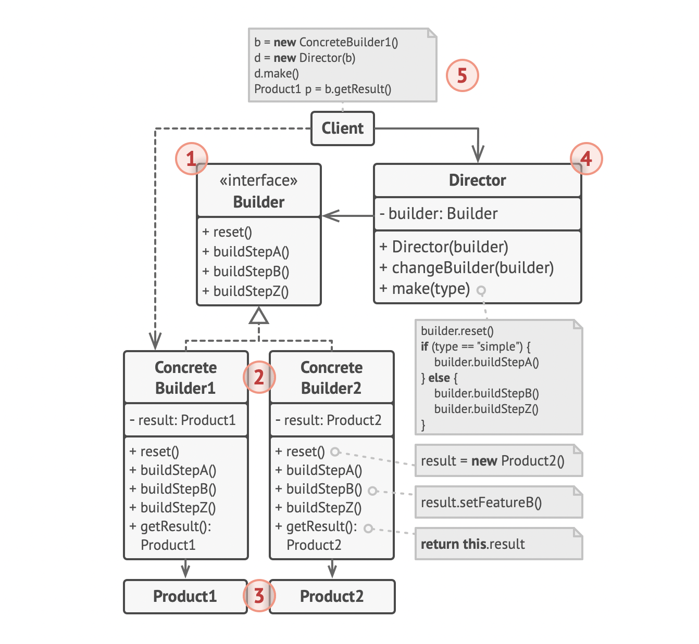

# Builder Pattern

> construct complex objects step by step
>
> 참고자료
>
> - [refactoring.guru](https://refactoring.guru/design-patterns/builder)
> - head first design patterns 서적


## UML



- `Builder`
  - 모든 타입의 builders에 공통적인 construction step을 정의한 인터페이스
- `Concrete Builders`
  - construction steps를 구현하여 customizing
  - 각 step에 대한 개별 설정 가능
- `Products`
  - builder를 통해서 생성된 인스턴스
  - concrete builders의 최종 메서드(보통 build())가 반환하는 타입
- `Director`
  - builder의 구체 타입을 멤버로 갖고, 해당 builder를 이용해 실제 인스턴스를 만드는 클래스

- `Client`
  - concrete builder를 Director 인스턴스 생성 시 주입하여 make() 메서드로 실제 product 인스턴스를 생성하고, 이후 getResult() 메서드를 통해 해당 객체를 얻음


<br>

## 활용 사례

```java
// Car builder 적용
public class Car {

    private final String engine;  // 필수 매개변수
    private final int wheels;     // 필수 매개변수
    private final int seats;
    private final int windows;
    private final int doors;

    private Car(Builder builder) {
        this.engine = builder.engine;
        this.wheels = builder.wheels;
        this.seats = builder.seats;
        this.windows = builder.windows;
        this.doors = builder.doors;
    }

    // builder
    public static class Builder {

        private final String engine;
        private final int wheels;
        private int seats = 4;
        private int windows = 4;
        private int doors = 4;

        public Builder(String engine, int wheels) {
            this.engine = engine;
            this.wheels = wheels;
        }

        public Builder seats(int val) {
            this.seats = val;
            return this;
        }

        public Builder windows(int val) {
            this.windows = val;
            return this;
        }

        public Builder doors(int val) {
            this.doors = val;
            return this;
        }

        public Car build() {
            return new Car(this);
        }
    }
		
    // Client run
    public static void main(String[] args) {
        Car sportsCar = new Car.Builder("default engine", 4)
                .seats(2)
                .windows(2)
                .doors(2)
                .build();
    }
}

```

- 보통 특정 객체의 public static inner class로 빌더 클래스 설정
- builder 클래스를 직접 구현 시 필수 매개변수에 대한 설정 가능
- client가 인스턴스 생성 시 Car.Builder() -> selectFieldMethods() -> build() 메서드 호출

<br>

##### hierarchical builder

```java
/* super class */
public abstract class Pizza {
    public enum Topping { HAM, MUSHROOM, ONION, PEPPER, SAUSAGE }
    final Set<Topping> toppings;

    Pizza(Builder<?> builder) {
        toppings = builder.toppings.clone();
    }
    
    abstract static class Builder<T extends Builder<T>> {
        EnumSet<Topping> toppings = EnumSet.noneOf(Topping.class);
        public T addTopping(Topping topping) {
            toppings.add(Objects.requireNonNull(topping));
            return self();
        }

        abstract Pizza build();

        // 하위 클래스는 self() overriding -> this 반환하게 해야 함
        protected abstract T self();
    }
}

/* sub class - NyPizza */
public class NyPizza extends Pizza {
    public enum Size { SMALL, MEDIUM, LARGE }
    private final Size size;

    public static class Builder extends Pizza.Builder<NyPizza.Builder> {
        private final Size size;

        public Builder(Size size) {
            this.size = Objects.requireNonNull(size);
        }

        @Override public NyPizza build() {
            return new NyPizza(this);
        }

        @Override protected Builder self() { return this; }
    }

    private NyPizza(Builder builder) {
        super(builder);
        size = builder.size;
    }
}

// sub class- Calzone
public class Calzone extends Pizza {
    private final boolean sauceInside;

    public static class Builder extends Pizza.Builder<Builder> {
        private boolean sauceInside = false; // 기본값

        public Builder sauceInside() {
            sauceInside = true;
            return this;
        }

        @Override public Calzone build() {
            return new Calzone(this);
        }

        @Override protected Builder self() { return this; }
    }

    private Calzone(Builder builder) {
        super(builder);
        sauceInside = builder.sauceInside;
    }
}

/* Client */
NyPizza pizza = new NyPizza.Builder(SMALL)
        .addTopping(SAUSAGE)
        .addTopping(ONION).build();

Calzone calzone = new Calzone.Builder()
        .addTopping(HAM).sauceInside().build();
```

- 계층적으로 설계된 클래스에서 builder 만들 시 generics를 이용하여 구현
- 하위 타입을 반환하는 protected abstract self() 메서드를 만들어 하위 클래스가 self()를 구현할 때 this를 반환하게 함
- 공통 재료는 Pizza 클래스에서 정의하고, sub class 들은 자신만의 멤버 필드를 구현하여 사용할 수 있음
- Client는 builder 패턴을 재사용하면서 자신만의 멤버필드를 호출하며 인스턴스 생성 가능

<br>

##### Lombok을 활용한 builder

```java
@Builder
@AllArgsConstructor(access = AccessLevel.PRIVATE)
public class Car {

    private final String engine;
    private final int wheels;
    private final int seats;
    private final int windows;
    private final int doors;

}
        Car car = new CarBuilder()
                .engine("default engine")
                .wheels(4)
                .build();

/* Client */
Car car = new CarBuilder()
        .engine("default engine")
        .wheels(4)
        .build();
```

- Lombok의 Builder annotation을 활용하면 내부적으로 public static CarBuilder 클래스를 생성하여 사용 가능
- 대신 필수 매개변수에 대한 설정 불가능, 개별 필드에 대한 검증 불가능
- AllArgsConstructor 에 대한 accessLevel private 설정하여 builder를 제외하고 클라이언트의 public 생성자 호출 제한

<br>

## Pros and Cons

- Pros
  - 복잡한 생성 단계를 가진 객체를 단계별로(step-by-step) 생성할 수 있음
  - 여러 구체적 표현 방식(various representations)을 갖는 인스턴스를 만들 때 같은 생성자를 재사용 할 수 있음(각 인스턴스 변수가 같고 생성 단계도 유사한데 detail 한 값만 변경이 되는 상황)
  - SRP를 지킴. 복잡한 생성 코드를 비즈니스 로직과 분리
  
- Cons
  - 생성 방식에 맞는 여러 concrete builder 클래스들을 만들어야 할 때 코드 복잡성이 증가
  
    (생성 자체는 client에게 맡기면 새로 클래스를 만들 필요는 없고, 개별 concrete builder를 강제해야 할 때 이러한 단점이 있을 수 있음. 따라서 builder 인터페이스의 단계가 추후에 추가될 때 concrete class도 모두 새로 구현해야 함)
