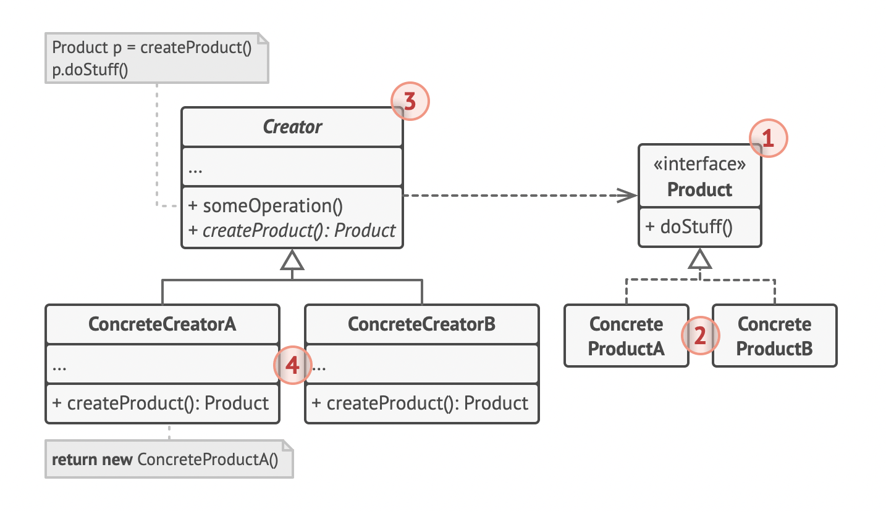

# Factory Method Pattern

> provides an interface for creating objects in a superclass, but allows subclasses to alter the type of objects that will be created
>
> 참고자료
>
> - [refactoring.guru](https://refactoring.guru/design-patterns/factory-method)
> - head first design patterns 서적

<br>

## UML



- `Product`
  - Creator 와 subclass에서 Product Subclasses 인스턴스 생성을 위해 호출하는 공통 메서드를 가짐
  - Creator에서는 Product에서 정의한 공통 메서드를 호출 하여 실제 인스턴스를 생성
- `Concrete Products`
  - Product interface의 세부 구현

- `Creator`
  - 실제 인스턴스를 생성하는 factory method를 정의(생성하고자 하는 인스턴스의 인터페이스인 Product 타입을 리턴)
  - 인스턴스를 생성하는 factory method가 Creator 클래스의 주요 책임은 아니고, 여러 비즈니스 로직 중에 인스턴스를 생성하는 책임이 하나 있는 것

- `Concrete Creators`
  - Creator에서 정의한 factory method를 overriding 하여 구체 클래스에 맞는 인스턴스 생성을 담당
  - factory method가 항상 새로운 인스턴스를 생성할 필요는 없고, 이미 메모리에 존재하는 인스턴스 등을 호출할 때도 사용될 수 있음


<br>

## 코드

```java
public interface Creator {

    Product newInstance();  // factory method

    default void doSomethingOthers() {
        // do something others..
    }
}

public class ConcreteCreator implements Creator {

    @Override
    public Product newInstance() {
        return new ConcreteProduct();
    }
}


public interface Product {

    void stepA();
    void stepB();
    // other steps...
}

public class ConcreteProduct implements Product {

    @Override
    public void stepA() {}

    @Override
    public void stepB() {}
}

```

<br>

## 활용 사례

- 작업해야 하는 객체의 정확한 유형 및 의존성을 모를 때 사용
  - Concrete Product와 실제 해당 인스턴스를 사용하는 코드를 구분하여, 클라이언트 코드에 대한 종속 없이 새로운 concrete product를 확장하기 쉬움
- 라이브러리나 프레임워크 사용자에게 내부 구성 요소를 확장하는 방법을 제공하려는 경우
  - 프레임워크에서 특정 컴포넌트를 생성하는 코드를 단일 팩토리 메서드로 줄이고, 컴포넌트 생성에 대한 메서드 재정의를 누구나 가능하게 만듦
  - UIFramework[creator]에서 createButton() factory method를 정의하고 있다고 가정. Button[product] - SquareButton[concrete product]가 있을 때, subclass인 RoundButton을 만들고 UIWithRoundFramework[concrete creator]를 만들어 createButton() factory method overriding

<br>

## Pros and Cons

- Pros
  - 인스턴스를 생성하는 creator와 실제 인스턴스가 되는 concrete products 클래스와의 커플링을 피할 수 있음
  - SRP: 인스턴스를 product creation 코드를 나눠서 한 곳으로 모을 수 있어 책임 분리
  - OCP: 새로운 타입의 Products를 유연성 있게 추가할 수 있고, 이미 작성한 클라이언트 코드 수정 불필요
  
- Cons
  - subclass가 많아질 때 코드가 비대해질 수 있음
  
    (이미 존재하는 creator 클래스의 계층구조에 패턴을 적용하는 것이 이상적)