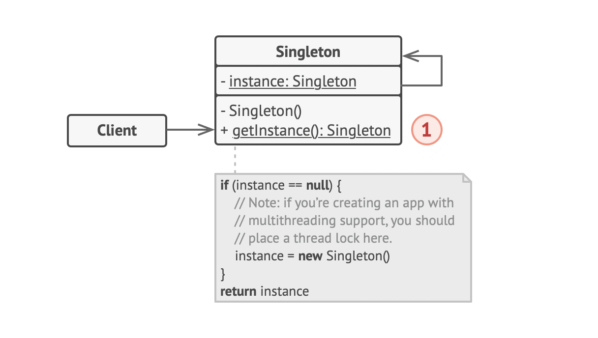

# Singleton Pattern

> a class has only one instance, while providing a global access point to this instance
>
> 참고자료
>
> - [refactoring.guru](https://refactoring.guru/design-patterns/singleton)
> - head first design patterns 서적
> - [java-singleton & spring-singleton](../../spring/spring-singleton.md)

<br>

## UML



- `Singleton`
  - 싱글턴 클래스는 getInstance() 등의 유일한 인스턴스를 반환하는 static 메서드를 가짐
  - 생성자를 private 이라는 access modifier로 선언해 외부에서 호출할 수 없게 함


<br>

## multithread 환경에서의 문제

```java
// bad1
public class Singleton {
    
    private static Singleton INSTANCE;
    
    private Singleton() {}
    
    public static Singleton getInstance() {
        if (INSTANCE == null) {
            INSTANCE = new Singleton();
        }
        return INSTANCE;
    }
}

// bad2
public class Singleton {

    private static Singleton INSTANCE = new Singleton();

    private Singleton() {}

    public static Singleton getInstance() {
        return INSTANCE;
    }
}

// bad3
public class Singleton {
    
    private static Singleton INSTANCE;
    
    private Singleton() {}
    
    public static synchronized Singleton getInstance() {
        if (INSTANCE == null) {
            INSTANCE = new Singleton();
        }
        return INSTANCE;
    }
}
```

- bad1
  - getInstance() 정적 메서드를 호출 시 multithread 환경에서는 각 스레드에서 동시 접근 시 각기 다른 인스턴스를 반환할 수도 있음

- bad2
  - 정적 초기화 시 인스턴스를 생성해버려도 되지만, 인스턴스 생성 비용이 크다면 비효율적

- bad3
  - synchronized 동기화를 하면 getInstance() 메서드를 한 스레드에서 호출 시 다른 스레드는 lock이 걸려 있어 오버헤드 증가
  - 인스턴스 획득에 속도가 중요하지 않다면 synchronized 써도 됨


```java
// good(DCL(Double-Checking Locking))
public class Singleton {

    private volatile static Singleton INSTANCE;

    private Singleton() {}

    public static Singleton getInstance() {
        if (INSTANCE == null) {
            synchronized (Singleton.class) {
                if (INSTANCE == null) {
                    INSTANCE = new Singleton();
                }
            }
        }
        return INSTANCE;
    }
}
```

- INSTANCE가 null 일 때만 동기화를하여 오버헤드를 극적으로 줄일 수 있음
- volatile과 synchronized를 활용
  - volatile은 cpu cache가 아닌 main memory에 저장하므로 성능 이슈가 있고, 동기화 문제를 해결하기 위해서는 synchronized를 같이 써야 함
- since jdk 1.5

<br>

## Pros and Cons

- Pros
  - 클래스가 단 하나의 인스턴스만을 가지는 것을 보장
  - 싱글턴 객체는 처음 요청된 때에만 초기화됨

- Cons
  - SRP(Single Response Principle)을 위반
  - multithread 환경에서 side effect 없이 동작하게 하기 위해 추가 작업 필요
  - client code에서 유닛테스트를 하기가 어려움(여러 테스트 프레임워크는 mock objects를 생성할 때 상속을 많이 사용하는데 싱글턴은 이를 어렵게 만듦)