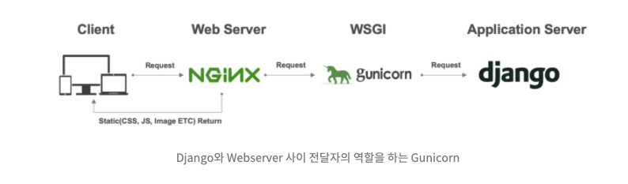

# Django


## 환경설정(macOS 기준)

- 가상환경 설정

  - brew, pyenv, pyenv-virtualenv 설치, 환경변수 설정

  - pyenv

    - python 버전들 확인

      ```bash
      $ pyenv versions  // 현재 설치하거나 설정한 버전들
      $ pyenv install --list  // 설치 가능한 버전 리스트
      ```

    - 특정 버전 설치

      ```bash
      $ pyenv install 3.x.x
      ```

    - 글로벌 설정

      ```bash
      $ pyenv global 3.x.x
      ```

    - 로컬 설정

      ```bash
      // local directory 이동 후 실행
      $ pyenv local 3.x.x
      ```

  - pyenv-virtualenv

    - 파이썬 가상환경 구성

      ```bash
      $ pyenv virtualenv 3.x.x <<virtualenv name>>
      ```

    - 활성화 / 비활성화

      ```bash
      $ pyenv activate <<virtualenv name>>
      $ pyenv deactivate
      ```

  - python으로 자체 가상환경 설정하기

    - 생성

      ```bash
      $ python -m venv <<가상환경명>>
      $ python -m venv .venv
      ```

    - 활성화 / 비활성화

      ```bash
      $ source .venv/scripts/activate
      $ source .venv/scripts/deactivate
      ```

- django version 확인

  ```
  $ python django --version

- django package install or upgrade

  ```bash
  $ pip install --upgrade django
  $ pip install Django
  ```


## WSGI



- WSGI는 파이썬 애플리케이션(파이썬 스크립트)이 웹 서버와 통신하기 위한 인터페이스

- wsgi는 웹서버(예를 들면 NGINX)로부터 요청을 받으면 서버 애플리케이션(Django)로 전달해주는 역할을 함

- Django의 runserver도 같은 역할을 수행하지만 단일 쓰레드로 동작하기 때문에 Request 요청이 많아질 경우 처리 능력이 현저히 떨어져 production 환경에서는 사용할 수 없음

- uwsgi vs gunicorn

  - 이전까지는 uwsgi를 많이 사용했지만, 자원 소모를 많이 하여 상대적으로 무겁다는 이유로 보다 가벼운 qunicorn을 사용하는 추세

  

## Django 프로젝트 시작하기

- .gitignore 설정

- django 프로젝트 시작하기

  ```bash
  $ django-admin startproject <<project name>>
  ```

- django server 시작하기

  > manage.py 파일이 있는 경로에서 실행

  ```bash
  $ python manage.py runserver
  ```

- 의존 package 설치

  - 설치

    ```bash
    $ pip install gunicorn  // wsgi 설치
    ```

  - 패키지 종속성 관리

    ```bash
    $ pip freeze > requirements.txt
    ```

    - requirements.txt 파일 생성을 통해 패키지 종속성 관리

- settings.py 기본 설정

  ```python
  # /settings.py
  
  # environ 설정 또는 default 값 설정(본인에 맞게)
  DATABASES = {
      'default': {
          'ENGINE': 'django.db.backends.postgresql',
          'NAME': os.environ.get('DJANGO_DB_NAME', 'djangosample'),
          'USER': os.environ.get('DJANGO_DB_USERNAME', 'sampleuser'),
          'PASSWORD': os.environ.get('DJANGO_DB_PASSWORD', 'samplesecret'),
          'HOST': os.environ.get('DJANGO_DB_HOST', 'localhost'),
          'PORT': os.environ.get('DJANGO_DB_PORT', '5432'),
      }
  }
  
  
  ```

  

- ##### app 생성하기

  ```bash
  $ python manage.py startapp <<app name>>
  ```

  

## Docker image 만들기

##### 배포용 gunicorn 설정 파일 생성

```python
# ./gunicorn/prod.py

import multiprocessing

bind = '0.0.0.0:8000'
workers = multiprocessing.cpu_count() * 2
timeout = 90
max_requests = 5000
accesslog = '-'
```

- gunicorn package install 후 진행


##### Dockerfile 생성

```yaml
# /Dockerfile

FROM python:3

WORKDIR /app
ADD    ./requirements.txt   /app/
RUN    pip install -r requirements.txt

ADD    ./{YOUR_APP_NAME}   /app/{YOUR_APP_NAME}/
ADD    ./gunicorn       /app/gunicorn/
ADD    ./manage.py      /app/

CMD ["gunicorn", "{YOUR_APP_NAME}.wsgi", "-c", "gunicorn/prod.py"]
```


##### Dockerfile-dev 생성

```yaml
# /compose/django/Dockerfile-dev

FROM python:3

ENV PYTHONUNBUFFERED 0

WORKDIR /app

ADD    requirements.txt    /app/
RUN    pip install -r requirements.txt
```


##### docker-compose.yml 파일 생성

```yaml
# docker-compose.yml

version: '3'

volumes:
  postgres_data: {}

services:
  db:
    image: postgres
    ports:
    	- "5432:5432"
    volumes:
      - postgres_data:/var/lib/postgres/data
    environment:
      - POSTGRES_DB=djangosample
      - POSTGRES_USER=sampleuser
      - POSTGRES_PASSWORD=samplesecret

  django:
    build:
      context: .
      dockerfile: ./compose/django/Dockerfile-dev
    volumes:
      - ./:/app/
    command: ["./manage.py", "runserver", "0:8000"]
    environment:
     - DJANGO_DB_HOST=db
    depends_on:
      - db
    restart: always
    ports:
      - 8000:8000
```


## 파일 시스템

- `__init__.py` 하나의 패키지로 인식할 수 있게 만들어줌
- `asgi.py`
- `settings.py` 해당 django 프로젝트의 모든 설정이 담김
  - INSTALLED_APPS
  - LANGUAGE_CODE : 언어 설정
  
- `urls.py` 
  - path 설정 : `urlpatterns`
- `views.py`
  - app 내에 위치
  - 함수의 첫번째 parameter : 반드시 `request`


## DTL(Django Template Language) Syntax

- ##### Variable

  - {{ variable }}

- ##### Filters

- ##### Tags

- ##### Comments


Variables

Filters

Tags

Comments


pjt 이름으로 쓰면 안되는 것들

request, library 이름들, built-in 함수, '-', test 등..


##  Model

> 웹 어플리케이션의 데이터를 구조화하고 조작하기 위한 도구


##### ORM

- object-Relational-Mapping은 객체 지향 프로그래밍 언어를 사용하여 호환되지 않는 유형의 시스템간에 데이터를 변환하는 프로그래밍 기술

##### Migrations

- makemigrations

  ```bash
  $ python manage.py makemigrations
  ```

  - model을 변경한 것을 기반으로 새로운 마이그레이션(like 설계도)을 만들 때 사용

- migrate

  ```bash
  $ python manage.py migrate
  ```

  - 마이그레이션을 DB에 반영하기 위해 사용
  - 설계도를 실제 DB에 반영하는 과정

  - 모델에서의 변경 사항들과 DB의 스키마가 동기화를 이룸


##### READ

1. all()
2. get()

- 객체가 없으면 DoesNotExist 에러 발생
- 객체가 여러개일 경우 MultipleObjectsReturned 에러 발생
- 위와 같은 특징을 가지고 있기 때문에 unique 혹은 NOT NULL 특징을 가지고 있는 경우에만 사용 가능(pk로 조회)

3. filter()
4. Field lookups

- 


## REST Framework

##### Serialization(직렬화)

- 데이터 구조나 객체 상태를 동일하거나 다른 컴퓨터 환경에 저장하고 나중에 재구성할 수 있는 포맷으로 변환하는 과정
- 예를 들어 DRF의 Serializer는 Django의 Queryset 및 Model Instance와 같은 복잡한 데이터를, JSON, XML 등의 유형으로 쉽게 변환할 수 있는 Python 데이터 타입으로 만들어줌
- DRF의 Serializer는 Django의 Form 및 ModelForm 클래스와 매우 유사하게 작동


## DJango Ubuntu 환경에서 세팅하기

##### Pyenv

- 의존 라이브러리 설치

  ```bash
  $ sudo apt-get update; sudo apt-get install make build-essential libssl-dev zlib1g-dev \
  libbz2-dev libreadline-dev libsqlite3-dev wget curl llvm \
  libncursesw5-dev xz-utils tk-dev libxml2-dev libxmlsec1-dev libffi-dev liblzma-dev
  ```

- pyenv clone

  ```bash
  $  git clone https://github.com/pyenv/pyenv.git ~/.pyenv
  ```

- path 설정

  ```bash
  # for bash
  echo 'export PYENV_ROOT="$HOME/.pyenv"' >> ~/.profile
  echo 'export PATH="$PYENV_ROOT/bin:$PATH"' >> ~/.profile
  echo 'eval "$(pyenv init --path)"' >> ~/.profile
  
  # if your /etc/profile sources ~/.bashrc
  echo 'if command -v pyenv >/dev/null; then eval "$(pyenv init -)"; fi' >> ~/.bashrc 
  ```

- 확인

  ```bash
  $ pyenv -v
  ```

- 설치 가능한 버전 확인

  ```bash
  $ pyenv install --list
  ```

- 특정 버전 설치

  ```bash
  $ pyenv install 3.x.x
  ```

- 글로벌 설정

  ```bash
  $ pyenv global 3.x.x
  ```

- 버전 확인

  ```bash
  $ pyenv versions
  ```


##### 가상환경 설정 및 실행

```bash
$ python -m venv .venv
$ source .venv/bin/activate
```


##### Migrate

```bash
$ python manage.py makemigrations
$ python manage.py migrate
```


## POSTGRES

- 접속

  ```bash
  docker exec -it <<container name or id>> /bin/bash
  $ psql --username={myusername} --dbname={mydbname}
  ```

- 조회

  - `\l` : 데이터베이스 목록 조회

- 특정 database 접속

  ```bash
  <<database_name>>=# \c {database_name}
  ```

- 테이블 생성

  ```bash
  <<database_name>>=# CREATE {TABLE_NAME} ( {attributes...} );
  ```

- 테이블 조회

  ```bash
  <<database_name>>=# SELECT * FROM PG_TABLES;  // 모든 테이블 조회
  <<database_name>>=# SELECT * FROM {TABLE_NAME};  // 특정 테이블 조회
  ```

- volumes

  - 조회 / 상세 조회

    ```bash
    $ docker volume ls
    $ docker volume inspect {volume_id or volume_name}
    ```

    


##### ubuntu 환경에서 postgres role fatal 시

```bash
$ sudo docker exec -it <<container name or id>> /bin/bash
$ psql --username={myusername} --dbname={mydbname}
```

