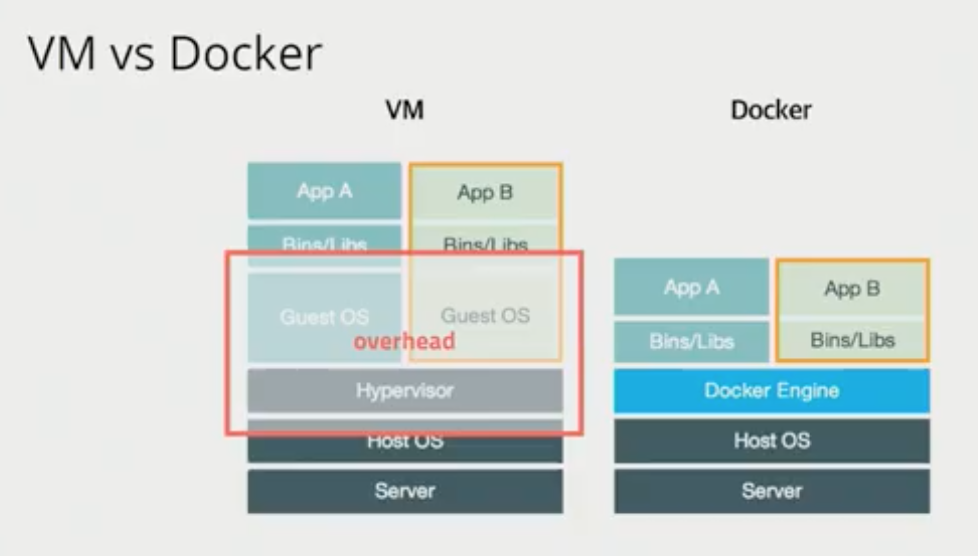

# Docker basic

참고사이트

- [44bit]((https://www.44bits.io/ko/post/almost-perfect-development-environment-with-docker-and-docker-compose))

- [inflearn](https://www.inflearn.com/course/%EB%8F%84%EC%BB%A4-%EC%9E%85%EB%AC%B8)

## 도커란 무엇인가?

- 컨테이너 기반의 오픈소스 가상화 플랫폼

- 서버를 관리한다는 것

  - 서버 관리가 굉장히 복잡하여 환경 설정 등 서버를 구축하는 시점에 따라서 동일한 방식으로 서버를 구축해도 장애가 발생할 가능성이 높음
  - 운영체제, 컴파일러, 설치된 패키지 등 개발 환경이 모두 같을 수는 없음
  - 즉, 서버 환경은 시시각각 변하여 완전히 동일한 서버를 구축하는 것이 어려움

- [서버 관리 방식의 변화(역사)](#서버-관리의-역사)

- 개념

  - 

  - 어떤 프로그램도 컨테이너로 만들 수 있음(MySQL, redis, Jenkins.. 모든 프로그램!)

  - AWS, Azure, Google Cloud 등 어디서든 돌아감

  - 가상머신처럼 독립적으로 실행되지만, 가상머신 보다 빠르고 쉽고 효율적!

  - 자원격리

    - 프로그램 간 독립적으로 운영될 수 있게 하는 것

  - 장점

    - 클라우드 이미지보다 관리하기 쉬움
    - 다른 프로세스와 격리되어 가상머신처럼 사용하지만 성능저하 거의 없음
    - 복잡한 기술(namespace, cgroups, network...)을 몰라도 사용 가능
    - 이미지 빌드 기록 남음
    - 코드와 설정으로 관리 > 재현 및 수정 가능
    - 오픈소스 > 특정 회사 기술에 종속적이지 않음
    - develop - build - ship - run(in docker)

  - 단점

    - 대규모 서비스가 되면 배포 이후 여러 서버 관리가 어려움

      -> Container Orchestration이 필요해짐!

  - Contatiner Orchestration

    - cluster - state - scheduling - rollout/rollback - service discovery - volume
    - deis, rancher, mesos, marathon, nomad 등 여러 서비스가 나왔지만 kubernetes로 표준화됨
    - kubernetes
      - 컨테이너를 쉽고 빠르게 배포/확장하고 관리를 자동화해주는 오픈소스 플랫폼
      - Google이 컨테이너 배포 시스템으로 사용하던 borg를 기반으로 만든 오픈소스 v1.0 release(2015) -> 현재 CLOUD NATIVE에서 관리중
      - container의 미래!!
        - 스케쥴링
          - 컨테이너를 적당한 서버에 배포해 주는 작업
          - 여러 대의 서버 중 가장 할 일 없는 서버에 배포하거나 그냥 차례대로 배포 또는 아예 랜덤하게 배포
          - 컨테이너 개수를 여러 개로 늘리면 적당히 나눠서 배포하고 서버가 죽으면 실행중이던 컨테이너를 다른 서버에 띄워줌
        - 클러스터링
          - 여러 개의 서버를 하나의 서버처럼 사용
          - 작게는 몇 개 안되는 서버부터 많게는 수천 대의 서버를 하나의 클러스터로
          - 여기저기 흩어져 있는 컨테이너도 가상 네트워크를 이용하여 마치 같은 서버에 있는 것처럼 쉽게 통신
        - 서비스 디스커버리
          - 서비스를 찾아주는 기능
          - 클러스터 환경에서 컨테이너는 어느 서버에 생성될지 알 수 없고 다른 서버로 이동할 수도 있음
          - 따라서 컨테이너와 통신을 하기 위해서 어느 서버에서 실행중인지 알아야 하고 컨테이너가 생성되고 중지될 때 어딘가에 IP와 Port 같은 정보를 업데이트해줘야 함
          - 키-벨류 스토리지에 정보를 저장할 수도 있고 내부 DNS 서버를 이용할 수도 있음

- 특징
  - 확장성/이식성
    - 도커가 설치되어 있다면 어디서든 컨테이너를 실행할 수 있음
    - 특정 회사나 서비스에 종속적이지 않음
    - 쉽게 개발서버를 만들 수 있고 테스트서버 생성도 간편함
  - 표준성
    - 도커를 사용하지 않는 경우 개별 언어들로 만든 서비스들의 배포 방식은 제각각 다르지만, 컨테이너라는 표준으로 서버를 배포하므로 모든 서비스들의 배포과정이 동일해짐
  - 이미지
    - 이미지에서 컨테이너를 생성하기 때문에 반드시 이미지를 만드는 과정이 필요
    - Dockerfile을 이용해 이미지를 만들고 처음부터 재현 가능
    - 빌드 서버에서 이미지를 만들면 해당 이미지를 이미지 저장소에 저장하고 운영서버에서 이미지를 불러옴
  - 설정관리
    - 설정은 보통 환경변수로 제어함
    - MYSQL_PASS=password와 같이 컨테이너를 띄울 때 환경변수를 같이 지정
    - 하나의 이미지가 환경변수에 따라 동적으로 설정파일을 생성하도록 만들어져야 함
  - 자원관리
    - 컨테이너는 삭제 후 새로 만들면 모든 데이터가 초기화됨
    - 업로드 파일을 외부 스토리지와 링크하여 사용하거나 S3 같은 별도의 저장소가 필요
    - 세션이나 캐시를 memcached나 redis와 같은 외부로 분리

## 서버 관리의 역사

> 자체 서버 운영 - 상태(설정) 관리 도구 등장(CHEF, ANSIBLE, puppet) - 가상머신 - 클라우드 - PaaS - Docker - Kubernetes - Service Mesh

- 자체 서버 운영

  - 서버 주문 - 서버 설치 - CPU, Memory, HardDisk 조립 - 네트워크 연결 - OS 설치 - 계정설정 - 방화벽 설정...
  - 서버를 설정하기 위해 많은 노력과 시간 필요
  - 성능이 좋은 것을 미리 구매하고 효율적인 사용을 위해 여러 app 설치

- 설정 관리 도구

  - 설정을 script로 만들고 실행시키게 함
  - 문서가 아닌 코드 형식으로 형상 관리
  - 러닝커브가 있고, 한 서버에 다른 버전을 설치 못함

- 가상머신

  - Jenkins, Wordpress, Chat ...
  - 한 서버에 가상머신 여러개 설치 가능
  - 백업 가능
  - 과정을 기록하고 있지 않고, 느리고, 용량이 커 공유가 어려움

- 클라우드

  - AWS, Google Cloud, Azure ...
  - 하드웨어 파편화 문제 해결
  - 가상화된 환경만으로 아키텍쳐 구성이 가능해짐
  - 이미지를 기반으로 다수의 서버 상태 관리
  - 단, 서버 운영의 문제는 잔존

- PaaS

  - Heroku, Netlify, AWS Elastic Beanstalk, Google Cloud App Engine

  - 서버 운영하는 것이 복잡하므로 소스 코드만으로 배포가 가능하게 함

  - 일반화된 provisioning 방법 제공

    (대신 프로비져닝 과정에 개입할 수 없음)

  - 단점

    - application을 PaaS 방식에 맞게 작성해야 함
    - 서버에 대한 원격 접속 시스템을 제공하지 않음
    - 서버에 파일 시스템을 사용할 수 없음
    - Site 패키지를 설치할 수 없음
    - 로그 수집을 제한적인 방식으로 허용(STDOUT)

