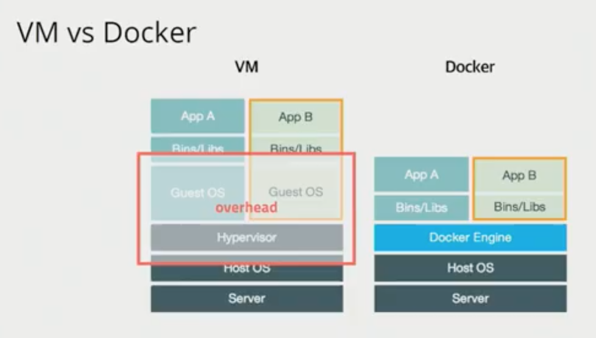

# Docker / Kubernetes

> develop -> git -> CI(test, build) -> CD(deploy) -> server(cloud) -> monitoring(Metrics(cpu, memory..), Log)
>
> AWS - IaC - Container - Orchestration - Monitoring - SRE

## 서버를 관리한다는 것

##### 역사

자체 서버 운영 - 설정 관리 도구 등장(CHEF, ANSIBLE, puppet) - 가상머신 - 클라우드 - PaaS - Docker - Kubernetes - Service Mesh

- 자체 서버 운영

  - 서버 주문 - 서버 설치 - CPU, Memory, HardDist 조립 - 네트워크 연결 - OS 설치 - 계정설정 - 방화벽 설정...
  - 서버를 설정하기 위해 많은 노력과 시간 필요
  - 성능이 좋은 것을 미리 구매하고 효율적인 사용을 위해 여러 app 설치

- 설정 관리 도구

  - 설정을 script로 만들고 실행시키게 함
  - 문서가 아닌 코드 형식으로 형상 관리
  - 러닝커브가 있고, 한 서버에 다른 버전을 설치 못함

- 가상머신

  - Jenkins, Wordpress, Chat ...
  - 한 서버에 가상머신 여러개 설치 가능
  - 백업 가능
  - 과정을 기록하고 있지 않고, 느리고, 용량이 커 공유가 어려움

- 클라우드

  - AWS, Google Cloud, Azure ...
  - 하드웨어 파편화 문제 해결
  - 가상화된 환경만으로 아키텍쳐 구성이 가능해짐
  - 이미지를 기반으로 다수의 서버 상태 관리
  - 단, 서버 운영의 문제는 잔존

- PaaS

  - Heroku, Netlify, AWS Elastic Beanstalk, Google Cloud App Engine

  - 서버 운영하는 것이 복잡하므로 소스 코드만으로 배포가 가능하게 함

  - 일반화된 provisioning 방법 제공

    (대신 프로비져닝 과정에 개입할 수 없음)

  - 단점

    - application을 PaaS 방식에 맞게 작성해야 함
    - 서버에 대한 원격 접속 시스템을 제공하지 않음
    - 서버에 파일 시스템을 사용할 수 없음
    - Site 패키지를 설치할 수 없음
    - 로그 수집을 제한적인 방식으로 허용(STDOUT)

## Docker

- 어떤 프로그램도 컨테이너로 만들 수 있음(MySQL, redis, Jenkins.. 모든 프로그램!)

- AWS, Azure, Google Cloud 등 어디서든 돌아감

- 가상머신처럼 독립적으로 실행되지만, 가상머신 보다 빠르고 쉽고 효율적!

- 자원격리

  - 프로그램 간 독립적으로 운영될 수 있게 하는 것

- 장점

  - 클라우드 이미지보다 관리하기 쉬움
  - 다른 프로세스와 격리되어 가상머신처럼 사용하지만 성능저하 거의 없음
  - 복잡한 기술(namespace, cgroups, network...)을 몰라도 사용 가능
  - 이미지 빌드 기록 남음
  - 코드와 설정으로 관리 > 재현 및 수정 가능
  - 오픈소스 > 특정 회사 기술에 종속적이지 않음
  - develop - build - ship - run(in docker)

- 단점

  - 대규모 서비스가 되면 배포 이후 여러 서버 관리가 어려움

    -> Container Orchestration이 필요해짐!

- Contatiner Orchestration

  - cluster - state - scheduling - rollout/rollback - service discovery - volume
  - deis, rancher, mesos, marathon, nomad 등 여러 서비스가 나왔지만 kubernetes로 표준화됨

## kubernetes

> 컨테이너를 쉽고 빠르게 배포/확장하고 관리를 자동화해주는 오픈소스 플랫폼. 

- Google이 컨테이너 배포 시스템으로 사용하던 borg를 기반으로 만든 오픈소스 v1.0 release(2015) -> 현재 CLOUD NATIVE 에서 관리 중

## DevOps 엔지니어

- 서비스를 배포하고 지원 + 모니터링
- 배포 파이프라인 구성
- 더 자주 더 빠른 릴리즈
- Cloud(AWS, Google Cloud, Azure,) / Cloud Native
- 컨테이너(Docker, Kubernetes...)
- 보안 Network, IAM, Service Mesh
- 장애 대응
- IaC - 테라폼
- SRE - SLI, SLO
- 외부 서비스 - DataDog, NewRelic

https://roadmap.sh/devops

10주 DevOps 스터디

- 1주 : Terraform을 이용하여 AWS VPC 만들기
- 2주 : 도커(컨테이너)로 서버 관리하기
- 3주 : 자동 빌드 & 자동 배포(CI/CD)
- 4주 : 배포 알림 / 채팅 봇 만들기
- 5주 : 쿠버네티스와 함께하는 컨테이너 오케스트레이션
- 6주 : AWS EKS 본격 설정
- 7주 : 모니터링
- 8주 : 로그 수집
- 9주 : 배포 최적화
- 10주 : 서비스메시(+보안)