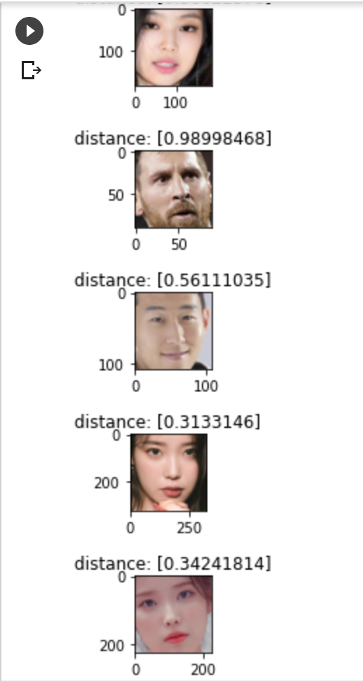

# Google Colab 기반 Face Recognition 입문

> 목표
>
> - Google Colab 기본 사용법 학습
> - Python 코드의 GPU 가속 적용 실행 > Google Drive와 연동해 수행결과를 읽고 쓰기
> - OpenCV 라이브러리 학습
> - OpenCV API 사용한 이미지 처리
> - face_recognition package 사용한 얼굴인식 기능 개발


## Google Colab ?

- Google Colab(oratory)은 Jupyter Notebook이 실행되는 PC의 로컬 리소르를 사용하는 것과 달리 소스코드를 Google의 클라우드 컴퓨팅 환경에서 제공되는 CPU / GPU / TPU를 사용해 실행시킬 수 있고, 소스코드나 데이터를 Google Drive를 통해 불러오거나 저장할 수 있는 개발 환경
- Cloud 기반이므로 별도 설치과정이 필요 없으며 딥러닝, M/L, 데이터 사이언스 분야에서 널리 사용


## Colab - Drive 연동

- Google Drive에 파일 추가
- 해당 파일을 앱에서 열기 - Google Colab 선택

- `<>` code snippet을 통해 샘플 코드 사용


## GPU 가속 비교

CPU와 GPU를 비교하였을 때 약 35배의 차이가 있었다.

```python
import tensorflow as tf
import timeit

device_name = tf.test.gpu_device_name()

def cpu():
  with tf.device('/cpu:0'):
    random_image_cpu = tf.random.normal((100, 100, 100, 3))
    net_cpu = tf.keras.layers.Conv2D(32, 7)(random_image_cpu)
    return tf.math.reduce_sum(net_cpu)

def gpu():
  with tf.device('/device:GPU:0'):
    random_image_gpu = tf.random.normal((100, 100, 100, 3))
    net_gpu = tf.keras.layers.Conv2D(32, 7)(random_image_gpu)
    return tf.math.reduce_sum(net_gpu)
  
cpu()
gpu()

# Run the op several times.
print('Time (s) to convolve 32x7x7x3 filter over random 100x100x100x3 images '
      '(batch x height x width x channel). Sum of ten runs.')
print('CPU (s):')
cpu_time = timeit.timeit('cpu()', number=10, setup="from __main__ import cpu")
print(cpu_time)
print('GPU (s):')
gpu_time = timeit.timeit('gpu()', number=10, setup="from __main__ import gpu")
print(gpu_time)
print('GPU speedup over CPU: {}x'.format(int(cpu_time/gpu_time)))
```

```python
# 실행결과
Time (s) to convolve 32x7x7x3 filter over random 100x100x100x3 images (batch x height x width x channel). Sum of ten runs.
CPU (s):
3.862475891000031
GPU (s):
0.10837535100017703
GPU speedup over CPU: 35x
```


## Colab에서 OpenCV 라이브러리를 사용한 그래픽 처리

https://docs.opencv.org/master/dc/da5/tutorial_py_drawing_functions.html

##### cv2 method

- cv2.shape-method(canvas, arg1, arg2, color, thickness)
  - shape-method: line, rectangle, ellipse, putText etc.

  - canvas: The canvas where you want to draw the shapes

  - arg1, arg2: shape-method에 따라 필요한 값 전달

  - thickness: 굵기 값, default=1, circle에 가까운 모양일 경우 -1

    

```python
import cv2
import numpy as np
from matplotlib import pyplot as plt

# 이미지 버퍼 생성
buffer = np.full((512,512,3), 255, np.uint8)

# 이미지 버퍼 가공
# cv2.line(buffer, (123,0), (123,128), (0,255,0), 3)
# cv2.rectangle(buffer, (200, 200), (300,300), (0,255,0), 3)
# cv2.circle(buffer, (447, 63), 63, (0,255,0), -1)
# cv2.ellipse(buffer, (256,256), (100,50), 0, 0, 180, 255, -1)
font = cv2.FONT_HERSHEY_SIMPLEX
cv2.putText(buffer,'OpenCV',(10,500), font, 4, (100,123,55), 2,  cv2.LINE_AA)

# 이미지 버퍼 출력
plt.imshow(buffer)
plt.show()
```


## face_recognition package 사용한 얼굴인식 기능 개발

##### Google Drive 연동

- execute 'open files from google drive snippet '

#####  install face_recognition package

- ```python
  pip install face_recognition
  ```


##### face_recognition 기본 실행

```python
# 필요 library import
import cv2, os
import face_recognition as fr
from IPython.display import image, display
from matplotlib import pyplot as plt

image_path = '/gdrive/My Drive/colab/src/people.jpg'
image = fr.load_image_file(image_path)
face_locations = fr.face_location(image)

for (top, right, bottom, left) in face_locations:
  cv2.rectangle(image, (left, top), (right, bottom), (0,255,0), 3)

# 이미지 버퍼 출력
plt.rcParams['figure_figsize'] = (16,16)
plt.imshow(image)
plt.show()
```


##### face_recognition 개별 인물 인식 및 encoding 값 기준 distance 비교

- 개별 인물의 face_image를 인식하여 encoding

- fr.face_distance()의 파라미터로 두 인물의 encoding data를 전달해 두 사진간의 distance를 확보

- distance가 0.6 이상이면 타인, 미만이면 동일인으로 판단할 수 있음

  (더 정확하게 하고 싶다면 기준점을 0.5로 낮춤)

- 실행

  - 개별 인물들의 이미지를 known_person_list에 추가

    ```python
    plt.rcParams['figure.figsize'] = (1,1)
    
    known_person_list = []
    known_person_list = []
    known_person_list.append(fr.load_image_file('/gdrive/My Drive/colab/src/person1.jpg'))
    known_person_list.append(fr.load_image_file('/gdrive/My Drive/colab/src/person2.jpeg'))
    known_person_list.append(fr.load_image_file('/gdrive/My Drive/colab/src/person3.jpg'))
    known_person_list.append(fr.load_image_file('/gdrive/My Drive/colab/src/person4.jpg'))
    known_person_list.append(fr.load_image_file('/gdrive/My Drive/colab/src/person5.jpeg'))
    ```

  - 얼굴을 인식하여 감지된 부분을 잘라낸 다음 known_face_list에 저장

    ```python
    known_face_list = []
    for person in known_person_list:
      
      # 얼굴 좌표를 알아내서 잘라냄
      top, right, bottom, left = fr.face_locations(person)[0]
      face_image = person[top:bottom, left:right]
    
      # knwon_face_list에 잘라낸 face_image를 저장
      known_face_list.append(face_image)
    ```

  - known_face_list에 저장된 얼굴 출력

    ```python
    # knwon_face_list에 저장된 얼굴 출력
    for face in known_face_list:
      plt.imshow(face)
      plt.show()
    ```

  - 비교할 unknown image의 얼굴을 잘라내 출력

    ```python
    # 기존 리스트에 없는 새로운 파일 open
    unknown_person = fr.load_image_file('/gdrive/My Drive/colab/src/unknown.jpg')
    
    # 얼굴 좌표를 알아내서 잘라냄
    top, right, bottom, left = fr.face_locations(unknown_person)[0]
    unknown_face = unknown_person[top:bottom, left:right]
    
    # unknown_face 라는 타이틀을 붙여서 표시
    plt.title('unknown_face')
    plt.imshow(unknown_face)
    plt.show()
    ```

  - unknown_face encoding

    ```python
    # unknown_person_face를 인코딩
    enc_unknown_face = fr.face_encodings(unknown_face)
    
    # 화면에 표시
    plt.imshow(enc_unknown_face)
    plt.show()
    ```

  - 등록된 얼굴리스트와 비교해 distance 수치와 함께 출력

    ```python
    #등록된 얼굴리스트를 비교
    for face in known_face_list:
    
      # 등록된 얼굴을 128-dimensional face 인코딩
      enc_known_face = fr.face_encodings(face)
    
      # 등록된 얼굴과 새로운 얼굴의 distance 얻기
      distance = fr.face_distance(enc_known_face, enc_unknown_face[0])
    
      # distance 수치를 포함한 얼굴 출력
      plt.title('distance: ' + str(distance))
      plt.imshow(face)
      plt.show()
    ```


##### 결과

