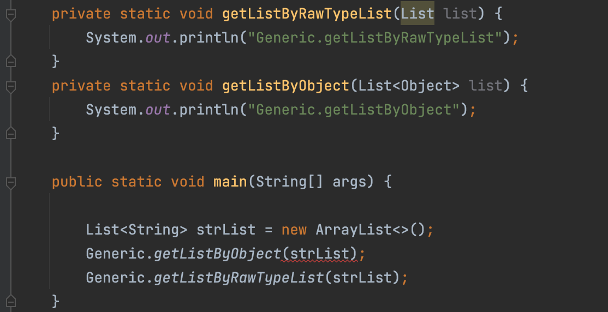

# 제네릭

> [ITEM 26. RAW 타입은 사용하지 말라](#ITEM-26.-RAW-타입은-사용하지-말라)
>
> [ITEM 27. 비검사 경고를 제거하라](#ITEM-27.-비검사-경고를-제거하라)
>
> [ITEM 28. 배열보다는 리스트를 사용하라](#ITEM-28.-배열보다는-리스트를-사용하라)
>
> [ITEM 29. 이왕이면 제네릭 타입으로 만들라](#ITEM-29.-이왕이면-제네릭-타입으로-만들라)
>
> [ITEM 30. 이왕이면 제네릭 메서드로 만들라](#ITEM-30.-이왕이면-제네릭-메서드로-만들라)
>
> [ITEM 31. 한정적 와일드카드를 사용해 API 유연성을 높이라](#ITEM-31.-한정적-와일드카드를-사용해-API-유연성을-높이라)
>
> [ITEM 32. 제네릭과 가변인수를 함께 쓸 때는 신중하라](#ITEM 32.-제네릭과-가변인수를-함께-쓸-때는-신중하라)
>
> [ITEM 33. 타입 안전 이종 컨테이너를 고려하라](#ITEM-33.-타입-안전-이종-컨테이너를-고려하라)

- 제네릭(generic)은 자바 5부터 사용(제네릭 지원 전에는 컬렉션에서 객체를 꺼낼 때마다 형변환 해야 했음)
- 제네릭을 사용하면 컬렉션이 담을 수 있는 타입을 컴파일러에 알려주게 됨
- 그래서 컴파일러는 알아서 형변환 코드를 추가할 수 있고, 엉뚱한 타입의 객체를 넣으려는 시도를 컴파일 과정에서 차단하여 더 안전하고 명확한 프로그램을 만들어줌
- 꼭 컬렉션이 아니더라도 이러한 이점을 누릴 수 있으나, 코드가 복잡해진다는 단점이 따라오는데, 이번 장에서는 제네릭의 이점을 최대로 살리고 단점을 최소하하는 방법을 이야기함

<br>

## ITEM 26. RAW 타입은 사용하지 말라

> - 클래스와 인터페이스 선언에 타입 매개변수(type parameter)가 쓰이면 이를 제네릭 클래스 혹은 제네릭 인터페이스라 함
> - 예컨데 List 인터페이스는 원소의 타입을 나타내는 타입 매개변수 E를 받음
> - 그래서 이 인터페이스의 완전한 이름은 List\<E>지만, 짧게 List라고도 자주 씀
> - 제네릭 클래스와 제네릭 인터페이스를 통틀어 **제네릭 타입(generic type)**이라 함

##### generics

- 각각의 제네릭 타입은 일련의 매개변수화 타입(parameterized type)을 정의
- 먼저 클래스(혹은 인터페이스) 이름이 나오고, 이어서 꺽쇠괄호 안에 실제 타입 매개변수들을 나열
  - List\<String>은 원소의 타입이 String인 리스트를 뜻하는 매개변수화 타입
  - String이 정규(formal) 타입 매개변수 E에 해당하는 실제(actual) 타입 매개변수

##### raw type

- 제네릭 타입을 하나 정의하면 그에 딸린 로 타입(raw type)도 함께 정의됨

  - raw type: 제네릭 타입에서 타입 매개변수를 전혀 사용하지 않을 때를 말함(e.g. List\<E>의 로 타입은 List)

- 로 타입은 타입 선언에서 제네릭 타입 정보가 전부 지워진 것처럼 동작하는데, 제네릭이 도입되기 전 코드와 호환되도록 하기 위한 궁여지책

  ```java
  // Stamp 인스턴스만 취급한다.
  private final Collection stamps = ...;
  
  // runtime 시점에 캐스팅 되지 않는 ClassCastException 발생
  for (Iterator i = stamps.iterator(); i.hasNext();) {
      Stamp stamp = (Stamp) i.next();  // ClassCastException
      stamp.cancel();
  }
  ```

  - 컬렉션의 로 타입으로 사용해선 안됨
  - 오류는 가능한 한 발생 즉시, 이상적으로는 컴파일 시점에 발견하는 것이 좋음
  - 위 오류 예시에서는 런타임에 문제가 발생하고, 'Stamp 인스턴스만 취급한다'는 주석도 컴파일러가 이해하지 못하므로 별 도움이 되지 않음

##### generic 활용

```java
private final Collection<Stamp> stamps = ...;
```

- 컴파일러는 stamps에 Stamp의 인스턴스만을 넣어야 함을 인지
  - 아무런 경고 없이 컴파일된다면 의도대로 동작할 것임을 보장(다만 컴파일 경고를 숨기지 않았어야 함)

- 컴파일러는 컬렉션에서 원소를 꺼내는 모든 곳에 보이지 않는 형변환을 추가하여 절대 실패하지 않을 것임을 보장

- raw type은 절대 사용하면 안됨
  - raw type을 쓰면 제네릭이 안겨주는 안전성과 표현력을 모두 잃게 됨
  - 자바 5버전 이하의 호환성 때문에 만들어 놓았을 뿐 쓰면 안됨
    - 마이그레이션을 위해 로 타입을 지원하고, 제네릭 구현에는 소거(erasure; item28) 방식을 사용하기로 함

##### 예시1

List 같은 raw type은 사용해서는 안되나, List\<Object> 처럼 임의 객체를 허용하는 매개변수화 타입은 괜찮음

- List\<Object>는 모든 타입을 허용한다는 의사를 컴파일러에 명확히 전달한 것

- List\<String>은parameter로 List를 받는 메서드에는 전달 가능하지만, Object 타입을 받는 메서드에는 전달 불가

  - 제네릭의 하위 타입 규칙(item28): List\<String>은 raw type인 List의 하위 타입이지만, List\<Object>의 하위 타입은 아님

    

##### 예시2

2개의  집합(Set)을 받아 공통 원소를 반환하는 메서드

```java
// bad
// 동작은 하지만 로 타입을 사용해 안전하지 않음
static int numElementsInCommon(Set s1, Set s2) {
    int result = 0;
    for (Object o1 : s1) {
        if (s2.contains(o1)) {
            result++;
        }
    }
    return result;
}

// good
// 비한정적 와일드카드 타입(unbounded wildcard type) 사용
static int numElementsInCommon(Set<?> s1, Set<?> s2) { ... }
```

- 비한정적 와일드카드 타입(unbounded wildcard type)

  - 제네릭 타입을 쓰고 싶지만 실제 타입 매개변수가 무엇인지 신경 쓰고 싶지 않을 때 '?' 사용

  - 제네릭 타입 `Set<E>`의 비한정적 와일드카드 타입은 `Set<?>`

    - 어떤 타입이라도 담을 수 있는 가장 범용적인 매개변수화 Set 타입

  - raw type `Set`과의 차이

    - 와일드카드 타입은 안전하고, 로 타입은 안전하지 않음

    - 로 타입 컬렉션에는 아무 원소나 넣을 수 있으니 타입 불변식을 훼손하기 쉬움

    - Collection<?>에는 (null 외에는) 어떤 원소도 넣을 수 없음

      ```java
      static int numElementsInCommon2(Set<?> s1, Set<?> s2) {
      	s1.add("verboten"); // compile error
      }
      ```

      - null 이외에는 어떤 타입도 넣을 수 없게 함
      - 제약에서 벗어나기 위해선 제네릭 메서드나 한정적 와일드카드 타입을 사용해야 함(item 30,31)

##### raw type 을 쓰지 말라는 규칙 이외의 예외

- class 리터럴에는 로 타입을 써야 함

  - 자바 명세에는 class 리터럴에 매개변수화 타입을 사용하지 못하게 함(배열과 기본타입은 허용)
  - List.class, String[].class, int.class는 허용
  - List\<String>.clas, List\<?>.class 허용하지 않음

- instanceof 연산자는 비한정적 와일드카드 타입 외의 매개변수화 타입에는 적용할 수 없음

  - 런타임에는 제네릭 타입 정보가 지워지므로

  - 로 타입이든 비한정적 와일드카드 타입이든 instanceof는 완전히 똑같이 동작하므로, 꺽쇠괄호와 물음표는 아무런 역할 없이 코드만 지저분하게 만드므로, 차라리 로 타입을 쓰는 것이 깔끔

    ```java
    //ok
    if (o instanceof Set) {  // 로 타입
        Set<?> s = (Set<?>) o;  // 와일드카드 타입
    }
    ```

##### 용어

- 매개변수화 타입(parameterized type): `List<String>`
- 실제 타입 매개변수(actual type parameter): `String`
- 제네릭 타입(generic type): `List<E>`
- 정규 타입 매개변수(formal type parameter): `E`
- 비한정적 와일드카드 타입(unbounded wildcard type): `List<?>`
- 로 타입(raw type): List
- 한정적 타입 매개변수(bounded type parameter): `<E extend Number>`
- 재귀적 타입 한정(recursive type bound): `<T extends Comparable<T>>`
- 한정적 와일드카드 타입(bounded wildcard type): `List<? extends Number>`
- 제네릭 메서드(generic method): `static <E> List<E>`, `asList(E[] a)`
- 타입 토큰(type token): `String.class`

<br>

## ITEM 27. 비검사 경고를 제거하라

> 비검사 경고를 모두 제거하라, 그리하면 코드는 타입 안정성이 보장된다!
>
> (runtime에 ClassCastException이 발생할 일이 없음)

##### 종류

- 비검사 형변환 경고(unchecked conversion)

  ```java
  // unchecked conversion (javac -Xlint:uncheck 설정 시)
  private Set<Lark> exaltation = new HashSet();
  
  // since jdk 7
  // 다이아몬드 연산자만으로 해결 가능(올바른 실제 타입 매개변수 추론)
  private Set<Lark> exaltation = new HashSet<>();
  ```

- 비검사 메서드 호출 경고

- 비검사 매개변수화 가변인수 타입 경고

- 비검사 변환 경고

##### @SuppressWarnings("unchecked")

- 경고를 제거할 수 없지만 타입 안전하다고 확신할 수 있다면 애너테이션을 달아 경고를 숨기자

- 개별 지역번수 선언부터 클래스 전체까지 어떤 선언에도 달 수 있음

- **가능한 한 좁은 범위에 적용하라**

  - 보통은 변수 선언, 아주 짧은 메서드, 생성자 등
  - 가칫 심각한 경고를 놓칠 수 있으니 절대로 클래스 전체에 적용해서는 안됨

- 한 줄이 넘는 메서드나 생성자에 애너테이션이 있으면 지역변수 선언 쪽으로 옮기자

  ```java
  public <T> T[] toArray(T[] a) {
      if (a.length < size) {
          // 생성한 배열과 매개변수로 받은 배열의 타입이 모두 T[]로 같으므로 올바른 형변환
          @SuppressWarnings("unchecked")
          T[] result = (T[]) Arrays.copyOf(elements, size, a.getClass());
          return result;
      }
  
      if (a.length > size) {
          a[size] = null;
      }
      
      return a;
  }
  ```

  - return 문에는 @SuppressWarnings 애너테이션을 다는 게 불가능함
  - 메서드 전체에 달고 싶지만, 범위가 필요 이상으로 넓어지므로 반환값을 담을 지역변수를 선언하고 그 변수에 애너테이션을 달아줌
  - **경고를 무시해도 안전한 이유를 항상 주석으로 남겨야 함**

<br>

## ITEM 28. 배열보다는 리스트를 사용하라

##### 배열과 제네릭 타입의 차이점

- 첫번째, 배열은 공변(covariant), 제네릭은 불공변(invariant)

  - Sub가 Super의 하위타입이라면 배열 Sub[]는 배열 Super[]의 하위 타입이 됨(공변, 즉 함께 변한다는 뜻)

  - 제네릭은 Type1, Type2가 있을 때 List\<Type1>은 List\<Type2>의 하위타입도 아니고 상위 타입도 아님

  - 예시

    - 배열

      ```java
      Object[] objectArray = new Long[1];
      objectArray[0] = "타입이 달라 넣을 수 없다";
      ```

      - runtime 실패

      - ArrayStoreException 발생

    - 제네릭

      ```java
      List<Object> ol = new ArrayList<Long>();
      ol.add("타입이 달라 넣을 수 없음");
      ```

      - compile 실패

- 두번째, 배열은 실체화(reify), 제네릭은 타입정보가 런타임에 소거(erasure)

  - 배열은 런타임에도 자신이 담기로 한 원소의 타입을 인지하고 확인
    - 위 예시에서 보듯 Long 배열에 String을 넣으려 하면 ArrayStoreException 발생
  - 반면 제네릭은 타입 정보가 런타임에는 소거(erasure)
    - 원소 타입을 컴파일타임에만 검사하며 런타임에는 알 수조차 없음
    - 소거는 제네릭이 지원되기 전의 레거시 코드와 제네릭 타입을 함께 사용할 수 있게 해주는 메커니즘

##### 실체화 불가 타입(non-refiable type)

> E, List\<E>, List\<String> 같은 타입

- 배열은 제네릭 타입, 매개변수화 타입, 타입 매개변수로 사용할 수 없음
  - new List\<E>[], List\<String>[], new E[] 식으로 작성하면 컴파일 시 제네릭 배열 생성 오류를 일으킴
  - 제네릭 배열을 만들지 못하게 막은 이유
    - 타입 안전하지 않음
    - 만약 이를 허용한다면 컴파일러가 자동 생성한 형변환 코드에서 런타임에 ClassCastException이 발생할 수 있음
    - 이는 런타임에 ClassCastException이 발생하는 일을 막아주겠다는 제네릭 타입 시스템의 취지에 어긋나는 것

- 실체화되지 않아서 런타임에는 컴파일타임보다 타입 정보를 적게 가지는 타입

- 소거 메커니즘 때문에 매개변수화 타입 가운데 실체화될 수 있는 타입은 `List<?>와 Map<?, ?>` 같은 비한정적 와일드카드 타입 뿐임

  (배열을 비한정적 와일드카드 타입으로 만들 수는 있지만 유용하게 쓸일 일은 거의 없음)

- 배열을 제네릭 타입으로 만들 수 없어 귀찮을 때도 있음

  - 제네릭 컬렉션에서는 자신의 원소 타입을 담은 배열을 반환하는 게 보통은 불가능(완벽하지는 않지만 대부분의 상황에서 이 문제를 해결해주는 방법은 item 33 참고)
  - 제네릭 타입과 가변인수 메서드(varargs method, item53)을 함께 쓰면 해석하기 어려운 경고 메시지를 받게 됨
    - 가변인수 메서드를 호출할 때마다 가변인수 매개변수를 담을 배열이 하나 만들어지는데, 이 때 그 배열의 원소가 실체화 불가 타입이라면 경고가 발생
    - `@SafeVarargs` 애너테이션으로 대처 가능(item32)

- 배열로 형변환할 때 제네릭 배열 생성 오류나 비검사 형변환 경고가 뜨는 경우 대부분은 배열인 E[] 대신 컬렉션인 List\<E>를 사용하면 해결

  - 코드가 조금 복잡해지고 성능이 살짝 나빠질 수도 있지만, 그 대신 타입 안전성과 상호운용성은 좋아짐

- 예시

  - 제네릭을 적용하지 않은 클래스

    ```java
    public class Chooser {
    
        private final Object[] choiceArray;
    
        public Chooser(Collection choices) {
            this.choiceArray = choices.toArray();
        }
    
        public Object choose() {
            Random random = ThreadLocalRandom.current();
            return choiceArray[random.nextInt(choiceArray.length)];
        }
    }
    ```

    - choose 메서드를 호출할 때마다 반환된 Object를 원하는 타입으로 형변환해야 함

    - 혹시나 타입이 다른 원소가 들어 있었다면 런타임에 형변환 오류가 남

  - 제네릭 적용1: 컴파일 오류

    ```java
    class GenericChooser<T> {
        private final T[] choiceArray;
    
        public GenericChooser(Collection<T> choices) {
            this.choiceArray = choices.toArray();  // error
        }
    }
    ```

    - choices.toArray() 에서 Object[] cannot be converted to T[] error 발생

  - 제네릭 적용2

    ```java
    class GenericChooser<T> {
        private final T[] choiceArray;
    
        public GenericChooser(Collection<T> choices) {
            this.choiceArray = (T[]) choices.toArray();
        }
      
        public T choose() {
            Random random = ThreadLocalRandom.current()
                    return choiceArray[random.nextInt(choiceArray.length)];
        }
    }
    ```

    - T가 무슨 타입인지 알 수 없으니 컴파일러는 형변환이 런타임에도 안전한지 보장할 수 없음([unchecked] unchecked cast)

    - 동작은 하지만 컴파일러가 안전을 보장하지 못할 뿐이므로, 안전하다고 확신한다면 주석을 남기고 애너테이션을 달아 경고를 숨겨도 됨

  - 제네릭 적용3

    ```java
    class GenericListChooser<T> {
    
        private final List<T> choiceArray;
    
        public GenericListChooser(Collection<T> choices) {
            this.choiceArray = new ArrayList<>(choices);
        }
    
        public T choose() {
            Random random = ThreadLocalRandom.current();
            return choiceArray.get(random.nextInt(choiceArray.size()));
        }
    }
    ```
  
    - 배열 대신 리스트를 쓰면 Chooser는 오류나 경고 없이 컴파일 됨
  - 코드양이 조금 늘고 더 느릴테지만, 런타임에 ClassCastException을 만날 일이 없으니 그만한 가치가 있음

<br>

## ITEM 29. 이왕이면 제네릭 타입으로 만들라

##### Object 타입을 활용한 Stack class

```java
public class Stack {

    private Object[] elements;
    private int size = 0;
    private static final int DEFAULT_INITIAL_CAPACITY = 16;

    public Stack() {
        elements = new Object[DEFAULT_INITIAL_CAPACITY];
    }

    public void push(Object e) {
        ensureCapacity();
        elements[size++] = e;
    }

    public Object pop() {
        if (size == 0) {
            throw new EmptyStackException();
        }
        Object result = elements[--size];
        elements[size] = null;
        return result;
    }

    public boolean isEmpty() {
        return size == 0;
    }

    private void ensureCapacity() {
        if (elements.length == size) {
            elements = Arrays.copyOf(elements, 2 * size +1);
        }
    }
}
```

- 위 클래스는 원래 제네릭 타입이어야 마땅함
- Object 타입을 사용할 때 클라이언트는 스택에서 꺼낸 객체를 형변환해야 하는데, 이 때 런타임 오류가 날 위험이 있음

<br>

##### Generic 이용한 Stack class

```java
public class Stack<E> {

    private E[] elements;
    private int size = 0;
    private static final int DEFAULT_INITIAL_CAPACITY = 16;

    public Stack() {
        elements = (E[]) new Object[DEFAULT_INITIAL_CAPACITY];
    }

    public void push(E e) {
        ensureCapacity();
        elements[size++] = e;
    }

    public E pop() {
        if (size == 0) {
            throw new EmptyStackException();
        }
        E result = elements[--size];
        elements[size] = null;
        return result;
    }

    public boolean isEmpty() {
        return size == 0;
    }

    private void ensureCapacity() {
        if (elements.length == size) {
            elements = Arrays.copyOf(elements, 2 * size +1);
        }
    }
}
```

- 클래스 선언에 타입 매개변수 추가(보통 `E`를 사용, item68)

- 제네릭 배열을 만드는 과정에서 오류가 남

  - E와 같은 실체화 불가 타입으로는 배열을 만들 수 없음

- 해결책1

  - 제네릭 배열 생성을 금지하는 제약을 대놓고 우회하는 방법

  - Object 배열을 생성한 다음 제네릭 배열로 형변화

    `(E[]) new Object[DEFAULT_INITIAL_CAPACITY]`

    - 'unchecked cast' warning 발생하여 일반적으로 타입 안전하지 않음

    - 하지만 문제의 배열 elements는 private 필드에 저장되고, 클라이언트로 반환되거나 다른 메서드에 전달되는 일이 전혀 없음. push 메서드를 통해 배열에 저장되는 원소의 타입도 항상 E이므로, 이 비검사 형변환은 확실히 안전함

    - 비검사 형변환이 안전함을 직접 증명했다면, 범위를 최소로 좁혀 `@SuppressWarnings` 애너테이션으로 해당 경고를 숨김(해당 예제에서는 생성자가 비검사 배열 생성 말고는 하는 일이 없으니 생성자 전체에서 경고를 숨겨도 괜찮음)

      ```java
      @SuppressWarnings("unchecked")
      public Stack() {
        elements = (E[]) new Object[DEFAULT_INITIAL_CAPACITY];
      }
      ```

- 해결책2

  - elements 필드의 타입을 E[]에서 Object[]로 바꿈

  - 이경우 E는 실체화 불가 타입이므로 컴파일러는 런타임에 이뤄지는 형변환이 안전한지 증명할 방법이 없음

  - 배열이 반환한 원소를 E로 형변환하면 오류 대신 경고가 뜸

    `E result = (E) elements[--size];`

- 두 해결책 모두 나름의 지지를 얻고 있음
  - 첫번째는 가독성이 더 좋고, 코드도 더 짧음(배열의 타입을 E[]로 선언하여 오직 E타입 인스턴스만 받음을 확실히 함)
  - 두번째는 배열에서 원소를 읽을 때마다 형변환을 해줘야 함
  - 따라서 첫번째 방식이 더 선호되지만, (E가 Object가 아닌 한) 배열의 런타임 타입이 컴파일타임 타입과 달라 힙 오염(heap pollution, item32)을 일으킴

##### 제네릭 배열과 리스트

- 위 Stack 예제는 item 28(배열보다는 리스트를 우선하라)와 모순되어 보임

- 하지만 제네릭 타입 안에서 리스트를 사용하는 것이 항상 가능하지도, 꼭 더 좋은 것도 아님

  - 자바가 리스트를 기본 타입으로 제공하지 않으므로 ArrayList 같은 제네릭 타입도 결국 기본 타입인 배열을 사용해 구현해야 함
  - HashMap 같은 제네릭 타입은 성능을 높일 목적으로 배열을 사용하기도 함

- Stack 예제처럼 대다수 제네릭 타입은 타입 매개변수에 아무런 제약을 두지 않음

  - 어떤 참조 타입으로도 Stack을 만들 수 있음

    `Stack<Object>` `Stack<int[]>` `Stack<List<String>>`...

  - 단, 기본 타입은 사용할 수 없음

    `Stack<int>` `Stack<double>` -> compile error

    - 이는 자바 제네릭 타입 시스템의 근본적 문제이나, 박싱된 기본 타입을 사용해 우회할 수 있음 `Stack<Integer>`

<br>

## ITEM 30. 이왕이면 제네릭 메서드로 만들라

> 클래스와 마찬가지로 메서드도 제네릭으로 만들 수 있음
>
> 매개변수화 타입을 받는 정적 유틸리티 메서드는 보통 제네릭
>
> - Collections의 binarySearch(), sort() 등
>
>   ```java
>   public static <T> int binarySearch(List<? extends Comparable<? super T>> list, T key) {
>       if (list instanceof RandomAccess || list.size()<BINARYSEARCH_THRESHOLD)
>           return Collections.indexedBinarySearch(list, key);
>       else
>           return Collections.iteratorBinarySearch(list, key);
>   }
>   ```

##### 제네릭 메서드

```java
// bad
// unchecked call to HashSet(Collection<? extends E>) as a member of raw type HashSet
public static Set union(Set s1, Set s2) {
    Set result = new HashSet(s1);
    result.addAll(s2);
    return result;
}

//good
public static <E> Set<E> union(Set<E> s1, Set<E> s2) {
    Set<E> result = new HashSet<>(s1);
    result.addAll(s2);
    return result;
}

//better, bounded wildcard type
public static <E extends Super> Set<E> unions(Set<E> s1, Set<E> s2) {
    //...
}
```

- 원소 타입을 타입 매개변수로 명시하고, 메서드 안에서도 이 타입 매개변수만 사용하게 수정
- (타입 매개변수들을 선언하는) 타입 매개변수 목록은 메서드의 제한자와 반환 타입 사이에 옴

<br>

##### 제네릭 싱글턴 팩터리(불변 객체를 여러 타입으로 활용)

- 제네릭은 런타임에 타입 정보가 소거되므로, 하나의 객체를 어떤 타입으로든 매개변수화할 수 있음

- 하지만 이렇게 하려면 요청한 타입 매개 변수에 맞게 매번 그 객체의 타입을 바꿔주는 정적 팩터리(generic singleton factory)를 만들어야 함

  ```java
  @SuppressWarnings("unchecked")
  public static <T> Comparator<T> reverseOrder(Comparator<T> cmp) {
      if (cmp == null) {
          return (Comparator<T>) ReverseComparator.REVERSE_ORDER;
      } else if (cmp == ReverseComparator.REVERSE_ORDER) {
          return (Comparator<T>) Comparators.NaturalOrderComparator.INSTANCE;
      } else if (cmp == Comparators.NaturalOrderComparator.INSTANCE) {
          return (Comparator<T>) ReverseComparator.REVERSE_ORDER;
      } else if (cmp instanceof ReverseComparator2) {
          return ((ReverseComparator2<T>) cmp).cmp;
      } else {
          return new ReverseComparator2<>(cmp);
      }
  }
  ```

  - reverseOrder 함수 객체(item 42)

<br>

##### 항등함수(identity)를 담은 클래스

- 직접 만든 제네릭 싱글턴 팩터리

  ```java
  // generic singleton factory pattern
  @SuppressWarnings
  private static UnaryOperator<Object> IDENTITY_FN = t -> t;
  
  public static <T> UnaryOperator<T> identityFunction() {
      return (UnaryOperator<T>) IDENTITY_FN;
  }
  ```

  - UnaryOperator\<Object>는 UnaryOperator\<T>가 아니기 때문에 비검사 형변환 경고 발생
    - 하지만 항등함수란 입력 값을 수정 없이 그대로 반환하는 특별한 함수이므로, T가 어떤 타입이든 UnaryOperator\<T>를 사용해도 타입 안전
  - 항등함수 객체는 상태가 없으므로 요청 시마다 새로 생성하는 것은 낭비
  - 자바의 제네릭이 실체화된다면 항등함수를 타입별로 하나씩 만들어야 하지만, 소거 방식을 사용한 덕에 제네릭 싱글턴 하나면 충분함

- 자바 라이브러리 Function.identity() 사용해도 됨

  ```java
  /**
   * Returns a function that always returns its input argument.
   */
  static <T> Function<T, T> identity() {
      return t -> t;
  }
  ```

<br>

##### 재귀적 타입 한정(recursive type bound)

```java
public interface Comparable<T> {
    int compareTo(T o);
}
```

- 드물지만 자기 자신이 들어간 표현식을 사용하여 타입 매개변수의 허용 범위를 한정

- 타입의 자연적 순서를 정하는 Comparable 인터페이스와 함께 쓰임

  - 타입 매개변수 T는 Comparable\<T>를 구현한 타입이 비교할 수 있는 원소의 타입을 정의(실제로 거의 모든 타입은 자신과 같은 타입의 원소와만 비교할 수 있음)
  - 따라서 String은 Comparable\<String>을 구현하고, Integer는 Comparable\<Integer>를 구현함

- Comparable을 구현한 원소의 컬렉션을 입력받는 메서드들은 주로 그 원소들을 정렬 혹은 검색하거나, 최솟값이나 최댓값을 구하는 식으로 사용

  ```java
  public static <E extends Comparable<E>> E max(Collection<E> c);
  ```

  - 해당 기능을 수행하려면 컬렉션에 담긴 모든 원소가 상호 비교될 수 있어야 함
  - 타입 한정인 `<E extends Comparable<E>>`는 **모든 타입 E는 자신과 비교할 수 있다**(상호 비교 가능하다)는 뜻을 아주 정확하게 표현

<br>

## ITEM 31. 한정적 와일드카드를 사용해 API 유연성을 높이라

##### 한정적 와일드카드

```java
// compile error
// Stack<Integer>는 Stack<Number>의 하위타입이 아니다
Stack<Number> numberStack = new Stack<>();
Iterable<Integer> integers = ...;
numberStack.pushAll(integers);

// 한정적 와일드카드 사용(extends)
// 'E의 하위타입의 Iterable 이어야 한다'
public void pushAll(Iterable<? extends E> src) {
    for (E e: src) push(e);
}

// 한정적 와일드카드 사용(super)
// 'E의 상위 타입의 Collection 이어야 한다'
public void popAll(Collection<? super E> dst) {
    while (!isEmpty()) dst.add(pop());
}
```

- 유연성을 극대화하려면 원소의 생사낮나 소비자용 입력 매개변수에 와일드카드 타입을 사용하라
- 반면에 입력 매개변수가 생산자와 소비자 역할을 동시에 한다면 와일드카드 타입을 써도 좋을 게 없음
  - 이는 타입을 정확히 지정해야 하는 상황이므로
- PECS(producer-extends, consumer-super)
  - 매개변수화 타입 T가 생산자라면 `<? extends T>`
  - 소비자라면 `<? super T>` 사용

##### 예제

```java
// 제네릭만 사용
public static <E extends Comparable<E>> E max(List<E> list)
  
// 한정적 와일드카드 사용
public static <E extends Comparable<? super E>> E max(List<? extends E> list)
```

- 입력 매개변수에서는 E 인스턴스를 생산하므로 `List<? extends E>` 로 수정
- Comparable\<E>는 E 인스턴스를 소비하므로 `Comparable<? super E>` 로 수정

##### 타입 매개변수와 와일드카드

- 메서드 선언에 타입 매개변수가 한 번만 나오면 와일드 카드로 대체하라

  - 비한정적 타입 매개변수라면 비한정적 와일드카드로 바꾸라

  - 한정적 타입 매개변수라면 한정적 와일드카드로 바꾸라

- 예외

  ```java
  // swap 메서드의 두 가지 선언
  public static <E> void swap(List<E> list, int i, int j)
  public static void swap(List<?> list, int i, int j)
    
  // compile error
  public static void swap(List<?> list, int i, int j) {
      list.set(i, list.set(j, list.get(i)));
  }
  ```

  - public API라면 두번째 한정적 와일드 카드가 간단하여 더 나음

    - 어떤 리스트든 이 메서드를 넘기면 명시한 인덱스의 원소를 교환
    - 신경써야 할 타입 매개변수도 없음

  - 컴파일 에러가 나는 원인은 리스트의 타입이 `List<?>`인데, `List<?>`에는 null 외에는 어떤 ㅌ값도 넣을 수 없기 때문

    - 와일드카드 타입의 실제 타입을 알려주는 메서드를 private 도우미 메서드로 따로 작성하여 우회

      ```java
      public static void swap(List<?> list, int i, int j) {
          swapHelper(list, i, j);
      }
      
      private static <E> void swapHelper(List<E> list, int i, int j) {
          list.set(i, list.set(j, list.get(i)));
      }
      ```

      - swapHelper 메서드는 리스트가 `List<E>`임을 알고 있음
      - 메서드 내부에서는 더 복잡한 제네릭 메서드를 이용했지만, 덕분에 외부에는 와일드카드 기반의 선언을 유지할 수 있음(즉 swap 메서드를 호출하는 클라이언트는 복잡한 swapHelper의 존재를 모른 채 그 혜택을 누리는 것)

<br>

## ITEM 32. 제네릭과 가변인수를 함께 쓸 때는 신중하라

##### 제네릭과 가변인수의 부조화

- 가변인수(varargs) 메서드와 제네릭은 자바 5 때 함께 추가되었으므로 잘 어우러질 것으로 기대하지만, 실제로는 그렇지 않음

- 가변인수 메서드를 호출하면 가변인수를 담기 위한 배열이 하나 자동으로 만들어짐

  - 내부로 감춰야 했을 이 배열을 클라이언트에게 노출하는 문제가 생김

  - 그 결과 varargs 매개변수에 제네릭이나 매개변수화 타입이 포함되면 알기 어려운 컴파일 경고가 생김

    (메서드를 선언할 때 실체화 불가 타입으로 varargs 매개변수를 선언하면 컴파일러가 경고를 보냄)

    `warning [unchecked] Possible heap pollution from parameterized vararg type List<String>`

- 결과

  ```java
  // stringLists[0] 에는 integer 42가 담겨있으므로 get() 메서드 호출 후 String ClassCast 시 exception
  static void dangerous(List<String>... stringLists) {
      List<Integer> intList = List.of(42);
      Object[] objects = stringLists;
      objects[0] = intList;  //힙 오염 발생
      String s = stringLists[0].get(0);  //ClassCastException
  }
  ```

  - 매개변수화 타입의 변수가 타입이 다른 객체를 참조하면 힙 오염이 발생
  - 다른 타입 객체를 참조하는 상황에서는 컴파일러가 자동 생성한 형변환이 실패할 수 있으니, 제네릭 타입 시스템이 약속한 타입 안전성의 근간이 흔들림
  - 제네릭 varargs 배열 매개변수에 값을 저장하는 것은 안전하지 않음

##### 제네릭 varargs 매개변수를 받는 메서드를 선언할 수 있도록 한 이유

- 제네릭 배열을 프로그래머가 직접 생성하는 건 허용하지 않지만, 제네릭 varargs 매개변수를 받는 메서드를 선언할 수 있음

  - 제네릭이나 매개변수화 타입의 varargs 매개변수를 받는 메서드가 실무에서 매우 유용하기 때문으로, 언어 설계자는 이 모순을 수용하기로 함

  - 예시

    ```java
    Arrays.asList(T... a)
    Collections.addAll(Collection<? super T> c, T... elements)
    EnumSet.of(E first, E... rset);
    ```

- 자바 7 이후의 @SafeVarargs

  - 자바 7 전에는 제네릭 가변인수 메서드의 작성자가 호출자 쪽에서 발생하는 경고에 대해 해줄 수 있는 것이 없었음
    - 클라이언트는 경고를 그냥 두거나 호출하는 곳에 @SuppressWarnings("unchecked") 애너테이션을 달아 경고를 숨겨야 했음
  - 자바 7 이후에 @Safevarargs 애너테이션이 추가되어 메서드 작성자가 그 메서드가 타입 안전함을 보장하는 장치를 둘 수 있음
  - 단, 메서드가 안전한게 확실하지 않다면 절대 @SafeVarargs 애너테이션을 달면 안됨

##### 제네릭 varargs 매개변수를 받는 메서드가 안전한지 확신하는 방법

가변인수 메서드를 호출할 때 <u>varargs 매개변수를 담는 제네릭 배열이 만들어진다는 사실을 기억</u>하자

- 메서드가 이 배열에 아무것도 저장하지 않고(그 매개변수들을 덮어쓰지 않고)
- 배열의 참조가 밖으로 노출되지 않는다면(신뢰할 수 없는 코드가 접근할 수 없다면) 안전

```java
// unsafe
// 자신의 제네릭 매개변수 배열의 참조를 노출한다 - 안전하지 않음
static <T> T[] toArray(T... args) {
    return args;
}
```

- 메서드가 반환하는 배열의 타입은 이 메서드에 인수를 넘기는 컴파일타임에 결정
- 그 시점에는 컴파일러에게 충분한 정보가 주어지지 않아 타입을 잘못 판단할 수 있음
- 따라서 자신의 varargs 매개변수 배열을 그대로 반환하면 힙 오염을 이 메서드를 호출한 쪽의 콜스택으로까지 전이하는 결과를 낳음

##### 에러 예시

```java
// bad
static <T> T[] pickTwo(T a, T b, T c) {
    switch(ThreadLocalRandom.current().nextInt(3)) {
        case 0: return toArray(a, b);
        case 1: return toArray(a, c); 
        case 2: return toArray(b, c);
    }
    throw new AssertionError();
}
```

- 제네릭 가변인수를 받는 toArray 메서드를 호출한다는 점만 빼면 위험하지도 않고 경고를 내지 않음

- 컴파일러 동작

  - toArray에 넘길 T 인스턴스 2개를 담을 varargs 매개변수 배열을 만드는 코드 생성
  - 이 코드가 만드는 배열의 타입은 Object[]인데, pickTwo에 어떤 타입의 객체를 넘기더라도 담을 수 있는 가장 구체적 타입이기 때문
  - 이후 toArray 메서드가 돌려준 이 배열이 그대로 pickTwo를 호출한 클라이언트까지 전달
  - 따라서 pickTwo는 항상 Object[] 타입 배열을 반환

- runtime 실행

  ```java
  public static void main(String[] args) {
    String[] attribtues = pickTwo("1", "2", "3");
  }
  ```

  - 컴파일은 문제가 없지만, 실행하면 ClassCastException 발생
  - pickTwo의 반환값을 attributes에 저장하기 위해 String[]로 형변환하는 코드를 컴파일러가 자동 생성한다는 점을 놓쳤음
  - Object[]는 String[]의 하위 타입이 아니므로 형변환은 실패

##### 정상 동작 예시

```java
// annotation 사용
@SafeVarargs
static <T> List<T> flatten(List<? extends T>... lists) {
    List<T> result = new ArrayList<>();
    for (List<? extends T> list : lists) {
        result.addAll(list);
    }
    return result;
}

// List 매개변수로 변환
// List.of 메서드에도 @SafeVarargs 애너테이션이 달려 있으므로 가능
@SafeVarargs
static <T> List<T> flatten(List<List<? extends T>> lists) {
    List<T> result = new ArrayList<>();
    for (List<? extends T> list : lists) {
        result.addAll(list);
    }
    return result;
}

// List.of 사용 방식
// 결과 코드는 배열 없이 제네릭만 사용하므로 타입 안전
static <T> List<T> pickTwo(T a, T b, T c) {
    switch(ThreadLocalRandom.current().nextInt(3)) {
        case 0: return List.of(a, b);
        case 1: return List.of(a, c);
        case 2: return List.of(b, c);
    }
    throw new AssertionError();
}
```

- varargs 매개변수를 안전하게 사용하는 전형적인 예
  - flatten 메서드는 임의 개수의 리스트를 인수로 받아 받은 순서대로 그 안의 모든 원소를 하나의 리스트로 옮겨 담아 반환
  - @SafeVarargs 애너테이션이 달려 있으니 선언하는 쪽과 사용하는 쪽 모두에서 경고를 내지 않음

##### @SafeVarargs 규칙

> 재정의할 수 없는 메서드에만 달아야 한다. 재정의한 메서드도 안전할지는 보장할 수 없기 때문이다. 자바 8에서 이 애너테이션은 오직 정적 메서드와 final 인스턴스 메서드에만 붙일 수 있고, 자바 9부터는 private 인스턴스 메서드에도 허용된다.

- varargs 매개변수 배열에 아무것도 저장하지 않는다
- 그 배열(혹은 복제본)을 신뢰할 수 없는 코드에 노출하지 않는다

<br>

## ITEM 33. 타입 안전 이종 컨테이너를 고려하라

##### 타입 안전 이종 컨테이너

- 일반적으로 제네릭은 Set\<E>, Map\<K, V> 등의 컬렉션과 ThreadLocal\<T>, AtomicReference\<T> 등의 단일원소 컨테이너에서도 흔히 쓰임
  - 여기서 매개변수화되는 대상은 (원소가 아닌) 컨테이너 자신
  - 따라서 하나의 컨테이너에서 매개변수화할 수 있는 타입의 수가 제한됨
  - 예로, Set에는 원소의 타입을 뜻하는 단 하나의 타입 매개변수만 있으면 되며, Map에는 키와 값의 타입을 뜻하는 2개만 필요한 것
- 하지만, 데이터베이스의 행이 임의의 열을 갖는 것처럼 모든 열을 타입 안전하게 이용할 수 있게 할 수도 있음
  - 컨테이너 대신 키를 매개변수화한 다음, 컨테이너에 값을 넣거나 뺄 때 매개변수화한 키를 함께 제공하면 됨
  - 이렇게 하면 제네릭 타입 시스템의 값의 타입이 키와 같음을 보장해줄 것

##### 예시

- 각 타입의 Class 객체를 매개변수화한 키 역할로 사용

  - 이 방식이 동작하는 이유는 class의 클래스가 제네릭이기 때문

  - class 리터럴의 타입은 Class가 아닌 Class\<T>

    예를 들어 String.class 타입은 Class\<String>

  - 컴파일타임 타입 정보와 런타임 타입 정보를 알아내기 위해 메서드들이 주고받는 class 리털얼을 **타입 토큰(type token)**이라 함

- Favorite

  ```java
  public class Favorite {
      private Map<Class<?>, Object> favorites = new HashMap();
  
      public <T> void putFavorite(Class<T> type, T instance) {
          favorites.put(Objects.requireNonNull(type), instance);
      }
      public <T> T getFavorite(Class<T> type) {
          return type.cast(favorites.get(type));
      }
  }
  
  public static void main(String[] args) {
      Favorites f = new Favorites();
  
      f.putFavorite(String.class, "Java");
      f.putFavorite(Integer.class, 0xcafebabe);
      f.putFavorite(Class.class, Favorite.class);
  
      String favoriteString = f.getFavorite(String.class);
      int favoriteInteger = f.getFavorite(Integer.class);
      Class<?> favoriteClass = f.getFavorite(Class.class);
  
      System.out.printf("%s %x %s%n", favoriteString, favoriteInteger, favoriteClass);
  }
  ```

  - 출력 결과: Java cafebabe Favorites

  - Favorite 인스턴스는 타입 안전

    - String을 요청했는데, Integer를 반환하는 일은 절대 없음
    - 모든 키의 타입이 제각각이라 일반적인 맵과 달리 여러 가지 타입의 원소를 담을 수 있음

  - favorites의 타입은 Map<Class<?>, Object>로, 비한정적 와일드카드 타입이라 맵 안에 아무것도 넣을 수 없다고 생각할 수 있지만, 와일드카드 타입이 중첩(nested)되어 있음

    - 맵이 아니라 키가 와일드카드 타입이므로, 모든 키가 서로 다른 매개변수화 타입일 수 있다는 뜻임
    - 원소가 Class\<String>, Class\<Integer> 일 수 있음

  - 값 타입은 단순히 Object인데, 이 맵은 키와 값 사이의 타입 관계를 보증하지 않는다는 뜻

    - 모든 값이 키로 명시한 타입임을 보증하지 않음

    - getFavorite() 메서드에서 favorite.get(type)은 Object이나, 리턴 값은 T이므로 형변환해야 함

      - 따라서 getFavorite() 구현은 Class의 cast 메서드를 사용해 객체 참조를 Class가 가리키는 타입으로 동적 형변환함

      - cast 메서드는 형변환 연산자의 동적 버전

        ```java
        public class Class<T> {
            T cast(Object obj);
        }
        ```

        - 이 메서드는 단순히 주어진 인수가 Class 객체가 알려주는 타입의 인스턴스인지를 검사한 다음, 맞다면 그 인수를 그대로 반환하고 아니면 ClassCastException을 던짐
        - 클라이언트 코드가 깔끔히 컴파일된다면, getFavorite()이 호출하는 cast는 ClassCastException을 던지지 않을 것임을 보장

  - 제약1

    - 악의적인 클라이언트가 Class 객체를 (제네릭이 아닌) 로 타입으로 넘기면 Favorites 인스턴스의 안전성이 쉽게 깨짐(하지만 이렇게 짜여진 클라이언트 코드에서는 컴파일 시 비검사 경고가 뜰 것)

      ```java
      // runtime ClassCastException 발생
      f.putFavorite((Class)Integer.class, "Integer의 인스턴스가 아님");
      Integer favoriteInteger = f.getFavorite(Integer.class);
      
      // compile & run 모두 정상이나, 원래는 Integer 제네릭이므로 타입 안전하지 않음
      HashSet<Integer> set = new HashSet<>();
      ((HashSet)set).add("문자열");
      ```

    - 하지만 이러한 제약을 감수한다면 런타임 타입 안전성을 얻을 수 있음

      (Favorites가 타입 불변식을 어기는 일이 없도록 보장하려면 아래와 같이 putFavorite aㅔ서드에서 인수로 주어진 instance의 타입이 type으로 명시한 타입과 같은지 확인)

      ```java
      // 동적 형변환으로 런타임 타입 안전성 확보
      public <T> void putFavorite(Class<T> type, T instance) {
          favorites.put(Objects.requireNonNull(type), type.cast(instance));
      }
      ```

    - 예시

      - java.util.Collections의 checkedSet, checkedList, checkedMap
      - 위 정적 팩터리들은 컬렉션(혹은 맵)과 함께 1개(혹은 2개)의 Class 객체를 받음
      - 이 메서드들은 모두 제네릭이라 Class 객체와 컬렉션의 컴파일타임 타입이 같음을 보장

  - 제약2

    - 실체화 불가 타입에는 사용할 수 없음

    - String, String[]은 저장할 수 있어도, List\<String>은 저장할 수 없음

      `List<String>.class`처럼 사용하려 하면 오류가 난다

    - 이 제약에 대한 완벽히 만족스러운 우회로는 없음

    - 슈퍼 타입 토큰(super type token)으로 해결하려는 시도도 있음

      ```java
      Favorites f = new Favorites();
      
      List<String> pets = Arrays.asList("개", "고양이", "앵무새");
      
      f.putFavorite(new TypeRef<List<String>>(){}, pets);
      List<String> listOfStrings = f.getFavorites(new TypeRef<List<String>>(){});
      ```

##### 한정적 타입 토큰

- Favorites가 사용하는 타입 토큰은 비한정적. 하지만 메서드들이 허용하는 타입을 제한하고 싶을 수 있는데 이 때는 한정적 타입 토큰을 활용하면 가능함
- 한정적 타입 토큰이란, 단순히 한정적 타입 매개변수나 한정적 와일드카드를 사용하여 표현 가능한 타입을 제한하는 타입 토큰

- 예시(애너테이션 API)

  ```java
  // java.lang.reflect.AnnotatedElement
  
  public interface AnnotatedElement {
      
      //대상 요소에 달려 있는 애너테이션을 런타임에 읽어 오는 기능을 한다
      <T extends Annotation> T getAnnotation(Class<T> annotationType);
  }
  ```

  - 리플렉션의 대상이 되는 타입들인 클래스(java.lang.Class\<T>), 메서드(java.lang.reflect.Method), 필드(java.lang.reflect.Field) 같이 프로그램 요소를 표현하는 타입들에서 구현함
  - annotationType 인수는 애너테이션 타입을 뜻하는 한정적 타입 토큰임
  - 토큰으로 명시한 타입의 애너테이션이 대상 요소에 달려 있다면 그 애너테이션을 반환하고, 없다면 null을 반환
  - 즉, 애너테이션된 요소는 그 키가 애너테이션 타입인, 타입 안전 이종 컨테이너

- class.asSubclass

  - Class\<?> 타입의 객체가 있고, 이를 (getAnnotation처럼) 한정적 타입 토큰을 받는 메서드에 넘길 때, Class\<?extends Annotation>으로 형변환할 수도 있지만, 이 형벼환은 비검사이므로 컴파일 시 경고가 뜸

  - Class 클래스는 이러한 형변환을 안전하게 (그리고 동적으로) 수행해주는 `asSubclass` 인스턴스 메서드를 제공

  - 호출된 이스턴스 자신의 Class 객체를 인수가 명시한 클래스로 형변환(형변환된다는 것은 이 클래스가 인수로 명시한 클래스의 하위 클래스라는 뜻)

  - 형변환에 성공하면 인수로 받은 클래스 객체를 반환하고, 실패하면 ClassCastException을 던짐

  - 예시

    ```java
    static Annotation getAnnotation(AnnotatedElement element, String annotationTypeName) {
        Class<?> annotationType = null; //비한정적 타입 토큰
        try {
            annotationType = Class.forName(annotationTypeName);
        } catch (Exception ex) {
            throw new IllegalArgumentException(ex);
        }
        return element.getAnnotation(annotationType.asSubclass(Annotation.class));
    }
    ```

    - 컴파일 시점에는 타입을 알 수 없는 애너테이션을 asSubclass 메서드를 사용해 런타임에 읽어내는 예시
    - 이 메서드는 오류나 경고 없이 컴파일 됨

[위로](#제네릭)

