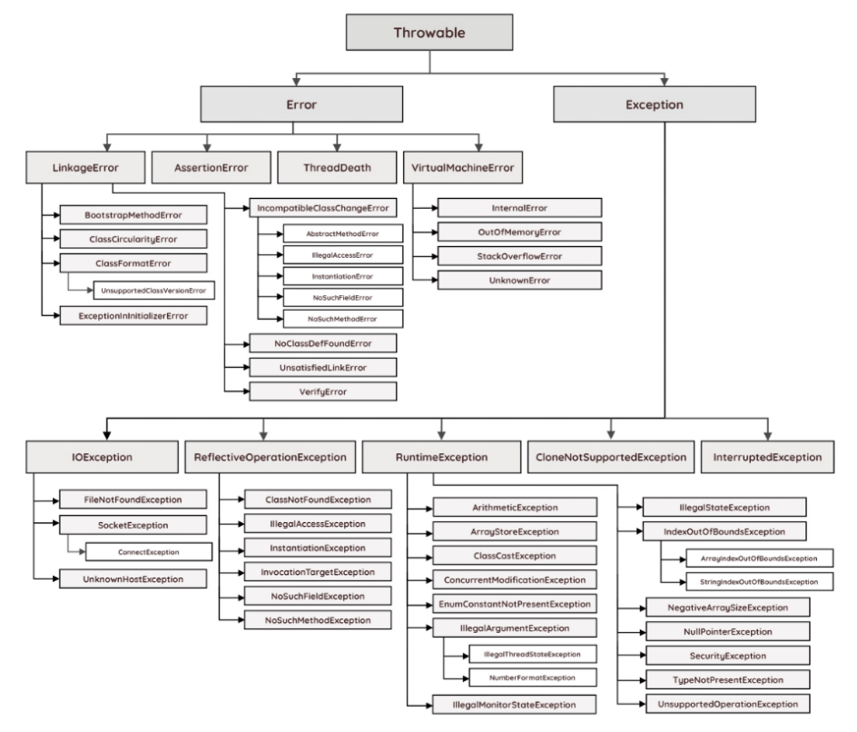

# Exception handling



##### 에러(Error)와 예외(exception)

- 에러: 프로그램 코드에 의해서 수습될 수 없는 심각한 오류
- 예외: 프로그램 코드에 의해서 수습될 수 있는 다소 미약한 오류


##### RuntimeException and others

- RuntimeException class & subclass
  - 주로 프로그래머의 실수에 의해 발생될 수 있는 예외
  - 예를 들어 배열 범위 벗어남(ArrayIndexOutOfBoundsException), null인 참조변수의 멤버 호출(NullPointerException), 형변환 오류(ClassCastException), 0으로 나누는 경우(ArithmeticException) 등
- Exception class(RuntimeException 제외)
  - 외부 영향으로 발생할 수 있는 것. 사용자의 동작에 의해서 발생하는 경우가 대다수
  - 존재하지 않는 파일 이름 입력(FileNotFoundException), 클래스 이름 잘못 적은 경우(ClassNotFoundException), 입력 데이터 형식이 잘못됨(DataFormat Exception) 등


##### try - catch

> 예외는 프로그래머가 미리 처리해주어야 하며, 예외처리(exception handling)란 프로그램 실행 시 발생할 수 있는 예외의 발생에 대비한 코드를 작성하는 것. 처리되지 못한 예외(uncaught exception)는 JVM의 '예외처리기(UncaughtExceptionHandler)'가 받아서 원인을 화면에 출력

```java
try {
    // 예외 발생 가능한 문장
} catch (Exception1 e1) {
    // Exception1 발생 시 처리 문장
} catch (Exception2 e2) {
    // Exception2 발생 시 처리 문장
}
```


##### finally

> 예외의 발생 여부에 상관 없이 실해오디어야 할 코드를 포함시킬 목적으로 사용
>
> try - catch - finally의 순서로 구성
>
> return 문이 있더라도 finally block 실행 후 return

```java
public void method() {
    try {
        // 예외 발생 가능한 문장
        return
    } catch {
        // 예외 처리를 위한 문장
    } finally {
        // 예외 발생 여부와 관계 없이 수행(예외든 아니든 수행)
        // return이 선행되어도 강제 수행
    }
}
```


##### printStackTrace()와 getMessage()

- 예외가 발생했을 때 생성되는 예외 클래스의 인스턴스에는 발생한 예외에 대한 정보가 담겨 있음
- printStackTrace()
  - 예외발생 당시의 `호출 스택(call stack)`에 있었던 메서드의 정보와 예외 메시지를 화면에 출력

- getMessage()
  - 발생한 예외클래스의 인스턴스에 저장된 메시지를 얻을 수 있음


##### 멀티 catch 블럭

```java
try {
    // ...
} catch (Exception1 | Exception e) {
    e.printStackTrace();
}
```

- jdk1.7부터 여러 catch 블럭을 `|` 기호를 이용해 하나의 catch 블럭으로 합칠 수 있게 됨
- 조상 예외 클래스에 선언된 멤버만 사용 가능


##### throw 예외 발생시키기

> 예외 클래스의 객체를 만든 뒤 `throw`를 이용해 예외 발생시킴

```java
try {
    Exception e = new Exception("고의로 발생시킨 예외");
    throw e;
} catch (Exception e) {
    e.prntStackTrace();
}
```


##### 메서드 예외 선언

```java
void method() throws Exception 1, Exception2 {}
```

- 메서드 뒤에 `throws` 키워드를 이용해 발생 가능한 예외를 나열 

- 자바에서는 메서드를 작성할 때 메서드 내에서 발생할 가능성이 있는 예외를 메서드의 선언부에 명시하여 이 메서드를 사용하는 쪽에서는 이에 대한 처리를 하도록 강요하기 때문에, 프로그래머들의 짐을 덜어 주는 것은 물론이고 보다 견고한 프로그램 코드를 작성할 수 있도록 도와줌

  > method 구현부 내 throws로 예외를 명시한다고 해서 해당 메서드를 호출하는 부분에서 컴파일 단계의 에러를 잡아주진 않지만, 명시된 exceptions를 메서드 호출부에서 handling 해줘야 함을 뜻한다고 이해

- 예외는 예외가 발생한 메서드에서 직접 처리해도 되고, 메서드를 호출한 곳에서 처리를 해주어도 됨


##### 사용자 정의 exception

> 보통 Exception 또는 RuntimeException 클래스로부터 상속받아 만듦(필수적으로 처리해야 하는 예외들이 선택적으로 처리해도 되는 상황인 경우, 필요에 따라 'unchecked' 예외가 강제적인 'checked' 예외보다 더 많이 사용)

```java
class MyException extends Exception {
    public final int ERR_CODE;
    
    MyException(String msg, int errCode) {
        super(msg);
        ERR_CODE = errCode;
    }
    
    MyException(string msg) {
        super(msg, 500);  // ERR_CODE를 500으로 강제
    }
}
```

- 위와 같이 getMessage()로 메시지만 받는 것이 아니라 errCode도 같이 받는 사용자 정의 exception을 만들 수도 있음


##### 예외 되던지기(exception re-throwing)

- 호출된 곳과 호출한 곳 모두에서 예외 상황을 처리해줘야 하는 상황의 경우 사용

##### 연결된 예외(chained exception)

- RuntimeException 생성자를 이용해 checked 예외를 unchecked 예외로 처리해서 예외를 강제하지 않을 때도 사용 가능
