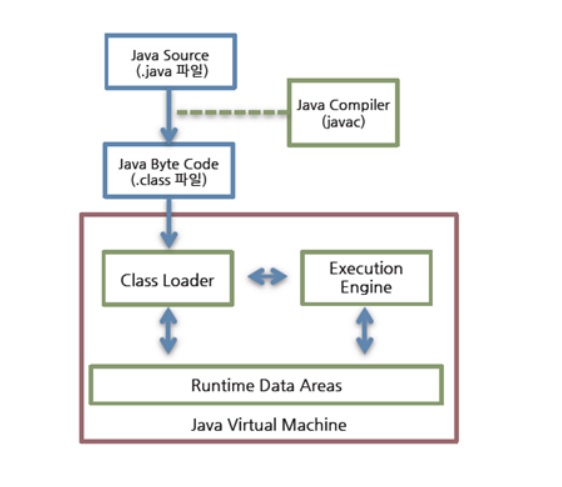
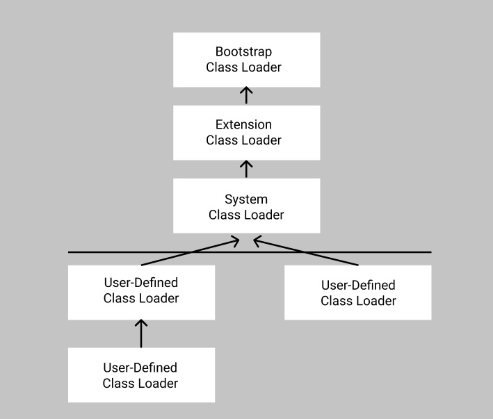
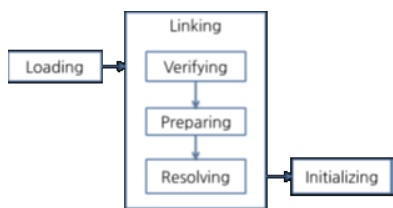
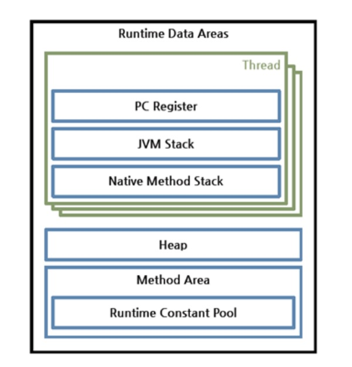
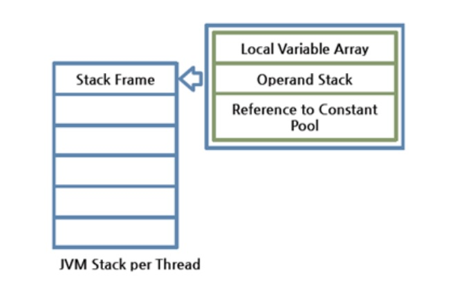

# JVM

> 출처 : https://d2.naver.com/helloworld/1230
>
> 자바 바이트 코드는 JRE 위에서 동작하고, JRE에서 가장 중요한 요소는 자바 바이트코드를 해석하고 실행하는 JVM(Java Virual Machine)임.

## 가상머신

- 가상머신(virtual machine)은 프로그램을 실행하기 위해 물리적 머신(컴퓨터 등)과 유사한 머신을 소프트웨어로 구현한 것
- 자바는 원래 WORA(Write Once Run Anywhere)를 구현하기 위해 물리적인 머신과 별개의 가상 머신을 기반으로 동작하도록 설계됨
- 이를 통해 자바 바이트코드를 실행하고자 하는 모든 하드웨어에 JVM을 동작시킴으로써 자바 실행 코드를 변경하지 않고 모든 종류의 하드웨어에서 동작하게 된 것

- JVM의 특징
  - 스택 기반의 가상 머신: 인텔 x86 아키텍처나 ARM 아키텍처와 같은 하드웨어가 레지스터 기반으로 동작하는 데 비해 JVM은 스택 기반으로 동작
  - 심볼릭 레퍼런스: 기본 자료형(primitive data type)을 제외한 모든 타입(클래스와 인터페이스)을 명시적인 메모리 주소 기반의 레퍼런스가 아니라 심볼릭 레퍼런스 참조
  - 가비지 컬렉션: 클래스 인스턴스는 사용자 코드에 의해 명시적으로 생성되고 가비지 컬렉션에 의해 자동으로 파괴됨
  - 기본 자료형을 명확하게 정의해 플랫폼 독립성 보장: C/C++ 등 전통적인 언어는 플랫폼에 따라 int형의 크기가 변함. JVM은 기본 자료형을 명확하게 정의해 호환성을 유지하고 플랫폼 독립성 보장
  - 네트워크 바이트 오더(network byte order): 자바 클래스 파일은 네트워크 바이트 오더 사용. 인텔 / ARM 계열 사이의 플랫폼 독립성 유지하기 위해 고정 바이트 오더 유지

## 자바 바이트코드

- 자바 코드를 배포하는 가장 작은 단위

- WORA 구현을 위해 JVM은 사용자 언어인 자바와 기계어 사이의 중간 언어인 자바 바이트코드를 사용
- JVM은 자바 바이트코드를 실행하는 실행기
  - 자바 컴파일러는 C/C++ 등의 컴파일러처럼 고수준 언어를 기계어, 즉 직접적인 CPU 명령으로 변환하는 것이 아니라, 개발자가 이해하는 자바 언어를 JVM이 이해하는 자바 바이트코드로 번역함. 따라서 자바 바이트코드는 플랫폼 의존적 코드가 없어 JVM이 설치된 장비라면 CPU나 운영체제가 다르더라도 실행 가능. 컴파일 결과물의 크기가 소스코드의 크기와 비슷하므로 네트워크로 전송하여 실행하기 쉬움

## JVM 구조

클래스 로더(Class Loader)가 컴파일된 자바 바이트코드를 런타임 데이터 영역(Runtime Data Areas)에 로드하고, 실행 엔진(Execution Engine)이 자바 바이트코드를 실행

##### 클래스 로더

- 자바는 동적 로드, 즉 컴파일 타임이 아니라 런타임(클래스를 처음 참조할 때)에 해당 클래스를 로드하고 링크하는 특징이 있음

- 이 동적 로드를 담당하는 부분이 JVM의 클래스 로더

- 특징

  - 계층 구조: 클래스 로더끼리 부모-자식 관계를 이루어 계층 구조로 생성됨. 최상위 클래스 로더는 부트스트랩 클래스 로더(Bootstrap Class Lodaer)
  - 위임 모델: 계층 구조를 바탕으로 클래스 로더끼리 로드를 위임하는 구조로 동작함. 클래스를 로드할 때 먼저 상위 클래스 로더를 확인하여 상위 클래스 로더에 있다면 해당 클래스를 사용하고, 없다면 로드를 요청받은 클래스 로더가 클래스를 로드
  - 가시성(visibility) 제한: 하위 클래스 로더는 상위 클래스 로더의 클래스를 찾을 수 있지만, 상위 클래스 로더는 하위 클래스 로더의 클래스를 찾을 수 없음

  - 언로드 불가: 클래스 로더는 클래스를 로드할 수는 있지만 언로드할 수 없음. 언로드 대신, 현재 클래스 로더를 삭제하고 아예 새로운 클래스 로더를 생성하는 방법 사용 가능

- ##### 클래스 로더 위임 모델

  

  - 클래스 로더가 클래스 로드를 요청받으면 다음의 순서로 해당 클래스가 있는지 확인

    `클래스 로더 캐시 - 상위 클래스 로더 - 자기 자신`

  - 즉, 이전에 로드된 클래스인지 클래스 로더 캐시를 확인하고, 없으면 상위 클래스 로더로 거슬로 올라가면 확인, 루트 클래스 로더까지 확인해도 없으면 요청받은 클래스 로더가 파일 시스템에서 해당 클래스를 찾음
  - 부트스트랩 클래스 로더
    - JVM을 기동할 때 생성
    - Object 클래스를 비롯해 자바 API들을 로드
    - 다른 클래스 로더와 달리 자바가 아닌 네이티브 코드로 구현되어 있음
  - 익스텐션 클래스 로더
    - 기본 자바 API를 제외한 확장 클래스들을 로드
    - 다양한 보안 확장 기능 등을 로드
  - 시스템 클래스 로더(System Class Loader)
    - 부트스트랩 클래스 로더와 익스텐션 클래스 로더가 JVM 자체의 구성 요소들을 로드하는 것이라면, 시스템 클래스 로더는 애플리케이션의 클래스들을 로드
    - 사용자가 지정한 $CLASSPATH 내의 클래스들을 로드
  - 사용자 정의 클래스 로더
    - 애플리케이션 사용자가 직접 코드 상에서 생성해서 사용하는 클래스 로더

- ##### 클래스 로드 - 링크 - 초기화

  

  - 클래스 로더가 아직 로드되지 않은 클래스를 찾으면, 위와 같이 클래스를 로드하고, 링크한 뒤 초기화 함
  - 로드: 클래스를 파일에서 가져와 JVM의 메모리에 로드
  - 검증: 읽어 들인 클래스가 자바 언어 명세 및 JVM 명세대로 구성되어 있는지 검사(가장 오래 걸리고 까다로운 단계)
  - 준비: 클래스가 필요로 하는 메모리를 할당 -> 클래스에서 정의된 필드, 메서드, 인터페이스들을 나타내는 데이터 구조 준비
  - 분석: 클래스의 상수 풀 내 모든 심볼릭 레퍼런스를 다이렉트 레퍼런스로 변경
  - 초기화: 클래스 변수들을 적절한 값으로 초기화

##### 런타임 데이터 영역

- JVM이 운영체제 위에서 실행되면서 할당받는 메모리 영역

- 총 6개의 영역으로 나뉨(pc register/jvm stack/native method stack은 스레드마다 하나씩 생성되고, heap/method area/runtime constant pool은 모든 스레드가 공유)

  - 이중 PC 레지스터(PC Register)

    - 각 스레드마다 하나씩 존재하며 스레드가 시작될 때 생성
    - 현재 수행 중인 JVM 명령의 주소를 가짐

  - JVM Stack

    - 각 스레드마다 하나씩 존재하며 스레드가 시작될 때 생성

    - Stack Frame 이라는 구조체를 저장하는 스택으로, JVM은 오직 JVM 스택에 스택 프레임을 추가(push) 및 제거(pop)하는 동작만 수행

      

      - Stack Frame은 JVM 내에서 메서드가 수행될 때마다 하나씩 생성되어 해당 스레드의 JVM 스택에 추가되고, 메서드가 종료되면 제거됨
      - 각 스택 프레임은 지역 변수 배열(Local Variable Array), 피연산자 스택(Operand 
        Stack), 현재 실행 중인 메서드가 속한 클래스의 런타임 상수 풀에 대한 레퍼런스를 가짐
      - 지역 변수 배열은 0부터 시작하는 인덱스를가진 배열로, 0은 메서드가 속한 클래스 인스턴스의 this 레퍼런스, 1부터는 메서드에 전달된 파라미터들 저장, 메서드 파라미터 이후는 메서드의 지역 변수들 저장
      - 피연산자 스택은 메서드의 실제 작업 공간으로, 각 메서드는 피연산자 스택과 지역 변수 배열 사이에서 데이터 교환

  - Native Method Stack

    - 자바 외의 언어로 작성된 네이티브 코드를 위한 스택

  - Heap
    - 인스턴스 또는 객체를 저장하는 공간으로 GC 대상
    - JVM 성능 이슈에서 가장 많이 언급되는 공간
  - Method Area
    - 모든 스레드가 공유하는 영역으로 JVM이 시작될 때 생성
    - JVM이 읽은 클래스와 인터페이스에 대한 런타임 상수 풀, 필드와 메서드 정보, Static 변수, 메서드의 바이트코드 등을 보관
  - Runtime constant Pool
    - 클래스와 인터페이스의 상수, 필드와 메서드에 대한 모든 레퍼런스를 담고 있는 테이블
    - 즉, 어떤 메서드나 필드를 참조할 때 JVM은 런타임 상수 풀을 통해 해당 메서드나 필드의 실제 메모리상 주소를 찾아서 참조하므로 JVM 동작에서 가장 핵심적인 역할을 수행하는 곳

​		

##### 실행 엔진

- 클래스 로더를 통해 JVM 내의 런타임 데이터 영역에 배치된 바이트 코드는 실행 엔진에 의해 명령어 단위로 실행됨
- 자바 바이트코드는 기계가 바로 수행할 수 있는 언어보다는 인간이 보기 편한 형태로 기술되어 있어, JVM 내부에서 기계가 실행할 수 있는 형태로 변경시키는 2가지 방법 채택
  - 인터프리터
    - 바이트코드 명령어 하나씩 읽어서 해석 및 실행
    - 하나씩 해석하므로 바이트코드 하나하나의 해석은 빠르지만, 인터프리팅 결과의 실행은 느림
    - 즉, 바이트코드라는 '언어'는 기본적으로 인터프리터 방식으로 동작
  - JIT(Just-In-TIme)
    - 인터프리터의 단점을 보완하기 위해 도입된 JIT 컴파일러
    - 인터프리터 방식으로 실행하다가 적절한 시점에 바이트코드 전체를 컴파일해 네이티브 코드로 변경하고, 이후에는 해당 메서드를 더이상 인터프리팅하지 않고 네이티브 코드로 직접 실행
    - 네이티브 코드는 캐시에 보관하기 때문에 한 번 컴파일된 코드는 계속 빠르게 수행됨