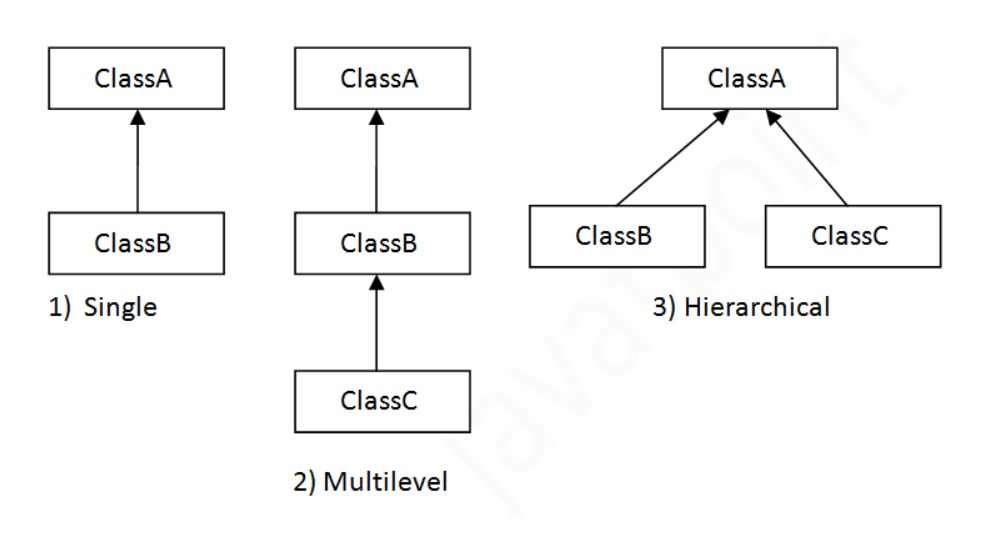

# 객체지향언어2


## 상속

> 상속이란 기존의 클래스를 재사용하여 새로운 클래스를 작성하는 것
>
> 상속을 통해 클래스 작성하면 적은 양의 코드로 새로운 클래스 작성할 수 있고, 코드를 공통적으로 관리할 수 있어 유지보수에 용이
>
> ```java
> class Child extends Parent {}
> ```
>
> - 두 클래스는 서로 상속 관계에 있다고 함. 상속해주는 클래스는 '조상 클래스', 상속 받는 클래스는 '자손 클래스'
> - 조상 클래스 : parent/super/base class
> - 자손 클래스 : child/sub/derived class



- subclass는 superclass의 모든 멤버변수(속성, 메서드)를 모두 상속 받음
- 생성자와 초기화 블럭은 상속되지 않음
- 인스턴스 생성
  - subclass 인스턴스를 생성하면 superclass의 멤버와 합쳐진 하나의 인스턴스로 생성됨


##### 포함관계

```java
class Circle {
    Point point = new Point();
}

class Point {
    int x;
    int y;
}
```

- 상속관계로 맺어줄지 위처럼 포함관계로 맺어줄지는 `is-a`, `has-a` 관계에 따라 설정
- `Circle is a point` vs `Circle has a point` 를 보면 원이 점인지, 원이 점을 포함하는지를 생각하여 결정


##### 단일 상속(single inheritance)

- C++은 다중 상속이 되어서 한 클래스에서 여러 클래스를 상속 받는 것이 가능하지만, 자바는 하나의 클래스만 상속 받을 수 있음
- 다중 상속이 가능하다면 복합적 기능을 가진 클래스를 쉽게 작성할 수 있지만, 클래스 관계가 복잡해지고 다른 클래스로부터 상속 받은 멤버간 이름이 같을 경우 구분할 수 없음

- 아무것도 상속 받지 않는 클래스는 컴파일러가 상속계층도의 최상위에 있는 `Object` 클래스를 상속함


##### super

- subclass에서 superclass로부터 상속받은 멤버를 참조하는 데 사용되는 참조변수
- 멤버가 중복 정의되어 서로 구별해야 하는 경우 사용하는 것을 권장
- super()는 조상 클래스의 생성자를 호출하는 데 사용
  - super() 생성자 호출이 없으면 생성자의 첫 줄에 컴파일러가 자동 추가(object 클래스는 root이므로 제외)


## 제어자(modifier)

> 클래스, 변수, 메서드의 선언부에 함께 사용되어 부가적 의미 부여
>
> 접근 제어자와 그 외의 제어자로 나뉨
>
> - access modifier: public, protected, default, private
> - etc: static, final, abstract, (native, transient, synchronized, volatile, strictfp)


##### 접근 제어자(access modifier)

> 멤버 또는 클래스에 사용되어 외부에서 접근하지 못하도록 제한하는 역할을 함
>
> 클래스, 멤버변수, 메서드, 생성자에서 사용

- 종류
  - private: 같은 클래스 내
  - default: 같은 패키지 내
  - protected: 같은 패키지 내 + 다른 패키지의 자손 클래스 내
    - 상속을 통해 확장될 것이 예상되는 클래스에서 사용
  - public: 제한 없음
- 접근제어자를 이용한 캡슐화
  - 접근 제어자 사용해 클래스 내부에 선언된 데이터 보호
  - 외부에는 불필요하고 내부적으로만 사용되는 부분 감추기 위함

##### 그 외 제어자

- static

  ```java
  class StaticTest {
      static int width = 200;  // static 변수
      static {}  // 클래스 초기화 블럭
      static int max(int a, int b) { return a > b ? a : b; }  // static 메서드
  }
  ```

  - 공통적인 상황에서 사용
  - 인스턴스 멤버 사용 여부에 따라 결정
  - 멤버변수, 메서드, 초기화 블럭에서 사용 가능

- final

  - 변수: 값을 변경할 수 없는 상수
  - 메서드: 오버라이딩 할 수 없음
  - 클래스: 자손 클래스 정의할 수 없음 

  - 생성자를 이용한 final 멤버 변수의 초기화

    ```java
    class Card {
        final int NUMBER;
        
        Card(int number) {
            NUMBER = number;
        }
    }
    ```

    - final 붙은 상수는 일반적으로 선언 및 초기화를 동시에 하지만, 인스턴스 변수의 경우 생성자에서 초기화되도록 할 수 있음

- abstract

  - 클래스와 메서드에서 사용 가능

    - 클래스: 클래스 내에 추상 메서드가 선언되어 있음을 의미
    - 메서드: 선언부만 작성하고 구현부는 작성하지 않은 추상 메서드임을 알림

  - 아직 완성되지 않은 메서드가 존재하는 추상클래스는 인스턴스 생성 불가능

    (다음 장에서 세부 설명)


## 다형성(polymorphism)

> 여러가지 형태를 가질 수 있는 능력을 의미
>
> 한 타입의 참조변수로 여러 타입의 객체를 참조할 수 있도록 함으로써 다형성을 프로그램적으로 구현

```java
class AnotherTv extends Tv {}
Tv t1 = new Tv();
Tv t2 = new AnotherTv();
```


##### 참조변수의 형변환

- Up-casting: sub -> super (자동 형변환)

- Down-casting: super -> sub (명시적으로 해야함)

  - down casting 시에는 참조변수가 다룰 수 있는 멤버변수의 갯수가 늘어날 수 있기 때문에 명시적으로 형변환하는 것이라고 이해할 수 있음

- 참조변수가 가리키는 인스턴스의 자손타입으로 형변환은 불가능

  ```java
  class Test {
      public static void main(String args[]) {
          Car car = new Car();
          FireEngine fe = null;
          
          fe = (FireEngine)car;  // ClassCastException 발생
      }
  }
  ```

- instanceof

  ```java
  void doWork(Car c) {
      if (c instanceof FireEngine) {
          FireEngine fe = (FireEngine)c;
      }
  }
  ```

  - 참조변수가 참조하고 있는 인스턴스의 실제 타입을 알아보기 위해 사용
  - c 참조변수가 가리키고 있는 인스턴스가 FireEngine인지를 확인한 뒤에 형변환


##### 참조변수와 인스턴스의 연결

```java
public class Test {
	public static void main(String[] args) {		
		Parent parent = new Child();
		Child child = new Child();
		
		System.out.println(parent.x);
		System.out.println(child.x);
		child.method();
		child.method();
	}
}
```

```java
class Parent {
	int x = 10;
	
	void method() {
		System.out.println("parent method");
	}
}
```

```java
class Child extends Parent {
	int x = 40;
	
	void method() {
		System.out.println("child method");
	}
}

```

```txt
실행결과
10
10
child method
child method
```

- superclass에 선언된 멤버변수와 같은 이름의 인스턴스변수를 subclass에 중복으로 정의했을 때 다른 결과가 나옴
- 메서드는 오버라이딩한 경우에도 참조변수의 타입에 관계없이 항상 실제 인스턴스의 메서드가 호출
- 같은 타입의 인스턴스라도 멤버변수는 참조변수의 타입에 따라 달라짐
  - superclass 타입의 참조변수 사용했을 경우에는 `superclass.멤버변수` 참조
  - subclass 타입의 참조변수 사용했을 경우에는 `subclass.멤버변수` 참조


## 추상클래스(abstract class)

> 미완성된 클래스(미완성 메서드를 포함하고 있다는 의미)
>
> 인스턴스를 생성할 수 없으며 상속받은 subclass에서 오버라이딩 시 가능
>
> ```java
> abstract class AbstractClass {
>     abstract void method() {};
> }
> 
> class ConcreteClass extends AbstractClass {
>     void method() { /* */ }
> }
> ```


## 인터페이스(interface)

> 일종의 추상클래스(추상메서드와 상수만을 멤버로 가질 수 있음)
>
> ```java
> interface MyInterface {
>     public static final int num = 1;
>     public abstract method(int a);
> }
> ```
>
> - 모든 멤버변수는 public static final
>
> - 모든 메서드는 public abstract
>
>   (jdk1.8부터 static, default는 예외)
>
> - 인터페이스에 정의된 모든 멤버는 예외없이 적용되므로 편의상 생략하는 경우가 많고, 생략된 제어자는 컴파일러가 자동으로 추가


##### 인터페이스의 다중 상속

- 인터페이스는 인터페이스로부터만 상속받을 수 있으며, 클래스와 달리 다중 상속 가능


##### 인터페이스의 구현

```java
class Fighter implements Fightable {}
```

```java
abstract class Fighter implements fightable {
    // 메서드 중 일부만 구현할 때 abstract class로 선언
}
```


##### 인터페이스를 이용한 다형성

- 인터페이스 타입의 참조변수로 이를 구현한 클래스의 인스턴스를 참조

- 매개변수의 타입으로 사용 가능

- 리턴타입이 인터페이스라는 것은 메서드가 해당 인터페이스를 구현한 클래스의 인스턴스를 반환한다는 것을 의미

  ```java
  Fightable method() {
      Fighter f = new Fighter();
      return f
  }
  ```


##### 인터페이스의 장점

- 개발시간 단축
  - 인터페이스와 구현 클래스를 나누어 동시에 작업 가능
- 표준화 가능
  - 기본 틀을 인터페이스로 작성 뒤 구현하여 작성하도록 해 일관되고 정형화된 프로그램 개발 가능
- 서로 관계없는 클래스들에게 관계를 맺어줄 수 있음
  - 하나의 인터페이스를 구현하는 관계 없는 클래스 간에 관계를 맺게함
- 독립적 프로그래밍 가능
  - 선언과 구현이 분리되어 실제 구현에서 독립적 프로그램 작성 가능
  - 한 클래스의 변경이 다른 클래스에 영향을 미치지 않음


## 내부클래스(inner class)

> 클래스 내에 선언된 클래스
>
> 두 클래스의 멤버들 간에 서로 쉽게 접근할 수 있고, 불필요한 클래스를 감춤으로써 코드 복잡성 줄일 수 있음


##### 종류와 특징

- static class
  - 외부 클래스의 멤버 변수 선언 위치에 선언
  - static 메서드에서 사용될 목적으로 선언

- instance class
  - 외부 클래스의 멤버변수 선언 위치에 선언
  - 외부 클래스의 인스턴스 멤버들과 관련된 작업할 때 사용

- local class

  - 외부 클래스의 메서드나 초기화블럭 안에서 선언
  - 해당 영역 내부에서만 사용 가능

- anonymous class

  - 클래스의 선언과 객체의 생성을 동시에 하는 이름 없는 클래스(일회용)

  - 이름이 없기 때문에 생성자도 가질 수 없음

    ```java
    new MyClass() {}
    new MyInterface() {}
    ```

    
