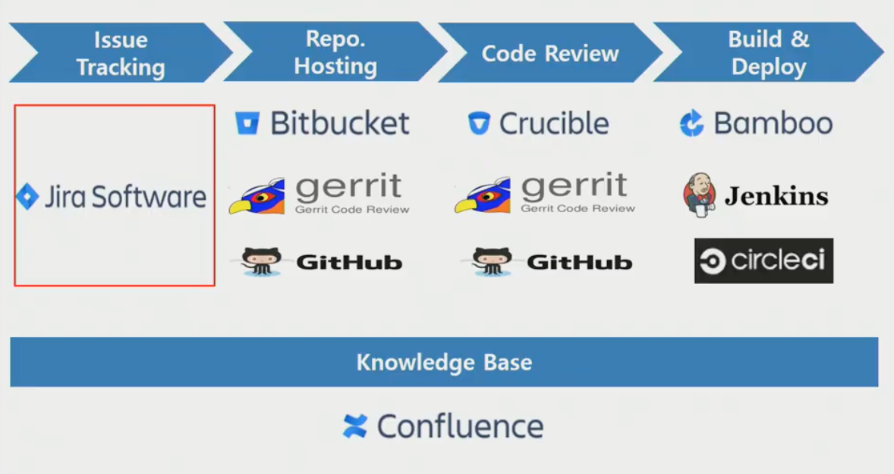

# JIRA / JQL


## Issue

##### Issue types

- Story: 유저가 어떤 서비스를 사용하는지(ex. 사용자가 로그인을 한다)
- Task: 기능을 하나하나의 단위로 나눔(ex. 로그인 페이지 디자인, 비밀번호 찾기 기능 등)
- Bug: 버그 발생했을 시
- Epic: 하나의 큰 틀, 테스트, 스토리, 버그 등 다른 issue들이 들어가 전체 epic으로 관리


##### Issue elements

- Title

- Description

- Assignee: 담당자

- status: workflow(To Do - In Progress - Done)

- Components: 이슈들을 특정 기준으로 하나로 묶을 때 사용(ex. frontend의 기능들 묶음)

- Resolution: 이슈의 종료 기준(Unresolved & Done)

  

## Board

> Scrum / Kanban

- existing project vs existing Saved Filter
  - 현재 존재하는 프로젝트를 가지고 보드 생성
  - 생성한 Filter에 맞는 issue들만 가지고 와 보드 생성


## JQL

##### 개념

- Jira Query Language
- Jira Issue를 구조적으로 검색하기 위해 제공하는 언어
- SQL(Standard Query Language)과 비슷한 문법
- Jira의 각 기능들에 맞는 특수한 예약어들 제공
- 쌓인 Issue들을 재가공해 유의미한 데이터를 도출해내는 데 활용(Gadget, Agile Board 등)


##### 사용법

- Basic Query

  ```sql
  
  ```

- Advanced Query

  - operators

    - =, !=, >, >=
    - in, not in
    - ~(contains), !~(not contains)
    - is empty, is not empty, is null, is not null

    

  - keywords

    - AND
    - OR
    - NOT
    - EMPTY
    - NULL
    - ORDER BY

    

  - Functions

    - endOfDay(), startOfDay()
    - endOfWeek() - saturday, startOfWeek() - sunday
    - endOfMonth(), startOfMonth(), endOfYear(), startOfYear()
    - currentLogin()
    - currentUser()

    ```sql
    /* 날짜별 기능을 섞어서 사용 가능 */
    updated = startOfWeek(2d)
    ```

    

  - 날짜별 기능

    - -2w, -6d, -1d, Current, 1d, 1w 등

      ```sql
      /* 이틀 전부터 현재까지 수정된 문서 검색 */
      updated = -2d
      ```

  

- Filter Share

  - Search - save as - name설정 - Details에서 권한 설정 가능 및 공유

  ```sql
  updated > startOfWeek(1d) and updated < endOfWeek(-1d)
  ```

  ```sql
  resolution = Unresolved
  ```

  


## Dashboard & Gadget

##### Dashboard

- 새로운 dashboard 생성
  - create new dashboard

- 공유 
  - Add Viewers 설정

  
  

##### Gadget

- 지표 관리를 위한 gadgets 추가 가능
- 필요한 gadgets 등록 후 배치
- 예시
  - Assigned to Me: 나에게 할당된 issues
  - Filter Results: 내가 만든 필터에 해당하는 결과들을 보여줌
  - Pie Chart
    - 필터들을 항목별로 구분해 파이차트로 표시
    - 여러 기준(components 등)으로 할 수 있고 update 시간 설정 가능
  - Heat Map
    - pie chart와 비슷하지만 비율에 따라 글자가 커지는 효과


## 현업에서의 Jira 활용

- Issue Tracking 시 많이 사용

  

- Gitlab과 Jira 이슈 연동(smart commit)

  - commit 시 issue의 key를 추가하면 링크가 생겨서 해당 issue와 연결

  - #close: issue 종료

    ```txt
    TEST-23 #close Fixed this today
    ```

- plugins

  - 여러 plugins 통해 추가 기능 사용
  - Structure plugin ?
  - repository hosting ?
  - 다른 tool과 연동되는 것을 써보는게 좋음

- remine: 무료툴

