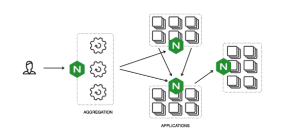

# NGINX

## nginx는 웹서버?

- 흔히 nginx를 웹서버로 칭한다. 웹서버는 리소스에 대한 HTTP 요청을 받아 콘텐츠를 클라이언트에게 돌려주는 역할을 하는 것을 말한다. 

- 보통 우리가 사용했던 nginx도 클라이언트의 요청을 대신 받고, 리소스를 직접 찾아서 응답하거나, 해당 요청 uri로 리다이렉트하는 중재자의 역할로 사용했다. 그래서 location 설정에 따라(요청 URI에 따라) 특정 root에 위치한 리소스를 찾아 응답해주거나, 특정 포트에서 실행중인 프로세스를 proxy_pass로 설정해 특정 요청을 리다이렉트 시켜주는 용도로 사용했다.

- 물론 nginx가 HTTP 및 그와 관련된 TCP 처리를 구현하는 웹서버 역할도 하지만, 보다 많은 역할을 한다.

- nginx [공식 사이트](https://www.nginx.com/)에서도 다양한 역할을 한다고 기술하고 있다.

  - F5 NGINX Products로 소개하고 있는 부분에 다음과 같은 여섯가지 products를 소개하는데, 각 제품에 특화된 강점이 있는 것으로 보인다.
  - 예를 들면 nginx plus는 nginx 최상단에서 돌아가는(built on top of NGINX) load balancer, API gateway, reverse proxy 역할을 하는 소프트웨어이고, nginx ingress controller는 enterprise 수준의 로드 밸런싱을 지원하는 것이다.
    - NGINX Open Source
    - NGINX Plus
    - NGINX Controller
    - NGINX App Protect
    - NGINX Unit
    - NGINX Amplify
  - 또한 nginx 다음의 여섯가지 키워드를 메인 페이지에서 제시하고 있는데, nginx가 로드 밸런싱이 가능하고, microservices를 구현하게 해주며, 어떠한 클라우드 위에서도 배포가 가능하고, 보안이 뛰어나며, high-performance web & mobile 환경을 제공하고, api gateway의 역할을 한다는 것이다.
    - Load Balancing
    - Microservices
    - Cloud
    - Security
    - Web & Mobile Applications
    - API Gateway
  
  

## nginx의 기능들

- Load Balancing

  - nginx 공식 사이트의 [Using nginx as HTTP load balancer](http://nginx.org/en/docs/http/load_balancing.html)를 보면 설정을 통해 서버 부하를 분산하는 기술을 구현할 수 있다. (https로 설정만 하면 https도 가능하다)
  - `It is possible to use nginx as a very efficient HTTP load balancer to distribute traffic to several application servers and to improve performance, scalability and reliability of web applications with nginx.`
  - round-robin, least-connected, ip-hash 등의 방법을 통해 요청을 분산시킨다.

- Microservices

  - nginx에서 2021. 6. 4. 업데이트한 글을 보면 다음과 같이 설명하고 있다.

  - `The microservices work together, communicating through web APIs or messaging queues to respond to incoming events.`

  - web APIs 또는 메시징큐(대기열)를 통해 통신해 incoming events에 반응한다는 것이다. 이를 nginx가 구현하고 있는 것으로 보이는데, nginx가 application server의 앞에서 해당 요청(events)을 받아 처리한다는 의미로 해석된다.

  - 그림을 보면 agrregation 하는 nginx 서버가 각 인스턴스가 되는 서버(이 서버들도 결국 개별 application이 nginx를 거쳐 통신한다)의 통신을 중재하는 것이다.

  - API gateway 역할을 통해서 microservices를 구현하는 것으로 볼 수 있는데, 공식사이트의 [Building Microservices: Using an API Gateway](https://www.nginx.com/blog/building-microservices-using-an-api-gateway/) 글을 보면 API Gateway를 이용해 마이크로서비스를 구현한다.

    (상세한 내용은 추가 학습이 필요)

    

  - 2018년에 nginx에서 microservices를 설명한 영상을 보면 아래와 같이 microservices stack을 설명하는데, 아래와 같이 해석될 수 있을 듯하다.

  - 도커가 가상 container를 통해 application server를 구동시키고, 수많은 containers의 관리(orchestration)를 kubernetes가 한다면, 해당 서비스(microservice라고 보아도 되겠다)들의 통신을 nginx가 중재하겠다는 것이다.

    

- API gateway

  - 위에서 설명한 것처럼 microsevices를 구현하기 위해 nginx는 api gateway의 역할을 한다.

  - 공식 사이트의 [What is an API Gateway?](https://www.nginx.com/learn/api-gateway/) 를 보면 개별 서버가 클라이언트의 요청을 direct로 처리하는 것이 아니라, api gateway 서버 하나로 단일화하여 클라이언트의 요청을 처리한다.

    `Maintain a single API domain`

- high-performance web & mobile applications

  - nginx가 웹/모바일 환경에서 높은 성능을 자랑한다고 한다.
    - improve site speed / reduce page load time / speed up encryption / save on bandwidth / monitor performance / scale when you need it
  - nginx가 낮은 latency(네트워크 지연시간)를 자랑한다고 하는데, 그만큼 성능이 뛰어나다는 뜻인 듯하다.

- cloud, security는 추후 정리..

- 정리

  결론적으로 nginx는 load balancing을 통해 부하를 분산시켜 안정성을 높이고, api gateway의 역할을 하여 하나의 도메인에서 api 요청을 관리하며, 추가적으로 이를 통해 MSA를 구현할 수 있고, 높은 성능과 보안을 자랑한다고 볼 수 있다.

## 그래서 왜 reverse proxy죠?

- 공통점
  - 이들 모두가 클라이언트와 서버 사이에서 통신을 중재하는 역할을 한다는 공통점이 있다.
- 차이점
  - proxy는 http 완벽가이드 책에서도 설명하듯이 `웹 프락시가 있다면 클라이언트는 HTTP 서버와 이야기하는 대신, 자신의 입장에서 서버와 대화해주는 프락시와 이야기한다.` 즉 전통적인 프락시(forward proxy) 서버는 클라이언트의 입장에서 프락시 서버를 통해 외부 네트워크와 통신한다.
  - reverse proxy는 proxy 서버의 일종이지만, 클라이언트를 보호하기 위한 전통적인 프락시 서버와는 다르게 서버를 보호하기 위한 목적(Unlike a traditional proxy server, which is used to protect clients, a reverse proxy is used to protect servers)이 상대적으로 더 크다. reverse proxy는 클라이언트로부터 요청을 받아서(accept), 서버에 해당 요청을 던지고(forwards) 응답 리소스를 다시 클라이언트에게 보낸다(response).
- 정리
  - (traditional forward) proxy 는 클라이언트의 관점에서, reverse proxy는 서버의 관점에서 보안을 개선하고, 성능을 높여주며, 비용을 절약시켜주는 등 다양한 side 기능들을 제공한다고 할 수 있다.

## 그래서! nginx는 성능이 왜 좋죠?

아는 분이 답변해주세요..
