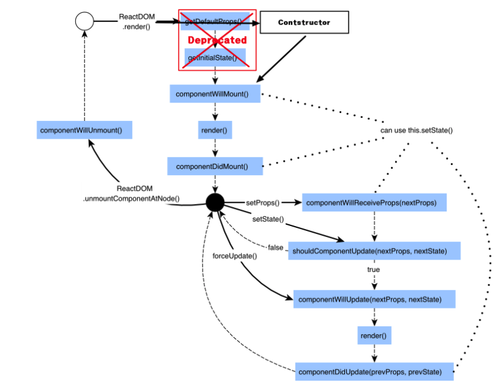

# React

> 2021.06.04 ~ ing


## Setting

1) npm 설치

- 위 패키지를 통해 설치 시 port 3000을 통해 react node server 활성화 후 실행

  ```bash
  $ npx create-react-app {project-name}
  $ npm start
  ```

- node.js package 모듈을 통해 react project 생성  >> react server start(node package를 통해 설치 시 gitingore, src 등 기본 폴더 구조 생성(node_modules, .gitingnore, README.md, package.json))

- /public/index.html : root html 파일

- /src/App.js : root js 파일, 모든 react code에 대한 compile

- /src/index.css  &&  /src/index.js : 모든 react code에 대한 css, js 파일 load

  /src/index.js에서 react, react-dom, ./index.css, App.js load하여 root html인 /public/index.html에 render


2) cdn install 방식

 - React API, React DOM, Babel 설치 필요

   ```html
   <head>
     <script src="https://unpkg.com/react@^16/umd/react.production.min.js"></script>
     <script src="https://unpkg.com/react-dom@16.13.0/umd/react-dom.production.min.js"></script>
   	<script src="https://unpkg.com/babel-standalone@6.26.0/babel.js"></script>
   </head>
   
   <body>
     <div id ="root"></div>
     <script type="text/babel">
     	// React code will go hear
     	class App extends react.Components {
   			render() {
       		return (
         		// react html
       			<h1>Hello World</h1>
       		)
   		  }
   		}
   
   		ReactDOM.render(<App/>, document,getElementById('root'))
     </script>
   </body>


## Component

##### function component

- 한 js 파일 내 function을 만들어 component화

  ```jsx
  function App() {
    return (
    	<ChildComponent/>
    )
  }
  
  function ChildComponent() {
    return (
    	<div>
      	child component
      </div>
    )
  }
  ```


##### class component

- React.Component를 상속 받고 render 함수를 만들어 return 값에 JSX 문법을 사용해 작성

  ```jsx
  class ParentComponent extends React.Component {
    render() {
      return (
        <ChildComponent value={ 'sth' } />
      )
    }
  }
  ```


## State{#state}

> 컴포넌트 안에서 관리되는 데이터를 저장하는 객체
>
> state data를 사용하는 쪽과 구현하는 쪽을 분리시키기 위함
>
> state data의 변경이 일어날 때 해당 변수의 데이터가 모두 변경되도록 연동됨(state가 변경이 되면 HTML이 자동으로 rerendering)
>
> 일반 변수는 함수가 끝날 때 사라지지만, state 변수는 React에 의해 유지

##### function component

- useState React Hook은 class component에서는 사용할 수 없고, function component에서만 사용 가능

- useState

  - useState 함수에 인자로 data를 전달하면, state 객체에 저장되는 변수와 해당 변수를 변경시키는 함수를 배열로 반환
  - 아래 setScore() 함수를 실행하여 state data를 변경시킴(인자로 대체시킬 값을 전달)

  ```jsx
  import { useState } from 'react'
  
  // score는 해당 state 데이터(0), setScores는 해당 데이터를 변경하는 함수
  // state data에는 문자, 숫자, 배열, 객체 등 모든 타입의 데이터를 할당할 수 있음
  function Board() {
    let [score, setScore] = useState(0)
    let [titles, setTitles] = useState(['title1', 'title2',])
  	
    // 1) 값
    // score 1 증가 함수
    // state 객체를 직접 변경하지 않고 사본을 만들어 변경함()
  	function increaseCount() {
      let newCount = count + 1
      setCount(newCount)
    }
    
    // 2) 객체
    // 깊은 복사를 통해 titles 사본을 만든 뒤 setTitles
    function changeTitles() {
      let newTitles = [...titles]
      newTitles[0] = 'title0'
      setTitles(newTitles)
    }
    
    return (
      // <></>: JSX fragment
    	<>
        <p>{ count }</p>
        <p>{ titles }</p>
        <button onClick={ increaseCount }>count 1 증가</button>
        <button onClick={ changeTitles }>title 변경</button>
      </>
    )
  }
  ```


##### class component

- state 생성 시 construnctor(생성자) 함수를 만들고 상속받은 생성자(super())도 함께 호출

  ```jsx
  class Board extends React.Component {
    constructor(props) {
      super(props)
      this.state = {
        key1: 'value1',
      }
    }
    render() {
      return (
      	<>
        	<p>{ this.state.key1 }</p>
        </>
      )
    }
  }
  ```


## Props

> 하위 컴포넌트로 데이터를 전달하기 위한 객체

- 기본 사용 방법
  - component의 attribute는 전달할 component의 변수명이고, 값으로 해당 변수에 할당되는 값이 들어감
  - 하위 컴포넌트에서는 props 객체에 담긴 해당 변수명으로 데이터 접근

  ```jsx
  <ChildComponent value={ sth } />
  
  // in ChildComponent
  { this.props.value }
  ```

- 불변성(immutability)
  - props 하는 이유는 하위 컴포넌트를 제어되는 컴포넌트(controlled component)로 만들기 위함

  - 데이터는 값을 변경하기 위한 두 가지 방법이 있음. 1)값을 직접 변경하는 것, 2)원하는 변경 값을 가진 새로운 사본으로 데이터를 교체하는 것

  - 이 때 기존 데이터(객체)를 직접 변경하지 않고 사본을 만들어 교체하는 것은 다음과 같은 장점을 가짐

    - 복잡한 특징들을 단순하게 만듦. 기존 객체를 변경하지 않으므로 이전 이력을 유지하고 재사용 가능

    - 변화를 감지함. 참조하고 있는 불변 객체가 이전 객체와 다르다면 객체는 변화하는 것으로 감지하기 때문.

    - React에서 다시 rendering하는 시기를 결정함. react에서 순수 컴포넌트(pure component)를 만드는 데 도움을 주어 rerendering 할지 결정할 수 있게 함

      > 모든 React component는 자신의 props를 다룰 때 반드시 순수 함수처럼 동작해야 함.
      >
      > ```js
      > // pure function(입력값을 바꾸지 않고 항상 동일한 입력값에 대해 동일한 결과를 반환)
      > function sum(a, b) {
      >   return a + b
      > }
      > 
      > // 입력값을 변경시키므로 순수함수가 아님
      > function withdraw(account, amount) {
      >   account.total -= amount
      > }
      > ```


## State & Props Async

- state(by setState), props가 비동기적으로 업데이트 될 수 있으므로 state를 계산 시에 해당 값에 의존해서는 안됨

  ```jsx
  // wrong
  this.setState({
    counter: this.state.counter + this.props.increment,
  })
  
  // right
  this.setState( (state, props) => {
    counter: state.counter + props.increment
  })
  ```

  


## Event Handler

```jsx
// attribute: event, value: { 실행될 함수 }
<span onClick={ func }>button</span>
```

- default event 방지

  ```jsx
  function handleClick(e) {
    e.preventDefault()
  }
  ```

  

## Form

> javascript 함수로 폼의 제출을 처리하고 사용자가 폼에 입력한 데이터에 접근하도록 하기 위해 Controlled Components(제어 컴포넌트)라는 기술을 활용

##### Controlled Component

- 일반적으로 React에서 변경 가능한 state 가 컴포넌트의 state 속성에 유지되고, setState()에 의해 업데이트됨
- React state를 'single source of truth(신뢰 가능한 단일 출처)'로 만들어 두 요소를 결합 >> 폼을 렌더링하는 React 컴포넌트는 폼의 사용자 입력값 제어

```jsx
class NameForm extends React.Component {
  constructor(props) {
    super(props)
    this.state = {value: ''}

    this.handleChange = this.handleChange.bind(this)
    this.handleSubmit = this.handleSubmit.bind(this)
  }

  handleChange(event) {
    this.setState({value: event.target.value})
  }

  handleSubmit(event) {
    alert('A name was submitted: ' + this.state.value)
    event.preventDefault()
  }

  render() {
    return (
      <form onSubmit={this.handleSubmit}>
        <label>
          Name:
          <input type="text" value={this.state.value} onChange={this.handleChange} />
        </label>
        <input type="submit" value="Submit" />
      </form>
    );
  }
}
```

- textarea, select [문서](https://ko.reactjs.org/docs/forms.html) 참조 


## Lifecycle Features

##### function component(Hooks)

> Hook은 최상위(at the top level)에서만 호출해야함. 반복문, 조건문, 중첩된 함수 내에서 사용 불가능
>
> react function component와 custom Hook에서만 사용 가능
>
> Hook은 항상 `use`로 시작해 React가 감지할 수 있게함

- State Hook
  - state hook에 대한 내용은 위 [State](#state) 참조
- Effect Hook
- Context Hook
- Reducer Hook


##### class component(lifecycle methods)

​	

- componentWillMount
  - DOM mount 전, rendering 전에 한 번 호출
- componentDidMount
  - 해당 component output이 DOM에 렌더링된 후 실행
  - DOM에 접근 가능
  - 외부 API에서 data를 가져올 필요가 있는 경우 사용하면 좋음(이미 DOM을 mount한 상태에서 state를 변경해 re-rendering 하기 좋음)
- shouldComponentUpdate
  - re-rendering 여부를 결정
  - props나 state가 변경되면 해당 함수를 호출한 뒤 render 함수 호출 여부를 결정
  - 현재 props / state와 next props / next state를 비교하므로 re-rendering을 결정하는 것임
- shouldComponentWillUpdate
  - re-rendering이 이루어지기 직전에 호출
  - 따라서 props / state와 무관하게 instance에서 update 전 처리해야 할 일을 실행
  - shouldComponentUpdate 호출 뒤에 실행되며, re-rendering을 하지 않으면 실행되지 않음
  - 이 lifecycle에서 setState를 하게 되면 무한루프에 빠짐
- shouldComponentDidUpdate
  - update가 완료되고 rendering 후 DOM에 mount 된 이후 즉시 호출
  - DOM에 접근해 조작 가능(현재 props와 이전 props 비교 가능)
- componentWillUnmount
  - 해당 component에 의해 생성된 DOM이 삭제(unmount)되기 직전에 실행

```jsx
class ClassComp extends React.Component {
  constructor(props) {  // Constructor
    super(props)
    this.state = {value: ''}
  }
  
  componentWillMount() {
    console.log('componentWillMount')
  }
  
  ComponentDidMount() {
    console.log('componentDidMount')
  }
  
  shouldComponentUpdate(nextProps, nextState) {
    console.log('shouldComponentUpdate')
    return true // render를 호출해야 할 때 true, else false
  }
  
  shouldComponentWillUpdate(nextProps, nextState) {
    console.log('shouldComponentWillUpdate')
  }
  
  shouldComponentDidUpdate(nextProps, nextState) {
    console.log('shouldComponentDidUpdate')
  }
  
  render() {
    console.log('render')
    return (
    	<>
      	<h1>Class Component</h1>
      </>
    )
  }
}
```


## Element

- React 앱의 가장 작은 단위
- brower DOM element와 달리 React element는 일반 객체(plain object)
- React DOM은 React element와 일치하도록 DOM을 업데이트


## React & Ajax

```jsx
function Component() {
  return (
  	<>
    	
    </>
  )
}
```


---

## Syntax

- class

  class는 js에서 이미 사용하고 있는 예약어(Reserved Words)이므로 className 속성으로 설정

  ```jsx
  <div className="container"></div>
  ```

  

- data binding

  - 중괄호({})를 사용하여 데이터를 바인딩

  - 변수, 함수 등을 모두 바인딩 가능

    ```jsx
    function App() {
      let posts = 'Posts'
      function func() {
        return 100
      }
      return (
        <div className="App">
          <h4>{ posts }</h4>
          <h4>{ func() }</h4>
          
        </div>
      );
    }
    ```

  

- style attribute

  - js의 예약어 등 제한이 많기 때문에 중괄호 안에 key-value 쌍으로 명시

  - '-' 등이 사용되는 스타일 속성은 camelCase로 작성

    ```jsx
    let myStyle = { color: 'blue', fontSize: '30px' }
    <h4 style={ myStyle }>{ posts }</h4>
    ```

    


## etc

