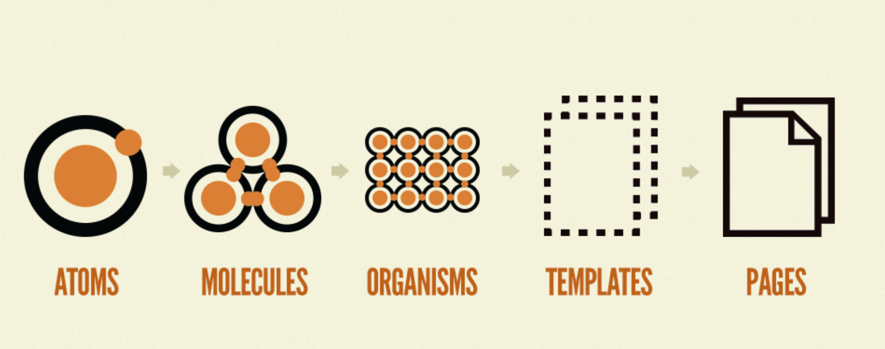

# React File Structure

> 프로젝트에 따라 유연하게 파일 구조를 가져갈 수 있지만, 리액트 생태계 내에서 고려하는 일반적인 접근법이 있음


## 파일의 기능이나 라우트에 의한 분류

- CSS, JS, Test file을 기능이나 라우트로 분류된 폴더에 같이 두는 방법

```markdown
common/
  Avatar.js
  Avatar.css
  APIUtils.js
  APIUtils.test.js
feed/
  index.js
  Feed.js
  Feed.css
  FeedStory.js
  FeedStory.test.js
  FeedAPI.js
profile/
  index.js
  Profile.js
  ProfileHeader.js
  ProfileHeader.css
  ProfileAPI.js
```


## 파일 유형에 의한 분류

- 비슷한 파일끼리 묶는 방법

- [Atomic Design](https://bradfrost.com/blog/post/atomic-web-design/)도 파일 유형에 따른 디자인 방법론(5단계로 나뉨)

  

  - atoms: HTML tag(form, input, button), 컬러팔레트, 폰트, 애니메이션 인터페이스 등 추상화된 요소들도 포함
  - molecules: 입력(input)과 제출(submit button)처럼 하나의 기능을 하는 단위로 볼 수 있음. 특정 기능을 재사용하기 위한 단위라고 볼 수도 있음
  - organisms: molecules의 집합으로 표현될 수 있음. 비슷한 기능끼리 묶거나, 다른 기능이지만 하나의 'grid'로 나뉠 수 있는 것들의 집합임. 독립된 영역, 재사용 가능한 컴포넌트 단위로 볼 수 있음.
  - templates: 와이어프레임과 같이 page의 layout을 잡고 organisms들의 집합으로 표현될 수 있는것
  - pages: 사용자가 실제 보는 페이지

```markdown
api/
  APIUtils.js
  APIUtils.test.js
  ProfileAPI.js
  UserAPI.js
components/
  Avatar.js
  Avatar.css
  Feed.js
  Feed.css
  FeedStory.js
  FeedStory.test.js
  Profile.js
  ProfileHeader.js
  ProfileHeader.css
```


## 고려할 점

- 깊은 디렉토리 중첩을 피할 것. 상대 경로를 통한 임포트나 파일 이동 시 유지보수가 어려워짐. 단일 프로젝트 내에서는 3~4 level의 깊이까지만 제한하는 것이 권장됨
