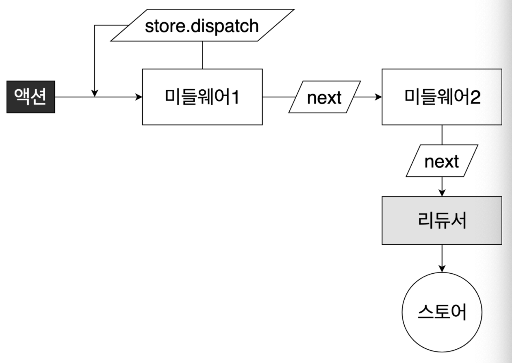

# Redux

> 리덕스를 이용할 시 컴포넌트의 상태 업데이트 관련 로직을 다른 파일로 분리시켜 관리 가능


## 목차

- [Redux의 세가지 규칙](#redux의-세가지-규칙)
- [기본 개념](#기본-개념)
- [최종 폴더 구조](#최종-폴더-구조)
- [Redux 사용](#redux-사용)
- [React-Redux 사용](#react-redux-사용)
- [Component 내 사용](#component-내-사용)
- [Redux 개발자도구 적용](#redux-개발자도구-적용)
- [최적화](#최적화)
- [Redux Middleware](#redux-middleware)


## Redux의 세가지 규칙

- 단일 스토어
  - 하나의 application에 하나의 스토어 유지
  - 상태관리가 복잡해지므로 하나로 통일
- 읽기 전용 상태
  - 리덕스의 상태는 읽기 전용이므로, 객체 불변성을 유지시켜줘야 함
  - 내부적으로 데이터가 변경되는 것을 감지하기 위해 얕은 비교(shallow equality) 검사를 하기 때문(성능 향상)
- 순수 함수 reducer
  - 변화를 일으키는 reducer는 순수함수여야 함
  - reducer 함수는 파라미터로 prevState와 Action 객체를 받는데, 파라미터 외의 값에는 의존하면 안됨


## 기본 개념

##### 액션

- 상태에 어떠한 변화가 필요하면 action 발생(object)
- type 필드를 반드시 가지고 있어야 함(action 결정)


##### 액션 생성 함수

- 액션을 만드는 함수
- 단순히 파라미터를 받아와서 액션 객체 형태로 리턴


##### 리듀서(Reducer)

- state의 변화를 담당하는 함수
- 현재 상태와 전달받은 액션을 참고해 새로운 상태를 만들어 반환


##### 스토어(Store)

- 하나의 어플리케이션은 하나의 스토어를 가짐
- state, reducer를 포함
- getState(), dispatch(), subscribe() 등의 내장 함수를 가짐


## 최종 폴더 구조

- [ducks 패턴](https://github.com/erikras/ducks-modular-redux)을 따름

```bash
.
└── src
    ├── containers
    │   ├── CounterContainer.js
    │   └── TodosContainer.js
    └── modules
    		├── index.js
        ├── counter.js
        └── todos.js
```


## Redux 사용

- vanilla js로 redux 라이브러리를 사용할 땐 내장 함수인 store.dispatch, store.subscribe 함수를 사용했지만, react-redux에서는 유틸 함수(connect / redux에서 제공하는 combinedReducer 사용)와 컴포넌트(Provider)를 사용

- 폴더 구조

  - 일반적인 구조(Redux 공식 문서)

    - 액션 타입, 액션 생성 함수, 리듀서 코드를 별도 파일로 분리해서 작성하는 방법

      ```bash
      .
      └── src
          └── containers
              ├── actions
              │   ├── counter.js
              │   ├── todos.js
              ├── constants
              │   ├── ActionTypes.js
              └── reducers
                  ├── counter.js
                  └── todos.js
      ```

  - Ducks 패턴

    - 액션 타입, 액션 생성 함수, 리듀서 함수를 기능별로 파일 하나에 모두 작성하는 방법

    - root reducer에서 여러개의 리듀서를 합쳐 작업(index.js)
    
      ```bash
      .
      └── src
          └── modules
          		├── index.js
              ├── counter.js
              └── todos.js
      ```
      
  
- react-redux 모듈 생성

  - 리액트 리덕스 모듈에는 [액션타입, 액션 생성함수, 리듀서]가 모두 포함

    ```jsx
    // modules/timer.js
    
    /* 1.액션 타입 만들기 */
    // Ducks 패턴으로 생성 시 액션의 이름에 보통 접두사를 붙임
    // 다른 모듈과 액션 이름이 중복되는 것을 방지
    const SET_DIFF = 'timer/SET_DIFF';
    const INCREASE = 'timer/INCREASE';
    
    /* 2.액션 생성함수 만들기 */
    // 일반 액션 생성함수는 export
    export const setDiff = diff => ({ type: SET_DIFF, diff });
    export const increase = () => { type: INCREASE };
    
    /* 초기 상태 선언 */
    const initialState = {
      number: 0,
      diff: 1
    };
    
    /* 3.리듀서 선언 */
    // reducer는 export default
    export default counter = (state = initialState, action) => {
      switch (action.type) {
        case SET_DIFF:
          return {
            ...state,
            diff: action.diff
          };
        case INCREASE:
          return {
            ...state,
            number: state.number + state.diff
          };
        default:
          return state;
      }
    }
    ```

    ```jsx
    // modules/todos.js
    const ADD_TODO = 'todos/ADD_TODO';
    const TOGGLE_TODO = 'todos/TOGGLE_TODO';
    
    let nextId = 1;
    export const addTodo = text => ({
    	type: ADD_TODO,
      todo: {
        id: nextId++,
        text
      }
    })
    
    export const toggleTodo = id => ({
      type: TOGGLE_TODO,
      id
    });
    
    // initial state
    const initialState = [
    	{
        id: 1,
        text: 'todo1',
        done: false
      }
    ];
    
    export default todos = (state = initialState, action) => {
      switch (action.type) {
        case ADD_TODO:
          return state.concat(action.todo);
        case TOGGLE_TODO:
          return state.map(
          	todo =>
            	todo.id === action.id
            	? { ...todo, done: !todo.done }
            	: todo
          );
        default:
          return state;
      };
    };
    ```

  

- root reducer 생성

  - 위 timer, todos 처럼 리듀서가 여러개라면 이를 한 리듀서로 합쳐서 사용하며, 이를 root reducer라고 함

  ```jsx
  // modules/index.js
  import { combinedReducers } from 'redux';
  import timer from './timer';
  import todos from './todos';
  
  const rootReducer = combineReducers({
    counter,
    todos
  });
  
  export default rootReducer;
  ```

  

- 스토어 생성(하나의 application에 단 하나의 스토어만을 생성하므로 src/index.js에서 생성)

  ```jsx
  // /src/index.js
  
  import { createStore } from 'redux';
  
  const store = createStore(rootReducer);
  ```


## React-Redux 사용

- installation

  ```bash
  $ npm install react-redux
  ```

- 적용

  ```jsx
  // src/index.js
  
  // ...기타 import 생략
  import { createStore } from 'redux';
  import { Provider } from 'react-redux';
  import rootReducer from './modules';
  
  const store = createStore(rootReducer);
  
  ReactDOM.render(
  	<Provider store={store}>
    	<App />
    </Provider>,
    document.getElementById('root')
  );
  ```

  

## Component 내 사용

- component 내에서 redux를 사용할 때 presentational component와 container component를 분리하여 작성한다.

- 이는 view에 해당하는 프리젠테이셔널 컴포넌트와 리덕스 스토어에 접근하는 컴포넌트를 분리하기 위함이다. 이를 통해 프리젠테이셔널 컴포넌트에서는 리덕스 스토어의 전역 데이터에 직접적으로 접근하지 않고 필요한 값 또는 함수만 props로 받아와서 사용한다.

- container component에는 리덕스 스토어의 상태 조회, 액션 디스패치 등의 함수를 작성한다.

- presentational component

  ```jsx
  // src/components/Todos/index.js
  // 생략
  ```

- container component

  ```jsx
  // src/containers/TodosContainer.js
  
  import { useState } from 'react';
  import { useSelector, useDispatch } from 'react-redux'; // useSelector는 state값을 조회, useDispatch는 dispatch 함수 호출 가능
  import { addTodo, toggleTodo } from '../modules/todos'; // 액션 함수
  import Todos from '../components/Todos';
  
  const TodosContainer = () => {
    const todos = useSelector(state => state.todos);
    const dispatch = useDispatch();
    
    const onCreate = (text) => {
      return dispatch(addTodo(text))
    }
    const onToggle = useCallback(id => dispatch(toggleTodo(id)), [dispatch]); // 최적화를 위해 useCallback 사용
    
    return (
      <Todos 
        todos={todos}
        onCreate={onCreate}
        onToggle={onToggle}
      />;
    )
  }
  
  export default TodosContainer
  ```

- Todos component 사용

  ```jsx
  // in anywhere
  import TodosContainer from './containers/TodosContainer'
  
  const Comp = () => {
    return (
    	<>
      	<TodosContainer />
    	</>
    )
  }
  export default Comp
  ```


## Redux 개발자도구 적용

- installation

  - 크롬 extension 설치

    ```txt
    redux-devtools
    ```

  - 프로젝트 패키지 설치

    ```bash
    $ npm install redux-devtools-extension
    ```

- 적용

  ```jsx
  // src/index.js
  
  // 기타 import 생략
  import { createStore } from 'redux';
  import { composeWithDevTools } from 'redux-devtools-extension';
  
  const store = createStore(rootReducer, composeWithDevTools());
  
  ReactDOM.render(
  	<Provider store={store}>
    	<App />
    </Provider>,
    document.getElementById('root')
  );
  ```

  

## 최적화

[참고](https://react.vlpt.us/redux/08-optimize-useSelector.html)


## Redux Middleware

[추가 자료](https://react.vlpt.us/redux-middleware/02-make-middleware.html)

> action - ( middleware ) - Reducer - Store
>
> 리덕스 미들웨어를 사용하면 action이 디스패치된 뒤 리듀서에서 해당 액션을 받아와 업데이트하기 전에 추가적인 작업을 할 수 있음
>
> 추가적인 작업(예시)
>
> - 특정 조건에 따라 액션이 무시되게 만듦
> - 액션을 콘솔에 출력하거나, 서버 쪽에 로깅
> - 액션이 디스패치 되었을 때 이를 수정해서 리듀서에게 전달
> - 특정 액션이 발생했을 때 이에 기반해 다른 액션이 발생되도록 triggered
> - 특정 액션이 발생했을 때 특정 자바스크립트 함수 실행


##### 리덕스 미들웨어 템플릿

```jsx
const middleware = store => next => action => {
  // 수행할 작업
}
```



- store는 리덕스 스토어 인스턴스. dispatch, getState, subscribe 함수 등이 들어 있음
- next는 액션을 다음 미들웨어에 전달하는 함수. next(action) 형태로 사용. 만약 next를 호출하지 않으면 액션이 무시처리되어 리듀서에게로 전달되지 않음
- action은 현재 처리하고 있는 액션 객체


##### 미들웨어 만들기

```jsx
// middlewares/MyLogger.js

const myLogger = store => next => action => {
  // 액션 값을 객체가 아닌 함수로 만들어서 사용도 가능
  typeof action === 'function'
  	? action(store.dispatch, store.getState)
  	: next(action)
  
  console.log(action)  // 액션 출력
  const result = next(action)  // 다음 미들웨어 (또는 리듀서) 에게 액션 전달
  //업데이트 이후의 상태 조회
  console.log('\t', store.getState())
  
  return result  // 반환 값은 dispatch(action)의 결과물
}

export default myLogger
```


##### 미들웨어 적용

```jsx
// src/index.js

import { createStore, applyMiddleware } from 'redux'
import myLogger from './middlewares/myLogger'

const store = createStore(rootReducer, applyMiddleware(myLogger))

ReactDOM.render(
	<Provider store={store}>
  	<App />
  </Provider>,
  document.getElementById('root')
)
```


### Middlewares

- logger

  ```bash
  $ npm install redux-logger
  ```

  ```jsx
  // src/index.js
  
  import logger from 'redux-logger'
  
  const store = createStore(rootReducer, applyMiddleware(myLogger, logger))
  //...
  ```

- redux-thunk

  > 리덕스에서 비동기 작업을 처리할 때 가장 많이 사용하는 미들웨어
  >
  > 이를 사용하면 액션 객체가 아닌 함수를 디스패치 할 수 있음
  >
  > 함수 디스패치 시에는 해당 함수에서 dispatch, getState를 파라미터로 받아야함. 이 함수를 만들어주는 함수를 thunk라고 부름

  ```bash
  $ npm install redux-thunk
  ```

  ```jsx
  // src/index.js
  
  import ReduxThunk from 'redux-thunk'
  
  const store = createStore(
  	rootReducer,
    // logger를 사용하는 경우 logger가 가장 마지막에 와야 함
    composeWithDevTools(applyMiddleware(ReduxThunk, logger))
  )
  ```

  

  ```jsx
  const getComments = () => (dispatch, getState) => {
    // 이 안에서 액션을 dispatch 할 수도 있고
    // getState를 사용해 현재 상태 조회도 가능
    const id = getState().post.activeId
    
    // 요청이 시작했음을 알리는 액션
    dispatch({ type: 'GET_COMMENTS' })
    
    // 댓글을 조회하는 프로미스를 반환하는 getComments 가 있다고 가정하면
    api
    	.getComments(id)
    	.then( 
      	(comments) => {
          dispatch({
            type: 'GET_COMMENTS_SUCCESS',
            id,
            comments
          })
        }
      )
    	.catch(
    		(err) => {
          dispatch({
            type: 'GET_COMMENTS_ERROR',
            error: e
          })
        }
    	)
  }
  ```

  
