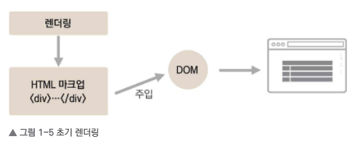
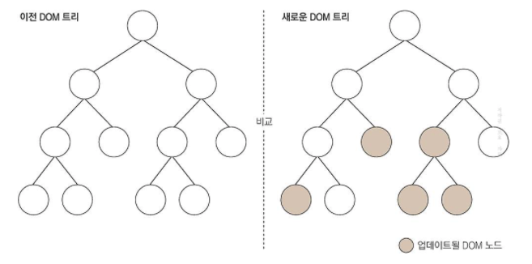

# React Rendering

> 리액트는 자바스크립트 라이브러리로, 구조가 MVC, MVW 등인 프레임워크와 달리, 오직 V(View)만 신경쓰는 라이브러리

##### Component

- 특정 부분이 어떻게 생길지 정하는 선언체
- 다른 프레임워크에서 템플릿은 보통 HTML 태그 형식을 문자열로 반환하지만, 리액트의 컴포넌트는 <b>재사용 가능한 API로</b>, 여러 기능을 내장하고 컴포넌트 하나에서 해당 컴포넌트의 생김새와 작동 방식을 정의

##### Rendering

- 사용자 화면에 뷰를 보여주는 것을 렌더링이라 함

- 리액트 컴포넌트가 최초로 실행한 '초기 렌더링'과 컴포넌트의 데이터 변경으로 다시 실행되는 '리렌더링' 개념의 이해가 필요

- 초기 렌더링

  - `render() {}` 함수를 통해 최초 렌더링

  - html 형식의 문자열을 반환하지 않고, 뷰의 상태와 기능에 대한 정보를 지닌 객체 반환

  - 최상위 컴포넌트의 렌더링 작업이 끝나면 지니고 있는 정보들을 사용하여 HTML 마크업(markup)을 만들고, 이를 실제 페이지의 DOM 요소 안에 주입

    

- rerendering

  - 리액트에서 뷰를 업데이트할 때는 '업데이트 과정을 거친다'라고 하기보다는 '조화 과정(reconciliation)'을 거친다고 하는 것이 더 정확한 표현함. 이는 데이터 변화에 따라 뷰가 변형되는 것처럼 보이지만, 사실은 새로운 요소로 갈아끼우기 때문임

  - rerender 될 때, render 함수가 반환한 결과를 곧바로 DOM에 반영하지 않고, 이전 render 함수가 만들었던 컴포넌트 정보와 현재 render 함수가 만든 컴포넌트 정보를 비교

    

    

`출처: 리액트를 다루는 기술(개정판), 김민준 저, (주)도서출판길벗 `
