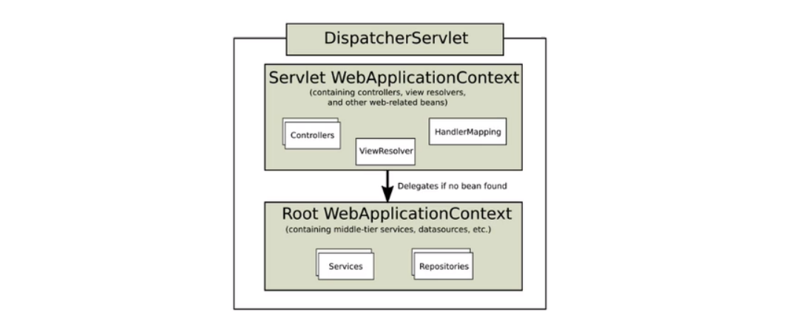

# Spring Execution Process


##### 톰캣(WAS) 구동

- Context Path 설정
  - 최초 tomcat 서버와 연결되는 프로젝트 path
  - 경로: /Servers/Tomcat v8.0 Server at localhost-config/server.xml
  - `<Context docBase="projectName" path="/" reloadable="false" source="org.eclipse.jst.jee.server:projectName"/>`를 통해 pharos 프로젝트에 대한 요청 연결


##### 톰캣에 의해 web.xml loading

- 루트 컨테이너 생성

  - 구동될 때 참조하는 설정 파일(deployment descriptor)

  - 경로: /projectName/src/main/wepapp/WEB-INF/web.xml

  - filter

    - filter-mapping에서 설정한 페이지(url-pattern으로 설정)가 Controller의 함수 매핑 전에 호출될 필터클래스를 적용. `<filter />`와 `<filter-mapping />`을 `<filter-name />`으로 매핑하여 `<url-pattern />`에 대한 요청에 필터 적용
    - charaterEncodingFilter : 캐릭터 인코딩을 utf-8로 설정
    - HTMLTagFilter : 전자정부프레임워크 환경에서 XSS를 방지하기 위해 불필요한 HTML태그의 등록 및 저장을 방지해줌
    - LogFilter :  로그 저장을 위한 필터

    ```xml
    <display-name>egovframe.miplatform.uiadaptor.template</display-name>
    	<filter>
    		<filter-name>encodingFilter</filter-name>
    		<filter-class>
    			org.springframework.web.filter.CharacterEncodingFilter
    		</filter-class>
    		<init-param>
    			<param-name>encoding</param-name>
    			<param-value>utf-8</param-value>
    		</init-param>
    	</filter>    
    	<filter>
            <filter-name>HTMLTagFilter</filter-name>
            <filter-class>egovframework.rte.ptl.mvc.filter.HTMLTagFilter</filter-class>
        </filter>
    	<filter>
            <filter-name>LogFilter</filter-name>
            <filter-class>projectName.framework.filter.LogFilter</filter-class>
        </filter>
    ```

    ```xml
    	<filter-mapping>
    		<filter-name>LogFilter</filter-name>
    		<url-pattern>*.do</url-pattern>
    	</filter-mapping>
    	<filter-mapping>
    		<filter-name>encodingFilter</filter-name>
    		<url-pattern>*.do</url-pattern>
    	</filter-mapping>
        
        <filter>
    	    <filter-name>cors</filter-name>
    	    <filter-class>projectName.framework.filter.SimpleCORSFilter</filter-class>
    	</filter>
        <filter-mapping>
    	    <filter-name>cors</filter-name>
    	    <url-pattern>/*</url-pattern>
    	</filter-mapping>
        
    	<filter-mapping>
            <filter-name>HTMLTagFilter</filter-name>
            <url-pattern>*.do</url-pattern>
        </filter-mapping>
    ```
    
  - context-param
  
    - Servlet context의 parameter 선언
    - Spring에서 기본적으로 제공해주는 설정 파일 외에 사용자가 직접 조정하는 xml 설정 파일을 지정
      - classpath는 `/.classpath.xml`에서 classpathentry로 설정한 경로
  
    ```xml
    	<context-param>
    		<param-name>contextConfigLocation</param-name>
    		<param-value>
    		        classpath:/config/resource/context-*.xml,
    				/WEB-INF/config/spring/context-*.xml,
    				classpath:/config/schedule/context-*.xml
    		</param-value>
    	</context-param>
    ```
  
  - listener
  
    - 스프링 설정 정보 읽는 역할
  
    ```xml
    	<listener>
    		<listener-class>org.springframework.web.context.ContextLoaderListener</listener-class>
    	</listener>
    	<listener>
    		<listener-class>projectName.framework.session.SoSessionListener</listener-class>
    	</listener>
    ```
  
  - servlet
  
    - spring에서는 DispatcherServlet이 모든 요청을 받고, 요청의 URL과 맵핑하는 Controller에 위임됨
    - `<servlet />`과 `<servlet-mapping />`을 통해 `<servlet-name />`에 해당하는 `<url-pattern />`에 대해 Controller에 위임
  
    ```xml
    	<!-- servlet -->
    	<servlet>
    		<servlet-name>action</servlet-name>
    		<servlet-class>
    			org.springframework.web.servlet.DispatcherServlet
    		</servlet-class>
    		<init-param>
    			<param-name>contextConfigLocation</param-name>
    			<param-value>
    				/WEB-INF/config/springmvc/dispatcher-servlet.xml,
    				/WEB-INF/config/springmvc/urlfilename-servlet.xml
    			</param-value>
    		</init-param>
    		<load-on-startup>1</load-on-startup>
    	</servlet>
    ```
  
    ```xml
    	<servlet-mapping>
    		<servlet-name>action</servlet-name>
    		<url-pattern>*.do</url-pattern>
    	</servlet-mapping>
    	<servlet>
    		<servlet-name>initAction</servlet-name>
    		<servlet-class>
    			pharos.framework.servlet.SoBaseServlet
    		</servlet-class>
    		<load-on-startup>1</load-on-startup>
    	</servlet>
    	<servlet-mapping>
    		<servlet-name>initAction</servlet-name>
    		<url-pattern>/init</url-pattern>
    	</servlet-mapping>
    ```
  
    ```xml
    	<!-- rest by harrison add START -->
        <servlet>
            <servlet-name>restful</servlet-name>
            <servlet-class>org.springframework.web.servlet.DispatcherServlet</servlet-class>
            <init-param>
                <param-name>contextConfigLocation</param-name>
                <param-value>/WEB-INF/config/springmvc/restful-servlet.xml</param-value>
            </init-param>
            <load-on-startup>1</load-on-startup>
        </servlet>
    ```
  
    ```xml
        <servlet-mapping>
            <servlet-name>restful</servlet-name>
            <url-pattern>/restful/*</url-pattern>
        </servlet-mapping>
    ```
    
  - welcome-file-list
  
    - 디렉토리의 기본 웹페이지
    - /src/main/webapp/ 경로의 `<welcome-file />`에 설정된 파일
  
    ```xml
    	<welcome-file-list>
    		<welcome-file>index.jsp</welcome-file>
    	</welcome-file-list>
    ```
  
  - login-config
  
    - servlet 보안
    - BASIC / DIGEST / CLIENT-CERT / FORM 4단계로 나뉨
  
    ```xml
    	<login-config>
    		<auth-method>BASIC</auth-method>
    	</login-config>
    ```
  
  - error-page
  
    - error code에 따른 공통 에러 페이지 정의
  
    ```xml
        <error-page>
            <error-code>404</error-code>
            <location>/common/error.jsp</location>
        </error-page>
        <error-page>
            <error-code>500</error-code>
            <location>/common/error.jsp</location>
        </error-page>
    ```
  
  - session-config
  
    - session의 만료시간 설정 (단위:분)
  
    ```xml
        <session-config>
            <session-timeout>180</session-timeout>
        </session-config>
    ```
  
  - resource-ref
  
    - JNDI(Java Naming and Directory Interface)와 DBCP(Database Connection Pool)을 통해 JSP와 DB연동하기 위한 설정
    - JNDI는 외부 객체 가져오기 위한 java api이고, DBCP는 DB와 연결된 커넥션을 미리 만들어 저장해둔 뒤 필요할 때 가져와 커넥션을 위한 비효율적 작업을 줄이고 DB 부하도 줄이기 위한 것
  
    ```xml
        <resource-ref>
            <description>DB Connection</description>
            <res-ref-name>jdbc/oracleDS</res-ref-name>
            <res-type>javax.sql.DataSource</res-type>
            <res-auth>Container</res-auth>
        </resource-ref>
    ```
  
    - description: 설명
    - res-ref-name: JDBC 이름, \<Resource>의 name 부분과 동일하게 작성
    - res-type: \<Resource>의 type 부분과 동일하게 입력
    - res-auth: \<Resource>의 type 부분과 동일하게 입력


##### ContextLoaderListener 생성

- web.xml에 등록되어 있는 `ContextLoaderListener` 생성
- 이는 ServletContextListener 인터페이스를 구현하고 있어, ServletContext의 라이프사이클에 맞춰`ApplicationContext`를 ServletContext에 생성/삭제하는 역할 수행
- ContextLoaderListener 클래스를 통해 ServletContext에 ApplicationContext를 등록해 `Spring에서 제공하는 IoC Container를 이용`하게 되는 것
- 이후 contextConfigLocation에 등록된 dispatcher-servlet.xml 로딩


##### dispatcher-servlet



- Root WebApplicationContext
  - ContextLoaderListener에 의해  ServletContext에 등록되는 ApplicationContext로, 모든 Servlet이 사용 가능함
- Servlet WebApplicationContext
  - DispatcherServlet에서 Root WebApplicationContet를 상속받아 만든 ApplicationContext로, 해당 DispatcherServlet 안에서만 사용 가능
- 이러한 구조를 가지는 이유는 root에는 모든 Servlet에서 공통으로 사용하는 Services, Repositories `bean`이 등록되고, 상속 받은 클래스는 개별 servlet에서 정의하는 `bean`이 등록되어 사용

- dispatcher servlet에 등록된 bean 들을 통해 클라이언트에서 controller로 접근하기 시작하게 되는 것

  (IoC, DI에 대해 추가 학습 필요)
