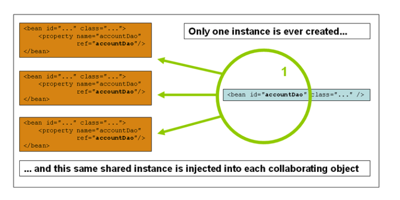

# Spring Singleton

> 이 글은 https://javabeat.net/spring-singleton-java-singleton/를 번역한 것입니다.


스프링 프레임워크 개발자들이 흔히 하는 오해 중의 하나가 spring singleton과 java singleton의 차이다. 흥미롭게도 이는 싱글톤 개념을 이해하는지 확인하는 인기 있는 인터뷰 질문([interview questions for spring developers](https://javabeat.net/spring-framework-interview-questions/)) 중의 하나가 되었다.

java 또는 spring을 사용하는 개발자라면 java singleton과 spring singleton의 명백한 차이에 대해서 아는 것이 중요하다. 설명하기에 앞서 java singleton에 대한 개념이 부족하다면 다음 글([java singleton pattern](https://javabeat.net/singleton-pattern-design-patterns-in-javaj2ee/))을 읽기를 바란다.

java singleton class는 클래스로더 당 하나 존재하며, spring singleton은 application context 당 하나 존재한다.


## Java Singleton

singleton classes를 구현하기 위해 미리 정의해놓은 규칙은 없지만, 싱글톤 클래스는 반드시 클래스로더 당 반드시 하나가 인스턴스화 되어야 한다. 다음은 자바 싱클톤 클래스를 구현하는 기본적은 단계다.

- singleton class라 하면, 클래스로더가 생성할 수 있는 인스턴스는 반드시 하나이다.
- 외부 클래스가 인스턴스화 하지 못하게 해당 생성자는 반드시 private으로 만들어져야 한다.
- 인스턴스를 저장하기 위한 static 변수를 선언한다.
- 해당 인스턴스를 반환하는 메서드를 선언한다.

위와 같은 기본적인 규칙에 따라 다음의 카테고리들로 java singleton을 구현할 수 있다.

- Eager Initialization

  - eager initialization에서는 singleton instance가 클래스를 로딩하는 시점에 생성된다. 이것이 싱클톤 인스턴스를 생성하는 가장 쉬운 방법이다. 하지만, 이러한 방법의 단점은 어떠한 client application도 해당 인스턴스를 사용하지 않더라도 반드시 생성된다는 것이다. 이러한 관점에서는 반드시 static 변수 선언을 통해 인스턴스를 생성하고, 이는 어떠한 exception handling도 제공하지 않는다.

  - 아래는 singleton instance의 eager initialization 의 한 예이다.

    ```java
    public class EagerInitialization {
      	private static final EagerInitialization instance = new EagerInitialization();
      	private EagerInitialization() {}
      
      	public static EagerInitialization getInstance() {
        	return instance;
      	}
    }
    ```

- Static Block Initialization

  - static block initialization도 eager initialization의 한 줄기이지만, 한 가지 차이점은 인스턴스의 생성이 `static initializer` 블럭에서 완료된다는 점이다. 이 방법도 exception handling을 위한 어떤 옵션도 제공하지 않는다.

  - 아래는 static block initialization의 한 예이다.

    ```java
    public class StaticBlockInitialization {
      	private static StaticBlockInitialization singletonInstance;
      	private StaticBlockInitialization() {}
      
      	static {
          	try {
              	singletonInstance = new StaticBlockInitialization();
            } catch(Exception e) {
              	throw new RuntimeException("Exception occured while creating the singleton instance");
            }
        }
      
    	  public static StaticBlockInitialization getInstance() {
          	return singletonInstance;
        }
    }
    ```

- Lazy Initialization

  - 이 접근에서는 클래스를 로딩 하고 처음으로 instance를 호출했을 때 instance를 생성한다.

  - 이 방법으로 서비스에서 필요하지 않은 인스턴스를 미리 생성하지 않을 수 있다.

  - single threaded 환경에서 실행될 때는 좋은 방법이지만, multi-threaded 환경에서는 여러 스레드가 새로운 인스턴스를 동시에 얻으려고 할 수 있으므로 좋은 방법은 아니다.

  - 아래는 lazy initialization의 한 예이다.

    ```java
    public class Main {
      	public static void main(String args[]) {
          	Singleton singleton = Singleton.getInstance();
          	System.out.println("Value 1: " + singleton.getValue());
          	singleton.setValue(20);
          	Singleton singleton2 = Singleton.getInstance();
          	System.out.println("Value 2: " + singleton2.getValue());
        }
    }
    
    class Singleton {
      	private Singleton() {}
      
      	private static Singleton singleton;
      	private int value = 10;
      	
      	public static Singleton getInstance() {
          	if (singleton == null) {
              	singleton = new Singleton();
            }
          	return singleton;
        }
      
      	public int getValue() {
          	return value;
        }
      	public void setValue(int value) {
          	this.value = value;
        }
    }
    ```

- Thread Safe Singleton

  - lazy 방식과 유사하나, singleton instance를 생성하는 것이 synchronized 되어 있다는 것이 차이점이다.

  - 이 방식이 singleton instance를 생성하는 가장 안전하고 좋은 해결법이지만, multiple threads가 동시에 같은 인스턴스를 얻으려고 하면 성능 상의 이슈가 있을 수 있다.

  - 아래는 thread safe singleton의 한 예이다.

    ```java
    public class ThreadSafeInstance {
      	private static ThreadSafeInstance singletonInstance;
      	private ThreadSafeInstance() {}
      	
      	public static synchronized ThreadSafeInstance getInstance() {
          	if(singletonInstance == null) {
              	singletonInstance = new ThreadSafeInstance();
            }
          	return singletonInstance;
        }
    }
    ```

<br>

## Spring Singleton

Spring singleton의 scope은 컨테이너 또는 bean 당 하나라고 볼 수 있다. 하나의 컨테이너 안에 있는 특정 클래스에서 하나의 bean을 정의한다면, spring container는 그 클래스에 해당하는 단 하나의 인스턴스만을 생성할 것이다. 스프링에서 싱글톤은 [scope for defining the beans]() 의 하나로 불린다. 싱글톤 scope는 기본적으로 스프링 빈의 스코프와 같다.



다음은 Spring의 singleton beans의 한 예이다.

```xml
<bean id="bookService" class="com.foo.DefaultBookService"/>
<!- the following is equivalent, though redundant (singleton scope is the default) ->
<bean id="bookService" class="com.foo.DefaultBookService" scope="singleton"/>
```


##### Spring Singleton은 어떻게 동작하는가?

싱글턴 인스턴스를 떠올릴 때, 가장 먼저 떠오르는 것이 application의 thread safety 이다. Spring의 singleton beans는 multi-threaded 환경에서 모든 요청들에 대해 공유된다. 이 때 어떻게 thread safety 하다는 것을 확신할 수 있을까?

`singleton beans가 어떤 state 정보도 저장해서는 안된다는 점이 중요하다`(It is important to remember that your singleton beans should not store any state information). `왜냐하면 단 한 번만 생성되는 bean 객체는 모든 쓰레드에 걸쳐 공유될 것이기 때문이다`(Because the bean instance created once will be shared across all the threads that are requesting for that spring bean). 특정 객체를 스프링 싱클톤 빈에 주입하게 되면, 한 번만 묶이게(wired) 되고 다시는 갱신(refreshed)되지 않을 것이다. 모든 컨트롤러들은 싱글톤 빈으로, 모든 VO(value objects)는 prototype beans로 만드는 것이 이상적이다.

prototype beans가 매번 주입되길 원한다면, method injection을 구현해야 한다. 그렇지 않으면 매번 prototype bean을 다시 생성하도록 singleton object를 만들 방법은 없다. VO를 매번 인스턴스화 하는 것은 다음의 글을 참고 ([method injection](https://javabeat.net/spring-method-injection/)) 

```java
@Controller
public class SampleController {
  	int i = 0;
	  
  	@Autowired
		private ValueObject vo;
}
```

- ValueObject는 XML configurations 에서 prototype bean으로 선언된다. 하지만 이 객체는 SampleController 인스턴스가 생성될 때 단 한 번 주입될 것이다. 그 후에는 모든 요청에 대해 동일한 객체가 사용된다. 이 경우 변수 i와 vo는 상태 정보(state information)을 유지해서는 안된다. 그렇지 않으면 모든 스레드에 해당 정보가 저장될 것이다.
- 예를 들어 변수 i가 한 요청만큼 증가하면 다른 스레드와 공유되는데, 이것은 혼란을 야기하고 applicatioon은 thread  safe 하지 않게 된다. 이를 방지하려면 상태 정보를 singleton bean에 저장하는 인스턴스 변수를 선언하면 안된다.


## Summary

정리하면 Java singleton은 클래스 로더 당 하나이고, spring singleton은 bean에 대한 application context 당 하나이다. 
