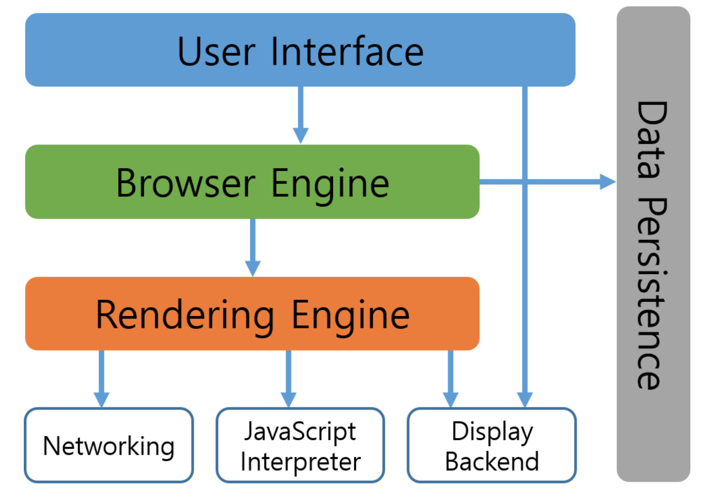

# Browser Rendering

- 사용자 인터페이스: 주소 표시줄, 이전/다음 버튼, 북마크 등 페이지를 보여주는 창을 제외한 나머지
- 브라우저 엔진: 사용자 인터페이스와 렌더링 엔진 사이의 동작을 제어
  - 크롬(Blink), safari(webkit), firefox(gecko) 등
- 렌더링 엔진: 요청한 컨텐츠를 표시(HTML, CSS 파싱하여 화면에 표시)
- 통신: HTTP 요청과 같은 네트워크 호출에 사용
- 자바스크립트 해석기: js 코드 해석 및 실행
- 자료 저장소 : cookie, web storage

## 브라우저 엔진

> chrome(Blink), safari(webkit), firefox(gecko) 등

- Parsing

  - 브라우저가 코드를 이해하고 사용할 수 있는 구조로 변환하는 것
  - HTML을 parsing하여 DOM 노드를 만들고 DOM 노들을 병합하여 DOM tree 생성
  - CSS를 parsing 하여 스타일 규칙을 만듦
  - Attachment라는 과정을 통해 Render Tree 생성
  - 변환 / 토큰화 / 렉싱 / DOM 생성? (~~추가 공부~~)

- Render Tree

  - DOM tree가 구축되는 동안 브라우저는 렌더 트리를 구축

  - 렌더 트리는 DOM 트리와 반드시 1:1로 대응하는 것은 아님

    (`<head>` 태그와 같은 비시각적 DOM 노드는 렌더 트리에 추가되지 않음)

- Layout

  - 렌드 트리 생성 후 노드들의 정확한 위치와 크기를 계산

- Painting

  - 각 노드를 화면의 실제 픽셀로 나타내는 과정

## 결론

HTML/CSS `parsing` -> `DOM tree` / `style rules` 구축 AND `Render Tree` 구축 -> `Layout` -> `Paint`

HTML과 CSS를 구문분석하여 파싱하면 HTML 문서를 기준으로 DOM 트리를 구축하고, CSS를 기반으로 스타일 규칙을 만든다. 이 과정에서 Render Tree도 함께 만들어지게 되는데, 구축된 렌더트리를 기반으로 노드들의 위치와 크기를 계산하는 Layout이 발생하고, 해당 레이아웃 안에서 노드들을 실제 픽셀로 그려내는 Painting을 통해 최종적으로 사용자에게 보여진다.

~~해당 과정들의 세부 과정이 있는데, 추가 공부 필요~~
