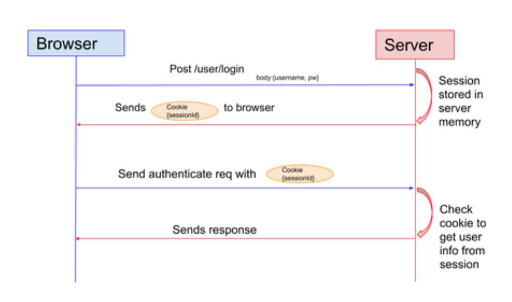

# JWT 인증

> JSON Web Token
>
> Server-Client 간 안전하게 정보 주고 받을 수 있도록 웹 표준으로 정의된 기술
>
> 사용자 인증 중 세션 기반 인증과 토큰 기반 인증의 두가지 방법의 차이에 대해서 다룸

## 목차

- [세션 기반 인증](#세션-기반-인증)
- [토큰 기반 인증](#토큰-기반-인증)
- [JWT structure](#jwt-structure)

## 세션 기반 인증

- 특성
  - 세션 기반 인증은 통상 SSR 방식의 웹서비스들에서 쓰이는 방법
  - 메모리에 세션 정보 저장(클라이언트는 주로 Cookie에 저장)
- 장점
  - 서버 쪽의 사용자 로그인 상태에 대한 확인이 분명하고 쉬움
  - 서버에서 정보를 관리하기 때문에 클라이언트의 변조에 의해 영향받기 어려워 보안성이 좋음
  - 토큰 방식의 Signature 등 부가적 정보가 없어 Server-Client 간 주고 받는 데이터가 적음
- 단점
  - 대규모 서비스의 경우 메모리에 저장되는 세션 정보로 인해 메모리 성능 부하가 있을 수 있어, Redis, Memcached 등의 별도 메모리 관리시스템으로 관리해줄 필요성 증가
  - 쿠키는 단일 도메인 또는 서브 도메인에만 작동되기 때문에 여러 도메인 사용할 경우 관리해주어야 하는 부담

## 토큰 기반 인증

- 특성
  - SPA 기반의 웹 서비스에서 많이 쓰이는 방법
  - 웹브라우저, 모바일, IoT 등 다양한 디바이스의 클라이언트들을 하나의 백엔드 서비스 API로 대응하기 위해 REST 아키텍쳐가 각광받으면서, REST 아키텍쳐의 무상태성(stateless)의 구현을 위해 많이 쓰임
  - 서명 데이터는 해싱 알고리즘을 통해 만들어지는데, 주로 HMAC SHA256 또는 RSA SHA256 알고리즘 사용
- 장점
  - multi-device client 대응에 부담이 적음
  - 클라이언트가 토큰 정보를 갖고 있기 때문에 서버 Scale-Up에 부담 적음
  - 세션 관리에 대한 메모리 부담 감소
  - 다양한 도메인 대응 용이
- 단점
  - 클라이언트 토큰 정보 탈취 시 보안 취약
  - 토큰에 Signature 등의 부가적 정보가 담겨 있어 Server-Client 간 주고 받는 데이터가 세션 기반의 인증보다 많음
  - 토큰 인증을 위해 DB를 매번 조회해야 하므로 DB 성능 부하가 있을 수 있음

## JWT structure

- .으로 구분된 세 파트로 구성
  - Header: type of token, signing algorithm
  - Payload : Claims(일종의 데이터, 사용자나 추가 데이터 등)
  - Signature : 인코딩된 (header + payload + secret key + signing algorithm) 로 생성하는 서명
